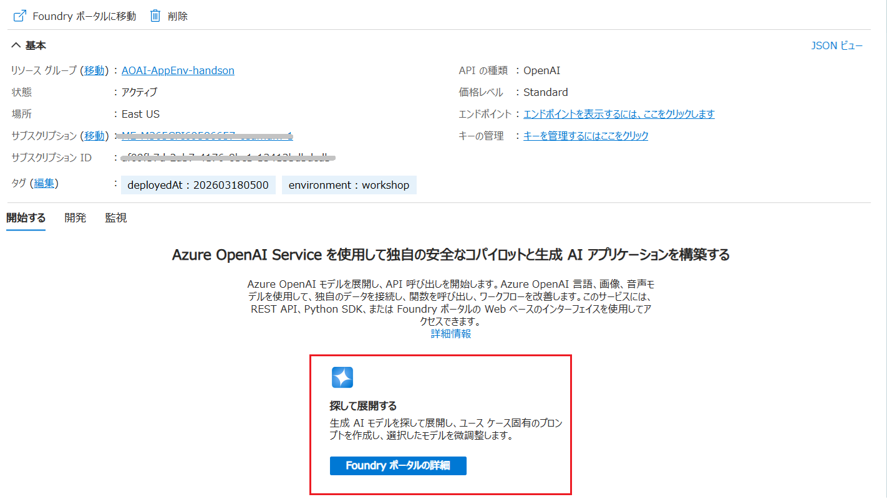
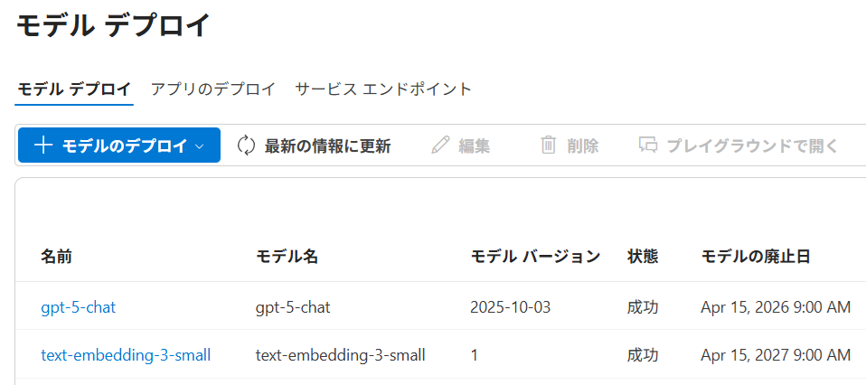
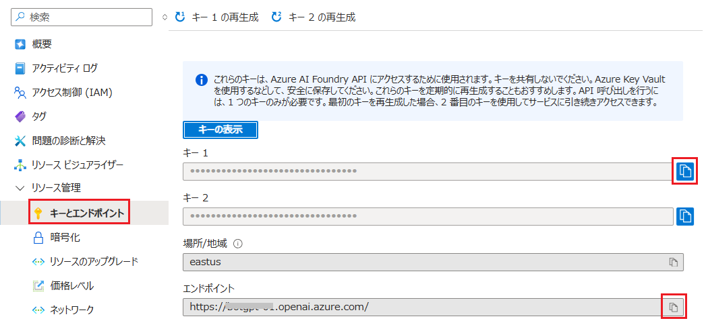

# 演習 1-1 : Azure リソースの作成

ハンズオンの演習を開始するのに必要となる Azure リソースを作成します。

Azure Cloud Shell からコマンドを使用してリソースグループを作成し、その後、 **Bicep** を使用して以下の Azure リソースを**自動作成**します。

* [Azure App Service](https://learn.microsoft.com/ja-jp/azure/app-service/overview)
* [Azure Storage Account](https://learn.microsoft.com/ja-jp/azure/storage/common/storage-account-overview)
* [Azure AI Search](https://learn.microsoft.com/ja-jp/azure/search/search-what-is-azure-search)
* [Azure OpenAI Service](https://learn.microsoft.com/ja-jp/azure/ai-foundry/openai/overview)
  - gpt-4o-mini (テキスト生成)
  - dall-e-3 (画像生成)
  - text-embedding-ada-002 (埋め込み)

> [!NOTE]
> [はじめに](intro.md#%E3%83%87%E3%83%97%E3%83%AD%E3%82%A4%E3%81%95%E3%82%8C%E3%82%8B-azure-%E3%83%AA%E3%82%BD%E3%83%BC%E3%82%B9%E3%81%A8-ai-%E3%83%A2%E3%83%87%E3%83%AB) に記載されている情報を参考に、Bicep を使用せずに Azure Portal や Azure CLI を使用して手動で作成しても構いませんが、リソースの作成先のリージョンは Azure OpenAI Service だけが `East US` で(※)、他のリソースは `Japan East` となるのでご注意ください。

> (※) これは `East US` リージョンが演習用アプリケーションが使用するすべての AI モデルをデプロイ可能であるためです。`Japan East` リージョンでは `dall-e-3` モデルをサポートしていません。

Bicep 使用して Azure リソースを自動作成する場合の手順は以下のとおりです。

\[**手順**▶️\]

1. 以下の Bicep ファイルをダウンロードします。
   - [prep-az-resource.bicep](./assets/prep-az-resource.bicep)
  
2. [Azure ポータル](https://portal.azure.com)にログインし、画面右上にある Cloud Shell アイコンをクリックして Cloud Shell 画面を開きます

    
   
3. Cloud Shell 画面で、以下のコマンドを実行してリソースグループ `AOAI-AppEnv-handson` を作成します
   ```bash
   az group create --name AOAI-AppEnv-handson --location "Japan East"
   ```

   Cloud Shell で以下のコマンドを実行してリソースグループ `AOAI-AppEnv-handson` が作成されていることを確認します。

    ```bash
    az group list --query "[?name=='AOAI-AppEnv-handson']" --output table
    ```

4. Cloud Shell 画面のメニュー \[ファイルの管理\] - \[アップロード\] を選択し、ダウンロードした `prep-az-resource.bicep` ファイルをアップロードします

    
    
    ファイルのアップロードが完了したら以下のコマンドを実行してアップロードしたファイルがリストされることを確認します。

    ```bash
    ls
    ```
5. アップロードした Bicep ファイルを使用して Azure リソースをデプロイします。実行するコマンドは以下のとおりです。

    ```bash
    az deployment group create --resource-group AOAI-AppEnv-handson --template-file prep-az-resource.bicep
    ```

    この Bicep ファイルは現在のタイムスタンプを付与したユニークな名前を付けて各リソースを作成します。

    デプロイが完了するまで時間がかかるので、しばらく待ちます(※)。

    (※) デプロイ時間はタイミングによって異なりますが、通常は 3 ～ 10 分程度で完了します。

6. デプロイが完了したら Azire ポータル画面で `AOAI-AppEnv-handson` リソースグループを開き、以下のリソースが作成されていることを確認します。

   - Azure OpenAI Service
   - Azure AI Search
   - Azure App Service
   - Azure App Service Plan
   - Azure Storage Account

   

7. デプロイされた Azure Storage Account リソース `storage(ランダムな値)`を開き、\[**BLOB コンテナー**\] メニューをクリックして、`rag-data-store` という名前の BLOB コンテナーが作成されていることを確認します。
   
     

8. デプロイされた AI モデルを確認します。 Azure OpenAI サービスのリソース `aoai-(ランダムな値)` を開き、\[**概要**\] メニュー画面内にある \[**Explore and deploy**\] ボックス内の \[**Explore Azure AI Foundry Portal**\]ボタンをクリックします

    

9.  Azure AI Foundry が開かれるので、画面左のメニューバーから \[**デプロイ**\] をクリックします

    

10. **gpt-4o-mini**、**text-embedding-ada-002**、**dall-e-3** の 3 つのモデルがリストされることを確認します。もし、リストされていない場合は、画面上部の \[**モデルのデプロイ**\] ボタンをクリックして、モデルを選択し、デプロイを行ってください。

    


ここまでの手順で Bicep ファイルを使用した、演習で使用する Azure リソースの作成と AI モデルのデプロイが完了しました。

### AI モデルを手動でデプロイする方法

 もし、ここまでの手順でデプロイがうまくいかなかった場合、Azure のリソースについては前述の情報を参考に Azure Portal や Azure CLI を使用して手動で作成してください。
 
 AI モデルについては以下の手順を参考にデプロイしてください。

なお、この手順は [Azure OpenAI アプリケーション開発ハンズオン](https://github.com/osamum/AOAI-first-step-for-Developer)コンテンツに遷移するので、デプロイが完了したら**次の演習には進まずに**このページに戻ってきてください。

* <a target="_blank" href="https://github.com/osamum/AOAI-first-step-for-Developer/blob/main/Ex01-2.md">Azure AI Foundry から言語モデル gpt-4o-mini のデプロイ</a>
* <a target="_blank" href="https://github.com/osamum/AOAI-first-step-for-Developer/blob/main/Ex01-3.md">Azure AI Foundry から埋め込みモデル : text-embedding-ada-002 のデプロイ</a>
* <a target="_blank" href="https://github.com/osamum/AOAI-first-step-for-Developer/blob/main/Ex01-4.md">Azure AI Foundry から画像生成モデル : dall-e-3 のデプロイ</a>
  
<br>


## 接続情報の取得

デプロイした Azure OpenAI サービスの接続情報を取得します。これらの情報は、演習用アプリケーションの設定に使用します。

具体的な手順は以下のとおりです。

\[**手順**▶️\]

1. この直前の作業で作成された OpenAI サービス インスタンスのプロパティ画面を開きます

2. 画面左側のメニューから **キーとエンドポイント** を選択し、表示された画面で \[**キー**\](※キー 1、キー 2 のどちらでも構いません)と \[**エンドポイント**\] をコピーします

    

コピーしたキーとエンドポイントは後続のタスクで使用しますので、メモ帳などに貼り付けて保持してください。

このキーとエンドポイントは [演習 1-2-2. ローカル環境へのクローンとアプリケーションの実行](Ex01-2.md#2-%E3%83%AD%E3%83%BC%E3%82%AB%E3%83%AB%E7%92%B0%E5%A2%83%E3%81%B8%E3%81%AE%E3%82%AF%E3%83%AD%E3%83%BC%E3%83%B3%E3%81%A8%E3%82%A2%E3%83%97%E3%83%AA%E3%82%B1%E3%83%BC%E3%82%B7%E3%83%A7%E3%83%B3%E3%81%AE%E5%AE%9F%E8%A1%8C)の手順で使用します。


## 次へ

👉　[**演習 1-2 : 演習用アプリケーションの入手と実行**](Ex01-2.md)

---

👈　[演習 1 : Azure リソースの作成とアプリケーションのデプロイ](Ex01.md)

🏚️　[README に戻る](README.md)

