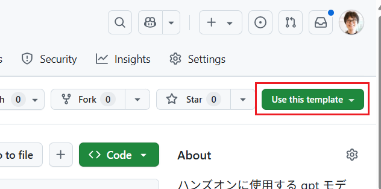
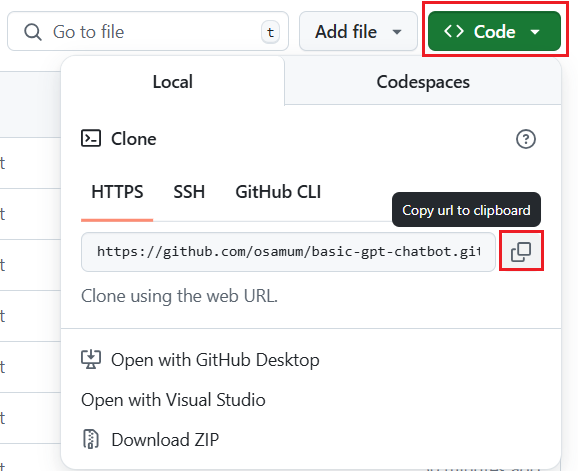
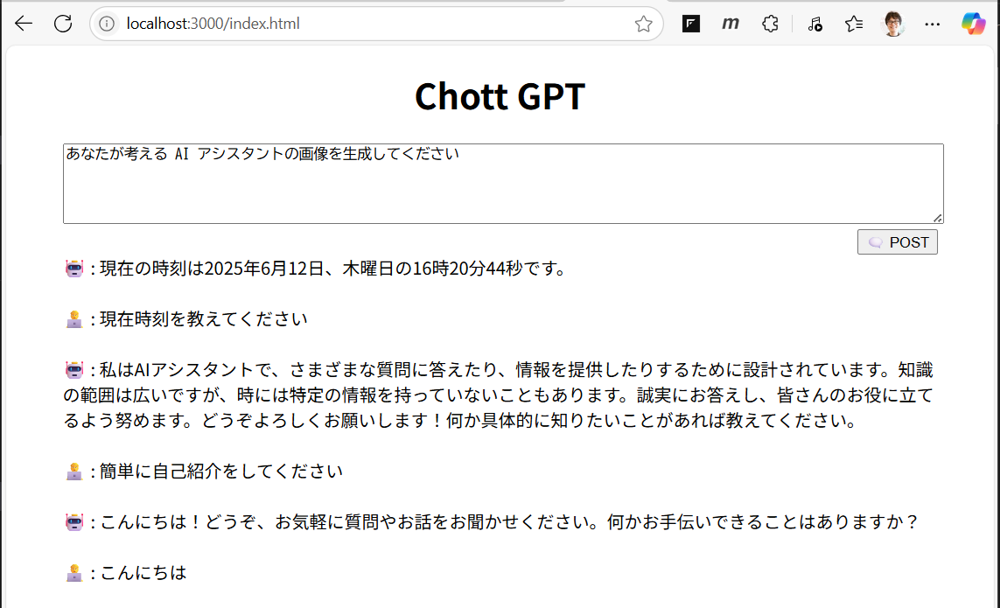

# 演習 1-2 : 演習用アプリケーションの入手と実行

演習で使用するアプリケーションを入手し、実行可能状態とします。

アプリケーションのプロジェクトの入手は GitHub 上にあるアプリケーションのリポジトリを直接クローンするのではなく、いったん受講者自身の GitHub アカウントにコピーしてから行います。

これはアプリケーションを Azure App Service にデプロイする際に、この GitHub リポジトリを経由して行うことでコードを修正した際の更新作業を容易にするためです。

リポジトリのコピー後、受講者自身の GitHub リポジトリからローカル環境にアプリケーションをクローンし、起動のための設定を行い、正常動作を確認します。

<br>

## 必要なツール 

この作業には以下のツールが必要です。インストールされていない場合は、以下のリンクからインストールを実施してください。
* **Visual Studio Code**  
  [Visual Studio Code のダウンロード](https://code.visualstudio.com/Download)

* **Node.js**  
  [Node.js のダウンロード](https://nodejs.org/ja/download/)

* **Git**  
  [Git のダウンロード](https://git-scm.com/downloads)

## 1. 演習用アプリケーションの入手

演習用アプリケーションのプロジェクトはテンプレートリポジトリとして作成されています。

同テンプレートを使用してユーザー自身の新規リポジトリの作成手順は以下のとおりです。

 1. 以下の URL にアクセスし、画面右上のボタン \[**Use this template**\]` をクリックし、\[**Create a new repository**\] を選択します  
      
    [basic-gpt-chatbot](https://github.com/osamum/basic-gpt-chatbot)

      
      <br>
    
1. **Create a new repository** 画面の各項目を以下のように設定します
      
     |  項目  |  値  |
     | ---- | ---- |   
     | Owner * | 自身のアカウント |
     | Repository name * | handson-bot |
     | Description (Optional) | 任意の説明 |
     | Public or Private|Public にチェック|
     | Include all branches | チェックしない|
    
2. 同ページの \[**Create repository from template**\] ボタンをクリックしてご自身の GitHub アカウントに `handson-bot` リポジトリが作成されたことを確認します
 
ここまでの手順で自身の GitHub アカウントに `handson-bot` リポジトリが作成されました。

<br>

## 2. ローカル環境へのクローンとアプリケーションの実行

GitHub アカウントに作成した `handson-bot` リポジトリをローカル環境にクローンし、アプリケーションの実行に必要な設定と依存関係のインストールを行います。

具体的な手順は以下のとおりです。

\[**手順**\]

1. ご自身の GitHub アカウントに作成した `handson-bot` リポジトリにアクセスし、画面内の \[**\<\> Code**\] ボタンをクリックし、表示された \[Local\] タブ内の \[**HTTPS**\] の URL をコピーします

    

2. ローカル環境の任意のディレクトリに移動し、以下のコマンドを実行して `handson-bot` リポジトリをクローンします

    ```bash
    git clone　<コピーしたURL>
    ```
3. クローンしたディレクトリに移動し、Visual Studio Code で開きます

    ```bash
    cd handson-bot
    code .
    ```

4. プロジェクトのルート ディレクトリにあるファイル `example.env` をコピーするか名前を変更し `.env` ファイルを作成します

5. `.env` ファイルを開き、[接続情報の取得](prep01.md#%E6%8E%A5%E7%B6%9A%E6%83%85%E5%A0%B1%E3%81%AE%E5%8F%96%E5%BE%97)で取得した接続情報を使用して、以下の内容を参考に環境設定を行います。なお、ここまでの手順のとおり設定を行っているのであれば `AZURE_OPENAI_ENDPOINT` と `AZURE_OPENAI_API_KEY` の値を設定するだけで、他の設定は設定値のままで問題ありません。
   
    ```env
    #Azure OpeAI Service リソースの接続情報
    AZURE_OPENAI_ENDPOINT=　Azure OpeAI Service リソースのエンドポイント URL
    AZURE_OPENAI_API_KEY=　Azure OpeAI Service リソースの API キー

    #言語モデルの設定
    LM_SETTINGS={"deploymentName":"言語モデルのデプロイ名", "apiVersion":"API のバージョン", "conversationLength":"会話を保持する件数", "tokenLimit":"トークンの上限"}

    #埋め込みモデルの設定
    EMBEDDING_SETTINGS={"deployName":"埋め込みモデルのデプロイ名", "apiVersion":"API のバージョン"}

    #画像生成モデルの設定
    IMAGE_GENERATOR_SETTINGS={"deploymentName":"画像生成モデルのデプロイ名", "apiVersion":"API のバージョン", "imageSize":"画像のサイズ","imageStyle":"vivid"}
    ```
    設定が完了したキーボードの \[**Ctrl + S**\] キーを押して保存します。

5. アプリケーションの依存関係をインストールします
   
   Visual Studio Code メニュー \[View\] - \[Terminal\] をクリックしてターミナルを開き、以下のコマンドを実行します。

    ```bash
    npm install
    ```
6. 依存関係のインストールが完了したら、以下のコマンドを実行してアプリケーションを起動します

    ```bash
    npm start
    ```

    以下のメッセージが表示されるのを待って表示された URL をクリックします

    ```bash
    Server is running on http://localhost:3000
    ```

7. ブラウザが起動し、アプリケーションのトップページが表示されることを確認します

    

    以下のプロンプトを実行して、アプリケーションが正常に動作することを確認します

    ```text
    こんにちは
    ```

    ```text
    簡単に自己紹介をしてください
    ```

    以下の質問に正しい結果が返ってくることで Function Calling が正常に動作していることを確認します

    ```text
    現在時刻を教えてください
    ```

    画像が生成できるか確認するために以下のプロンプトを実行します

    ```text
    あなたが考える AI アシスタントの画像を生成してください
    ```

    画像が認識できるか確認するために以下のプロンプトを実行します

    ```text
    この画像に映っている料理の作り方を教えてください https://osamum.github.io/publish/assets/steak.jpg
    ```

    RAG の設定がされていないので、以下の質問については回答できないことを確認します

    ```text
    やまたのおろち製作所の所在地を教えてください
    ```

    ここまでの手順で演習用アプリケーションの入手とローカルでの実行が完了しました。

この準備作業では演習用アプリケーションを入手し、ローカル環境で実行可能な状態にしました。

次の準備作業では、Azure AI Search のインデックスを作成し、RAG を有効化し、さらにその次の作業でアプリケーションを Azure App Service にデプロイして準備作業は完了です。


## 次へ

👉　[**演習 1-3 : Azure AI Search のインデックスの作成と RAG の有効化**](Ex01-3.md)

---

👈　[演習 1-1 : Azure リソースの作成](prep01.md)

🏚️　[README に戻る](README.md)

