# 演習 1-3 : Azure AI Search のインデックスの作成と RAG の有効化

演習用アプリケーションの RAG の機能を有効化するために、Azure AI Search のインデックスを作成します。

この演習での作業は以下のとおりです。

1. [Blob コンテナーへのドキュメントのアップロード](#1-blob-%E3%82%B3%E3%83%B3%E3%83%86%E3%83%8A%E3%83%BC%E3%81%B8%E3%81%AE%E3%83%89%E3%82%AD%E3%83%A5%E3%83%A1%E3%83%B3%E3%83%88%E3%81%AE%E3%82%A2%E3%83%83%E3%83%97%E3%83%AD%E3%83%BC%E3%83%89)
2. [Azure AI Search マネージド ID の有効化とアクセス許可](#2-azure-ai-search-%E3%83%9E%E3%83%8D%E3%83%BC%E3%82%B8%E3%83%89-id-%E3%81%AE%E6%9C%89%E5%8A%B9%E5%8C%96%E3%81%A8%E3%82%A2%E3%82%AF%E3%82%BB%E3%82%B9%E8%A8%B1%E5%8F%AF)
3. [Azure AI Search インデックスの作成](#3-azure-ai-search-%E3%82%A4%E3%83%B3%E3%83%87%E3%83%83%E3%82%AF%E3%82%B9%E3%81%AE%E4%BD%9C%E6%88%90)
4. [Azure AI Search への接続情報の取得](#4-azure-ai-search-%E3%81%B8%E3%81%AE%E6%8E%A5%E7%B6%9A%E6%83%85%E5%A0%B1%E3%81%AE%E5%8F%96%E5%BE%97)
5. [演習用アプリケーションの RAG の有効化](#5-%E6%BC%94%E7%BF%92%E7%94%A8%E3%82%A2%E3%83%97%E3%83%AA%E3%82%B1%E3%83%BC%E3%82%B7%E3%83%A7%E3%83%B3%E3%81%AE-rag-%E3%81%AE%E6%9C%89%E5%8A%B9%E5%8C%96)

## 1. Blob コンテナーへのドキュメントのアップロード

Azure AI Search で検索を行うためのデータとなるドキュメントを Azure Storage Blob コンテナーにアップロードします。

具体的な手順は以下のとおりです。

\[**手順▶️**\]

1. ここまでの作業でデプロイされた Azure Storage Account リソース `storage(ランダムな値)`を開き、画面左のメニューから \[データ ストレージ\]-\[**コンテナー**\] をクリックして、`rag-data-store` をクリックします
   
    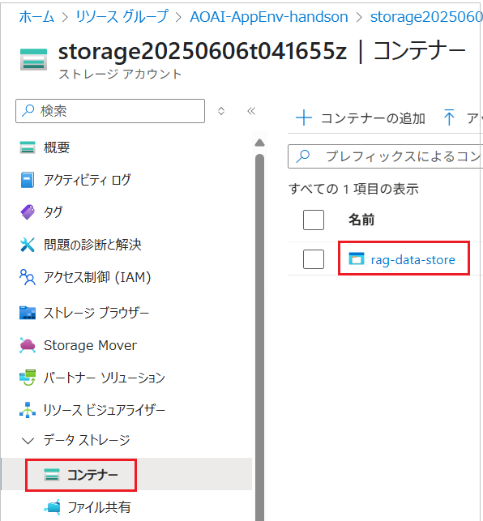 


2. 遷移した画面上部の \[**↑ アップロード**\] ボタンをクリックすると、画面右に \[**Blob のアップロード**\] ブレードが表示されます

    「**ファイルをこちらにドラッグ アンド ドロップまたはファイルの参照**」と書かれた灰色のボックス内に以下の検証用のダミーデータのファイルをドラッグ アンド ドロップするか、\[**ファイルの参照**\]リンクをクリックしてファイルを選択します

    - [**RAG 検証用ダミーデータ**](assets/RAG_TestData.txt)

    アップロード エリアにファイル名が表示されたら、\[**ファイルのアップロード**\] ボタンをクリックします

    

    アップロードが完了すると、アップロードしたファイルが一覧に表示されます。

    続いてアクセス許可の設定を行います。
    
3. Azure Storage Account の画面で、\[設定\]-\[**構成**\] メニューをクリックします。遷移した画面で \[**Azure portal で Microsoft Entra 認可を既定にする**\] の設定を **有効** にし、画面上部の \[**保存**\] ボタンをクリックします。

    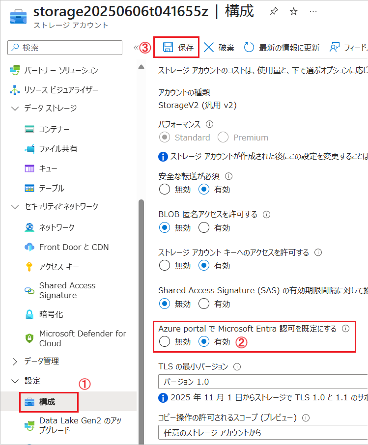

    この設定は Azure AI Search で Azure Storage Account 上のデータにアクセスしてインデックスを作成する際に必要な設定の一部です。

ここまでの手順で Azure Storage アカウントへのデータのアップロードが完了しました。

<br>

## 2. Azure AI Search マネージド ID の有効化とアクセス許可

Azure AI Search のインデックス作成にインポート ウィザードを使用しますが、その際、Azure Storage へのアクセスにキー認証が選択できなくなったためマネージド ID 認証を使用する必要があります。

ここではマネージド ID 認証に必要な設定を行います。

具体的な手順は以下のとおりです。

\[**手順▶️**\]

1. ここまでの作業でデプロイされた Azure AI Search リソース `search(ランダムな値)` を開き、\[設定\]-\[**ID**\] メニューをクリックします

    遷移した画面で \[**状態**\] の設定を **オン** にし、画面上部の \[**保存**\] ボタンをクリックします。

    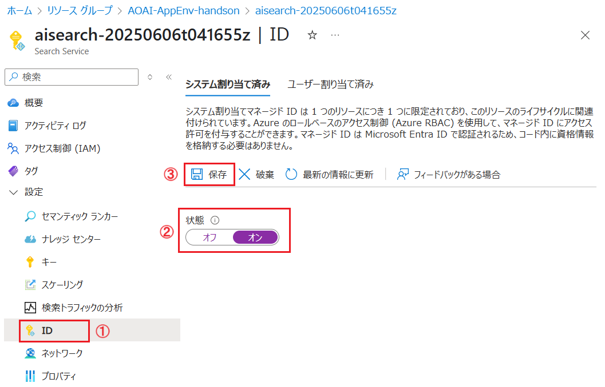

    これでこの Azure AI Search リソースにマネージド ID が付与されました。

2. Azure AI Search リソースにマネージド ID が有効になると \[**Azure ロールの割り当て**\] ボタンが表示されるのでクリックします

    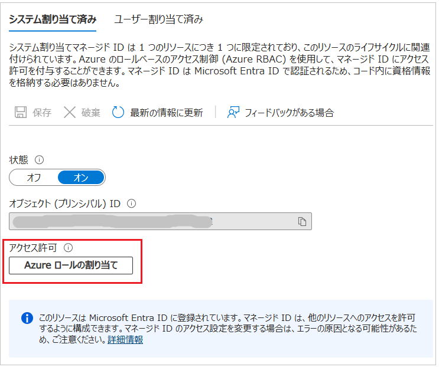

3. \[**Azure ロールの割り当て**\] 画面に遷移するので、画面上部の \[**+ ロールの割り当ての追加**\] ボタンをクリックします

    画面右側に \[**ロールの割り当ての追加**\] ブレードが表示されるので各項目のドロップダウン リストを以下のように設定します

    | 項目               | 設定値                                          |
    | ------------------ | ----------------------------------------------- |
    | スコープ           | **ストレージ**                                  |
    | サブスクリプション | この演習に使用しているもの                      |
    | リソース           | この演習でデプロイした Azure Storage アカウント |
    | 役割               | **ストレージ BLOB データ閲覧者**                |

    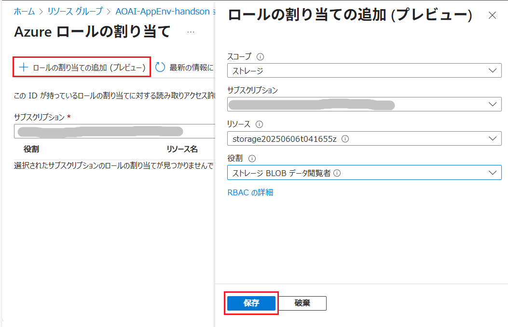

    設定が完了したら、画面下部の \[**保存**\] ボタンをクリックします。

ここまでの作業で Azure AI Search のマネージド ID を有効にし、指定した Azure Storage アカウントの BLOB コンテナーにデータの閲覧者としてアクセスできるようになりました。

<br>

## 3. Azure AI Search インデックスの作成

Azure Blob コンテナーにアップロードしたドキュメントを Azure AI Search を使用してベクトル検索できるようにインデックスを作成します。

具体的な手順は以下のとおりです。

\[**手順▶️**\]

1. 作業中の Azure AI Search リソース `search(ランダムな値)` の \[概要\] 画面を開き、画面上部の \[**データのインポートとベクター化**\] ボタンをクリックします

    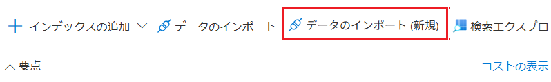

2. \[**データのインポートとベクター化**\] 画面に遷移し、データソースの選択メニューが表示されるので、\[**Azure Blob Storage**\] タイルをクリックします 
   
    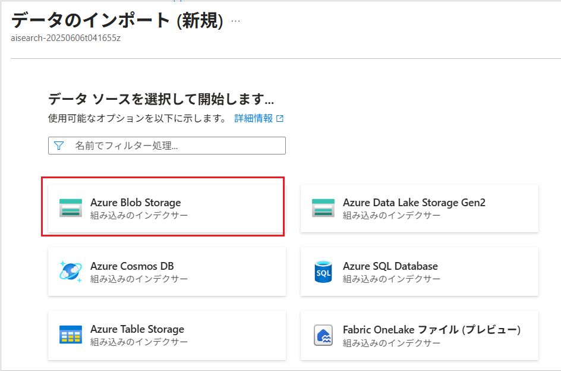

3. シナリオの選択画面に遷移するので、\[**RAG**\] タイルをクリックします

    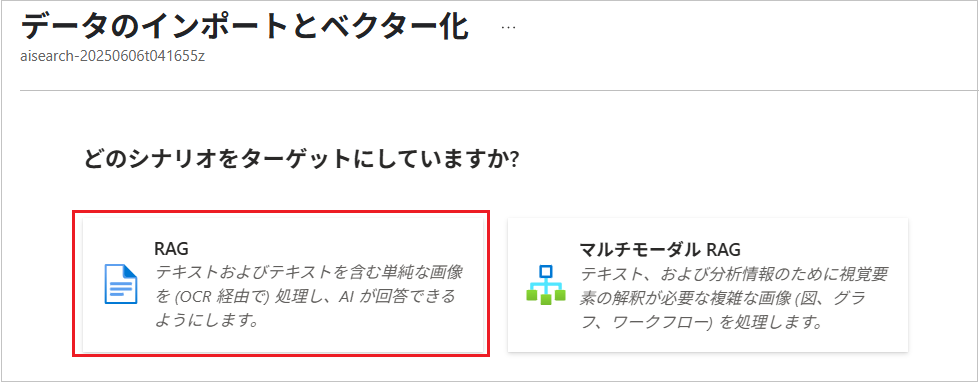

4. \[**Azure Blob Storage の構成**] 画面に遷移するので、各項目を以下のように設定します
   
    | 項目                  | 設定値                                      |
    | --------------------- | ------------------------------------------- |
    | サブスクリプション    | この演習に使用しているサブスクリプション    |
    | ストレージ アカウント | この演習でデプロイしたストレージ アカウント |
    | BLOB コンテナー       | `rag-data-store`                            |
    | BLOB フォルダー       | 既定のまま                                  |
    | 解析モード            | **テキスト**                                |
    | マネージド ID の種類  | **システム 割り当て**                       |

    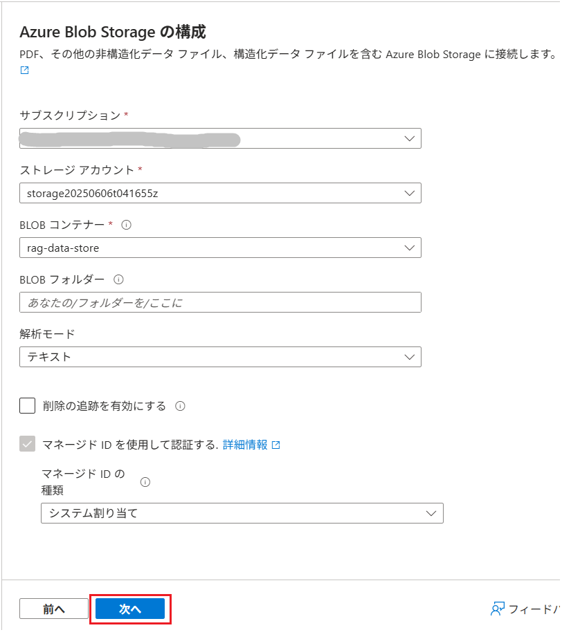

    各項目の設定か完了したら \[**次へ**\] ボタンをクリックします。

5. \[**テキストをベクトル化する**\] 画面に遷移するので、各項目を以下のように設定します

    | 項目                                                                                | 設定値                                       |
    | ----------------------------------------------------------------------------------- | -------------------------------------------- |
    | Kind                                                                                | \[**Azure OpenAI**\]                         |
    | サブスクリプション \*                                                               | この演習で使用しているサブスクリプション     |
    | Azure OpenAI Service \*                                                             | この演習でデプロイした Azure OpenAI リソース |
    | モデル デプロイ \*                                                                  | \[**text-embedding-ada-002**\]               |
    | 認証の種類                                                                          | \[**API キー**\]                             |
    | Azure OpenAI サービスに接続すると、アカウントに追加料金が発生することを承認します。 | チェック                                     |

    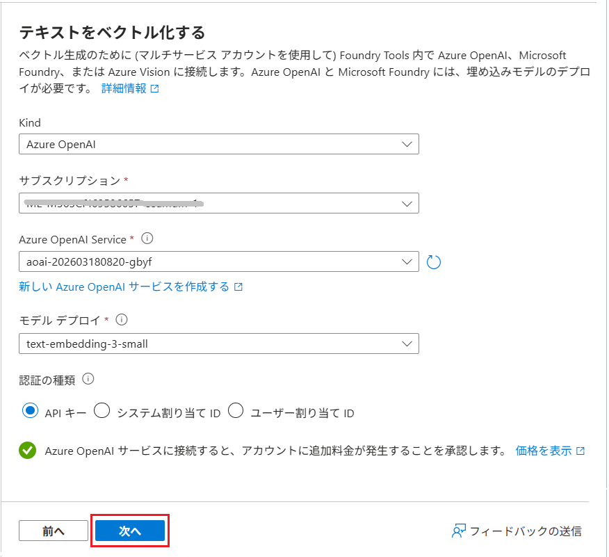

    各項目の設定か完了したら \[**次へ**\] ボタンをクリックします。

6. \[**画像をベクトル化する**\] 画面に遷移するので、既定の設定のまま \[**次へ**\] ボタンをクリックします

    

7. \[**高度なランク付けと関連性**\] 画面に遷移するので、既定の設定のまま \[**次へ**\] ボタンをクリックします

    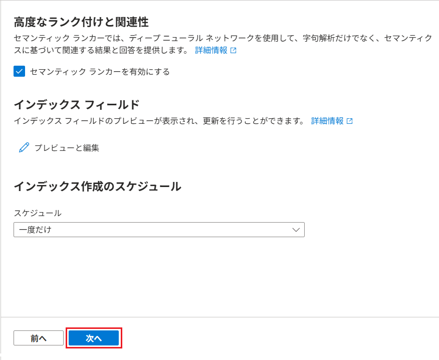
    

8. 遷移した画面内の \[オブジェクト名のプレフィックス\] の内容を `rag-index` に変更します。この値がインデックス名になります。

    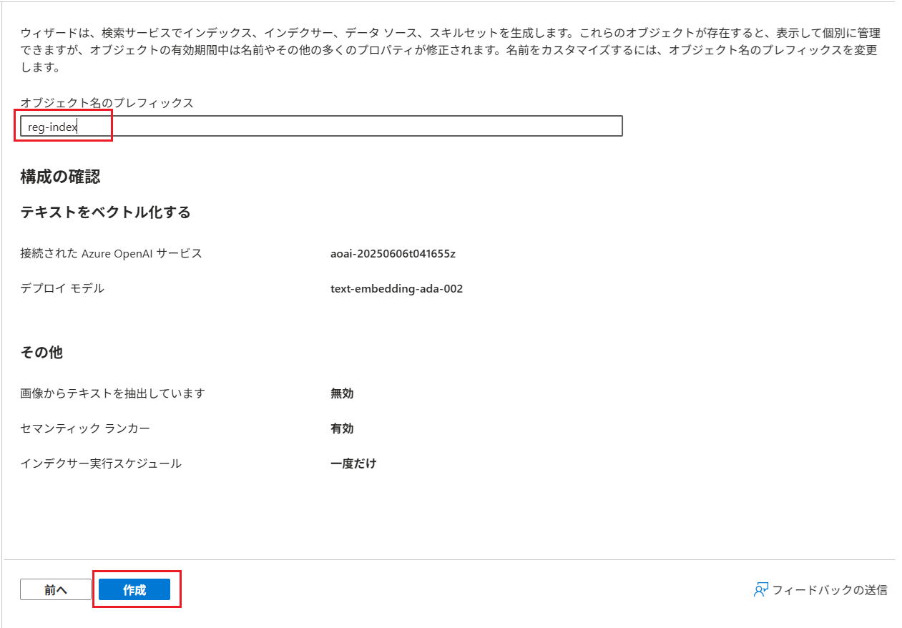

    画面下部の \[**作成**\] ボタンをクリックします。

9. \[**作成に成功しました**\] というメッセージ ボックスが表示されたら \[**検索の開始**\] ボタンをクリックします

10. 作成したインデックスの画面で \[**検索エクスプローラー**\] タブが表示されるので、検索ボックスに `*` を入力し、\[**検索**\] ボタンをクリックします

    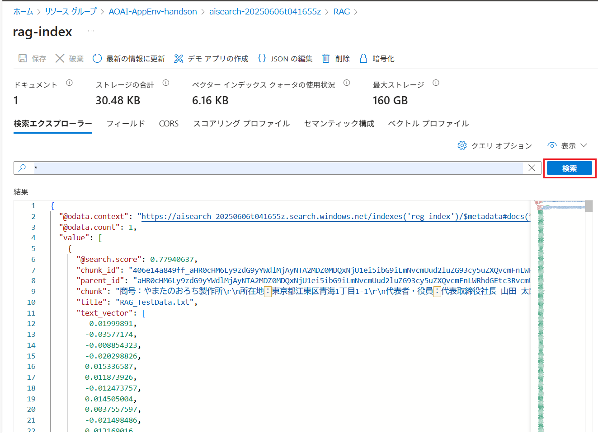

    検索結果にアップロードしたドキュメントの内容が表示されれば、インデックスの作成は成功です。

ここまでの手順で Azure AI Search のインデックスの作成が完了しました。

<br>

## 4. Azure AI Search への接続情報の取得

演習用アプリケーションから Azure AI Search のインデックスに接続するための情報を取得します。

以下のリンク先の手順に従い、Azure AI Search の接続情報を取得してください。なお、このリンクは [Azure OpenAI アプリケーション開発ハンズオン](https://github.com/osamum/AOAI-first-step-for-Developer)コンテンツに遷移するので、Azure AI Search の接続情報の取得が完了したら**次の演習には進まずにこのページに戻ってきてください**。

* [**Azure AI Search インスタンスの情報取得**](https://github.com/osamum/AOAI-first-step-for-Developer/blob/main/Ex03-4.md#%E6%BA%96%E5%82%99-1--azure-ai-search-%E3%82%A4%E3%83%B3%E3%82%B9%E3%82%BF%E3%83%B3%E3%82%B9%E3%81%AE%E6%83%85%E5%A0%B1%E5%8F%96%E5%BE%97)

<br>

## 5. 演習用アプリケーションの RAG の有効化

入手した Azure AI Search の接続情報を演習用アプリケーションに設定し、RAG の機能を有効化します。

具体的な手順は以下のとおりです。

\[**手順▶️**\]

1. Visual Studio Code で演習用アプリケーションのプロジェクトのルート ディレクトリにある `.env` ファイルを開きます

2. `.env` ファイルの以下の項目に、Azure AI Search の接続情報を設定します

    設定するのは `SEARCH_ENDPOINT` と `SEARCH_API_KEY` のみで、他の項目はそのままで問題ないはずですが、もし、実行時にエラーが発生する場合は `SEARCH_SETTINGS` の `indexName`(検索に使用するインデックス名) と `fieldName`(ベクトルデータが格納されているフィールド名) の値を、Azure AI Search のインデックスの設定に合わせて変更してください。

    ```env
    SEARCH_ENDPOINT=
    SEARCH_API_KEY=
    SEARCH_SETTINGS={"indexName":"rag-index","fieldName":"text_vector","thresholdScore":"5.8"}

    ```

    設定が完了したらキーボードの \[Ctrl\] + \[S\] キーを押して保存します。

3. Visual Studio Code メニュー \[View\] - \[Terminal\] をクリックしてターミナルを開き、以下のコマンドを実行してアプリケーションを起動します

    ```bash
    npm start
    ```

    以下のメッセージが表示されるのを待って表示された URL をクリックします
    
    ```
    Server is running at http://localhost:3000
    ```

4. アプリケーションが起動したら、以下のプロンプトを実行して、アプリケーションの RAG の機能が正常に動作することを確認します

    ```text
    やまたのおろち製作所の所在地はどこですか？
    ```

    Azure AI Search のインデックスに登録したドキュメントの内容が返ってくることを確認します。続いて以下のプロンプトを実行して、会話の状態が保持されていることを確認します

    ```text
    この会社の社長は誰ですか？
    ```

    ```text
    この会社の事業内容を教えてください
    ```
    
   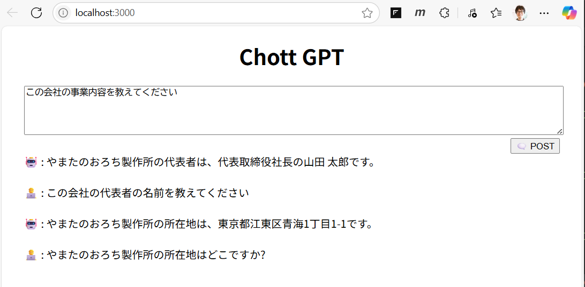

   ここまでの手順で演習用アプリケーションの RAG の機能が有効化され、Azure AI Search のインデックスを使用して検索ができるようになりました。

この準備作業では Azure Storage にアップロードしたデータを Azure AI Search にインポートし、ベクトル インデックスの作成を行いました。

また、Azure AI Search への接続情報を演習用アプリケーションの設定ファイルに追加し RAG の機能の有効化を行いました。

## 次へ

👉　[**演習 1-4 : Azure への演習用アプリケーションのデプロイ**](Ex01-4.md)

---

👈　[演習 1-2 : 演習用アプリケーションの入手と実行](Ex01-2.md)

🏚️　[README に戻る](README.md)
