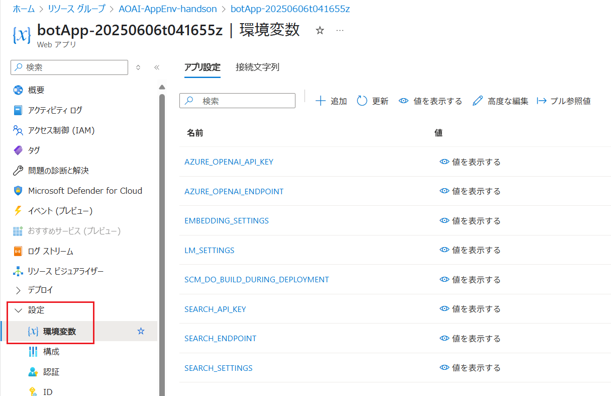
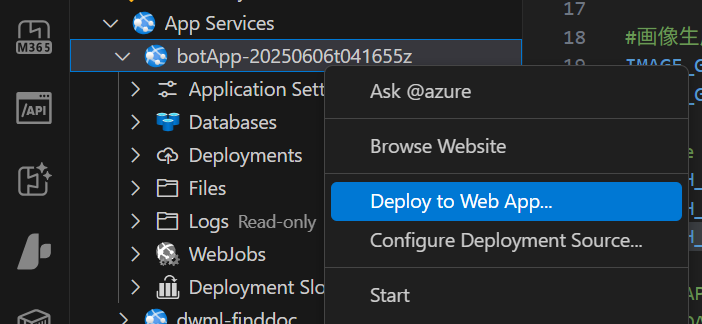
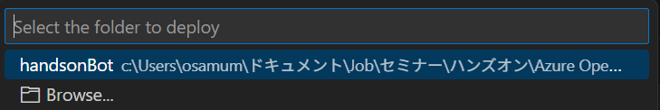
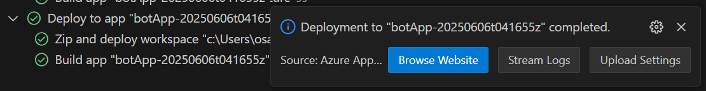
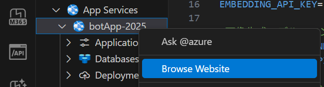
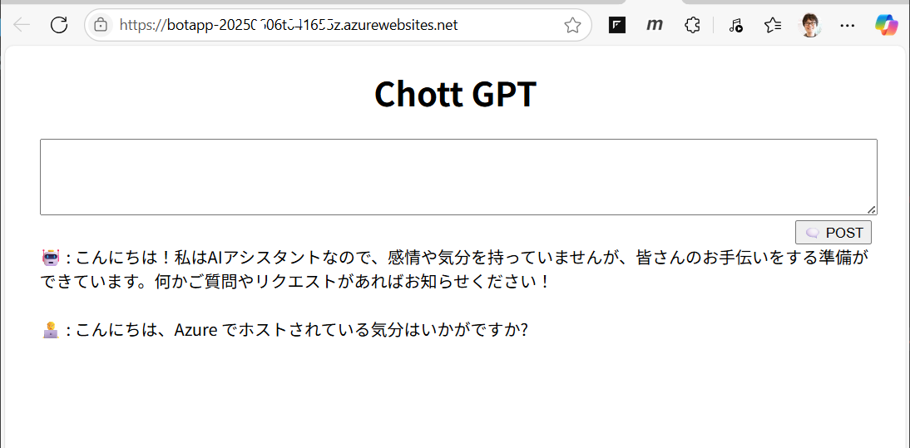

# 演習 1-4 : Azure への演習用アプリケーションのデプロイ

ローカル環境で正常動作が確認できた演習用アプリケーションを [準備 1 : Azure リソースの作成](Ex01-1.md) で作成しておいた Azure App Service にデプロイします。

この準備作業では、作成済みの Azure App Service に対し環境変数を設定し、その後、Visual Studio Code を使用してアプリケーションをデプロイします。

この演習での作業は以下のとおりです。

1. [Azure App Service の環境変数の設定](#1-azure-app-service-%E3%81%AE%E7%92%B0%E5%A2%83%E5%A4%89%E6%95%B0%E3%81%AE%E8%A8%AD%E5%AE%9A)
2. [Azure App Service へのアプリケーションのデプロイ](#2-azure-app-service-%E3%81%B8%E3%81%AE%E3%82%A2%E3%83%97%E3%83%AA%E3%82%B1%E3%83%BC%E3%82%B7%E3%83%A7%E3%83%B3%E3%81%AE%E3%83%87%E3%83%97%E3%83%AD%E3%82%A4)

<br>

## 1. Azure App Service の環境変数の設定

Azure App Service の環境変数の設定は、Azutre Portal や Azure CLI の以下のコマンドで行えますが、各環境変数ごとに設定するのは手間がかかるので Bicep を使用して一括で設定します。

具体的な手順は以下のとおりです。

\[**手順**▶️\]

1. 以下の内容をメモ帳などのテキストエディタに貼り付け、環境変数の設定の中身をコメントに従い書き換えます

    ``` bicep
    param siteName string
    param location string = resourceGroup().location

    resource appService 'Microsoft.Web/sites@2022-03-01' existing = {
    name: siteName
    }

    resource appSettings 'Microsoft.Web/sites/config@2022-03-01' = {
     name: '${siteName}/appsettings'
     properties: {
        'SCM_DO_BUILD_DURING_DEPLOYMENT' : 'true'
        'AZURE_OPENAI_ENDPOINT' : 'AzureOpenAI サービスのエンドポイント'
        'AZURE_OPENAI_API_KEY' : 'AzureOpenAI サービスの API キー'
        'LM_SETTINGS' : '{"deploymentName":"gpt-4o-mini", "apiVersion":"2024-05-01-preview", "conversationLength":"10", "tokenLimit":"20000"}'
        'IMAGE_GENERATOR_SETTINGS' : '{"deploymentName":"dall-e-3", "apiVersion":"2024-06-01", "imageSize":"1024x1024","imageStyle":"vivid"}'
        'EMBEDDING_SETTINGS' : '{"deployName":"text-embedding-ada-002", "apiVersion":"2023-05-15"}'
        'SEARCH_ENDPOINT' : 'Azure AI Search のエンドポイント'
        'SEARCH_API_KEY' : 'Azure AI Search の API キー'
        'SEARCH_SETTINGS' : '{"indexName":"reg-index","fieldName":"text_vector","thresholdScore":"5.8"}'
     }
    }
    ```

    実際に書換えが必要な環境変数の箇所は以下のとおりです:
    
    * AZURE_OPENAI_ENDPOINT : Azure OpenAI サービスのエンドポイント
    * AZURE_OPENAI_API_KEY : Azure OpenAI サービスの API キー   
    * SEARCH_ENDPOINT : Azure AI Search のエンドポイント
    * SEARCH_API_KEY : Azure AI Search の API キー

    書換えが完了したら内容を `prep-app-env.bicep` という名前で保存します

2. [Azure ポータル](https://portal.azure.com)にログインし、画面右上にある Cloud Shell アイコンをクリックして Cloud Shell 画面を開きます

    

3. Cloud Shell 画面のメニュー \[ファイルの監理\] - \[アップロード\] を選択し、作成した `prep-app-env.bicep` ファイルをアップロードします

    
    
    ファイルのアップロードが完了したら以下のコマンドを実行してアップロードしたファイルがリストされることを確認します。

    ```bash
    ls
    ```
4. アップロードした Bicep ファイルを使用して Azure リソースをデプロイします。実行するコマンドは以下のとおりです。(※コマンドライン中の `siteName` の値は、準備 1 で作成した Azure App Service の名前に置き換えてください)

    ```bash
    az deployment group create --resource-group AOAI-AppEnv-handson --template-file prep-app-env.bicep --parameters siteName=環境変数を設定するAzureAppServiceの名前
    ```
    
    Bicep の実行が完了するまで待ちます。

5. デプロイが完了したら Azure App Service のプロパティ画面を開き、画面左のメニュー \[設定\] - \[**環境変数**\]をクリックします
   
    環境変数の一覧が表示されるので、Bicep に記述した環境変数が正しく設定されていることを確認します。

    

    もし、足りないものや誤っているものがあれば、同画面で直接修正してください。

ここまでの作業で、Azure App Service に環境変数が設定されました。

なお、Bicep を使用すると、既存の環境変数が全て上書きされてしまうので、既存の環境変数に設定を追加する場合は、Azure Portal の UI や 以下のコマンドを使用してください。

```
az webapp config appsettings set \
  --name <app-service-name> \
  --resource-group <rg-name> \
  --settings MY_ENV_VAR=value
```

<br>

## 2. Azure App Service へのアプリケーションのデプロイ

Azure App Service へのアプリケーションのデプロイは、さまざまな方法で行えますがここでは Visual Studio Code の Azure Tools　拡張機能パックを使用して行います。

作業に入る前に以下のリンクより、Visual Studio Code の Azure Tools 拡張機能パックをインストールしてください。

* [**Azure Tools 拡張機能パック**](https://marketplace.visualstudio.com/items?itemName=ms-vscode.vscode-node-azure-pack)

その他、以下の方法でも Azure App Service へのデプロイが可能ですので、以下のいずれかの方法でデプロイを行っても問題ありません。

* [ZIP または WAR を使用する](https://learn.microsoft.com/ja-jp/azure/app-service/deploy-zip?tabs=cli)
* [FTP/S を使用した Azure App Service へのアプリのデプロイ](https://learn.microsoft.com/ja-jp/azure/app-service/deploy-ftp?tabs=portal)
* [Azure App Service への継続的デプロイを構成する](https://learn.microsoft.com/ja-jp/azure/app-service/deploy-continuous-deployment?tabs=github%2Cgithubactions)
* [Git をローカルで使用して Azure App Service にデプロイする](https://learn.microsoft.com/ja-jp/azure/app-service/deploy-local-git?tabs=cli)
* [Azure Pipelines を使用して Azure App Service にデプロイする](https://learn.microsoft.com/ja-jp/azure/app-service/deploy-azure-pipelines?tabs=yaml)
* [GitHub Actions を使用した App Service へのデプロイ](https://learn.microsoft.com/ja-jp/azure/app-service/deploy-github-actions?tabs=openid%2Caspnetcore)

なお、GitHub Actions を使用した CI/CD 環境の構築は、この[ハンズオンの演習](Ex03-1.md#2-github-actions-%E3%82%92%E4%BD%BF%E7%94%A8%E3%81%97%E3%81%9F-cicd-%E7%92%B0%E5%A2%83%E3%81%AE%E6%A7%8B%E7%AF%89)でも実施します。

### Visual Studio Code を使用した Azure App Service へのアプリケーションのデプロイ

Visual Studio Code と Azure Tools 拡張機能パックを使用して Azure App Service へのアプリケーションのデプロイを行います。

具体的な手順は以下のとおりです。

\[**手順**▶️\]

1. Visual Studio Code で演習用アプリケーションのソースコードを開き、Visual Studio Code の左側のメニュー バーから Azure のアイコンをクリックします

    はじめて Azure 拡張機能を使用する場合は、メニュー バーの右隣のツリーより \[**Sign in Azure**\] をクリックします

    

    メッセージ ボックスに `The extension 'Azure Resources' wants to sign in using Microsoft.` と表示されるので \[**Allow**\] ボタンをクリックすると Web ブラウザーが起動して認証が行われ、認証が完了すると Visual Studio Code に Azure サブスクリプションの一覧が表示されます。

2. サブスクリプションのアイコンをクリックすると、Azure リソースのアイコンの一覧が表示されるので、\[**App Service**\] をクリックして展開し、表示された App Service の一覧から今回の準備作業で作成した Azure App Service を右クリックして \[**Deploy to Web App**\] を選択します。

    

3. デプロイするプロジェクトのフォルダーを選択するように求められるので、演習用アプリケーションのソースコードが格納されているフォルダーを選択します。

    

    "(App Service 名)にデプロイしますか? 以前のデプロイは上書きされ、取り消すことはできません。" というメッセージが表示されるので、\[**Deploy**\] ボタンをクリックします。

4. デプロイが開始され、デプロイの進捗状況が Visual Studio Code の下部に表示されます。

5. デプロイが完了すると、以下のようなメッセージが表示されるので \[**Browse  Website**\] ボタンをクリックします。

    

    もし、メッセージ ボックスが消えてしまった場合は、Visual Studio Code の Azure Tools 拡張のツリービューより目的の Azure App Service のアイコンを右クリックし、表示されたコンテキス メニューから \[**Browse Website**\] を選択します。

    

6. ブラウザーが起動し、Azure App Service にデプロイした演習用アプリケーションが表示されます。

    

    これで Azure App Service への演習用アプリケーションのデプロイが完了しました。

    ブラウザーの URL を確認すると、`https://<App Service 名>.azurewebsites.net` のような形式になっていることが確認できます。

ここまでの手順で、演習用アプリケーションを Azure App Service にデプロイして、Azure 上で動作することを確認しました。


## 次へ

👉　[**演習 2 : アプリケーションをホストするための基本的な設定**](Ex02.md)

---

👈　[演習 1-3 : 演習用アプリケーションの RAG の有効化](Ex01-3.md)

🏚️　[README に戻る](README.md)
