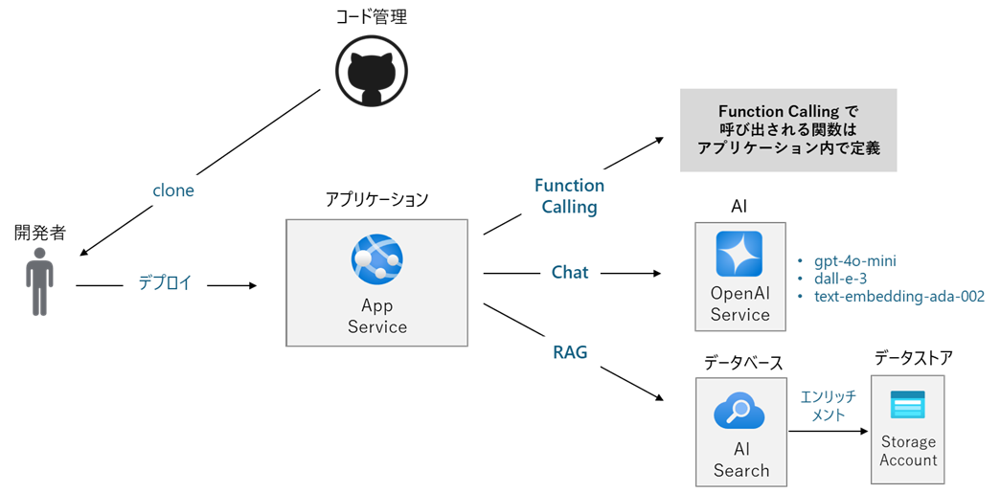

## 演習 1 : Azure リソースの作成とアプリケーションのデプロイ

Microsoft Azure 上に Azure OpenAI Service を利用した演習用アプリケーションをホストするために必要なリソースを Bicep を使用して自動作成します。

ローカルの開発環境では、演習用アプリケーションを GitHub リポジトリからローカルの開発環境に clone し、その後、Visual Studio Code 上で動作確認を行った後に Azure App Service にデプロイします。

この演習 1 で構築される環境は、アプリケーション開発における機能確認を確認するのための初期の PoC (Proof of Concept) のホスティング環境を想定しています。

ここでの作業内容は以下とおりです。

1. [**Azure リソースの作成**](Ex01-1.md)
2. [**演習用アプリケーションの入手と実行**](Ex01-2.md)
3. [**演習用アプリケーションの RAG の有効化**](Ex03-3.md)
4. [**演習用アプリケーションの Azure へのデプロイ**](Ex01-4.md)
   
 

## 次へ

👉　[**演習 1-1 : Azure リソースの作成**](Ex01-1.md)

---

👈 [はじめに](intro.md)

🏚️　[README に戻る](README.md)

