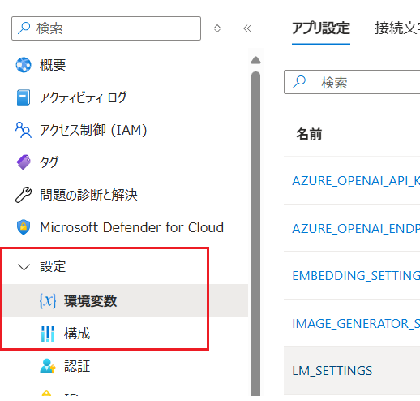
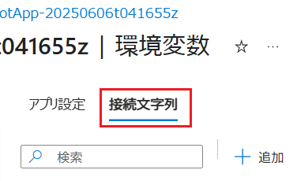

# 演習 2-1 : ホスティングに関する設定の確認

この演習では、Azure App Service で Web サイトや Web アプリケーションをホストするための基本的な設定である環境変数やアプリケーションのランタイムなどの設定を確認します(※)。

(※既に Azure App Service で Web サイトや Web アプリケーションをホストしている方はスキップして構いません)

オンプレミスでの Web サーバーの運用経験者が Azure App Service で Web サイトや Web アプリケーションをホストする際に知っておかなければならないことが 2 つあります。

それはこれまでオンプレミスの環境で確認していたアプリケーションをホストするための設定を、Azure ではどのように設定するのかということと Azure ならではの制限についてです。

これらは細かくは非常にたくさんありますが、このタスクでは基本にして必須のものを紹介します。

## 1. App Service の設定の確認

Web サイトやアプリケーションをホストする際に把握しておくべき環境変数や利用可能なアプリケーションのランタイム、既定のページや仮想ディレクトリなどの設定を確認します。

これらの設定は App Servive のメニュー \[設定\] グルーブ内の \[**環境変数**\]、\[**構成**\] 画面で確認することができます。

### \[環境変数\] の設定について

環境変数の設定画面については 既に演習 1-4 の [1. Azure App Service の環境変数の設定](Ex01-4.md#1-azure-app-service-%E3%81%AE%E7%92%B0%E5%A2%83%E5%A4%89%E6%95%B0%E3%81%AE%E8%A8%AD%E5%AE%9A) で既に設定を確認していますが、App Service には環境変数以外にも 特定の Azure データベースの接続文字列を格納できる **接続文字列** というものを設定することができます。

接続文字列は保存時に暗号化されるので、環境変数よりも安全にデータへの接続情報を保存することができます。ただし現在ではより安全性の高い Azure Key Vault を使用することが推奨されています。

接続文字列については、以下のドキュメントを参照してください。

* [接続文字列を構成する](https://learn.microsoft.com/ja-jp/azure/app-service/configure-common?tabs=portal#configure-connection-strings)

アプリケーションとデータベース間の接続文字列の保護については以下を参照してください。

* [アプリケーションとデータベース間の接続文字列を保護する](https://learn.microsoft.com/ja-jp/azure/app-service/tutorial-connect-overview)

### \[**構成**\] について

Azure App Service の \[**構成**\] 画面の \[**全般設定**\] タブでは、アプリケーションのランタイムやプロトコル設定、証明書などの設定を確認することができます。

\[**パスのマッピング**\] タブではマウントするストレージの設定を \[**エラーページ**\] タブではエラー発生時の HTTP ステータス コードを指定して任意のエラー ページを設定できます。