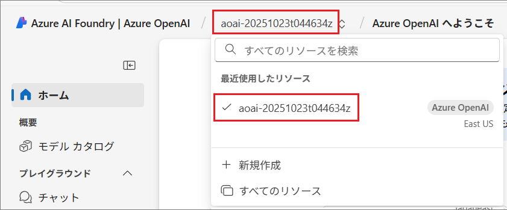
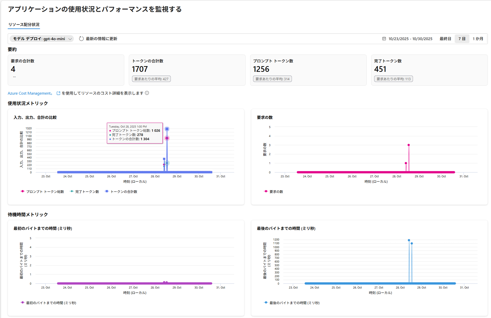

# 演習 2-2-2 : Azure OpenAI サービスのメトリックの表示

Azure OpenAI サービスでデプロイされる AI モデルは Azure AI Foundry サービス上でホスティングされます。

Azure AI Foundry には、それ単体でログを確認する機能は提供されていませんが、デプロイされた言語モデルのメトリック(状態)を確認するための機能が提供されています。これにより、モデルの動作状況を把握することができます。(※ただし、この機能は現在言語モデルに対してのみ提供されており、画像生成モデルや埋め込みモデルには提供されていません)

Azure OpenAI サービスにデプロイされた言語モデルのメトリックを表示する具体的な手順は以下の通りです。

\[**手順**▶️\]

1. [Azure AI Foundry](https://ai.azure.com) 画面にログインします

    画面左に表示されている **Azure AI Foundry | Azure OpenAI /** の右横に、このハンズオンで作成した OpenAI リソースの名前が表示されていることを確認します。もし、違う名前が表示されている場合は、クリックしてこのハンズオンで作成した OpenAI リソースを選択します。
 
    

2. 画面左側のメニューから \[**監視**\] をクリックし、\[目的のデプロイの選択\] ドロップダウンボックスから、ログを表示したいデプロイ(言語モデルの)を選択して、 ドロップダウンボックスの下にある \[**始めましょう**\] ボタンをクリックします。
　
    

3. [**アプリケーションの使用状況とパフォーマンスを監視する**] 画面に遷移し、指定期間内の \[**要求の合計数**\]、\[**トークンの合計数**\]、\[**プロンプト トークン数**\]、\[**完了トークン数**\] の値、**使用状況メトリック** と **待機時間メトリック** のグラフが表示され、グラフ上にマウスカーソルを合わせると、各時点での数値が表示されます。

    

ここまでの手順で、Azure OpenAI サービスにデプロイされた言語モデルのメトリックを表示することができました。

Azure OpenAI サービスのより詳しいメトリックの取得方法やアクションの設定方法、ログの取得方法については [演習 3-3 : 高度なログ監視](Ex03-3.md) で説明します。

 

## 次へ

👉　[**演習 2-3 : バックアップの設定**](Ex02-3.md)

---

👈　[演習 2-2-1 : App Service ログの設定と有効化](Ex02-2-1.md)

🏚️　[README に戻る](README.md)