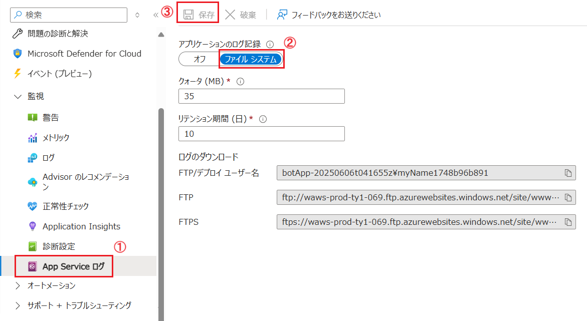
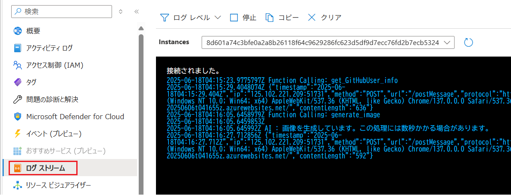
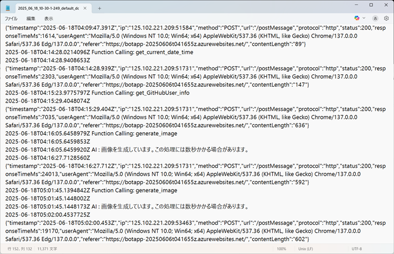

# 演習 2-2 : App Service ログの設定と有効化

この演習では App Service のログの有効化を行います。

> [!NOTE]
この演習では App Service 単体でのログの取得方法についてのみ説明します。Azure Storage や Azure AI Search、Azure OpenAI サービスのログの取得、さらには Azure Monitor が提供するさまざまな監視やログ分析機能を使用する機能については [演習 2-6 : 高度なログ監視](Ex03-3.md) で説明します。

一般的な Web サーバーの場合、既定の状態でアクセスログやエラーログなどのログが出力されますが、App Service では既定ではログが出力されないため、ログの設定と有効化を行う必要があります。

<br>

## 🌐 App Service のログの設定と有効化

App Service のログの設定は App Service のメニュー \[監視\] グループ内の \[**App Service ログ**\] 画面で行います。

使用している App Service のプラットフォームが Windows の場合は、ログの保存先として Azure Storage アカウントの BLOB コンテナーを指定することができますが、この演習で使用しているアプリケーションは Linux であるため App Service インスタンスのファイルシステムにログが保存されます。

この演習では、App Service のログを有効化し、ログストリームでログの取得状況をリアルタイムで確認したあとで、ログファイルをダウンロードして取得します。

具体的な手順は以下の通りです。

\[**手順**▶️\]

1. [Azure Portal](http://portal.azure.com) にログインします

2. この演習で使用している App Service のリソース画面を表示します

3. 画面左側のメニューから \[監視\] - \[**App Service ログ**\] をクリックします

    遷移した画面で \[**アプリケーションのログ記録(ファイルシステム)**\] トグルボタンを \[**オン**\] にし、画面上部の \[**保存**\] ボタンをクリックします

    
    
4. 画面左側のメニューから \[**ログストリーム**\] をクリックし、ログストリームの画面を表示します

5. Web ブラウザーの新しいタブを開き、演習用アプリケーションを表示して以下のようにいくつかのプロンプトを入力してやりとりを行います

    ``` text
    こんにちは
    ```

    ``` text
    現在の日時を教えてください
    ```

    ``` text
    GitHub アカウント、Octocat の写真を表示してください
    ```
    
    ``` text
    おいしそうなフィレステーキの画像をできるだけ写実的に生成してください
    ```
6. 再度ログストリームの画面を表示すると、取得されたログがリアルタイムで表示されていることが確認できます

    

7. ファイルシステムに取得されたアプリケーション ログをダウンロードします

    以下の URL を Web ブラウザーのナビゲーションバーに入力し、アプリケーション ログをダウンロードします。

    ```
    https://<app-name>.scm.azurewebsites.net/api/logs/docker/zip
    ```
    (※) ここで、\<app-name\> は演習で使用している App Service の名前に置き換えてください。

    なお、ファイルシステムに取得されたアプリケーション ログは、App Service が動作する OS ごとに以下のように異なります。

    - Linux/custom コンテナー: `https://<app-name>.scm.azurewebsites.net/api/logs/docker/zip`
    - Windows アプリ: `https://<app-name>.scm.azurewebsites.net/api/dump`

8. ダウンロードされた zip ファイル内の `<日付データ>_dafault_docker.log` ファイルを開き、ログストリームと同じ内容が記録されていることを確認します
 
    

ここまでの手順で、App Service のログの設定と有効化、ログストリームでのリアルタイムのログ確認、ファイルシステムからのログファイルのダウンロードが完了しました。


### 📖 App Service の OS による取得されるログの違いについて

App Service の OS によって、設定可能なログの種類や取得されるログの内容が異なります。

Windows の場合、Web サーバーログとして、アプリケーション側でコードを追加しなくても、HTTP リクエストのログやアプリケーション エラーのログが取得されますが、Linux の場合は、アプリケーション側でコードを追加する必要があります。

このハンズオンで使用している App Service は Linux を使用しているため、HTTP リクエストのログは、演習用アプリケーションのソース [app.js の 15 行目](https://github.com/osamum/basic-gpt-chatbot/blob/main/app.js)のコードで出力されています。

この App Service が使用している OS による取得できるログデータの詳細については、以下のドキュメントを参照してください。

* App Service のドキュメント - [ログの種類の概要](https://learn.microsoft.com/ja-jp/azure/app-service/troubleshoot-diagnostic-logs#overview-of-logging-types)

また、Linux を使用する App Service のログについての詳細は以下のドキュメントを参照してください。

* Japan PaaS Support Team Blog - [App Service on Linux におけるログ出力について](https://azure.github.io/jpazpaas/2023/07/27/AppServiceOnLinux-Log.html)

その他、Windows を使用する App Service の App Service ログの有効化についての演習を実施したい場合は、以下のドキュメントを参照してください。

* Azure App Service ハンズオン - [タスク 2 : App Service ログの設定と有効化](https://github.com/osamum/Azure-AppService-handson/blob/main/ex02.md#%E3%82%BF%E3%82%B9%E3%82%AF-2--app-service-%E3%83%AD%E3%82%B0%E3%81%AE%E8%A8%AD%E5%AE%9A%E3%81%A8%E6%9C%89%E5%8A%B9%E5%8C%96)

<br>

## 次へ

👉　[**演習 2-3 : バックアップの設定**](Ex02-3.md)

---

👈　[演習 2-1 : ホスティングに関する設定の確認](Ex02-1.md)

🏚️　[README に戻る](README.md)