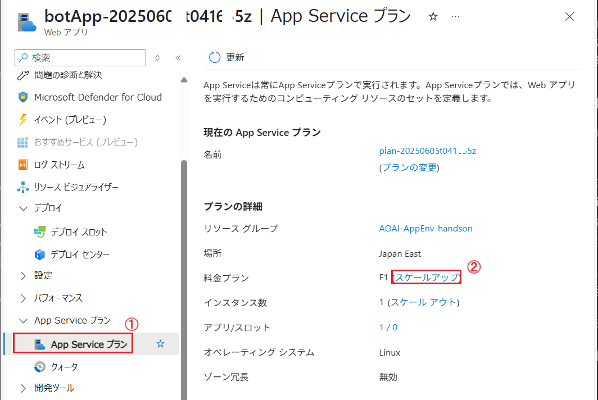
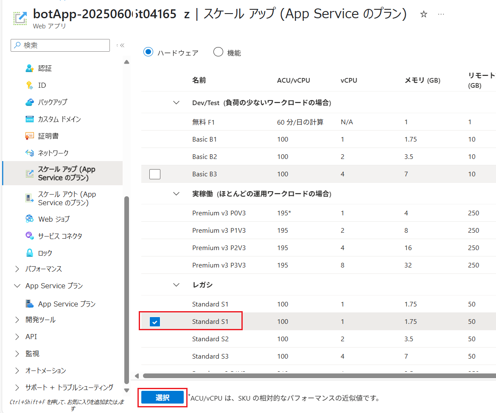
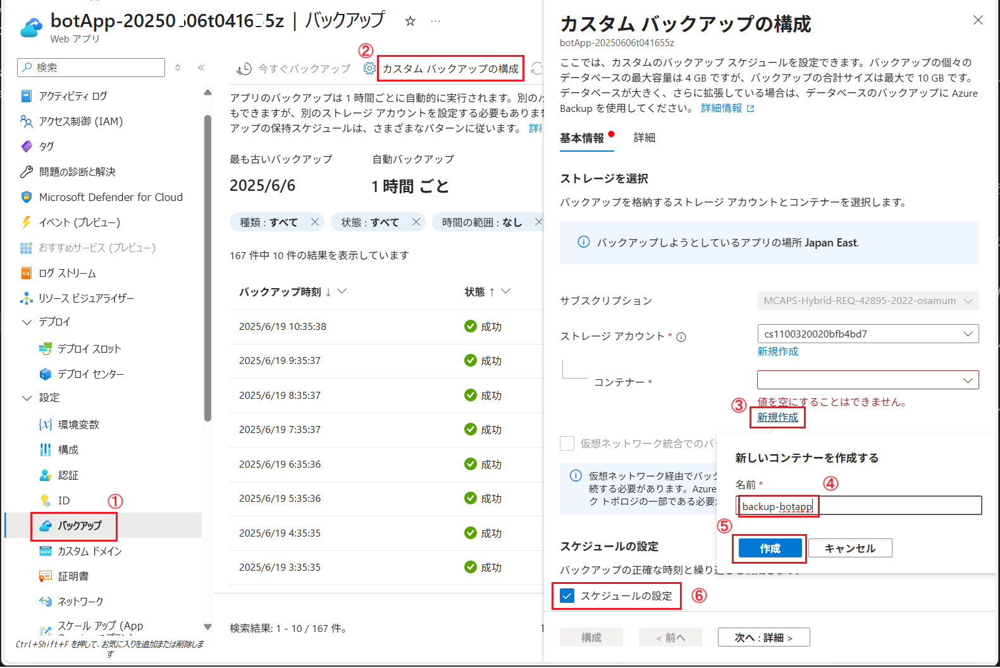
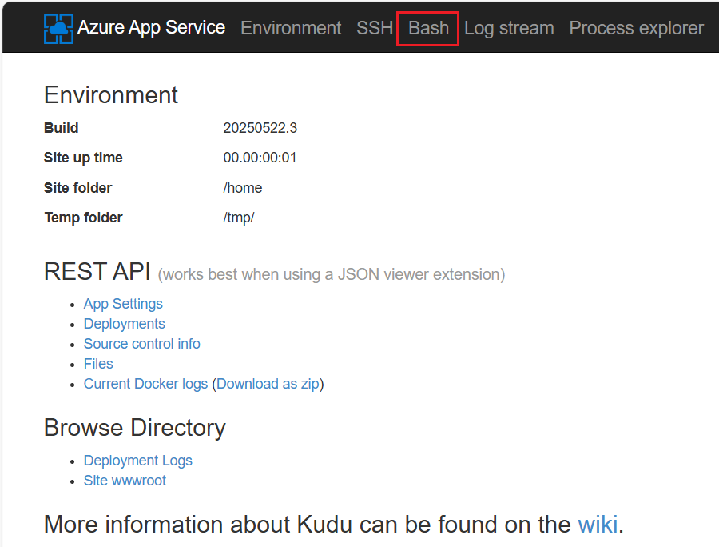
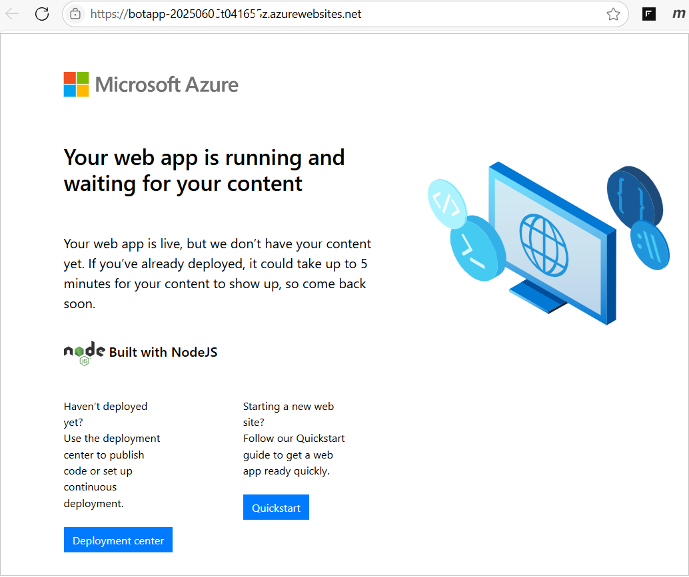
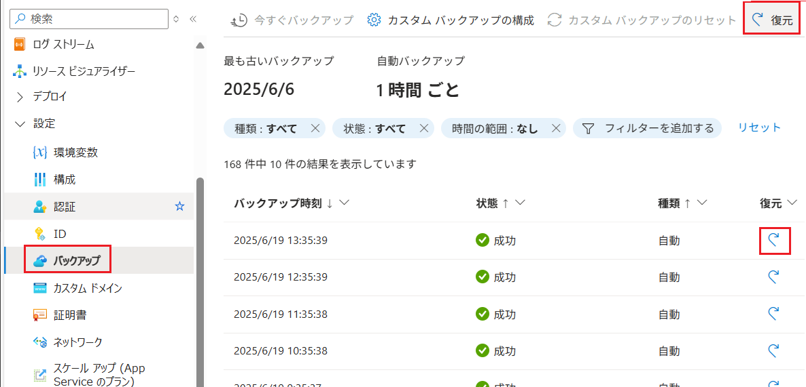
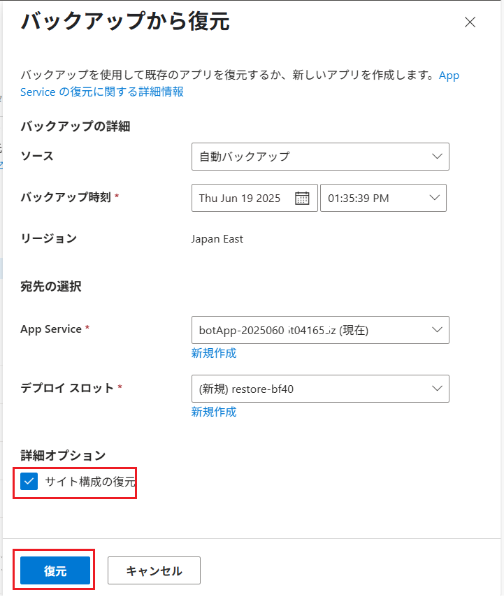
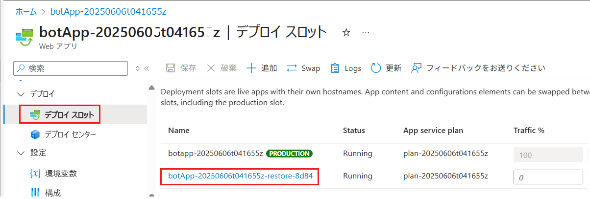
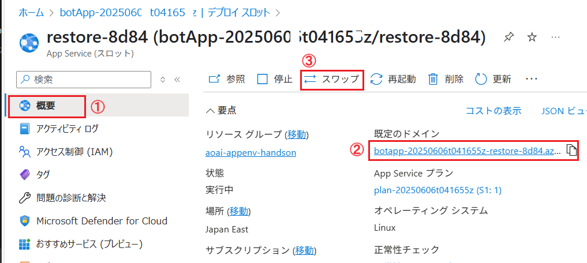

# 演習 2-3-1 : アプリケーションのバックアップ

Azure App Service では、アプリケーションのバックアップを自動で取得する仕組みが用意されており、これを利用することでバックアップのサービス、バックアップ先のストレージ等、個別に準備することなく、簡単にバックアップを取得することができます。

### 🌐 App Service プランの変更

Azure App Service のバックアップ機能を利用するには、App Service プランが **Basic** もしくは **Standard** 以上である必要があります。

この演習でデプロイされた App Service は **Free** プランであるため、演習の前にプランを **Standard** に変更します。**Free** プランの場合 \[バックアップ\] メニューから直接プランの変更が行えますが、この画面内では実稼働むけの高価な Premium v3 プランしか選択できないため、ここでは \[**App Service プラン**\] メニューから変更します。

また、なぜ **Basic** ではなくレガシの **Standard** プランに変更するのかというと、**Basic** プランではデプロイスロットが使用できないためです。
なお、今回変更する **Basic** プランは開発やテストなどの負荷の低い用途向けとなるので、可用性設定の演習でより可用性の高い Premium v3 プランに再度変更します。


現在使用している App Service プランの変更は以下の手順で行います。

\[**手順**▶️\]

1. [Azure Portal](https://portal.azure.com/) にログインします
2. この演習で使用している App Service のリソース画面を表示し、画面左のメニューから \[**App Service プラン**\] をクリックします

3. \[**App Service プラン**\] の画面に遷移するので、項目 \[**料金プラン**\] の `F1(スケールアップ)` のリンクをクリックします

    

4. \[**スケールアップ (App Service のプラン)**\] 画面に遷移し、App Service のプランの一覧が表示されるので \[**Standard (S1)**\] のチェックボックスにチェックをつけ、画面下の \[**選択**\] ボタンをクリックします

    

    \[価格プランのアップグレード\] ボックスが表示されるので、 \[**アップグレード**\] ボタンをクリックします。
    
    「プランが更新されました」と、通知表示されれば完了です。
    
    なお、画面はとくに別の画面には遷移しません。

ここまでの手順で App Service のプランを **Free** から **Standard** に変更することができました。

<br>

### バックアップの取得とリストア

この演習では、現在正常に動作しているアプリケーションに対し、リストア可能なバックアップが取得されていることを確認します。

その後、アプリケーションを破壊して動作不能とし、バックアップを使用してリストアを行い復旧させます。

\[**手順**▶️\]

1. [Azure Portal](https://portal.azure.com/) にログインします

2. この演習で使用している App Service のリソース画面を表示し、画面左のメニューから \[**バックアップ**\] をクリックします

    \[**バックアップ**\] の画面に遷移し、自動で取得されたバックアップの一覧が表示されていることを確認します。

    既にこのバックアップを使用してリストアを行うことができますが、バックアップがない場合や、任意のタイミングやバックアップの保存場所を指定したい場合は画面上部の \[カスタム バックアップの構成\] ボタンをクリックして設定を行うことができます。

    

    **既にバックアップがリストされている場合はなにもしなくてかまいません**。

3. バックアップが取得されていることを確認したら、リストア後の状態と比較するために、現在動作しているアプリケーションを破壊します

    画面左のメニューから \[**開発ツール**\] - \[**SSH**\] をクリックし、遷移した場面内の \[**移動**\] リンクをクリックします。

4. kudu の画面が別のタブで開くので、画面上部のメニューから \[**Bash**\] をクリックします

    

5. Bash の画面に遷移したら、以下のコマンドを入力してアプリケーションの **site** ディレクトリを削除します

    ```bash
    rm -rf site
    ```

    
    
    アプリケーションのファイルが削除され、アプリケーションは動作不能となります。

6. 演習用アプリケーションの URL にアクセスし、レスポンスが返らなくなっていることを確認します

    

7. 再度、Azure Portal の App Service の画面に戻り、画面左のメニューから \[**バックアップ**\] をクリックします

    画面上部の \[**復元**\] ボタンか、リストされているバックアップの一覧の任意のバックアップの \[**復元**\] ボタンをクリックします。

    

8.  \[**バックアップから復元**\] ブレードが表示されます。

    今回は App Service ログの設定を行っているので \[**サイト構成の復元**\] にチェックをつけます。(なお、カスタム バックアップの場合は \[**サイト構成の復元**\] は表示されません)

    また、\[**デプロイ スロット\***\] に表示されている名前を覚えておいてください。これは実際にバックアップがリストアされる際に使用されるデプロイスロット スロット名です。デプロイ スロットについては[演習 3-1](Ex03-1.md) で詳しく説明します。
    
    \[**復元**\] ボタンをクリックします

    

9. 復元完了の通知はとくにされないので、App Service の画面左のメニューから \[**デプロイ スロット**\] をクリックします

    デプロイ スロットの一覧が表示されるので、先ほど覚えておいたデプロイ スロット名がリストにあることを確認し、クリックします

    

10. 選択したデプロイ スロットの \[**概要**\] 画面が表示されるので、\[**既定のドメイン**\] のリンクをクリックして、アプリケーションが正常に動作していることを確認し、確認が取れたら画面上部 \[**スワップ**\] ボタンをクリックします(※)

    

    (※) これまで使用していた App Service のインスタンスと、リストアの際に生成されたデプロイ スロットのインスタンスは、**Production**(運用環境) と **Staging**(待機環境) の関係となっており、スワップを行うことで、デプロイ スロットのインスタンスが Production となり、これまでの Production のインスタンスが Staging となります。このようにデプロイ スロットを使用することで、バックアップからのリストアを行う際に、アプリケーションの停止時間を最小限に抑えることができます。

11. \[**スワップ**\] ブレードが表示されるので、画面下部の \[**Start Swap**\] ボタンをクリックします

12. スワップが完了した通知を確認後、演習用アプリケーションの \[**概要**\] 画面から \[**既定のドメイン**\] のリンクをクリックし、アプリケーションの画面が正常に表示されることを確認します。

ここまでの手順で、App Service のバックアップの設定とリストアの作業は完了です。

カスタム バックアップなどのその他の設定や手順につきましては、以下のドキュメントを参照してください。    

* [**Azure App Service でアプリをバックアップおよび復元する**](https://learn.microsoft.com/ja-jp/azure/app-service/manage-backup?tabs=portal#automatic-vs-custom-backups)

<br>

## 次へ

👉　[**演習 2-3-2 : Azure Storage Blob のデータ保護機能とバックアップ**](Ex02-3-2.md)

---

👈　[演習 2-3 : App Service ログの設定と有効化](Ex02-3.md)

🏚️　[README に戻る](README.md)