# 演習 2-3-1 : Azure Storage Blob のデータ保護機能とバックアップ

Azure Storage Blob にはそれ固有のバックアップの仕組みはありません。よって、Azure Storage Blob のバックアップを取得するには Azure Backup サービスを利用する必要があります。

しかし、Azure Storage には、削除されたデータを復元したり、上書きを防いだり、上書きされたデータであっても任意のバージョンを復元することができるデータ保護機能が用意されています。

Azure Storage Blob のバックアップ方法を説明する前に、Azure Storage Blob の[データ保護機能](https://learn.microsoft.com/ja-jp/azure/storage/blobs/data-protection-overview)について説明します。

なお、この手順で使用している BLOB は、一般的なファイルを扱うのに適した **ブロック BLOB** を前提にしています。Azure Srorage Blob には、複数の種類の BLOB があり、用途に応じて使い分けることができます。BLOB の種類については以下のドキュメントを参照してください。

* [**ブロック BLOB、追加 BLOB、ページ BLOB について**](https://learn.microsoft.com/ja-jp/rest/api/storageservices/understanding-block-blobs--append-blobs--and-page-blobs)

<br>

## 🛢️ Azure Storage Blob のデータ保護機能

### 論理的な削除 (ソフト デリート)

Azure Storage アカウントの論理的な削除機能を有効にしておくことで、削除された BLOB データやコンテナーを任意の期間復元することができます。

この機能は既定で有効になっており、設定内容は、Azure Storage アカウント画面の \[データ管理\] - \[**データ保護**\] から確認できます。

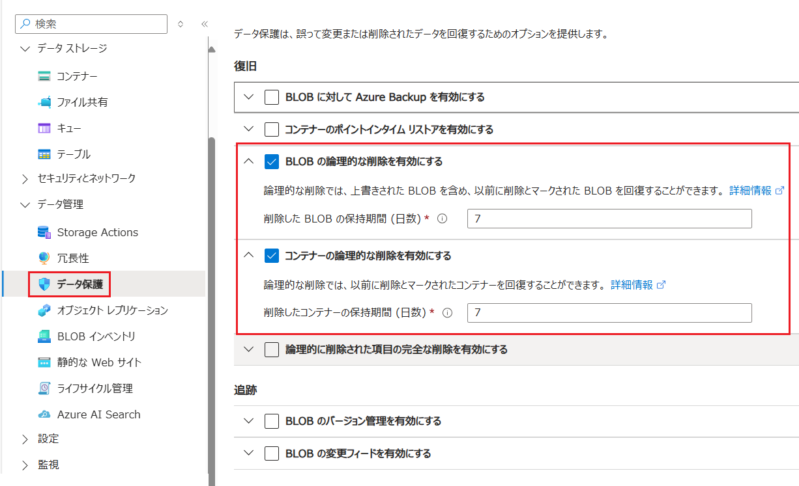

論理的な削除が有効な状態で削除されたコンテナー、もしくは BLOB を復元する手順は以下のとおりです。

\[**手順**📖\]

1. [Azure Portal](https://portal.azure.com/) にログインし、復元対象となるコンテナーもしくは BLOB が格納されている Azure Storage アカウントのリソース画面を表示します

2. 画面左のメニューから \[**コンテナー**\] をクリックし、コンテナーの一覧が表示されたたら、リスト上部の右側にある \[**アクティブなコンテナーのみを表示する**\] ドロップダウンボックスの内容を \[**アクティブな、および削除されたコンテナーを表示する**\] に変更します

3. 削除されたコンテナーがリストに表示されるので、復元したいコンテナーの右端にある \[**…**\] (その他の操作) をクリックし、表示されたメニューから \[**復元**\] をクリックします

    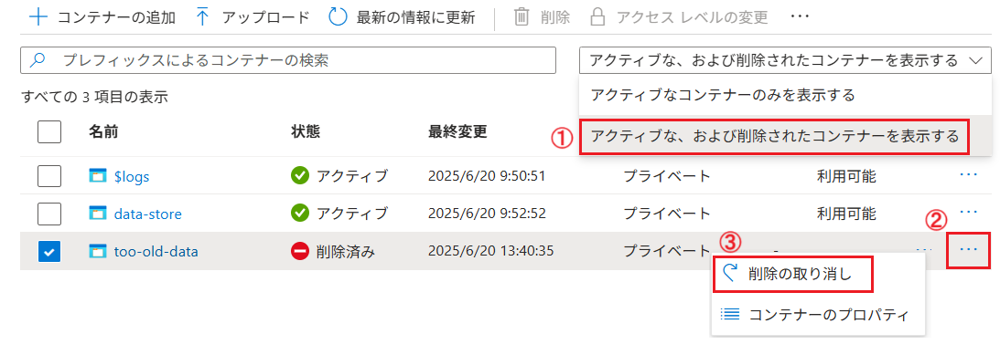

ここまでの手順で削除されたコンテナーを復元することができました。

BLOB も同様の手順で復元することができます。

ただし、論理的な削除はあくまで削除されたデータを復元するための機能であり、上書きされたデータを復元することはできません。

この機能についての詳細は以下のドキュメントを参照してください。

* [コンテナーの論理的な削除](https://learn.microsoft.com/ja-jp/azure/storage/blobs/soft-delete-container-overview)

* [BLOB の論理的な削除](https://learn.microsoft.com/ja-jp/azure/storage/blobs/soft-delete-blob-overview)


<br>

### BLOB を任意のバージョンに復元する

Blob Storage のバージョン管理を有効にすることで上書きされた BLOB の任意のバージョンを復元することができます。

この機能は、既定では有効になっていないので、必要に応じて有効にする必要があります。この機能を有効にするには、Azure Storage アカウント画面の \[データ管理\] - \[**データ保護**\] から行うことができます。

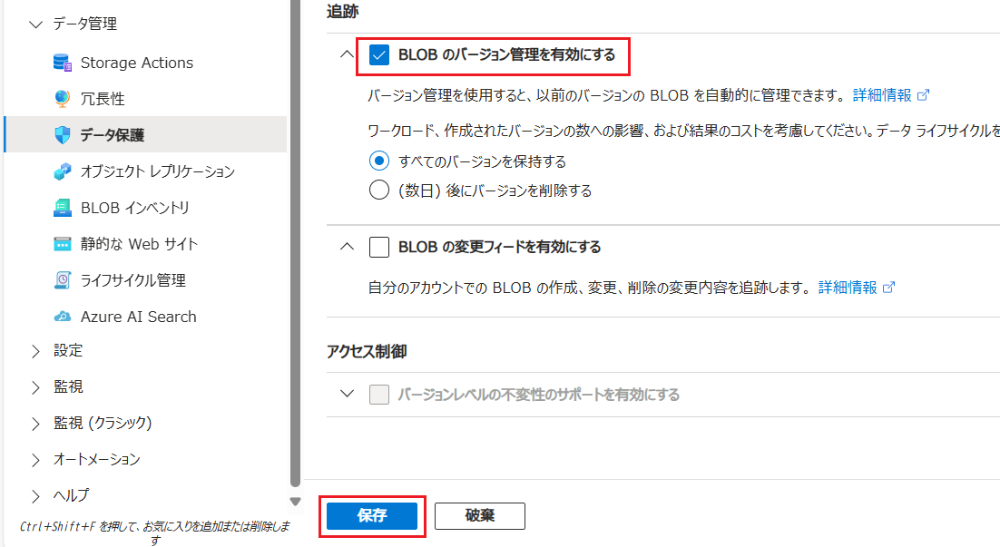

Blob Storage のバージョン管理が有効な状態で、任意のバージョンの BLOB を復元する手順は以下のとおりです。

\[**手順**📖\]

1. [Azure Portal](https://portal.azure.com/) にログインし、バージョンを戻したい BLOB が格納されているコンテナーの画面を表示します

2. BLOB (ファイル) の一覧が表示されるので、バージョンを戻したい BLOB をクリックします

3. BLOB の詳細画面が表示されるので、画面上部の \[**バージョン**\] タブをクリックします

    選択した BLOB のバージョンの一覧が表示されるので、目的のバージョンの右端にある \[**…**\] (その他の操作) をクリックし、表示されたメニューから \[**現在のバージョンに変更する**\] をクリックします

    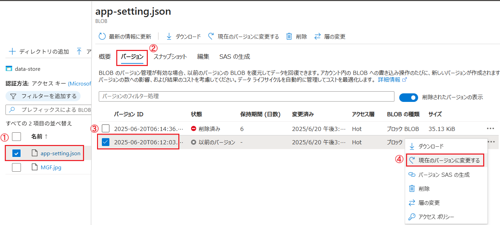

ここまでの手順で、BLOB の任意のバージョンを復元することができました。

この機能についての詳細は以下のドキュメントを参照してください。

* [BLOB のバージョン管理](https://learn.microsoft.com/ja-jp/azure/storage/blobs/versioning-overview)

<br>

### BLOB の上書きを防ぐ

BLOB 上書きされた際に元のバージョンに戻すのではなく、上書き自体を防ぎたい場合は、ポリシーを使用して BLOB の上書きを防ぐことができます。

詳しくは以下のドキュメントを参照してください。

* [**ビジネス クリティカルな BLOB データを書き込み 1 回、読み取り複数回 (WORM) の状態で保存する**](https://learn.microsoft.com/ja-jp/azure/storage/blobs/immutable-storage-overview)

また、ログ データのような、**常に更新されることのないデータが追加される**用途には、追加(Apend) Blob を使用することもできます。

追加 BLOB については以下のドキュメントを参照してください。

* [**追加 BLOB について**](https://learn.microsoft.com/ja-jp/rest/api/storageservices/Understanding-Block-Blobs--Append-Blobs--and-Page-Blobs#about-append-blobs)


<br>

### ポイントインタイム リストア

ポイントインタイム リストアでは、あらかじめ設定された保有期間中の BLOB データを以前の状態に復元することができます。これは、ユーザーまたはアプリケーションによって誤ってデータが削除された場合や、アプリケーション エラーによってデータが破損した場合に役立ちます。

ポイントインタイム リストアを有効にするには、ストレージ アカウントの管理ポリシーを作成し、保有期間を指定します。 保有期間中は、ブロック BLOB を現在の状態から前の時点の状態に復元できます。

この機能の有効化はAzure Storage アカウント画面の \[データ管理\] - \[**データ保護**\] から行うことができます。

実際の手順については、以下のドキュメントに記載されていますので参照してください。

* [**ポイントインタイム リストアを有効にして構成する**](https://learn.microsoft.com/ja-jp/azure/storage/blobs/point-in-time-restore-manage?tabs=portal#enable-and-configure-point-in-time-restore)

* [**アカウント内のすべてのコンテナーを復元する**](https://learn.microsoft.com/ja-jp/azure/storage/blobs/point-in-time-restore-manage?tabs=portal#restore-all-containers-in-the-account)

* [**ブロック BLOB の範囲を復元する**](https://learn.microsoft.com/ja-jp/azure/storage/blobs/point-in-time-restore-manage?tabs=portal#restore-ranges-of-block-blobs)


その他、Azure Blob Storage が提供するデータ保護機能については、以下のドキュメントを参照してください。

* [**Azure Storage Blob のデータ保護機能の概要**](https://learn.microsoft.com/ja-jp/azure/storage/blobs/data-protection-overview)

<br>

## 🗄️ Azure Backup を使用した Azure BLOB のバックアップ

ここまでの説明であったように Azure Storage Blob には、豊富なデータ保護機能が用意されており、ストレージの冗長化オプションも用意されています。

しかし、それでも Azure Backup を使って Blob データをバックアップする必要があるケース も存在します。以下にその代表的な状況を挙げます。

1. **長期保存（Long-term retention）**
   - Azure Storage のデータ保護機能は、通常、短期間のデータ保護を目的としています。長期保存が必要な場合は、Azure Backup を使用して定期的にバックアップを取得し、長期間にわたってデータを保持することができます。
2. **ランサムウェア対策・イミュータブルバックアップ**
   - Azure Backup は バックアップデータをイミュータブル（変更不可）に設定でき、悪意ある削除や改ざんから保護します。
    - ストレージのソフトデリートやバージョニングだけでは、内部からの攻撃やスクリプトによる削除に対して不十分な場合があります。
3.  **運用・監査要件への対応**
    - 金融・医療・公共などの業界では、監査証跡やバックアップの証明が求められることがあります。
    - Azure Backup は バックアップジョブのログやレポートを提供し、コンプライアンス対応を支援します。
4. **管理の一元化**
    - Azure Backup を使うことで、VM、SQL、ファイル、Blob などのバックアップを一元管理できます。これにより、運用負荷の軽減やポリシーの統一が可能になります。

この演習では、Azure Backup を使用した Azure BLOB のバックアップを実施します。

Azure Storage Blob にはそれ固有のバックアップの仕組みがないため Azure で用意されているバックアップの仕組みを利用する必要があります。

そのために[バックアップ コンテナーの作成](https://learn.microsoft.com/ja-jp/azure/backup/create-manage-backup-vault#create-a-backup-vault)、作成したバックアップ コンテナーへの[アクセス制御設定](https://learn.microsoft.com/ja-jp/azure/backup/blob-backup-configure-manage?tabs=operational-backup#grant-permissions-to-the-backup-vault-on-storage-accounts)、[バックアップ ポリシーの作成](https://learn.microsoft.com/ja-jp/azure/backup/blob-backup-configure-manage?tabs=operational-backup#create-a-backup-policy)などの事前準備が必要です。

ここでは一連の手順について紹介します。

### バックアップ コンテナーの作成

バックアップ コンテナーは、Azure Backup によってサポートされる特定のワークロードのバックアップ データを格納する Azure のストレージ エンティティです。

バックアップ コンテナーを使用すると、管理オーバーヘッドを最小限に抑えながら、バックアップ データを簡単に整理できます。

バックアップ コンテナーの作成手順は以下の通りです。

\[**手順**▶️\]

1. [Azure Portal](https://portal.azure.com/) にログインし、画面上部の検索ボックスに `バックアップ コンテナー` と入力し、表示された候補から \[**バックアップ コンテナー**\] をクリックします

    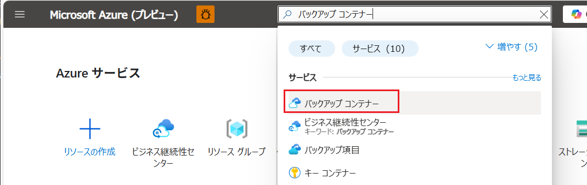

2. \[**バックアップ コンテナー**\] の画面が表示されるので、画面上部の \[**+ 作成**\] ボタンをクリックします

    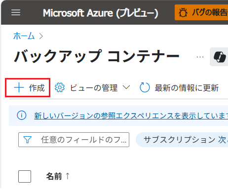

3. \[**バックアップ コンテナーの作成**\] 画面が表示されるので、各項目を以下のように設定します

    | 項目 | 設定値 |
    | --- | --- |
    | **サブスクリプション** | 使用しているサブスクリプションを選択 |
    | **リソース グループ** | `AOAI-AppEnv-handson` |
    | **バックアップ コンテナー名** | `handson-backup-container` |
    | **リージョン** | \[**Japan East**\] |
    | **バックアップ ストレージの冗長性** | 任意のもの(※) |
    
    (※) この演習では `ローカル冗長` でかまいませんが、運用環境では `geo 冗長` 、もしくは `ゾーン冗長` を選択することをお勧めします。なお、この設定はバックアップ コンテナーの作成後に変更することができません。

    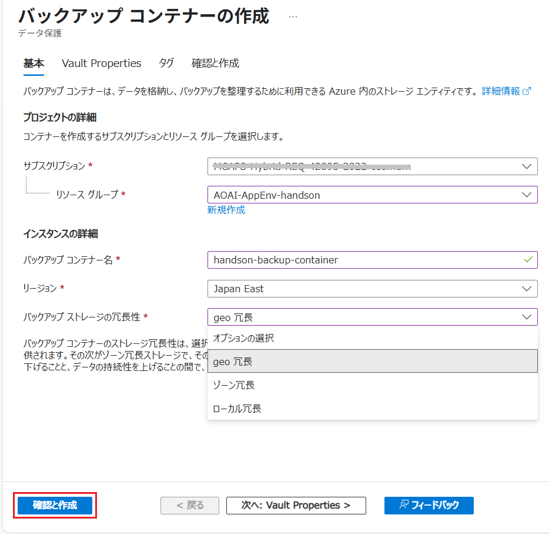

    設定が完了したら、画面下部の \[**確認および作成**\] ボタンをクリックし、\[**作成**\] ボタンが表示されたらクリックします。

    デプロイが開始され、完了すると通知が表示されます。

ここまでの手順でバックアップ コンテナーを作成することができました。

<br>

### Azure Storage アカウントでのバックアップ コンテナーへのアクセス許可の付与

バックアップ対象となる Storage アカウントに対して、バックアップ コンテナーへのアクセス許可を付与する必要があります。

最小限のアクセス許可として `Storage Account Backup Contributor` ロールが必要です。

具体的な手順は以下の通りです。

\[**手順**▶️\]

1. [Azure Portal](https://portal.azure.com/) にログインし、バックアップを取得する Stogare アカウントの画面を表示します

2. 画面左側のメニューで \[**アクセス制御 (IAM)**\] をクリックし、遷移した画面上部の　\[**+ 追加**\] ボタンをクリックし、表示されたメニューから \[**ロールの割り当ての追加**\] をクリックします

    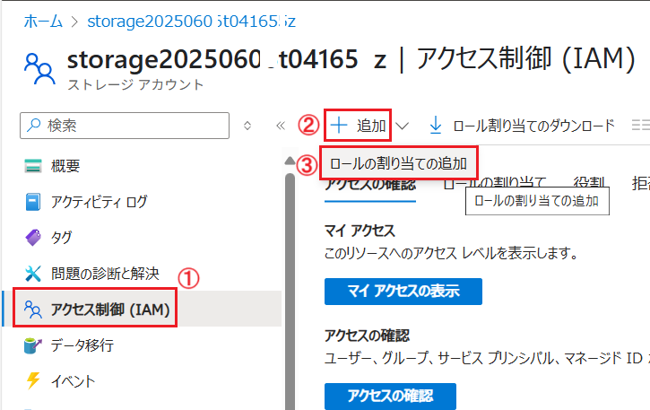

3. \[**ロールの割り当ての追加**\] 画面に遷移し、ロールの一覧が表示されるので、\[**Storage Account Backup Contributor**\] を選択し \[**次へ**\] ボタンをクリックします

    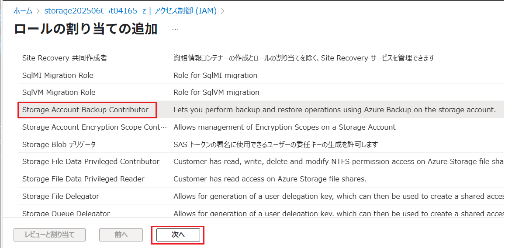

4. [**メンバー**\] タブがアクティブになるので、項目 \[**アクセスの割り当て先**\] オプション ボタンで \[**マネージド ID**\] にチェックをつけ、項目 \[**メンバー**\] で \[**+ メンバーの追加**\] リンクをクリックします

5. 画面右端に \[**マネージド ID の選択**\] ブレードが表示されるので、各項目を以下のように設定します

    | 項目 | 設定値 |
    | --- | --- | 
    | サブスクリプション | 使用しているサブスクリプションを選択 |
    | マネージド ID | \[**バックアップコンテナー**\] |
    | 選択 | `handson-backup-container` |

    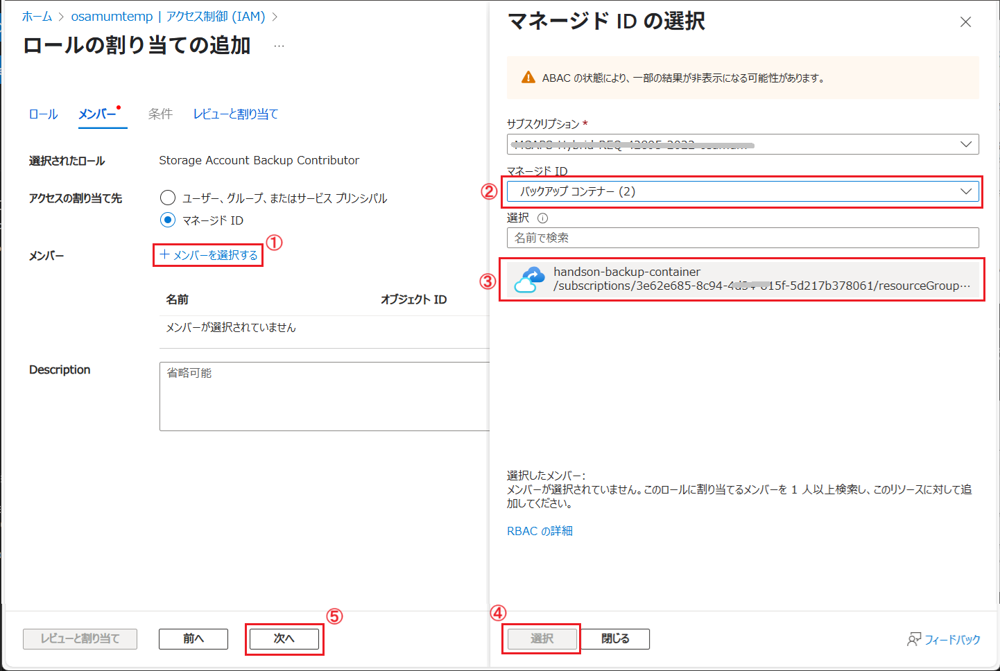

    \[**選択**\] ボタンをクリックするとブレードが閉じるので、画面下部の \[**次へ**\] ボタンをクリックします

6. \[レビューと割り当て\] タブがアクティブになるので、内容を確認し、画面下部の \[**レビューと割り当て**\] ボタンをクリックします

ここまでの手順で、バックアップ対象となる Storage アカウントに対しバックアップ コンテナーへのアクセス許可を付与することができました。  

<br>


### Azure Storage Blob のバックアップの構成

Azure Storage 画面で前の手順で作成したバックアップ コンテナーを使用して、Azure Storage Blob のバックアップを構成します。

具体的な手順は以下の通りです。

\[**手順**▶️\]

1. [Azure Portal](https://portal.azure.com/) にログインし、この演習で使用している Azure Storage アカウントの画面を表示します

2. 画面左側のメニューで \[データ管理\] - \[**データ保護**\] をクリックします

3. \[**データ保護**\] 画面に遷移するので、 \[復旧\] セクションにある \[**BLOB に対した Azure Backup を有効にする**\] チェックボックスにチェックします

4. 同セクション内にある \[**バックアップ コンテナー \***\] ドロップダウンボックスから、前の手順で作成したバックアップ コンテナー `handson-backup-container` を選択し、\[**バックアップ ポリシー \***\] のところにある \[**新規作成**\] リンクをクリックします

5. 画面右に \[**バックアップ ポリシーの作成**\] ブレードが表示されるので、各項目を以下のように設定します

    | 項目 | 設定値 |
    | --- | --- |
    | **ポリシー名 \*** | `handson-backup-policy` |
    | **データソースの種類 \*** | \[**Azure BLOB(Azure Storage)**\] を選択 |
   
    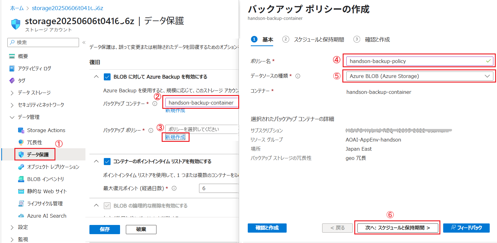

    設定が完了したら、画面下部の \[**次へ: スケジュールと保持期間 >**\] ボタンをクリックします

6. \[**スケジュールと保持期間**\] タブがアクティブになるので、任意のパックアップのタイミングを指定して \[**確認と作成**\] ボタンをクリックし、
    \[**作成**\] ボタンが表示されたらクリックします

7. \[**コンテナー \***\] 項目が表示されるので、\[**コンテナーの選択**\] リンクをクリックします

    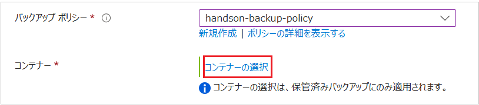

    画面右側に \[**コンテナーの選択**\] ブレードが表示されるので、\[**すべてのコンテナーをバックアップする**\] オプション ボタンにチェックをつけ、画面下部の \[**すべて選択**\] ボタンをクリックします。

    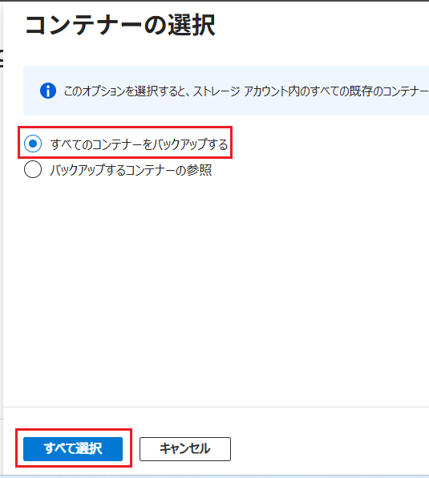

ここまでの手順で Azure Storage Blob のバックアップを構成することができました。

<br>

### Azure Storage Blob のバックアップの取得

バックアップの開始時刻になる前に、手動でバックアップを取得することもできます。

なお、この演習を行うまえに、Azure Storage アカウントの BLOB に任意のファイルをアップロードしておいてください。

手動でバックアップを取得する手順は以下の通りです。

\[**手順**▶️\]

1. [Azure Portal](https://portal.azure.com/) にログインし、この演習で使用している Azure Storage アカウントの画面を表示します

2. 画面左側のメニューで \[データ管理\] - \[**データ保護**\] をクリックします

3. \[**データ保護**\] 画面に遷移するので、 \[復旧\] セクションにある \[**バックアップを管理する**\] リンクをクリックします

4. \[**バックアップの管理**\] 画面に遷移するので、画面上部の \[**バックアップの取得**\] ボタンをクリックします

    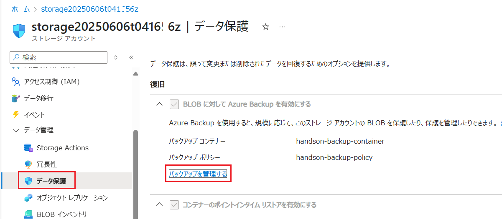

5. \[**バックアップ インスタンス**\] 画面が表示されるので、画面上部の \[ **↓ 今すぐバックアップ**\] ボタンをクリックします

    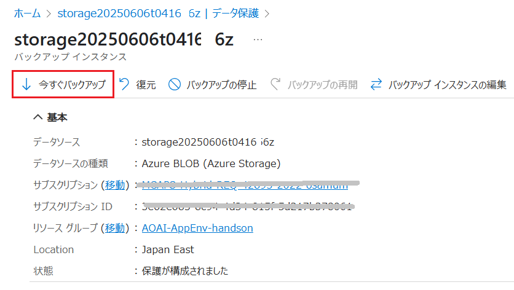

6. \[**今すぐバックアップ**\] 画面が表示されるので、画面下部の \[**今すぐバックアップ**\] ボタンをクリックします

ここまでの作業でバックアップのリクエストが送信されます。

実際にバックアップが開始されるまで、またパックアップが完了するまでには、数分かかります。

バックアップ の進捗状況は、同画面の \[**ジョブ**\] で確認できます。

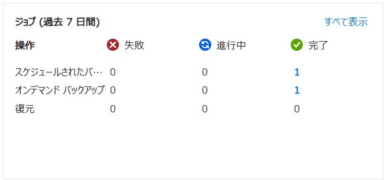

<br>

### Azure Storage Blob のリストア

前の手順で取得したバックアップを使用して、Azure Storage Blob のリストアを行います。

ここでは BLOB のみ復元する方法と、コンテナーも含めて復元する方法の 2 種類を紹介します。

はじめに、BLOB のみを復元する方法について説明します。


この作業を行う前にリストア対象の Azure Storage アカウント の任意のコンテナー内の **BLOB(ファイル) を削除しておいてください**。

もし、「削除ロック」によって削除できない場合は、削除ロックを解除してから実施してください。「削除ロック」の解除は、Azure Storage アカウントの画面左側のメニューから \[**設定**\] - \[**削除ロック**\] をクリックし、表示された画面で削除ロックを解除することができます。

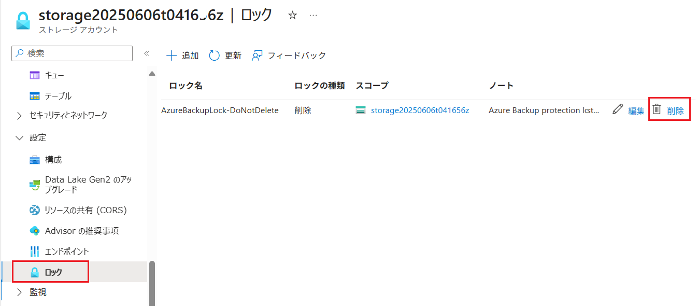

<br>

**BLOB のみを復元する**

Azure Storage Blob コンテナー内の BLOB のみを復元します。

もし、この方法では復元先のコンテナーも削除されていた場合は復元することはできません。

具体的な手順は以下の通りです。

\[**手順**▶️\]

1. [Azure Portal](https://portal.azure.com/) にログインし、この演習で使用している Azure Storage アカウントの画面を表示します

2. 画面左側のメニューで \[データ管理\] - \[**データ保護**\] をクリックします

3. \[**データ保護**\] 画面に遷移するので、 \[復旧\] セクションにある \[**バックアップを管理する**\] リンクをクリックします

4. \[**バックアップの管理**\] 画面に遷移するので、画面上部の \[**復元**\] メニューをクリックします

    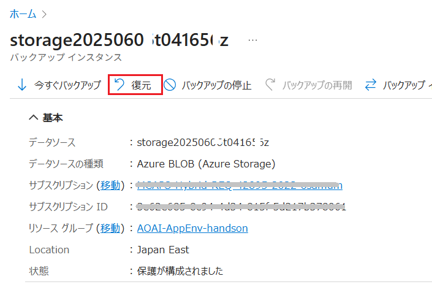

5. \[**復元**\] 画面が表示され、\[**➁ 復元ポイント**\] タブがアクティブになっているので、\[**復元ポイントの選択**\] リンクをクリックします

    画面右側に\[**復元ポイントの選択**\]ブレードが表示されるので、復元したいバックアップの日時を選択し、画面下部の \[**選択**\] ボタンをクリックします

    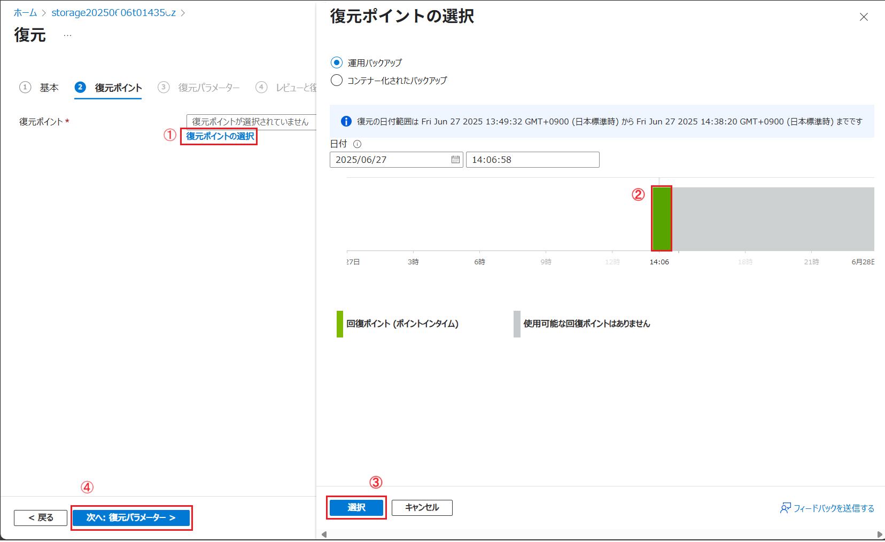

    ブレードが閉じるので、もとの画面下部の \[**次へ: 復元パラメーター**\] ボタンをクリックします

6. \[**③ 復元パラメーター**\] タブがアクティブになっているので、\[**ストレージ アカウントのすべての BLOB を復元する​**\] オプション ボタンにチェックをつけ、 \[**検証**\] ボタンをクリックして検証が完了するのを待ちます。

    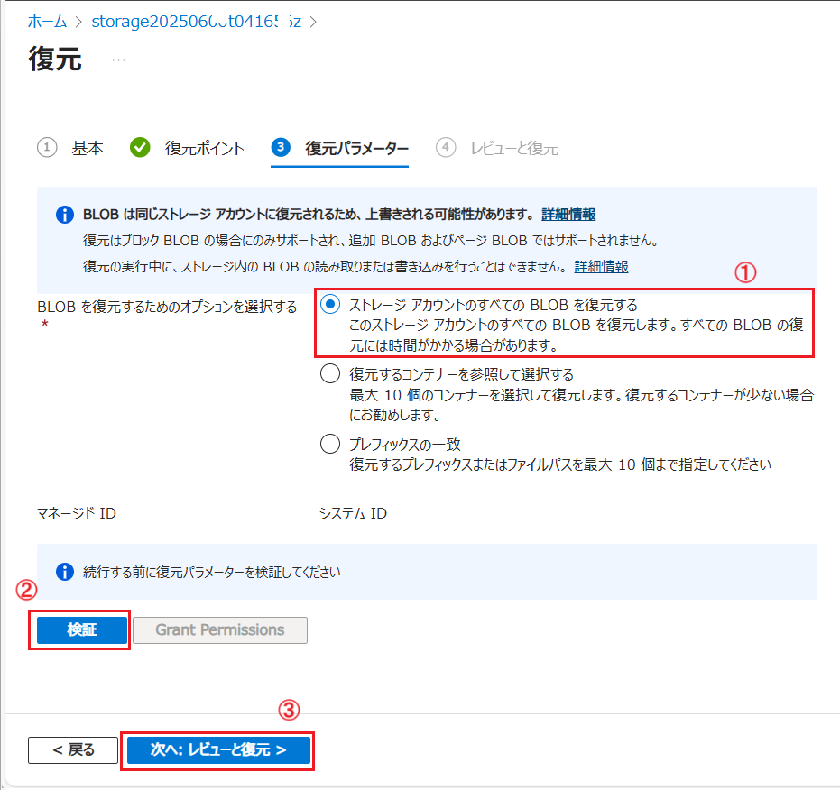

    検証が完了したら、画面下部の \[**次へ: レビューと復元**\] ボタンをクリックします

7. \[**④ レビューと復元**\] タブがアクティブになり、復元の内容が表示されるので、内容を確認し、画面下部の \[**復元**\] ボタンをクリックします

    リストアのリクエストが送信され、リストアの進捗状況は、同画面の \[**ジョブ**\] で確認できます。リストア完了の通知はとく行われないので、定期的にリフレッシュ アイコンをクリックして確認してください。

8. リストアが完了したら、リストアされた BLOB が、リストア対象のコンテナーに復元されていることを確認します。

ここまでの手順で Azure Backup コンテナーを使用して BLOB のみを復元することができました。    

<br>

**全てのコンテナーと BLOB を復元する**

Azure Storage Blob コンテナーとその中の BLOB をすべて復元します。**この方法では、コンテナーも削除されていた場合でも復元することができます**。

ただし、**バックアップ元にリストアすることはできない**ので、別途リストア用の Azure Storage アカウントを用意しておく必要があります。

以下のコマンドを Azure Cloud Shell(Bash) で順番に実行して、リストア用の Azure Storage アカウントを作成してください。

```bash
# 現在の日時を取得して、ストレージアカウント名を生成
name="restore$(date +%Y%m%d%H%M%S)"

# ストレージアカウントを作成
az storage account create --name $name --resource-group AOAI-AppEnv-handson --location japaneast --sku Standard_LRS
```

完了すると `restoreYYYYMMDDHHMMSS` のようなストレージアカウントが作成されます。

次に、作成したリストア用 Storage アカウントでで、以下の手順を参考にバックアップ コンテナー `handson-backup-container` へ \[**Storage Account Backup Contributor**\] のロールを付与してください。

* [**Azure Storage アカウントでのバックアップ コンテナーへのアクセス許可の付与**](#azure-storage-%E3%82%A2%E3%82%AB%E3%82%A6%E3%83%B3%E3%83%88%E3%81%A7%E3%81%AE%E3%83%90%E3%83%83%E3%82%AF%E3%82%A2%E3%83%83%E3%83%97-%E3%82%B3%E3%83%B3%E3%83%86%E3%83%8A%E3%83%BC%E3%81%B8%E3%81%AE%E3%82%A2%E3%82%AF%E3%82%BB%E3%82%B9%E8%A8%B1%E5%8F%AF%E3%81%AE%E4%BB%98%E4%B8%8E)

これでリストア用の Azure Storage アカウントが準備できました。

リストア用の Azure Storage アカウントに対して、Azure Backup コンテナー上のバックアップされているコンテナーをリストアします。

具体的な手順は以下の通りです。

\[**手順**▶️\]

1. [Azure Portal](https://portal.azure.com/) にログインし、この演習で使用している Azure Storage アカウントの画面を表示します

2. 画面左側のメニューで \[データ管理\] - \[**データ保護**\] をクリックします

3. \[**データ保護**\] 画面に遷移するので、 \[復旧\] セクションにある \[**バックアップを管理する**\] リンクをクリックします

4. \[**バックアップの管理**\] 画面に遷移するので、画面下部の \[**復元ポイント**\] の \[**コンテナー化されたバックアップ**\] タブをアクティブにします

    取得されたバックアップの一覧が表示されるので、リストアしたいバックアップの右端にある \[**…**\] (その他の操作) をクリックし、表示されたメニューから \[**復元**\] をクリックします

    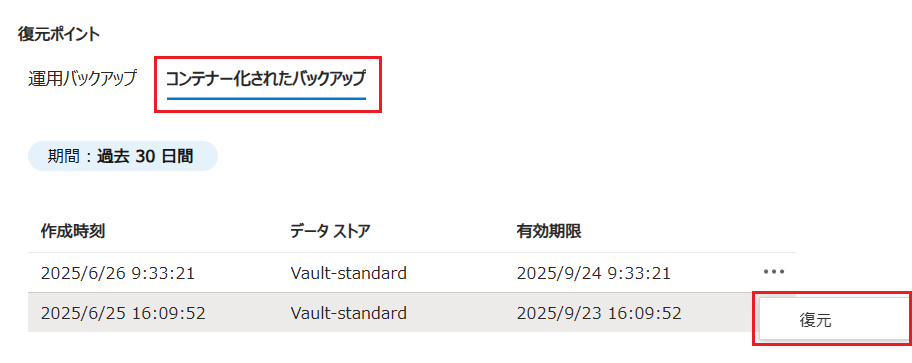

5. \[**復元**\] 画面が表示され、\[**➁ 復元ポイント**\] タブがアクティブになっているので、\[**復元ポイント \***\] に既に値が設定されていることを確認し、画面下部の \[**次へ: 復元パラメーター**\] ボタンをクリックします

    


6. \[**③ 復元パラメーター**\] タブがアクティブになり、復元先のストレージ アカウントを選択する項目が表示されるので、\[**ストレージ アカウントの選択**\] リンクをクリックします

    画面右側に \[**ストレージ アカウントの選択**\] ブレードが表示されるので、リストア用の Azure Storage アカウントを選択し、画面下部の \[**選択**\] ボタンをクリックします

    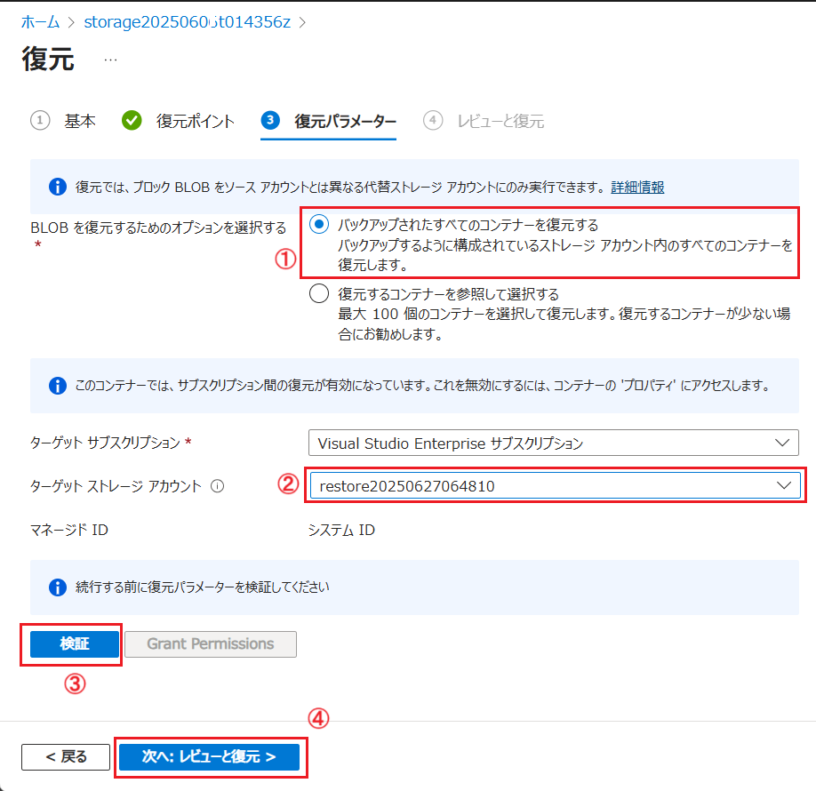

    ブレードが閉じるので、もとの画面下部の \[**次へ: レビューと復元**\] ボタンをクリックします

7.  \[**④ レビューと復元**\] タブがアクティブになり、復元の内容が表示されるので、内容を確認し、画面下部の \[**復元**\] ボタンをクリックします

    リストアのリクエストが送信され、リストアの進捗状況は、同画面の \[**ジョブ**\] で確認できます。リストア完了の通知はとく行われないので、定期的にリフレッシュ アイコンをクリックして確認してください。

8. リストアが完了したら、リストアされた全てのコンテナーと BLOB が、リストア先のストレージアカウントに復元されていることを確認します。

ここまでの手順で Azure Backup コンテナーを使用してコンテナーと BLOB を復元することができました。

その他、`運用バックアップ` と `保管済みバックアップ` の違いや、バックアップのスケジュールの設定方法、バックアップの保持期間の設定方法などの詳細ついては、以下のドキュメントを参照してください。

* [**Azure Backup を使用して Azure BLOB のバックアップを構成および管理する**](https://learn.microsoft.com/ja-jp/azure/backup/blob-backup-configure-manage?tabs=operational-backup#grant-permissions-to-the-backup-vault-on-storage-accounts)

<br>

## 次へ

👉　[**演習 2-3-3 : Azure AI Search 関連のバックアップ**](Ex02-3-3.md)

---

👈　[演習 2-3-1 : アプリケーションのバックアップ](Ex02-3-1.md)

🏚️　[README に戻る](README.md)


