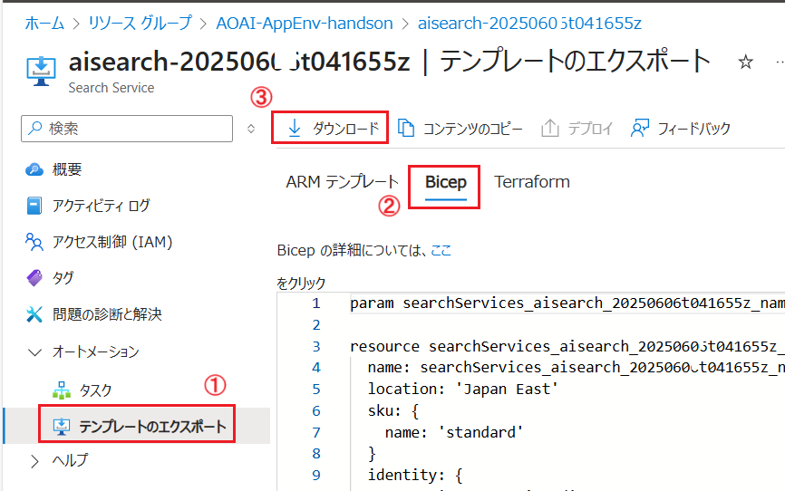
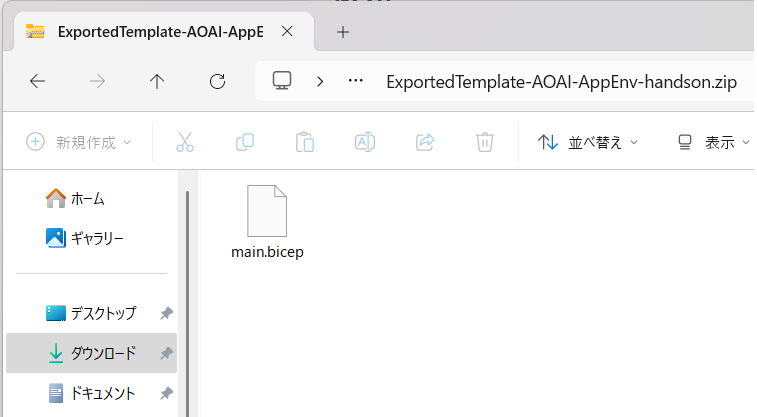
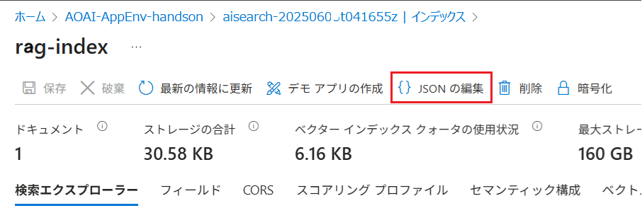
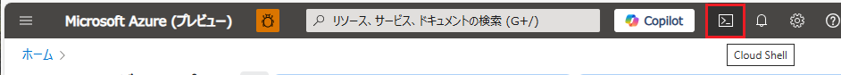
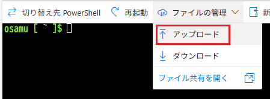

# 演習 2-3-3 : Azure AI Search 関連のバックアップ

Azure AI Search の検索機能を構成している要素は以下の 2 つに大別され、それぞれにバックアップとリストア方法が異なります。

1. Azure AI Search のサービス (インスタンス)
2. Azure AI Search サービス内のインデックス、スキルセット、データソース、インデクサー等の設定

この演習では、Azure AI Search サービスのバックアップとリストアを行い、インデックスを復旧する方法を学びます。

この演習で実施する作業は以下のとおりです。

1. [**Azure AI Search サービスのバックアップ**](#1-azure-ai-search-%E3%82%B5%E3%83%BC%E3%83%93%E3%82%B9%E3%81%AE%E3%83%90%E3%83%83%E3%82%AF%E3%82%A2%E3%83%83%E3%83%97)
2. [**Azure AI Search インデックスのバックアップ**](#2-azure-ai-search-%E3%82%A4%E3%83%B3%E3%83%87%E3%83%83%E3%82%AF%E3%82%B9%E3%81%AE%E3%83%90%E3%83%83%E3%82%AF%E3%82%A2%E3%83%83%E3%83%97)
3. [**Azure AI Search サービスの復旧**](#3-azure-ai-search-%E3%82%B5%E3%83%BC%E3%83%93%E3%82%B9%E3%81%AE%E5%BE%A9%E6%97%A7)

4. [**インデックスの復旧**](#4-%E3%82%A4%E3%83%B3%E3%83%87%E3%83%83%E3%82%AF%E3%82%B9%E3%81%AE%E5%BE%A9%E6%97%A7)

<br>

## 1. Azure AI Search サービスのバックアップ

Azure AI Search のサービス (インスタンス) には、ディスク上のイメージを取得するようないわゆる一般的なバックアップ機能はありませんが、構造とインスタンス固有の情報は ARM テンプレート、あるいは Bicep とパラメーターを保持しておけばこれらを使用して再デプロイを行うことで復旧が可能です。


**復旧時に引き継がれるもの**

ARM テンプレート/Bicep に含まれていれば、以下の構成が復旧可能です：

* サービス名、SKU、リージョン
* レプリカ数、パーティション数
* ネットワーク設定（IP制限、Private Link など）
* 暗号化設定（CMK など）※ただし、Key Vault のアクセス権も別途設定が必要

ただし、管理者キーやアクセス制御 (AIM) の設定は含まれませんので、復旧後に再設定が必要です。

アプリケーションが Azure AI Search サービスへのアクセスに管理者キーを使用している場合は、復旧後に再取得する必要がありますが、マネージド ID を使用している場合は、Bicep で `roleAssignments` リソースを使用してアクセス制御 (AIM) の設定をテンプレート化しておくことができます。

以下は、ユーザー アカウントに対し、Azure AI Search サービスの `Search Service 共同作成者` ロールを割り当てる Bicep の例です。

```bicep
resource roleAssignment 'Microsoft.Authorization/roleAssignments@2020-04-01-preview' = {
  name: guid(resourceGroup().id, 'SearchServiceContributor')
  properties: {
    roleDefinitionId: subscriptionResourceId('Microsoft.Authorization/roleDefinitions', 'de139f84-1756-47ae-9be6-808fbbe84772')
    principalId: '<ユーザーまたはサービスプリンシパルのオブジェクトID>'
    principalType: 'User'
  }
}
```
上記の Bicep の内容を `iam-role.bicep` というファイルとして Azure Cloud Shell で実行する際のコマンドは以下になります。

``` bash
az deployment group create \
  --resource-group <リソースグループ名> \
  --template-file iam-role.bicep
```

<br>

### 稼働している Azure AI Search インスタンスの Bicep テンプレートを取得

演習用にデプロイ済みの Azure AI Search インスタンスの Bicep テンプレートを Azure ポータルを使用して取得します。

具体的な手順は以下の通りです。

\[**手順**\]

1. [Azure Portal](https://portal.azure.com/) にログインし、この演習で使用している Azure AI Search の画面を表示します

2. 左側のメニューから \[オートメーション\] - \[**テンプレートのエクスポート**\]を選択します

3. \[**テンプレートのエクスポート**\] 画面が表示されるので、\[**Bicep**\] タブをアクティブにし、画面上部の \[**ダウンロード**\] メニューをクリックします

    

4. Zip ファイルがダウンロードされるので任意の場所に保存し、解凍して　Bicep ファイルが含まれていることを確認します

   

   Bicep ファイルはこのあとの演習で使用するので取り出しておいてください。

ここまでの手順で、演習用 Azure AI Search のインスタンスの Bicep テンプレートを取得できました。

<br>

## 2. Azure AI Search インデックスのバックアップ

>[!Note]
> この作業は**インデックスに独自のフィールドを定義している場合に必要**です。このハンズオンで使用しているインデックス `rag-index` は Azure AI Search のデータのインポート機能で自動生成されたものであるため、本来はバックアップの必要はありません。(※インデックスをリストアする際には再度インポート機能を使用することになり、自動で再生成されるため) 

Azure AI Search のインデックスにも全体をバックアップ イメージとして取得する機能はありませんが、インデックスの構成を JSON 形式でエクスポートすることができます。

ただし、**インデックス内の情報**は取得できない(※)ため、インデックスを作成した際に使用したデータ ソースは別途保存しておき、インデックス復旧後にデータをベクトルデータを再生成する必要があります。

復旧の際には、Azure AI Saerch の REST API とこれらを使用してインデックスを再作成します。

(※) インデックス内のベクトル フィールドの情報は、埋め込み(Emmbedding)モデルを使用して生成されており、埋め込みモデルは、アプリケーションがベクトル検索時に使用するものと同じものを使用する必要があります。よって、復旧する際、アプリケーションが使用している埋め込みモデルが変更されている場合は、インデックス内のベクトル フィールドの情報も再生成する必要があります。


### インデックスの構成を JSON 形式で取得

現在稼働中の Azure AI Search インスタンスから、インデックスの構成を JSON 形式で取得します。

具体的な手順は以下の通りです。

\[**手順**\]

1. [Azure Portal](https://portal.azure.com/) にログインし、この演習で使用している Azure AI Search の画面を表示します

2. 左側のメニューから \[検索管理\] - \[**インデックス**\] を選択して、インデックスの一覧を表示します

3. このハンズオンで作成したインデックス `rag-index` を選択し、遷移した画面上部のメニューから \[**{} JSON の編集**\] をクリックします

    

4.  \[**インデックス JSON エディター**\] 画面が表示されるので、表示されている JSON をすべて選択してコピーし、メモ帳などのテキスト エディターに貼り付けます

    貼り付けた JSON から不要な `@odata.etag` 要素を削除します。

    ```json
    "@odata.etag": "\"0x8DDB8EA2E7F667C\"",
    ```

    また、復旧の際に使用する [API バージョン](https://learn.microsoft.com/ja-jp/rest/api/searchservice/search-service-api-versions) 2024-07-01 でサポートされない以下の要素も削除します。

    (※)削除する要素はまとまっては記述されていませんので、要素名で検索を行いそれぞれの箇所で削除してください。なお、設定されている値はなんであれかまいません。

    ```json
    "normalizers": [],
    "flightingOptIn": false,
    "rankingOrder": "BoostedRerankerScore",
    ```
   
    編集が完了したら `rag-index.json` という名前をつけて保存します

ここまでの手順で、Azure AI Search のインデックスの構成を JSON 形式で取得できました。

<br>


## 3. Azure AI Search サービスの復旧

前の手順で取得した Azure AI Search の Bicep テンプレートをインスタンスを再デプロイします。

この手順を実行する前に、このハンズオンで使用している Azure AI Search のインスタンスを削除しておいてください。

パックアップした Bicep ファイルを使用して、Azure AI Search のインスタンスを再デプロイの手順は以下の通りです。

\[**手順**\]

1. [Azure ポータル](https://portal.azure.com)にログインし、画面右上にある Cloud Shell アイコンをクリックして Cloud Shell 画面を開きます

    

2. Cloud Shell 画面のメニュー \[ファイルの監理\] - \[アップロード\] を選択し、バックアップしておいた Azure AI Search の Bicep ファイルをアップロードします

    
    
    ファイルのアップロードが完了したら以下のコマンドを実行してアップロードしたファイルがリストされることを確認します。

    ```bash
    ls
    ```
3. アップロードした Bicep ファイルを使用して Azure リソースをデプロイします。実行するコマンドは以下のとおりです。Bicep ファイルの名前は既定で `main.bicep` なっているはずですが、もし変更している場合はコマンドライン内のファイル名を変更してください。

   ```bash
   az deployment group create --resource-group AOAI-AppEnv-handson --template-file main.bicep
   ```
   デプロイが完了するまで時間がかかるので、しばらく待ちます(※)。

   (※) デプロイ時間はタイミングによって異なりますが、通常は 3 ～ 10 分程度で完了します。

4. デプロイが完了したら Azire ポータル画面で `AOAI-AppEnv-handson` リソースグループを開き、Azure AI Search のインスタンスがバックアップしたものと同じ名前で作成されていることを確認します。

ここまでの手順で、Azure AI Search のインスタンスをバックアップから復旧できました。

### 補足

復旧された Azure AI Search のインスタンスではマネージド ID が自動的に作成されますが、マネージド ID 自体は別なものになっているため [Azure AI Search インデックスの作成](Ex01-3.md#azure-ai-search-%E3%82%A4%E3%83%B3%E3%83%87%E3%83%83%E3%82%AF%E3%82%B9%E3%81%AE%E4%BD%9C%E6%88%90) の作業で必要になる Azure Storage への `ストレージ BLOB データ閲覧者`ロールの [割り当て作業](Ex01-3.md#azure-ai-search-%E3%83%9E%E3%83%8D%E3%83%BC%E3%82%B8%E3%83%89-id-%E3%81%AE%E6%9C%89%E5%8A%B9%E5%8C%96%E3%81%A8%E3%82%A2%E3%82%AF%E3%82%BB%E3%82%B9%E8%A8%B1%E5%8F%AF)を再度行う必要があります。Azure Portal から手動だおこなっても構いませんが、以下の Bicep を使用してロール割り当てを行うこともできます。

```bicep
param location string = resourceGroup().location
param aiSearchName string = 'Azure AI Search インスタンス名' 
param storageAccountName string = 'Azure Storage アカウント名' // Azure AI Search のデータを格納するストレージ アカウント名

resource aiSearch 'Microsoft.Search/searchServices@2023-11-01' existing = {
  name: aiSearchName
}

resource storage 'Microsoft.Storage/storageAccounts@2023-11-01' existing = {
  name: storageAccountName
}

resource roleAssignment 'Microsoft.Authorization/roleAssignments@2022-04-01' = {
  name: guid(aiSearch.name, 'StorageBlobDataReader') // 固定 GUID を生成
  scope: storage
  properties: {
    roleDefinitionId: subscriptionResourceId('Microsoft.Authorization/roleDefinitions', '2a2b9908-6ea1-4ae2-8e65-a410df84e7d1') // Storage Blob Data Reader
    principalId: aiSearch.identity.principalId
    principalType: 'ServicePrincipal'
  }
}
```
この Bicep を `assign-role.bicep` という名前で保存して、Azure Cloud Shell から以下のコマンドを実行することでロール割り当てを行うことができます。

``` bash
az deployment group create --resource-group AOAI-AppEnv-handson --template-file assign-role.bicep 
```

<br>

## 4. インデックスの復旧

>[!Note]
> この作業はインデックスに独自のフィールドを定義している場合に行います。このハンズオンで使用しているインデックスは `rag-index` は Azure AI Search のデータのインポート機能で自動生成されたものであるため、[演習 1-3 Azure AI Search インデックスの作成](Ex01-3.md#azure-ai-search-%E3%82%A4%E3%83%B3%E3%83%87%E3%83%83%E3%82%AF%E3%82%B9%E3%81%AE%E4%BD%9C%E6%88%90) の手順でインデックスとインデックスに格納されているデータは再作成してください。移行の手順はオプションとして任意で実施してください。

前の演習で復旧した Azure AI Search のインスタンスに、バックアップしておいた JSON 形式のインデックス定義ファイルを使用して復旧します。

この作業を実施する前に以下のリンク先の手順に従い、Azure AI Search の接続情報を再取得してください。なお、このリンクは [Azure OpenAI アプリケーション開発ハンズオン](https://github.com/osamum/AOAI-first-step-for-Developer)コンテンツに遷移するので、Azure AI Search の接続情報の取得が完了したら**次の演習には進まずにこのページに戻ってきてください**。

とくに**管理者キーは、バックアップ時のものとは異なる**ので必ず取得しなおしてください。

バックアップしてしておいたインデックス定義ファイルを使用して、Azure AI Search のインデックスを復旧する手順は以下の通りです。

\[**手順**\]

1. [Azure ポータル](https://portal.azure.com)にログインし、画面右上にある Cloud Shell アイコンをクリックして Cloud Shell 画面を開きます

    

2. Cloud Shell 画面のメニュー \[ファイルの監理\] - \[アップロード\] を選択し、バックアップしておいたインデックス定義ファイル `rag-index.json` ファイルをアップロードします

    
    
    ファイルのアップロードが完了したら以下のコマンドを実行してアップロードしたファイルがリストされることを確認します。

    ```bash
    ls
    ```

3. 以下のコマンドを実行して変数を設定します。変数 `apiKey` と `endpoint` は、前の演習で取得した値に置き換えてください。

    ```bash
    resourceGroup="AOAI-AppEnv-handson"  
    indexFile="rag-index.json"
    endpoint="https://your-search-service-name.search.windows.net"  # Azure AI Search のエンドポイント
    apiKey="your-search-admin-key"  # 管理者キー（Primary または Secondary）
    ```

    設定した変数の値を確認するには、以下のコマンドを実行します。

    ```bash
    echo "Resource Group: $resourceGroup"
    echo "Index File: $indexFile" 
    echo "Endpoint: $endpoint"
    echo "API Key: $apiKey"
    ```

4. インデックスを復旧するためのコマンドを実行します。以下のコマンドを実行して、インデックスを作成します。

    ```bash
    az rest --method PUT --uri "${endpoint}/indexes/rag-index?api-version=2024-07-01" --headers "Content-Type=application/json" "api-key=${apiKey}" --body @"rag-index.json"
    ```
    コマンドの実行完了を待って Azure AI Search の \[インデックス\] メニューで `rag-index` が表示されていることを確認します。

ここまでの作業でバックアップしたインデックス定義ファイルから Azure AI Search のインデックスを復旧できました。

ただし、作成されたのはインデックスの構成のみで、インデックス内のベクトル データは含まれていませんので別途データを追加する必要があります。

## インデックスへのデータの追加について

インデックスの復旧後、インデックスにデータを追加するには、初回にインデックスにデータを投入したのと同様の手順でデータを追加することをお勧めします。

このハンズオンで使用しているインデックス `rag-index` のように、なんらかのツールを使用してデータが自動でインポートされている場合は、そのツールを使用してデータを再インポートします。なぜならば、データのインポートにはチャンクの長さや使用するスキル、インデックスのフィールドにどのようなデータを格納するかなど、ツールの仕様を完璧に理解していないと、インデックスの復旧後に同じようなデータを再生成することが難しいからです。もしこれらの仕様を理解している場合は、インデックスの復旧後に以下の REST API を使用してデータを追加することもできます。

* [**インデックスの作成 (Azure AI Search REST API**)](https://learn.microsoft.com/ja-jp/rest/api/searchservice/create-index)

* [**インデクサーの作成 (Azure AI Search REST API)**](https://learn.microsoft.com/ja-jp/rest/api/searchservice/create-indexer)

* [**データ ソースの作成 (Azure AI Search REST API)**](https://learn.microsoft.com/ja-jp/rest/api/searchservice/create-data-source)

* [**スキルセットの作成 (Azure AI Search REST API)**](https://learn.microsoft.com/ja-jp/rest/api/searchservice/create-skillset)

<br>

## 参考

* Japan PaaS Support Team Blog -
[**AI Search の設定やインデックスデータをバックアップしたい**](https://azure.github.io/jpazpaas/2024/01/25/backup-search-service.html)


