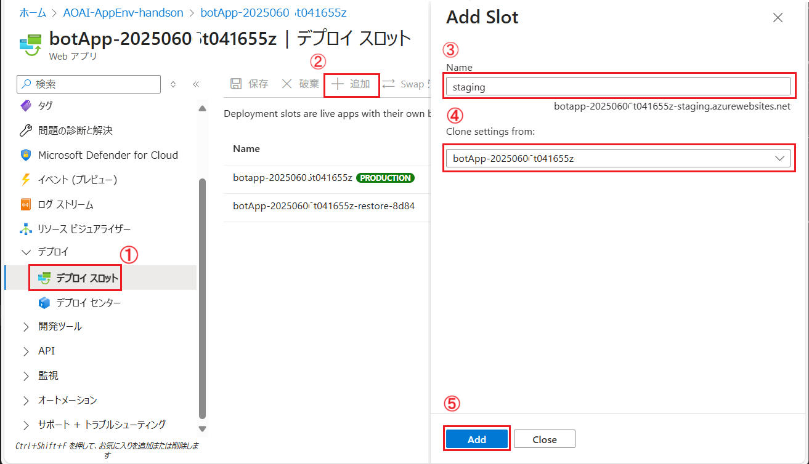
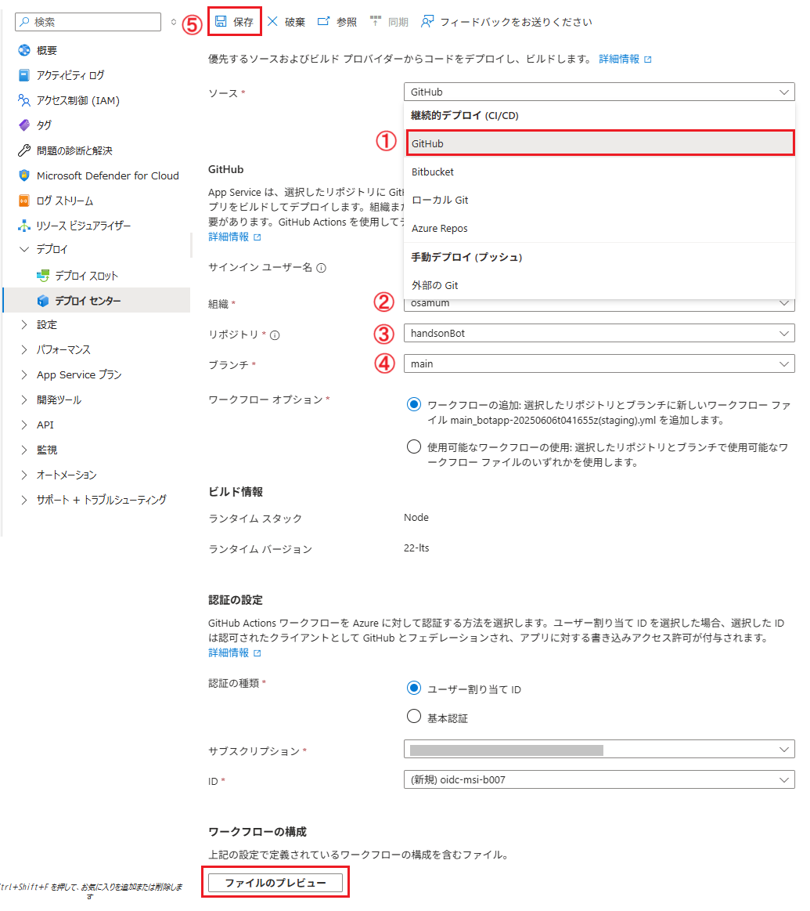
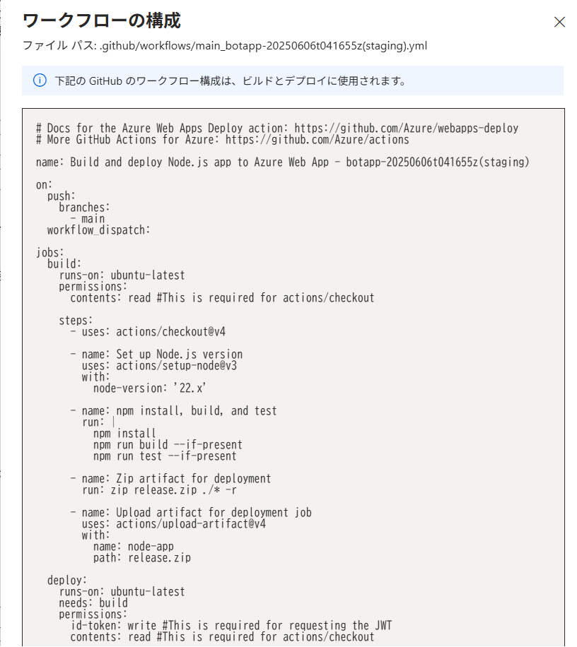
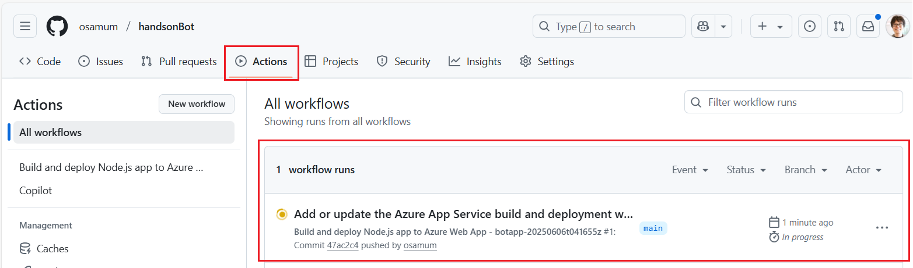
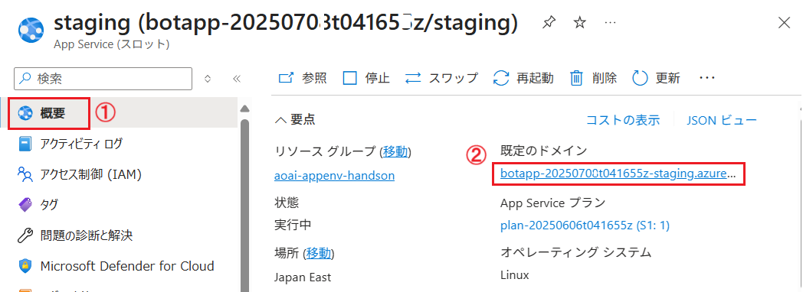
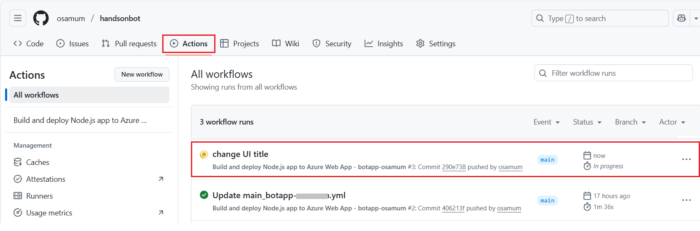
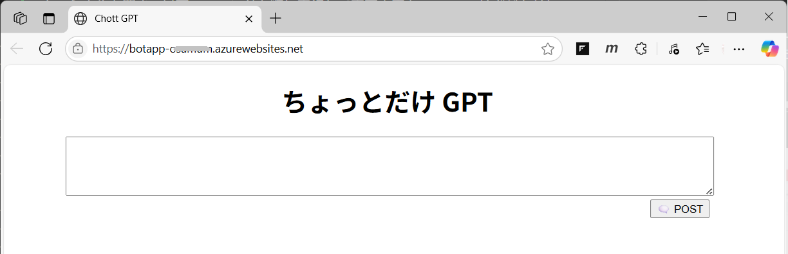
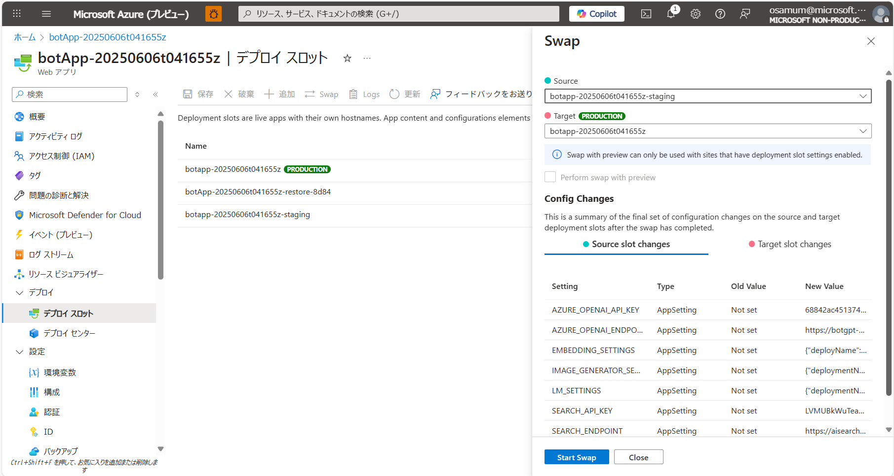

# 演習 2-4 : デプロイ スロットの作成

Azure App Service では、デプロイ スロットを使用して、アプリケーションの異なるバージョンを同じ App Service 内で管理できます。これにより、アプリケーションの新しいバージョンをテストしたり、ステージング環境を作成したりすることが容易になります。

この演習では、Azure App Service のデプロイ スロットを作成し、アプリケーションの production 環境とstaging 環境を分離し、また、GitHub Actions を使用した CI/CD 環境の構築を行います。

この演習では、以下の手順を実行します。

1. App Service のデプロイ スロットの作成と設定
2. GitHub Actions を使用した CI/CD 環境の構築
3. スロットのスワップ

<br>

## 1. App Service のデプロイ スロットの作成と設定

App Service プランのサービス レベルが Standard、Premium、または Isolated である場合は、デプロイ スロットを使用して、アプリケーションのステージング、テスト、およびプロダクション(運用)環境を分離できます。

デプロイ スロットを使用すると、Azure 上の ステージング スロットを使用してアプリケーションの新しいバージョンのテストを行い、テストが完了したら、トラフィックをデプロイ スロットから本番環境に切り替えるといったシナリオが実現できます。

なお、アプリケーションのコンテンツと構成の各要素は、(運用スロットを含む) 2 つのデプロイ スロットの間でスワップすることができます。

このハンズオンでは既に[演習 2-3-1 : アプリケーションのバックアップ](Ex02-3-1.md#%E6%BC%94%E7%BF%92-2-3-1--%E3%82%A2%E3%83%97%E3%83%AA%E3%82%B1%E3%83%BC%E3%82%B7%E3%83%A7%E3%83%B3%E3%81%AE%E3%83%90%E3%83%83%E3%82%AF%E3%82%A2%E3%83%83%E3%83%97)の手順で既にデプロイ スロットが一つ作成されていますが、このタスクでは新規作成の手順を確認するために、新規にデプロイ スロットを作成します。

具体的な手順は以下のとおりです。

1. [Azure Portal](https://portal.azure.com/) にログインします

2. このハンズオンでデプロイとた App Service、`botApp-ランダムな値` を選択し、画面左のメニューから \[デプロイ\] - \[**デプロイ スロット**\] を選択します

3. 遷移した画面で上部のメニューバーから \[**+ 追加**\] をクリックし、画面右に表示される \[**スロットの追加**\] ブレードの各項目を以下のように
設定します

    |項目|値|
    |---|---|
    |名前| `staging` |
    |次から設定を複製:| (現在操作を行っている App Service) |

    (※) 今回は運用 (production) 環境の環境変数を複製します。スワップによってスロット間で引き継がれる設定については以下のドキュメントを確認してください。

    * Azure App Service でステージング環境を設定する - [**スワップされる設定**](https://learn.microsoft.com/ja-jp/azure/app-service/deploy-staging-slots?tabs=portal#which-settings-are-swapped)

    

    \[**Add**\] ボタンをクリックするとデプロイ スロットの作成が開始されます。

4.. デプロイ スロットの作成が完了すると、その旨を知らせる通知が表示されるので、 \[**デプロイ スロット**\] の画面で作成したデプロイ スロットがリストされていることを確認します。

ここまでの手順でデプロイ スロットの作成の手順は完了です。

これで[演習 2 のバックアップの取得とリストア](ex02.md#%E3%83%90%E3%83%83%E3%82%AF%E3%82%A2%E3%83%83%E3%83%97%E3%81%AE%E5%8F%96%E5%BE%97%E3%81%A8%E3%83%AA%E3%82%B9%E3%83%88%E3%82%A2)の手順でリストア作業で行ったように \[**スワップ**\] を行うことで運用環境と今回作成したデプロイ スロット `staging` の App Service インスタンスを切り替えることができるようになりました。

しかし、ここまでの手順で作成したデプロイ スロット `staging` にはアプリケーションがデプロイされていないためインスタンスを切り替えると、運用環境のアプリケーションがデプロイされていない状態になってしまいます。

この先の作業は、次の演習 [GitHub リポジトリを使用した CI/CD]() の作業でアプリケーションをデプロイした後に、運用環境とステージング環境を切り替える(スワップ)手順を確認します。 

なお、このようにシステムのリリースを、2 つの本運用環境を使って安全に素早く行う手法を「ブルーグリーン デプロイメント」と言います。

また、Azure App Service のデプロイ スロットではブルーグリーン デプロイメントだけでなく、複数のスロットが受信するトラフィック量を調整し、「A/B テスト」に使用することもできます。


Azure App Service のデプロイ スロットの作成の詳細については以下の公式ドキュメントをご参照ください。 


* [Azure App Service でステージング環境を設定する](https://learn.microsoft.com/ja-jp/azure/app-service/deploy-staging-slots?tabs=portal#swap-two-slots)

<br>

## 2. GitHub Actions を使用した CI/CD 環境の構築

演習用アプリケーションの入手元のリポジトリがある GitHub では [GitHub Actions](https://docs.github.com/ja/actions/learn-github-actions/understanding-github-actions) というタスク自動化の仕組みが提供されています。この GitHub Actions を使用することで、アプリケーションのビルド、テスト、デプロイのパイプラインを自動化することができます。

GitHub Actions を使用する際には、ビルドからデプロイまでの処理を YAML ファイルにワークフローとして記述していく必要がありますが、Azure App Service では GitHub Actions 用のワークフローを自動で作成する機能が提供されており、かつ、GitHub と Azure App Service を連携させることで、GitHub にプッシュされたコードを App Service で感知し、自動でビルドとデプロイを行うパイプラインを作成することもできます。

この演習では GitHub にプッシュされたコードを App Service で感知し、自動でビルドとデプロイを行うパイプラインを作成します。

なお、この演習ではこの前の作業で作成したデプロイ スロット `botapp-ランダムな値-staging` に対して自動デプロイを行い、運用環境とステージング環境を切り替える手順を確認します。

App Service の \[デプロイ センター\] メニューで GitHub からの自動デプロイを設定するための具体的な手順は以下のとおりです。

\[**手順**\]

1. Azure ポータルから前のタスク 1.2 で作成したデプロイ スロット、`botapp-ランダムな値-staging` を選択し、画面左のメニューから \[**デプロイ センター**\] を選択します

2. \[**デプロイ センター**\] の画面に遷移するので、同画面のドロップダウンボックス \[**ソース \***\] から \[**GitHub**\] を選択します

3. \[**次のユーザーとしてサインイン :**\] の項目にご自身の GitHub アカウントが表示されているのを確認し、異なる場合は \[**アカウントの変更**\] リンクをクリックして正しいアカウントを指定します

4. 表示された項目を以下のように変更し、画面上部の \[**保存**\] ボタンをクリックします

    |項目|値|
    |---|---|
    |組織| (自身の GitHub アカウント) |
    |リポジトリ| `handsonBot` |
    |ブランチ| `main` |

5. \[**認証の設定**\] の項目は以下のように設定します

    |項目|値|
    |---|---|
    |認証タイプ\*| \[**ユーザー割り当て ID**\] |
    |サブスクリプション\*| (ご利用のサブスクリプション) |
    |ID\*| `(新規作成)` |
    |ブランチ| `main` |

    

     画面下部にある \[**ファイルのプレビュー**\] ボタンをクリックすると、GitHub Actions で使用される YAML ファイルのプレビューが表示されます。このファイルは GitHub にプッシュされたコードを App Service にデプロイするためのパイプラインを定義しています。

     

    ファイルの内容を確認したら \[**Close**\] ボタンをクリックしてファイルのプレビュー画面を閉じます。

    デプロイセンターの画面に戻るので、画面上部の \[**保存**\] ボタンをクリックして設定を保存します。
    
    \[**保存**\] ボタンをクリックすると同時に\[デプロイ センター\] の \[**ログ**\] タブがアクティブになり、GitHub Actions の実行状況が表示されるので、実行が完了するのを待ちます。

     
 
    また、GitHub にログインし、リポジトリ `handsonBot` を選択し、画面上部の \[**Actions**\] タブを選択し、作成されたワークフローが実行されていることを確認することもできます。

     

6. ワークフローの実行の実行が完了したら、Azure App Service の Staging インスタンスの画面に戻り、画面左のメニューから \[**概要**\] を選択します

    \[概要\] 画面内の \[**既定のドメイン**\] のリンクをクリックして、ステージング スロットのアプリケーションが表示されることを確認します

    

7.  ソースコードが GitHub リポジトリに Push されると自動的にデプロイされることを確認します
   
    演習 1-2 : 演習用アプリケーションの入手と実行 - [**2. ローカル環境へのクローンとアプリケーションの実行**](Ex01-2.md#2-%E3%83%AD%E3%83%BC%E3%82%AB%E3%83%AB%E7%92%B0%E5%A2%83%E3%81%B8%E3%81%AE%E3%82%AF%E3%83%AD%E3%83%BC%E3%83%B3%E3%81%A8%E3%82%A2%E3%83%97%E3%83%AA%E3%82%B1%E3%83%BC%E3%82%B7%E3%83%A7%E3%83%B3%E3%81%AE%E5%AE%9F%E8%A1%8C) の手順でローカル環境にクローンした演習用アプリケーションのソースコードを Visual Studio Code で開きます。

8.  プロジェクト ルート下の `public/index.html` ファイルを開き、`<h1>` タグの内容を任意の文字列に変更します

    ```html
    <h1 style="text-align: center;">Chott GPT</h1>
    ```

    キーボードの \[**Ctrl**\] + \[**S**\] キーを押下してファイルを保存します。

9.  Visual Studio Code のメニュー \[View\] - \[**Terminal**\] をクリックしてターミナルを開き、以下のコマンドを順に実行して変更内容を GitHub リポジトリに Push します

    ```bash
    git add .
    git commit -m "change UI title"
    git push origin main
    ```       

10. GitHub のリポジトリの \[**Actions**\] タブを開き、ワークフローが実行されていることを確認します

    

11. ワークフローの実行が完了したら、Azure App Service の Staging スロットでホストされているアプリケーションの URL にアクセスして、変更した内容が反映されていることを確認します

    

これでプロジェクトが GitHub にプッシュされると、App Service によって自動でビルドが行われ、App Service にデプロイされるようになりました。

もし、Azure App Service デプロイ センターが作成した GitHub Actions ワークフローでエラーで発生してデプロイが行えない場合は、以下の内容でトラブルシュートを行ってください。

* [**【補足】Azure App Service デプロイ センターが作成した GitHub Actions ワークフローでエラーが発生する場合のトラブルシュート**](wkard-ghAct-deploy.md)

<br>

3. スロットのスワップ

staging スロットにアプリケーションがデプロイされたので、運用環境とステージング環境を切り替え(スワップ)します。

具体的な手順は以下のとおりです。

\[**手順**\]

1. Azure ポータルから演習用アプリケーションの App Service の画面を開き、画面左のメニューから \[**デプロイ スロット**\] を選択します

2. 遷移した画面上部の \[**Swap**\] ボタンをクリックします

    画面右に \[**Swap**\] ブレードが表示されるので、各項目が以下の通りであることを確認し、プレードの下部の \[**Start Swap**\] ボタンをクリックします

    |項目|値|
    |---|---|
    |ソース| `botapp-ランダムな値-staging` |
    |ターゲット| `botapp-ランダムな値` (運用) |
    |プレビューでスワップを実行| チェックしない |

    

    完了の通知を待って、運用スロットの URL にアクセスし、前の作業で Staging スロットにデプロイしたアプリケーションが表示されることを確認します。

ここまでの手順で、運用環境とステージング環境を切り替える(スワップ)ことができました。

<br>

## まとめ

この演習では、Azure App Service のデプロイ スロットを使用して、アプリケーションのステージング環境を作成し、GitHub Actions を使用して自動デプロイのパイプラインを構築しました。また、スワップ機能を使用して運用環境とステージング環境を切り替える手順も確認しました。

アプリケーションの新しいバージョンを安全にテストし、運用環境にデプロイすることが容易になり、開発チームはアプリケーションを実際に Azure 上で動作させながら開発を進めることができるようになりました。

<br>

## 次へ

👉　[**演習 2-5 : 可用性設定**](Ex02-5.md)

---

👈　[演習 2-3-3 : Azure AI Search 関連のバックアップ](Ex02-3-3.md)

🏚️　[README に戻る](README.md)