# 演習 2-5-2 : スケールアップ/アウトの設定

システムが実際に稼働を開始すると、時間の経過とともに利用者が増えていき当初に見積った数よりもリクエスト数が増えてしまったり、特定の時間帯や期間にだけアクセスが集中して負荷がサーバーの処理能力を超えてしまうことがあります。このような場合、サーバーの性能を向上させるために、サーバーのスケールアップやスケールアウトを行う必要があります。

Azure 環境ではオンプレミス上のサーバーのようなハードウェアの調達やセットアップの必要はなく、Azure ポータルや CLI ツールを使用し短い時間でスケールアップやスケールアウトの環境を構築することができます。

このタスクでは、Azure App Service でのスケールアップ、スケールアウト、自動スケーリングの設定方法について確認します。

 

## スケールアップ

サービスのスケールアップとは、文字通りサーバーの処理能力（スケール）を垂直方向に向上させる方法です。具体的には CPU、メモリ、ディスク領域を増やしたり、さまざまな専用のオプション機能を選択可能になります。

ただし、スケールアップにはサービスのダウンタイムが発生する可能性があるため、注意が必要です。スケールアップは、サーバーの性能を向上させるための最も簡単な方法ですが、物理的な制約により限界があります。

Azure のリソースのスケールアップは物理的なハードウェアの変更を伴わないため、Azure ポータルや CLI ツールを使用してプランを変更するだけで簡単に行うことができます。

### 🌐 App Service のスケールアップ

App Service のスケールアップは、Azure ポータルを使用したスケールアップの手順を確認しますが、メニューからプランを選択するだけなので、実際に操作は行わず UI を確認するだけで終了とします。

具体的な手順については、以下の公式ドキュメントの内容に従い作業を行ってください。

* [**Azure App Service でアプリをスケールアップする - 価格レベルのスケールアップ**](https://learn.microsoft.com/ja-jp/azure/app-service/manage-scale-up#scale-up-your-pricing-tier)

### 🛢️ Storage アカウントのスケールアップ

Azure Storage アカウントのスケールアップは、ストレージ アカウントのパフォーマンスを向上させるために、ストレージ アカウントの種類を変更することを指します。Azure Storage では、Standard と Premium の 2 つのストレージ アカウントの種類があり、Premium ストレージ アカウントは高いパフォーマンスを提供します。

既存の Standard ストレージ アカウントを Premium ストレージ アカウントに変更することはできません。新しい Premium ストレージ アカウントを作成し、データを移行する必要があります。ただし、Azure サポートに問い合わせることで、Standard ストレージ アカウントのまま高い容量とイングレスの制限を要求することもできます。

詳しくは以下のドキュメントをご参照ください。

* Standard Storage アカウントのスケーラビリティとパフォーマンスのターゲット - [**Standard Storage アカウントのスケール ターゲット**](https://learn.microsoft.com/ja-jp/azure/storage/common/scalability-targets-standard-account?toc=%2Fazure%2Fstorage%2Fblobs%2Ftoc.json&bc=%2Fazure%2Fstorage%2Fblobs%2Fbreadcrumb%2Ftoc.json#scale-targets-for-standard-storage-accounts)

### 🔍 AI Search のスケールアップ

Azure AI Search では、パーティション数とレプリカ数を増やすことでスケールアップを行います。これにより、以下のような効果が得られます：

* パーティション数の増加：より多くのデータを格納可能に
* レプリカ数の増加：クエリのスループット向上と高可用性の確保

この設定は、演習 [AI Search の可用性ゾーンの設定](Ex02-5-1.md#-ai-search-%E3%81%AE%E5%8F%AF%E7%94%A8%E6%80%A7%E3%82%BE%E3%83%BC%E3%83%B3%E3%81%AE%E8%A8%AD%E5%AE%9A) で確認した Azure ポータルの AI Search 画面 \[設定\] - \[**スケーリング**\] メニューで行えます。また、同画面内の \[**価格レベルの変更**\] をクリックして、より大きい値を指定可能な価格レベルに変更することもできます。 

その他の詳細は以下のドキュメントをご参照ください。

* [**Azure AI Search のサービス レベルを選択する**](https://learn.microsoft.com/ja-jp/azure/search/search-sku-tier#partition-size-and-speed)

### 🧠 Azure OpenAI Service のスケールアップ

Azure OpeAI Service の性能を向上させる方法としては一般的な IT システムの性能として要求されるスループットやレイテンシ以外に時間当たりに処理できるトークン数を増やすことが挙げられます。

言語モデルが 1 分間に処理できるトークン数は既定で制限されており、これを利用する SKU の範囲で変更することができます。

 

#### タスク 1 : 言語モデルの 1 分あたりのトークン数レート制限を増やす

演習で使用している Azure OpenAI サービスの言語モデルは [Standard](https://learn.microsoft.com/ja-jp/azure/ai-foundry/openai/how-to/deployment-types#standard) デプロイを使用しており、現在の 1 分あたりのトークン数 (TPM) レート制限を引き上げることにより、より多くの情報を処理できるようになります。

具体的な手順は以下のとおりです。

\[**手順**\]

1. [Azure AI Foundry](https://ai.azure.com/resource/)にログインし、ロゴ \[**Azure AI Foundry | Azure OpenAI**\] の右側にあるドロップダウンリスト ボックスをクリックし、この演習で使用している Azure OpeAI Service のリソースを選択します

    選択したリソースの画面に遷移したら画面左のメニューから \[**デプロイ**\] を選択します

    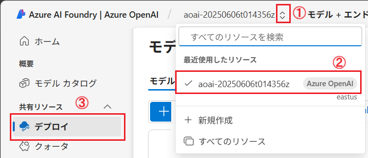

2. \[**デプロイ**] 画面に遷移し、AI モデルの一覧が表示されるので、\[**gpt-4o-mini**\] のモデルをクリックします

3. \[**gpt-4o-mini**\] の画面に遷移するので、\[詳細\] タブがアクティブになっていることを確認し、画面上部の \[**編集**\] ボタンをクリックします

    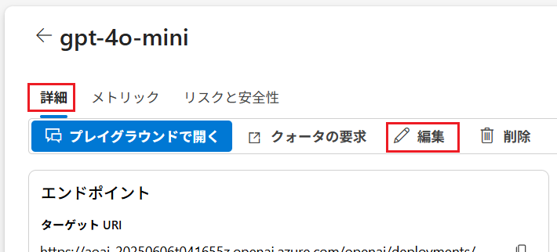

4. \[**gpt-4o-mini のデプロイを更新する**\] ダイアログボックスが表示されるので、同ダイアログボックス内の \[**1 分あたりのトークン数レート制限**\] のスライダーを操作し、任意の値に引き上げます。

    RAG で使用するデータベースが返す情報の量が多い場合や、Web 検索等を行う場合には最大値にしておくとトークン数の制限によるエラーの発生を緩和できます。

    

    設定が完了したら \[**変更内容の送信**\] ボタンをクリックします。

ここまでの手順で Azure OpeAI Service の言語モデルの 1 分あたりのトークン数レート制限の上限を変更することができました。

 

#### タスク 2 : Standard デプロイのレート制限を増やす

サービスが利用する Token の量が [Standard](https://learn.microsoft.com/ja-jp/azure/ai-foundry/openai/how-to/deployment-types#standard) デプロイで提供されるクォータの制限内に収まらない場合は、クォータの引き上げの要求を行うことができます。

Azure Poral からのクォータの引き上げの要求の申請手順は以下のとおりです。

>[!Note]
>このタスクは手順を確認するのにとどめ、実際の申請は行わないでください。

\[**手順**\]

1. [Azure AI Foundry](https://ai.azure.com/resource/)にログインし、ロゴ \[**Azure AI Foundry | Azure OpenAI**\] の右側にあるドロップダウンリスト ボックスをクリックし、この演習で使用している Azure OpeAI Service のリソースを選択します

    選択したリソースの画面に遷移したら画面左のメニューから \[**デプロイ**\] を選択します

    

2. \[**デプロイ**] 画面に遷移し、AI モデルの一覧が表示されるので、\[**gpt-4o-mini**\] のモデルをクリックします

3. 遷移した画面の右上にある \[**クォータの申請**\] ボタンをクリックします

    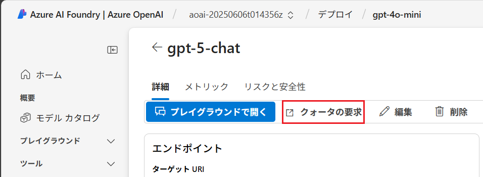

4. クォーターの申請フォームが表示されるので、必要事項を記入して \[**送信**\] ボタンをクリックします
    
    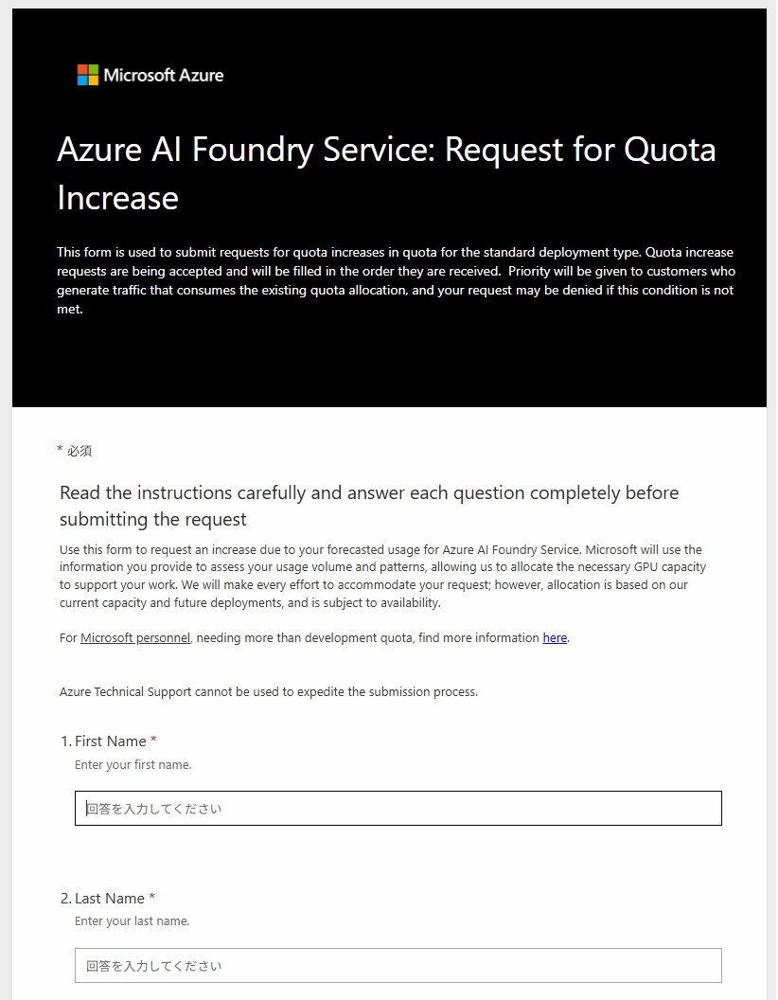

ここまでの手順で Azure OpeAI Service のスケールアップのためのキャパシティ申請は完了です。完了後、Azure OpeAI Service のリソースを新規に作成する際に価格プランを選択することができます。

 

## スケールアウト

スケールアップがサーバーの CPU やメモリといったものを増強して性能を垂直方向に向上させる方法であるのに対し、スケールアウトはサーバー単体の能力はそのままに、処理を複数台のサーバーに分散し処理能力（スケール）を水平方向に向上させる方法です。

この演習でデプロイされた App Service、Storege アカウント、AI Search ではそれぞれ仕組みや設定が異なります。

### タスク 1 : 🌐 App Service のスケールアウト (手動)

Azure App Service では、スケールアウトは App Service プランのインスタンス数を増やすことで行います。App Service プランのインスタンス数を増やすことで、アプリケーションの負荷が増えたときに、負荷を分散することができます。

App Service をスケールアウトする方法は、スケールアップ同様、Azure ポータル、Azure CLI、Azure PowerShell、REST API、または Azure Resource Manager テンプレートを使用して行うことができます。

このタスクの演習では、Azure ポータルを使用した手動スケールアウトの手順を確認します。

Azure App Service で、Azure ポータルから手動スケールアップを行う手順は以下のとおりです。

1. [Azure ポータル](https://portal.azure.com/)にログインし、演習で使用している App Service を選択します

2. 画面左のメニューから \[**スケール アウト (App Service プラン)**\] を選択します

3. 遷移した画面で \[スケールアウト方法\] で \[**手動*\] を選択し、\[**インスタンス数**\] スライド コントロールで任意の数を選択し、\[**保存**\] ボタンをクリックすることでスケールアウト用のインスタンス数を変更できます 

    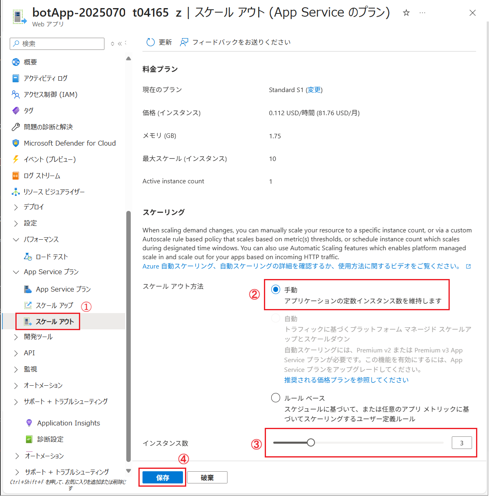

4. 画面左のメニューバーから \[**App Service プラン**\] をクリックし、遷移した画面で \[**Instance count**\] 選択すると、前の手順で指定した数にインスタンス数が変更されていることが確認できます 

    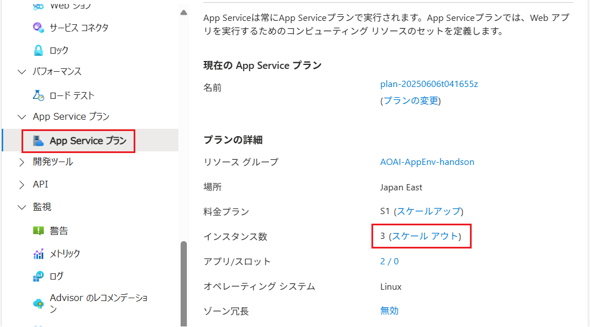

    これで App Service の手動スケールアウトの手順は完了です。

この方法を使用することで任意のタイミングでスケール アウトを行うことができます。

 

### タスク 2 : 🌐 App Service のスケールアウト (自動)

App Service では負荷が増えたときに自動的にインスタンス数を増やす自動スケーリングの設定も可能です。

スケールアウトは、サービスの需要を見積もり、あらかじめ計画して行うことが理想ですが、実際には予期せぬトラフィックの増加が発生することもあります。その際には自動スケーリングを使用して対処することができます。

自動スケーリングを使用すると、負荷が増えたときにインスタンス数を増やし、負荷が減ったときにインスタンス数を減らすことができます。これにより、負荷に応じてインスタンス数を自動的に増減させることができます。

自動スケーリングの設定は、Azure ポータル、Azure CLI、Azure PowerShell、REST API、または Azure Resource Manager テンプレートを使用して行うことができます。

このタスクの演習では、Azure ポータルを使用した自動スケーリングの手順を実施します。
具体的な設定手順は以下のとおりです。

\[**手順**\]

1. [Azure ポータル](https://portal.azure.com/)のホーム画面、左上にあるハンバーガーメニューをクリックし、表示されたメニューから \[**監視**\] を選択します

    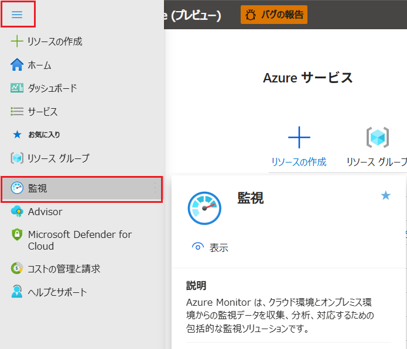

2. \[**モニター**\] 画面に遷移するので画面左のメニューから \[**自動スケーリング**\] を選択します。

    自動スケーリングが適用できるすべてのリソースが表示されるので、演習用アプリケーションをホストしている App Service のプランの名前をクリックします

    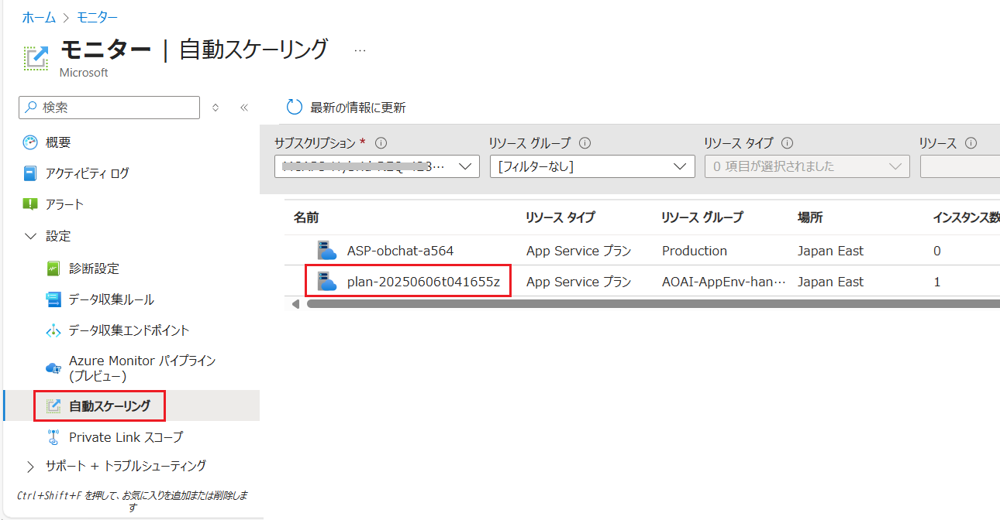

3. \[**自動スケーリング設定**\] の画面に遷移するので、画面内の \[**カスタム自動スケーリング**\] (図中 ①) をクリックし、表示された \[**既定** \*  自動生成された既定のスケール条件\] 内の項目 \[スケールモード\] でオプション ボタン \[**メトリックに基づいてスケーリングする**\] (図中 ➁)を選択し、さらに \[ルール\] の説明文中のリンク <u>**規則を追加する**</u>(図中 ➁)をクリックします。

    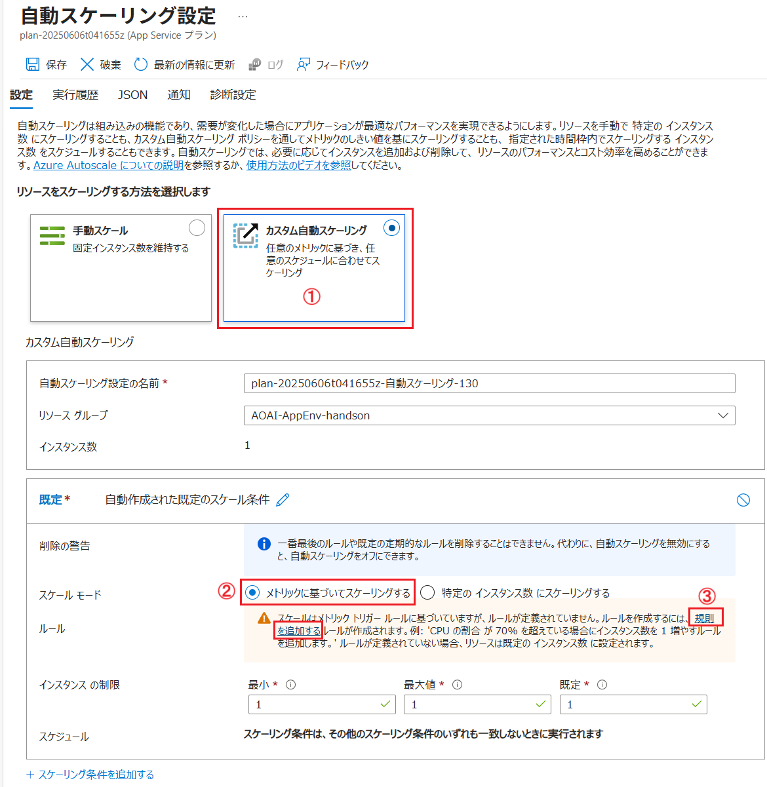

4. 画面右に \[**スケール ルール**\] ブレードが表示されます

    このブレードではスケール アウトする条件を設定しますが、この演習ではなるべく早くスケールアウトの動作を確認したいので、CPU の使用率が 20% を超えたらスケールアウトするよう、ブレード内の項目 [**スケール操作をトリガーするメトリックのしきい値** \*] を `20` に変更します。なお、それ以外の項目はの設定は全て既定のままです。
  
    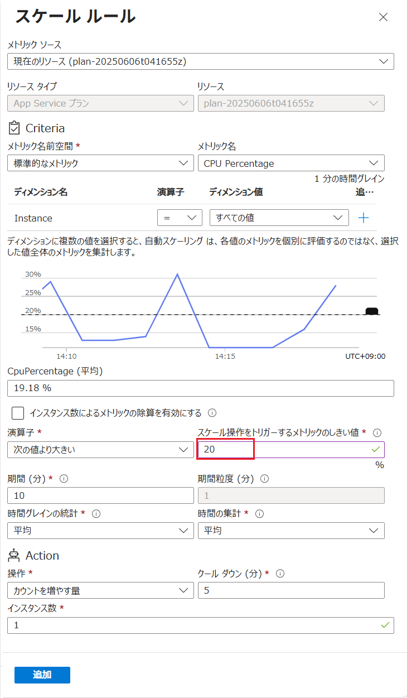

    設定が完了したら \[追加\] ボタンをクリックします。

5. \[**自動スケーリング設定**\] の画面に戻るので画面下部の \[**インスタンスの制限**\] で \[**最大値 \***\] の値を `3` に変更します。

    

    画面右上の \[**保存**\] ボタンをクリックします。

    
ここまでの手順で自動スケーリングの設定は完了です。

なお、今回の手順では CPU の使用率が上がった際にインスタンスを増やす設定しか行っていないため、一度スケールアウトが発生すると、CPU の使用率が下がってもインスタンス数は減らないままになってしまいます。

このような場合、インスタンス数を減らす(スケールイン)ための設定を行う必要がありますが、この演習では時間の都合上割愛しています。

スケールインの設定手順については、以下のドキュメントに詳しい手順が載っていますのでぜひご参照ください。

* [**Azure での自動スケールの使用 - 最初の自動スケーリング設定を作成する**](https://learn.microsoft.com/ja-jp/azure/azure-monitor/autoscale/autoscale-get-started?toc=%2Fazure%2Fapp-service%2Ftoc.json#create-your-first-autoscale-setting)

次の手順では Azure Load Testing を使用して負荷をかけ、自動スケーリングが正しく動作するか確認します。

 

### タスク 3 : Azure Load Testing を使用したスケールアウトの確認

Azure Load Testing を使用して演習用アプリケーションの App Service に負荷をかけ、自動スケーリングが正しく動作するか確認します。

本来であれば、ユーザーが行うユースケースに合わせたシナリオに沿ったシナリオを用意しテストを行うべきですが、今回は手順を簡略化するめに、単純にアプリケーションのトップページに対して負荷をかけます。

具体的な手順は以下のとおりです。

\[**手順**\]

1. Azure の検索ボックスから `Azure Load Testing` を検索してアクセスします

    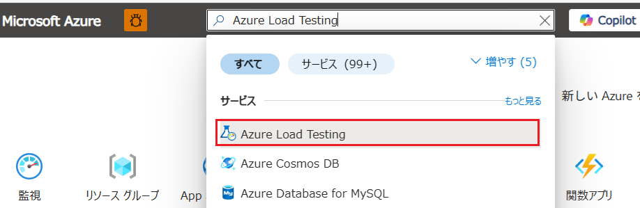

2. 「表示する Azure Load Testing のリソース がありません」と表示されるので \[**作成 + **\] ボタンをクリックします

3. [ロード テストのリソース作成] 画面に遷移するので各パラメーターを以下のように設定し、\[**作成**\] ボタンをクリック

    |項目|値|
    |---|---|
    |リソース グループ| `AOAI-AppEnv-handson` |
    |名前| `botapp-LoadTest` |
    |場所| `Japan East` |

    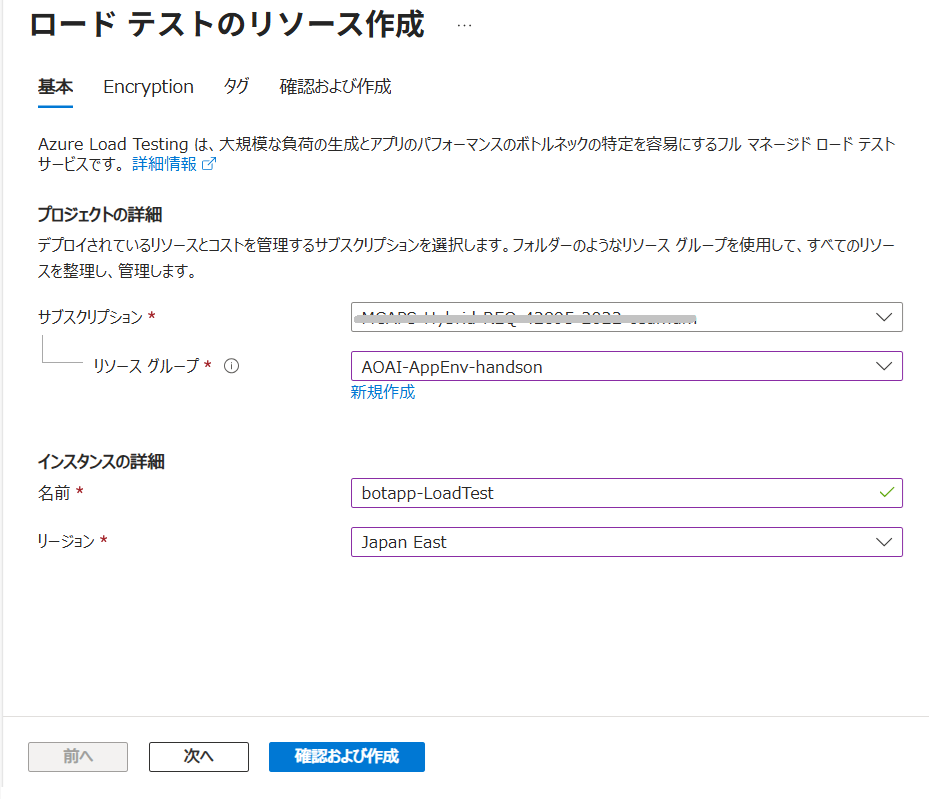

    \[**確認および作成**\] ボタンをクリックし、\[**作成**\] ボタンが有効になったらクリックします

4. リソースが作成されると \[**リソースに移動**\] ボタンが表示されるのでクリックします

5. [ロード テスト] 画面に遷移するので、画面左のメニューから \[**テスト**\] ボタンをクリックし、遷移した画面上部の \[**+ 作成**\] ボタンをクリックし\[**URL ベースのテストを作成する**\] を選択します

    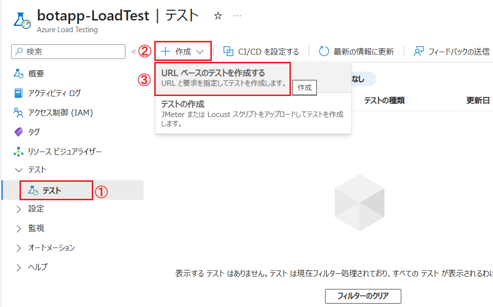

6. \[**URL ベースのテストを作成する**\] の画面に遷移するので、各項目を以下のように設定し \[**次へ**\] ボタンをクリックします

    | 項目 | 設定値  |
    | --- | --- |
    | テスト名 \* | (既定のまま)  |
    | テストの説明 | `自動スケールアウトの作動テスト` |
    | 詳細設定を有効にする | チェック |

    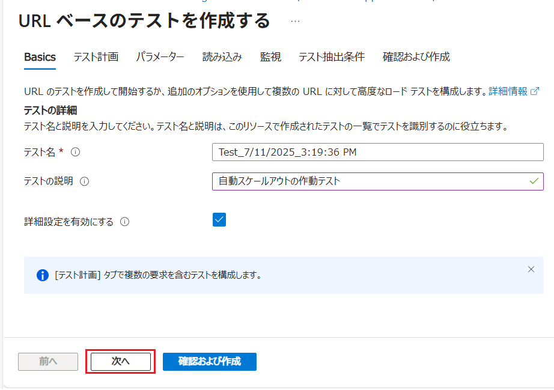

7. \[**テスト計画**\] タブがアクティブになるので、同タブ内の \[**+ 要求の追加**\] ボタンをクリックします
   
    画面右に \[**要求の追加**\] ブレードが表示されるので、以下のように設定し \[**追加**\] ボタンをクリックします

    | 項目 | 設定値  |
    | --- | --- |
    | 要求の形式 \* | 「UI に入力を追加する」にチェック  |
    | 要求名 \* | (既定のまま)  |
    | URL \* | `https://<演習用アプリケーションのホスト名>/` |
    | HTTP メソッド \* | `GET` |
    
    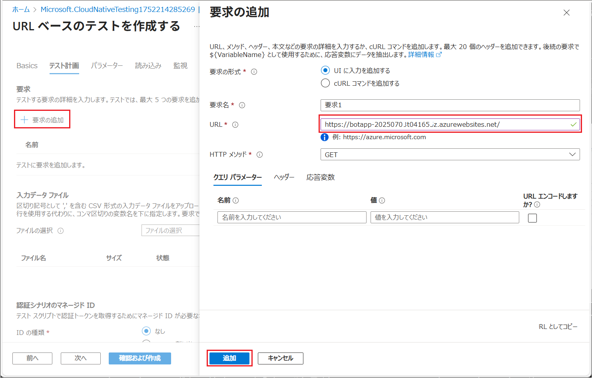

    項目をセットしたら \[**追加**\] ボタンをクリックします

8. \[**読み込み**\] タブをクリックしてアクティブにし、同タブ内の各項目を以下のように設定します

    | 項目 | 設定値  |
    | --- | --- |
    | エンジン インスタンス \* | (既定のまま)  |
    | ロード パターン \* | (既定のまま)  |
    | エンジンごとの同時使用ユーザー数 \* | (既定のまま) |
    | テスト期間 (分) \* | `2` |
    | 増加時間 (分) \* | `0` |
    | 負荷分散 | (既定のまま) |
    | ネットワーク | (既定のまま) |

    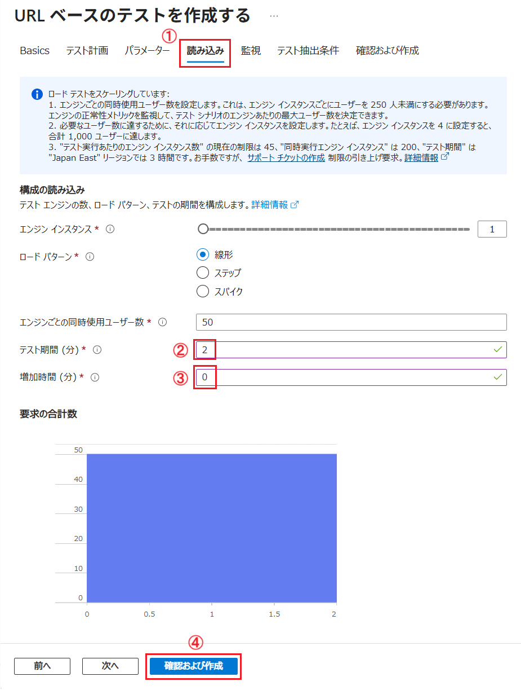

    設定が完了したら \[**確認および作成**\] ボタンをクリックし、表示された内容を確認して \[**作成**\] ボタンをクリックします。

    テストの実行は間もなく開始されます」のメッセージが表示されるので、しばらく待ちます。

    テストが完了するとテストの結果画面が表示されます。

    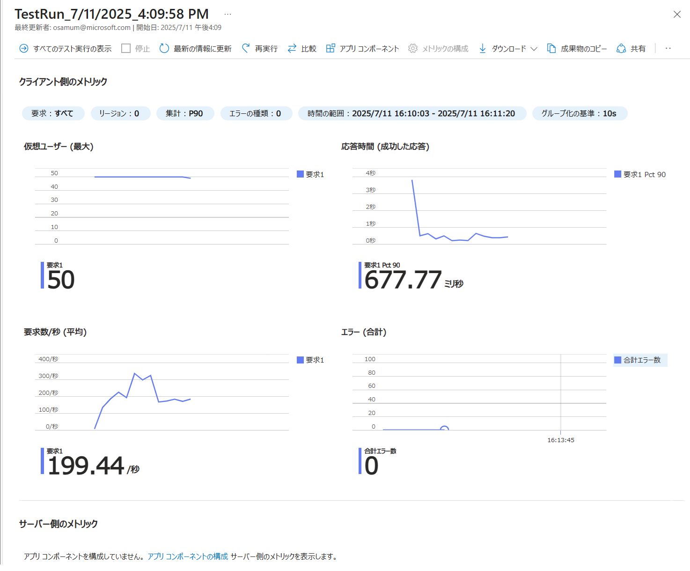

    本来のテストであればテストの結果からエラーの発生の有無やスループット等を確認しますが、今回の目的はスケールアウトの動作確認なので、テスト結果を閉じた後、画面上部の \[**テスト実行の削除**\] をクリックして削除しても構いません。

9. スケールアウトが実行されたか確認するために自動スケールのログを確認します

    Azure ポータルのホーム画面で、ハンバーガーメニューから [\[**監視**\]](https://portal.azure.com/#view/Microsoft_Azure_Monitoring/AzureMonitoringBrowseBlade/~/overview) を選択し、遷移した画面の左のメニューから [\[**自動スケーリング**\]](https://portal.azure.com/#view/Microsoft_Azure_Monitoring/AzureMonitoringBrowseBlade/~/autoscale) を選択します。

    

10. 自動スケーリングが適用できるすべてのリソースが表示されるので、演習で使用している App Service、MovieApp-XYZ の App Service プランの名前を選択します

    

11. . \[**自動スケーリング設定**\] の画面に遷移するので、画面上部の \[**実行履歴**\] タブをクリックして選択します

    同タブの内の \[**観察されたリソースのインスタンス数**\] のグラフの最大値が **3** であることを確認し、さらに \[**Observed Capacity (最大値)**\] の値が **3** であることを確認します。

    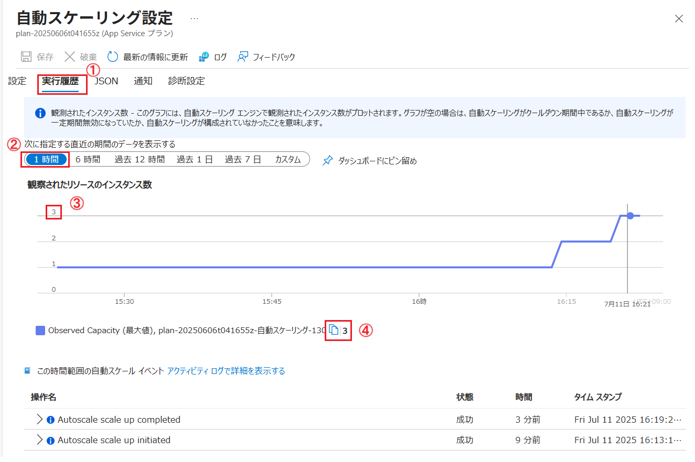

ここまでの手順で自動スケーリングの動作確認は完了です。

 

### 🛢️ Storage アカウントのスケールアウト

今回の演習用のシステムでは、AI Search のインデックスを作成するために Storage アカウントを使用しているだけなので、とくにスケールアウトの必要はありませんが、Storage アカウントのスケールアウトについても紹介しておきます。

Storage アカウントのスケールアウトは、App Service のような明示的なスケールアウトの設定はありませんが、以下のような方法でスケールアウト的な効果を得ることができます。

* **Storage アカウントの選定**
 
   今回の演習で使用している Storage アカウントは、現状最も高いスケーラビリティと機能を提供する **汎用 v2 (GPv2)** アカウントを使用しています。もし、GPv1 アカウントを使用している場合は GPv2 にダウンタイムなしで移行できます

* **Storage アカウントの制限とクォータの引き上げ**

    Azure Storage アカウントの 1 アカウントあたりの最大要求数（RPS）や帯域幅には[制限](https://learn.microsoft.com/ja-jp/azure/storage/common/scalability-targets-standard-account#scale-targets-for-standard-storage-accounts)がありますが、Azure ポータルでの操作、もしくは Microsoft サポートに依頼することで、制限の引き上げることができます。

    この操作を Azure ポータルで行う手順については、以下のドキュメントをご参照ください。

  * Azure Storage アカウントのクォータを増やす - [**ストレージ アカウントのクォータの引き上げを要求する**](https://learn.microsoft.com/ja-jp/azure/quotas/storage-account-quota-requests#request-storage-account-quota-increases)

* **冗長化オプションの選択**

    選択する冗長化によっても、可用性とスケーラビリティに影響がでます。冗長化オプションで [ゾーン冗長ストレージ(ZRS)](https://learn.microsoft.com/ja-jp/azure/storage/common/storage-redundancy#zone-redundant-storage) や[ジオゾーン冗長ストレージ(GZRS)](https://learn.microsoft.com/ja-jp/azure/storage/common/storage-redundancy#geo-zone-redundant-storage) を選択した場合は、複数の可用性ゾーンにまたがってデータを分散するため、スケールアウト的な効果が得られます。

 

### 🔍 AI Search のスケールアウト

一般的な RAG システムでは、アプリケーションへの問い合わせが発生するたびにデータベースへのアクセスが行われます。そのため、大量の問い合わせを受けるシステムの場合はデータベースのスケールアウトが必要になります。

このデータ ベースが今回の演習用アプリケーションのように Azure AI Search を使用している場合、スケールアウトの設定は前述の [**AI Search のスケールアップ**](https://github.com/osamum/aoai-app-basic-hosting/blob/main/Ex02-5-2.md#-ai-search-%E3%81%AE%E3%82%B9%E3%82%B1%E3%83%BC%E3%83%AB%E3%82%A2%E3%83%83%E3%83%97) と同様に、「パーティション数」と「レプリカ数」を増やすことで行います。

なお、スケーリングの単位は 検索ユニット(Search Unit, **SU**) と呼ばれ、以下のようにパーティション数とレプリカ数の積で表されます。

`SU = レプリカ数 × パーティション数`

どちらをどう増やすかについては、ワークロードの特性に応じて判断することが重要ですが、一般的には以下のようになります。

* クエリが多い場合 → レプリカ数を増やす
* インデックス作成・更新が多い場合 → パーティション数を増やす
* 両方の負荷が高い場合 → 両方を増やす
* 最大構成は SKU によって異なり、Standard SKU では最大 12 レプリカ・12 パーティションまで設定可能

より詳細な情報は以下のドキュメントをご参照ください。

* [**検索サービスの容量を見積もって管理する**](https://learn.microsoft.com/ja-jp/azure/search/search-capacity-planning)

 

プロビジョニング スループット ユニットを使用して OpenAI サービスを大規模にデプロイする
https://learn.microsoft.com/en-us/shows/azure-essentials-show/deploy-openai-services-at-scale-using-provision-throughput-units

