# 演習 2-6-2 : Log Analytics を使用したログの分析

Azure の監視の基盤である Azure Monitor が収集したログを分析するための機能として [Log Analytics](https://learn.microsoft.com/ja-jp/azure/azure-monitor/logs/log-analytics-overview) があります。
Log Analytics を使用して Azure Monitor が収集したログ データを並べ替え、フィルターし、分析します。 

また、より高度なクエリを作成して統計分析を実行し、結果をグラフで視覚化して特定の傾向を識別することもできます。

クエリの結果を対話的に操作する場合でも、ログ クエリ アラートやブックなどの他の Azure Monitor の機能で使用する場合でも、クエリ結果の書き込みとテストのためのツールとして Log Analytics を使用することができます。

この演習では演習用ボットアプリケーションが利用している Azure リソースに対して Log Analytics が使用できるように構成し、アプリケーションのログをクエリーしてエラーの発生状況を確認します。  

まかな手順としては、まず最初に Log Analytics ワークスペースを作成し、次に各 Azure リソースに対して Log Analytics を有効にします。そして、各リソースのログをクエリーしてエラーや監視対象イベントの発生状況を確認します。

<br>

## Log Analytics ワークスペースの作成

各 Azure リソースから Log Analytics を使用するための Log Analytics ワークスペースを作成します。Log Analytics ワークスペースは、すべての Azure および Azure 以外のリソースとアプリケーションから任意の種類のログ データを収集できるデータ ストアです。 

具体的な手順は以下のとおりです。

1. Azure ポータルのホーム画面にある検索ボックスに \[**Log Analytics**\] と入力し、検索結果の \[**Log Analytics ワークスペース**\] をクリックします

    

2. \[**Log Analytics ワークスペース**\] 画面に遷移するので、画面上部にある \[**+ 作成**\] ボタンをクリックします

    

3. \[**Log Analytics ワークスペースの作成**\] 画面に遷移し \[**基本**\] タブが表示されるので、同タブの各項目を以下のように設定します

    **プロジェクトの詳細**

    |項目|値|
    |---|---|
    |サブスクリプション \*| 現在お使いのサブスクリプション |
    |リソース グループ \*| \[**AOAI-AppEnv-handson**\] |

    **インスタンスの詳細**


    |項目|値|
    |---|---|
    |名前 \*| `AOAI-AppEnv-LogAnalytics` |
    |地域 \*| \[**Japan East**\] |

    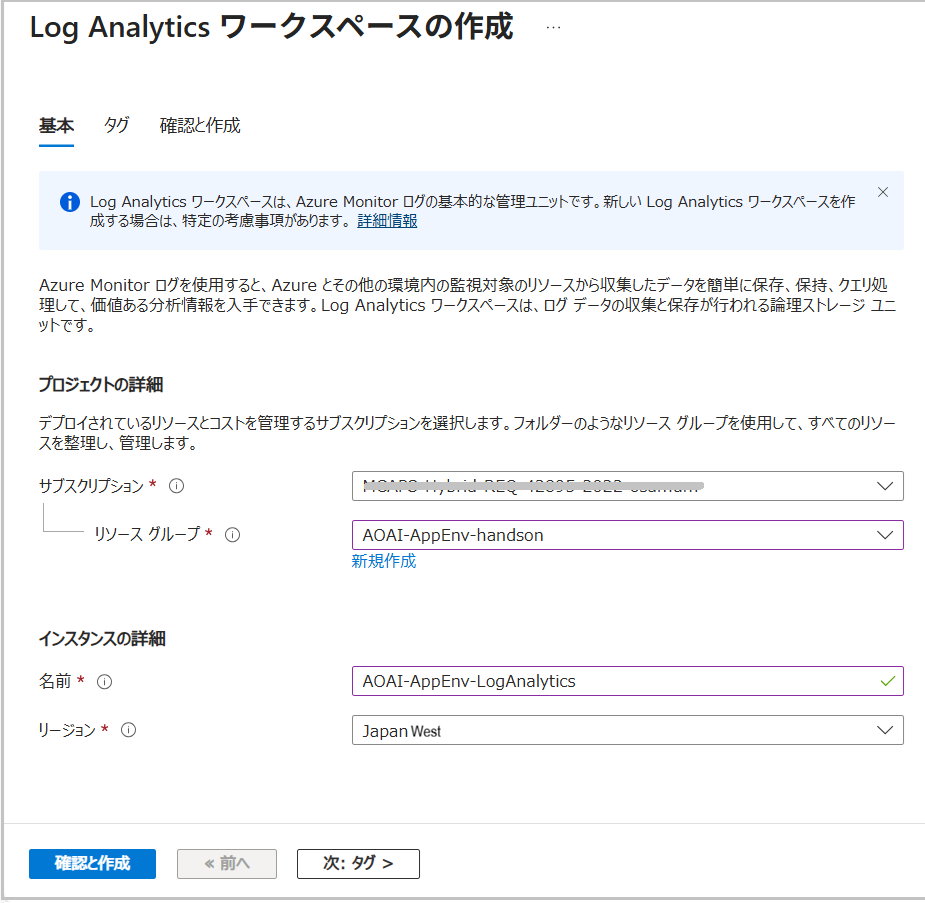

    設定が完了したら画面下にある \[**確認および作成**\] ボタンをクリックし、\[**作成**\] ボタンが表示されたらクリックしてデプロイを開始します。

ここまでの手順で Log Analytics ワークスペースが作成されます。

<br>

## 🌐 App Service への診断設定の追加

作成した Log Analytics ワークスペースに App Service のログを送信するための診断設定を追加します。

具体的な手順は以下のとおりです。

\[**手順**\] 

1. 演習用ボットアプリケーションをホストしている App Service の画面を開き、画面左のメニューの \[**監視**\] グループにある \[**診断設定**\] をクリックします

    \[**診断設定**\] 画面に遷移するので、画面内の \[**+ 診断設定を追加する**\] をクリックします。

    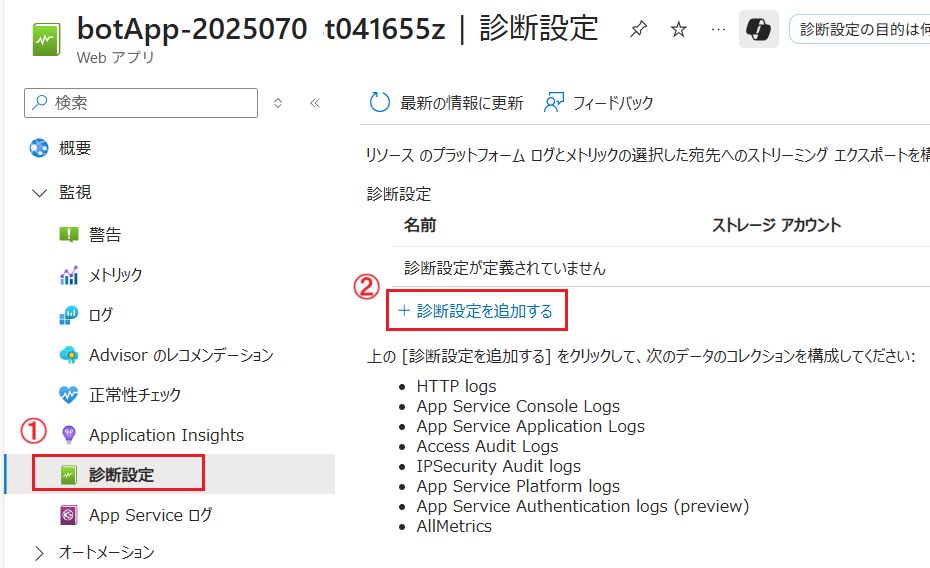

2.  診断設定の追加の作成画面に遷移するので、同画面の各項目を以下のように設定します

    * **診断設定の名前 \***

        `AOAI-AppEnv-DiagSetting`

    * **ログ** と **メトリック**

        すべてのチェックボックスにチェック

    * **宛先の詳細**

    |項目|値|
    |---|---|
    |Log Analytics ワークスペースへの送信| チェック |
    |サブスクリプション| お使いのサブスクリプション |
    |Log Analytics ワークスペース| \[**AOAI-AppEnv-LogAnalytics (japaneast)**\] (※)|
    |ストレージ アカウントへのアーカイブ| 既定のまま |
    |イベント ハブへのストリーム| 既定のまま |
    |パートナー ソリューションに送信| 既定のまま |

    (※) 前の手順で作成した Log Analytics ワークスペースを選択します。

    設定が完了したら画面上部にある \[**保存**\] ボタンをクリックします。

    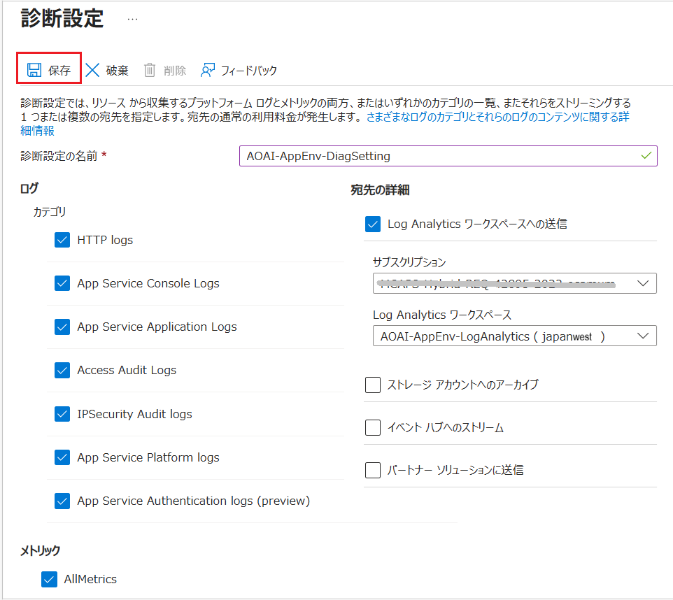

    保存が完了したら、画面内右上にある \[**×**\] ボタンをクリックして画面を閉じます。

3. A画面左のメニューの \[**監視**\] グループにある \[**ログ**\] をクリックします

    \[**クエリ ハブ**\] というダイアログボックスが表示される場合は、ダイアログボックス内右上にある \[**×**\] ボタンをクリックして\[**クエリ ハブ**\] ダイアログボックスを閉じます。

    \[**ログ**\] 画面の \[**新しいクエリ 1**\] タブが表示されるので、同タブ内の \[**テーブル**\] タブのツリービュー \[**その他**\] に `AppServiceConsoleLogs` と `AppServiceHTTPLogs` が表示されていることを確認します。

    **もし表示されていない場合**は、画面上部の \[**スコープの選択**\] ボタンをクリックし、表示された Azure リソースの一覧から演習用アプリケーションをホストしている `botApp-<unique_code>` を選択し \[**適用**\] ボタンをクリックします。

    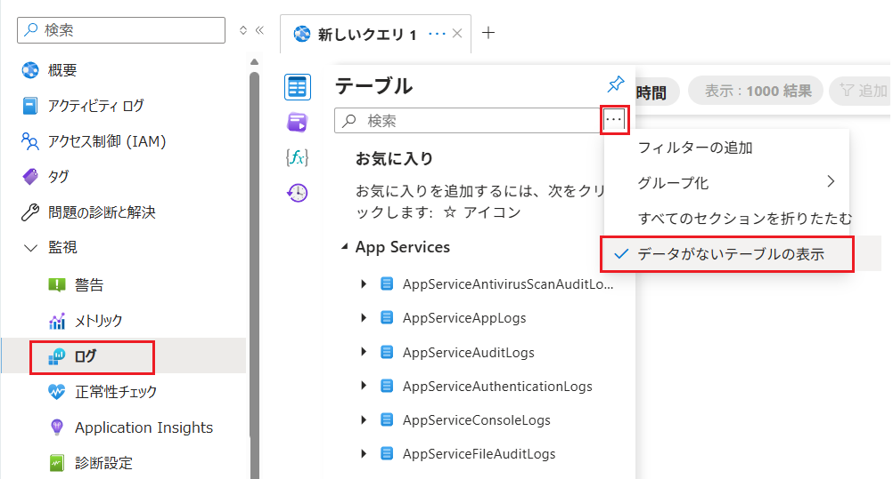

4.  \[**テーブル**\] タブのツリービュー \[**App Services**\] に表示されている `AppServiceHTTPLogs` を**ダブルクリック**し、画面右のクエリー エディターに文字列 `AppServiceHTTPLogs`が入力されたことを確認し、画面上部の \[**実行**\] ボタンをクリックします。

    クエリーが実行され、HTTP リクエストの一覧が表示されるので、任意のリクエストをクリックすると、そのリクエストの詳細が表示されるので確認します。

    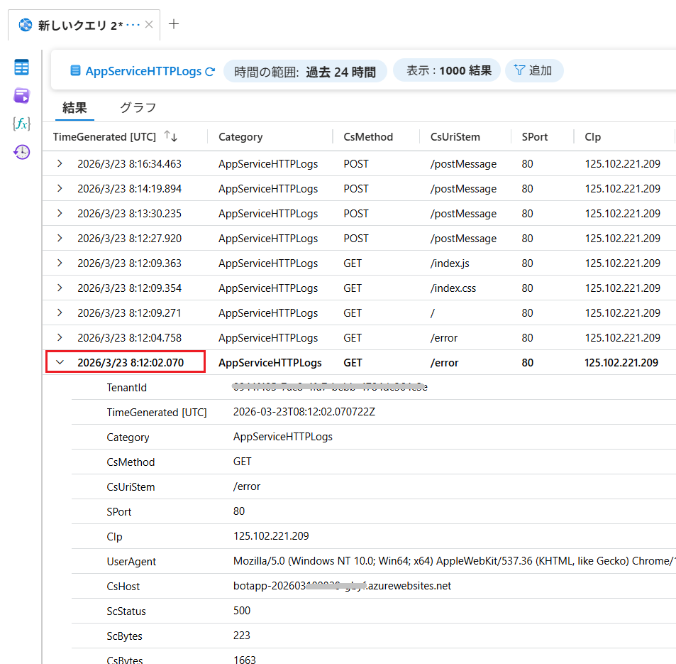

5. リクエストを HTTP500 エラーでフィルターします。

    クエリーエディターの内容を以下のように書き換え、画面上部の \[**実行**\] ボタンをクリックします。

    ```
    AppServiceHTTPLogs |
    where ScStatus == 500 
    ```
    クエリーが実行され、HTTP500 エラーのリクエストの一覧が表示されるので、任意のリクエストをクリックして **ScStatus** の内容が **500** であることを確認します。

    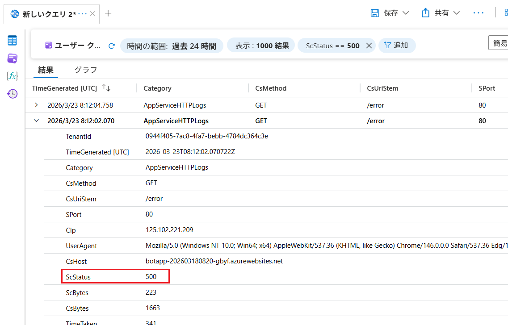

6. HTTP500 (HTTP Server Error) をフィルターするクエリーを保存します

    画面上部の \[**保存**\] - \[**クエリとして保存**\] をクリックすると、画面の右側に \[**クエリとして保存**\] ブレードが表示されるので、同ブレードの各項目を以下のように設定します。

    |項目|値|
    |---|---|
    |クエリ名 \*| `HTTPServerError` |
    |説明 | `HTTP500 のリクエストのみをリストします` |
    |既定のクエリ パックに保存する | チェック |
    |リソースの種類 | \[**App Services**\] |
    |カテゴリ | \[**Applications**\] |
    |ラベル | \[**新しいラベルを作成**\] をクリックして `MyQuery` というラベルを作成して指定|
    
    設定が完了したら画面下にある \[**保存**\] ボタンをクリックします。

    

7. クエリーエディタの画面に戻るので \[**クエリ**\] タブをアクティブにし、検索ボックスに `HTTPServerError` と入力してキーボードの \[Enter\] キーを押下ます

    前の手順で作成したクエリー \[**HTTPServerError**\] が検索結果に表示され、使用できることを確認します。

    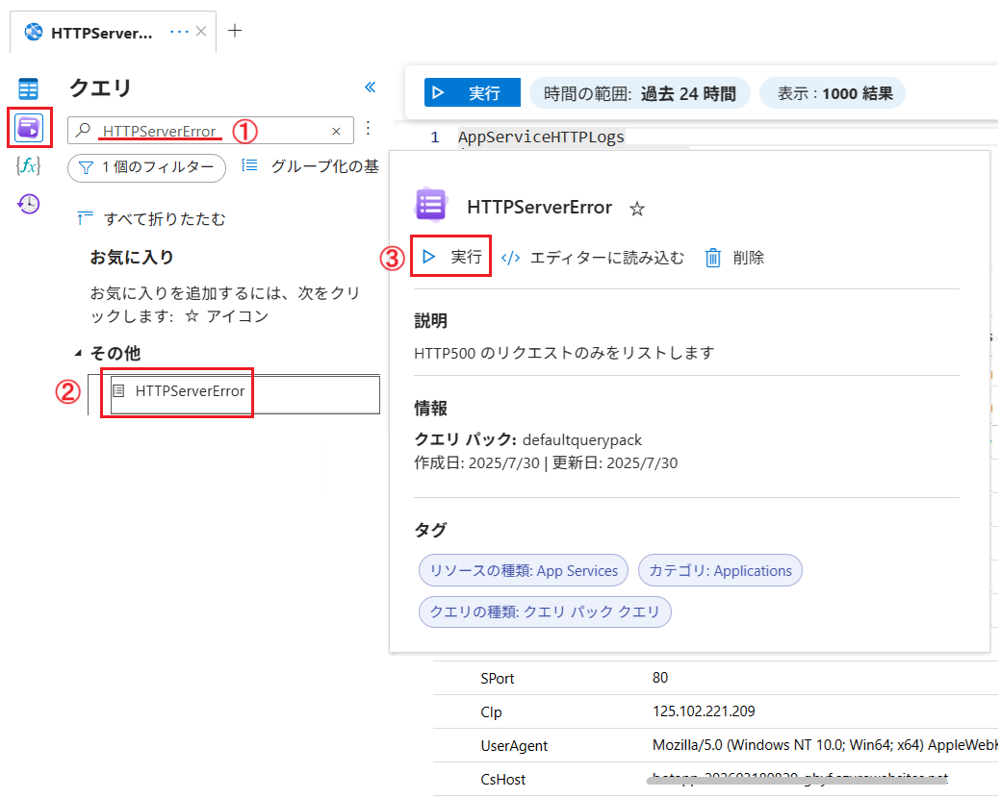

これでいつでも作成したクエリーを呼び出して Log Analytics で App Service のログをクエリーすることができるようになりました。

ここまでの手順では、**AppServiceHTTPLogs** のログをクエリーしましたが
同様の手順で **AppServiceConsoleLogs** のログもクエリーすることができます。

 **AppServiceConsoleLogs** ログには、アプリケーションのコンソール出力が記録されているので、アプリケーションのデバッグやトラブルシューティングに役立ちます。


この演習では単純にログの一覧表示と HTTP500 エラーのフィルタリングを行いましたが、さらに複雑なクエリーを Kusto 照会言語 (KQL) で記述して、ログの検索や集計や分析等も可能です。
ログ クエリの詳しい使い方については以下のドキュメントをご参照ください。

* [**Azure Monitor でログ クエリの使用を開始する**](https://learn.microsoft.com/ja-jp/azure/azure-monitor/logs/get-started-queries)

また、今回の演習では触れませんでしたが、[演習 2-6-1 : メトリック アラートの設定](Ex02-6-1.md)で使用した**メトリック**と同様にアラート ルールを作成して、ログの内容に応じたさまざまなアクションを構成することもできます。具体的な手順については以下のドキュメントをご参照ください。

* [**チュートリアル:Azure リソースのログ クエリ アラートを作成する**](https://learn.microsoft.com/ja-jp/azure/azure-monitor/alerts/tutorial-log-alert)

Log Analytics 全体の使用方法についての詳細は以下のドキュメントをご参照ください。

* [**Azure Monitor の Log Analytics の概要**](https://learn.microsoft.com/ja-jp/azure/azure-monitor/logs/log-analytics-overview)

<br>

## 🧠 Azure OpenAI サービスへの診断設定の追加

Log Analytics ワークスペースに Azure OpenAI サービスのログを送信する方法は、前の手順で App Service の診断設定を追加したのと同様ですが、診断設定を追加後に実際に使用できるようになるタイミングが違ったり、診断設定の項目が異なるため念のために手順を紹介します。

具体的な手順は以下のとおりです。

\[**手順**\] 

1. このハンズオンでデプロイした OpenAI リソース(aoai-\<unique-code\>) の画面を開き、画面左のメニューの \[**監視**\] グループにある \[**診断設定**\] をクリックします

    \[**診断設定**\] 画面に遷移するので、画面内の \[**+ 診断設定を追加する**\] をクリックします。

    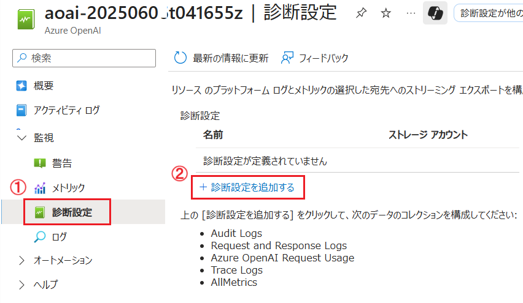

2.  診断設定の追加の作成画面に遷移するので、同画面の各項目を以下のように設定します

    * **診断設定の名前 \***

        `AOAI-oaiEnv-DiagSetting`

    * **ログ** と **メトリック**

        すべてのチェックボックスにチェック

    * **宛先の詳細**

    |項目|値|
    |---|---|
    |Log Analytics ワークスペースへの送信| チェック |
    |サブスクリプション| お使いのサブスクリプション |
    |Log Analytics ワークスペース| \[**AOAI-AppEnv-LogAnalytics (japaneast)**\] (※)|
    |ストレージ アカウントへのアーカイブ| 既定のまま |
    |イベント ハブへのストリーム| 既定のまま |
    |パートナー ソリューションに送信| 既定のまま |

    (※) 前の手順で作成した Log Analytics ワークスペースを選択します。

    設定が完了したら画面上部にある \[**保存**\] ボタンをクリックします。

    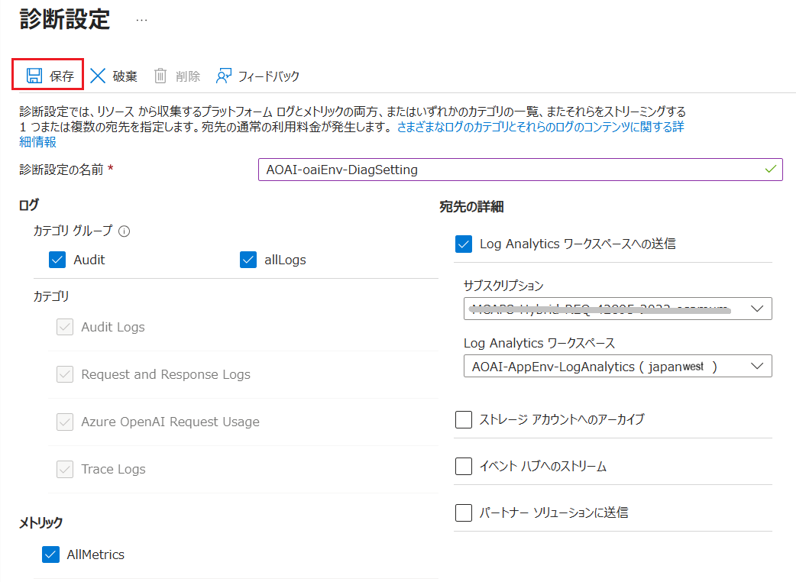

    保存が完了したら、画面内右上にある \[**×**\] ボタンをクリックして画面を閉じます。

    なお、Azure AI リソースの場合、ログ データがクエリや分析に**使用できるようになるまでに最大 2 時間かかる**ことがあります。そのため、診断設定を追加した直後にログをクエリしても、まだデータが存在しないことがありますのでしばらく時間をおいてからクエリを実行してください。

    また、演習用ボットアプリケーションに質問を投げかけて、ログが生成されるようにしてください。

3. 画面左のメニュー \[**監視**\] - \[**ログ**\] をクリックし、遷移した画面内にサブスクリプション内の Loganalytics ワークスペースの一覧が表示されるので、前の手順で作成した \[**AOAI-AppEnv-LogAnalytics**\] をクリックします。

4. \[**AOAI-AppEnv-LogAnalytics**\] の画面が表示されるので、同画面左のメニューから \[**ログ**\] をクリックします

    遷移した画面に \[**クエリ ハブ**\] というダイアログボックスが表示される場合は、ダイアログボックス内右上にある \[**×**\] ボタンをクリックして\[**クエリ ハブ**\] ダイアログボックスを閉じます。

    同画面内にローテートして表示されている \[**スキーマとフィルター**\] と書かれたバー上の **\[\>\>\]** の展開ボタンをクリックして、スキーマとフィルターのバーを展開します。

    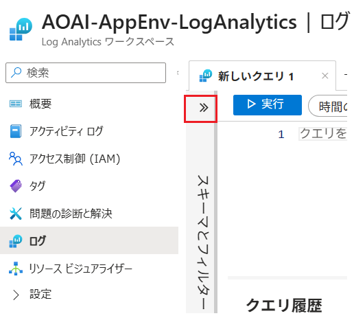

    \[**新しいクエリ 1**\] タブが表示されるので、同タブ内の \[**テーブル**\] タブのツリービュー \[**LogManagement**\] を展開し、\[**AzureDiagnostics**\] を**ダブルクリック**して、クエリー入力画面に `AzureDiagnostics` が入力されたことを確認します。

    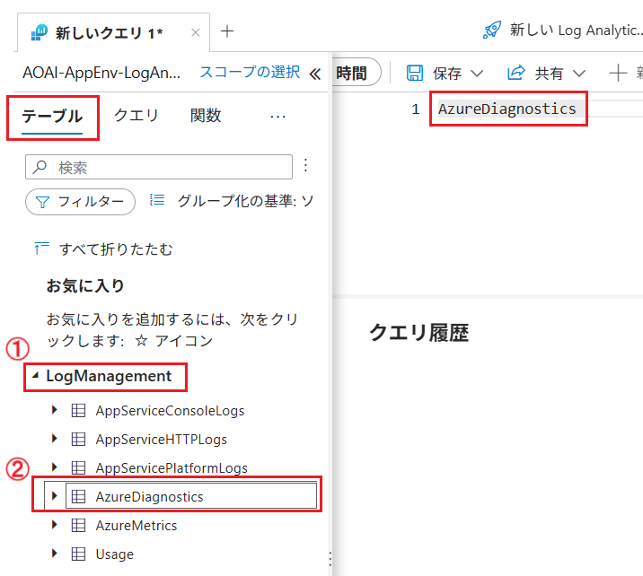

    なお、ここまでの手順の Azure ポータル UI の操作イメージは以下の画像のとおりです。

    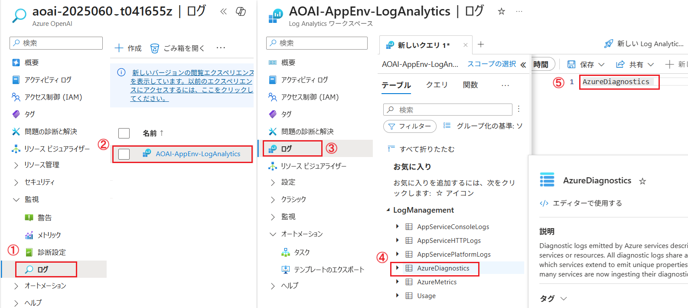

5. クエリー入力画面の \[**実行**\] ボタンをクリックし、ログの一覧が表示されることを確認します。

    \[**Category**\] フィールドの値が \[**RequestResponse**\] のログをクリックして展開し、ログの内容を確認します。

    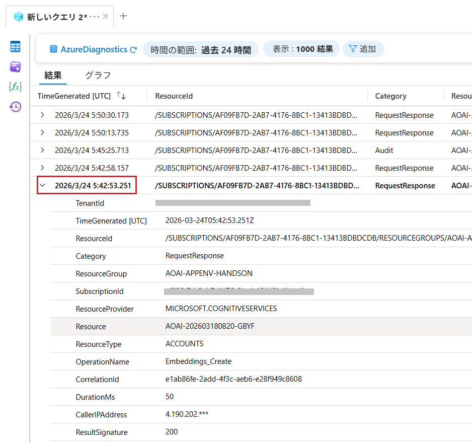

    現在のクエリーは \[**AzureDiagnostics**\] テーブルのすべてのログの一覧を表示しているので、以下のようにクエリーを変更して、演習用アプリケーションが使用している Azure OpenAI サービスの要求と応答のログのみを表示するようにします。

    なお、クエリー文中の `Resource` の値は、演習用ボットアプリケーションで使用している Azure OpenAI サービスのリソース名に置き換えてください。

    ```
    AzureDiagnostics
    | where Resource == "AOAI-<unique-code>" and Category == "RequestResponse"
    | sort by TimeGenerated desc
    ```

    \[**実行**\] ボタンをクリックして、正しい結果が表示されることを確認します。

6.  画面上部の \[**保存**\] - \[**クエリとして保存**\] をクリックすると、画面の右側に \[**クエリとして保存**\] ブレードが表示されるので、同ブレードの各項目を以下のように設定します。

    |項目|値|
    |---|---|
    |クエリ名 \*| `AOAI-<unique-code>.RequestResponse` |
    |説明 | `AOAI-<unique-code> の応答を表示するクエリ` |
    |レガシ クエリとして保存 | チェック |
    |既定のクエリ パックに保存する | チェックしない |
    |リソースの種類 | \[**App Services**\] |
    |カテゴリ | \[**Applications**\] |
    |ラベル | \[**新しいラベルを作成**\] をクリックして `MyAOAIquery` というラベルを作成して指定|
    
    設定が完了したら画面下にある \[**保存**\] ボタンをクリックします。

    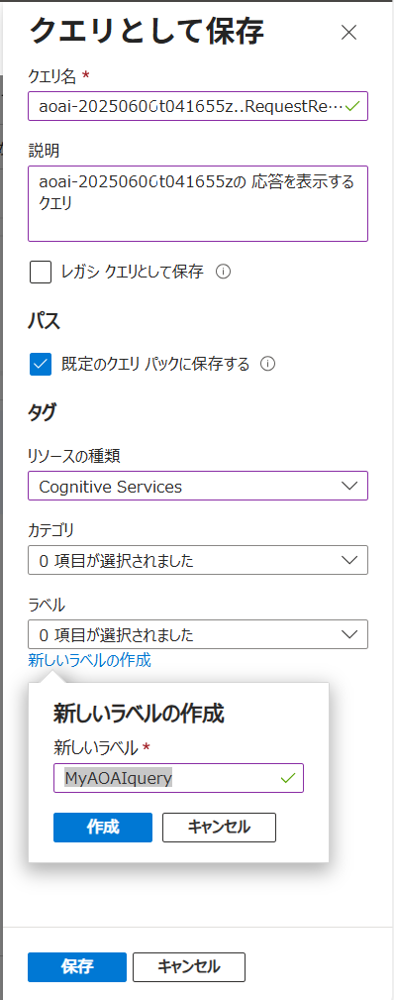

7. クエリーエディタの画面に戻るので \[**クエリ**\] タブをアクティブにし、検索ボックスに `AOAI-<unique-code>.RequestResponse` と入力してキーボードの \[Enter\] キーを押下します

    前の手順で作成したクエリー \[**AOAI-<unique-code>.RequestResponse**\] が検索結果に表示され、使用できることを確認します。

    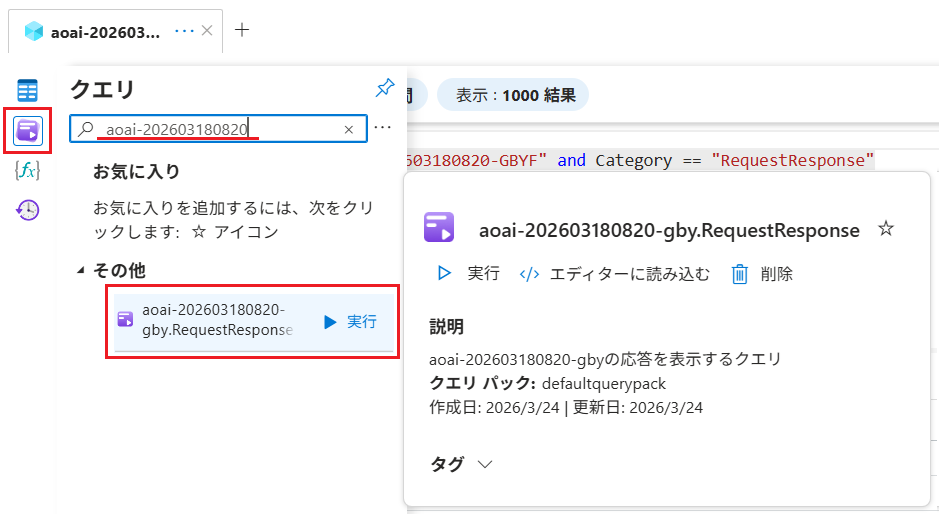

ここまでの手順で、演習用ボットアプリケーションが使用している Azure OpenAI サービスのログをクエリーすることができるようになりました。

その他のサンプル クエリーについては、以下のドキュメントを参照してください。

* Azure AI サービスの診断ログを有効にする - [**サンプル クエリ**](https://learn.microsoft.com/ja-jp/azure/ai-services/diagnostic-logging#sample-queries)

今回の手順で取得したログの  \[**Category**\] フィールドの値については以下のドキュメントを参照してください。

* [**Microsoft.CognitiveServices/accounts でサポートされるログ**](https://learn.microsoft.com/ja-jp/azure/azure-monitor/reference/supported-logs/microsoft-cognitiveservices-accounts-logs?source=recommendations)

その他のフィールドの値については、以下のドキュメントを参照してください。

* [**Azure OpenAI 監視データのリファレンス**](https://learn.microsoft.com/ja-jp/azure/ai-foundry/openai/monitor-openai-reference)

なお、Azure OpenAI サービスのログではユーザーの質問や応答の内容は記録されません。ユーザーの質問や応答の内容を記録するには、アプリケーション側でログに記録するように実装するかアプリケーションと Azure OpenAI サービスの間に Azure API Management を配置して、Azure API Management のログを記録するようにするなどの工夫が必要になります。

詳細については以下のドキュメントをご参照ください。

* [**ゲートウェイを介して Azure OpenAI の高度な監視を実装する**](https://learn.microsoft.com/ja-jp/azure/architecture/ai-ml/guide/azure-openai-gateway-monitoring)

<br>

## 🔍 Azure AI Search サービスへの診断設定の追加

Log Analytics ワークスペースに Azure AI Search サービスのログを送信する方法は、以下のドキュメントに詳しい手順が記載されているので、そちらを参照して実施してください。

* [**Azure AI 検索の診断ログを構成する**](https://learn.microsoft.com/ja-jp/azure/search/search-monitor-enable-logging)

なお、上記手順の \[**診断設定を追加する**\] の設定では、\[**Log Analytics ワークスペースへの送信**\] のチェックボックスにチェックを入れ、このハンズオンで作成した Log Analytics ワークスペース `AOAI-AppEnv-LogAnalytics (japaneast)`を選択してください。なお、**診断設定** を追加した後、Azure AI Search サービスのログが Log Analytics ワークスペースに送信されるまでにある程度の時間がかかるので、しばらく時間をおいてから Log Analytics ワークスペースのログをクエリして確認してください。

また、演習用ボットアプリケーションに質問を投げかけて、ログが生成されるようにしてください。

クエリーされた Azure AI Search サービスのログの内容についは、以下のリンクのドキュメントを参照してください。

* [**Azure AI Search の監視**](https://learn.microsoft.com/ja-jp/azure/search/monitor-azure-cognitive-search)

* [**Azure AI 検索の監視データのリファレンス**](https://learn.microsoft.com/ja-jp/azure/search/monitor-azure-cognitive-search-data-reference)


* [**Azure AI Search でクエリ要求を監視する**](https://learn.microsoft.com/ja-jp/azure/search/search-monitor-queries?source=recommendations)

<br>

## 🛢️ Azure Storage アカウントへの診断設定の追加

Azure Storage アカウントへの診断設定の追加方法は、ここまでの演習でおこなってきた他の Azure リソースでの設定と同様ですが、Storage アカウントは異なる複数のストレージの書類をサポートするため、その中のどのストレージのログを収集するかを選択する必要があります。

このハンズオンの作業では Blob ストレージしか使用していないので、Blob ストレージのログを収集するように設定します。

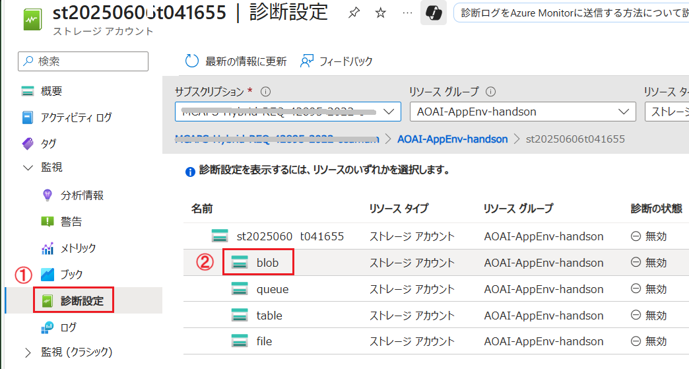


画面が遷移した \[**+ 診断設定の追加**\] リンクをクリックします。

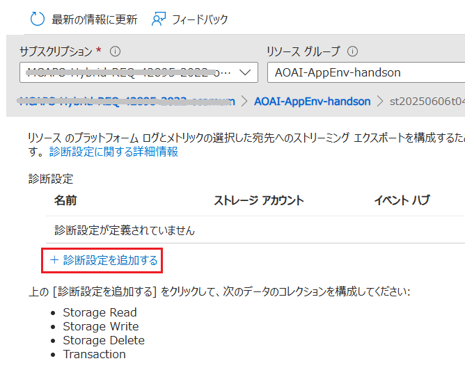

遷移した [**診断設定の追加**] 画面で、以下のように設定します。

 * **診断設定の名前 \***

    `AOAI-storageEnv-DiagSetting`

* **ログ** と **メトリック**

    すべてのチェックボックスにチェック

* **宛先の詳細**

|項目|値|
|---|---|
|Log Analytics ワークスペースへの送信| チェック |
|サブスクリプション| お使いのサブスクリプション |
|Log Analytics ワークスペース| \[**AOAI-AppEnv-LogAnalytics (japaneast)**\] (※)|
|ストレージ アカウントへのアーカイブ| 既定のまま |
|イベント ハブへのストリーム| 既定のまま |
|パートナー ソリューションに送信| 既定のまま |

(※) 前の手順で作成した Log Analytics ワークスペースを選択します。

設定が完了したら画面上部にある \[**保存**\] ボタンをクリックします。

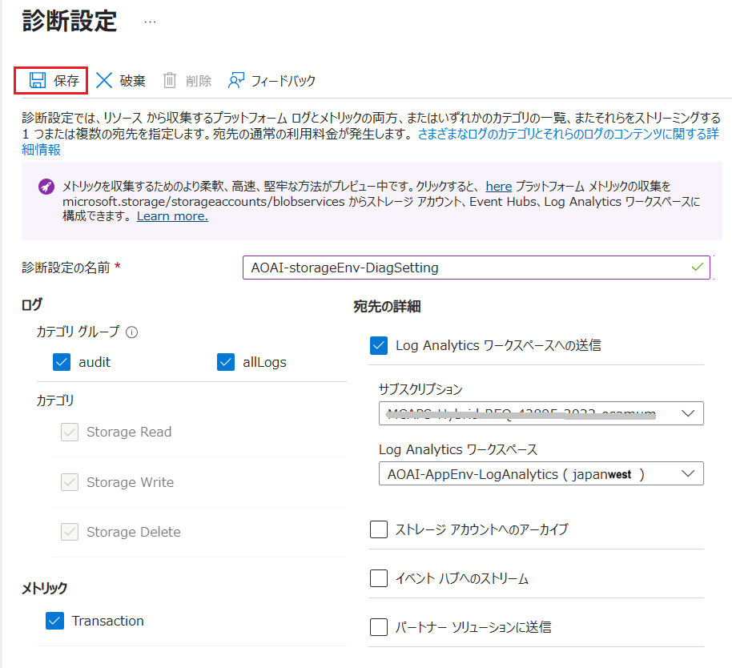 

ログが Log Analytics ワークスペースに送信されるまでにある程度の時間がかかるので、しばらく時間をおいてから Log Analytics ワークスペースのログをクエリして確認してください。

また、その間に作業を行った Storage アカウントの Blob ストレージに対してファイルをアップロードする等、何らかの操作を行い、ログが生成されるようにしてください。


Storage_Choose_DiagSetting.png
storage_Create_DiagSetting.png


Azure Monitor リソース ログ
https://learn.microsoft.com/ja-jp/azure/storage/blobs/monitor-blob-storage?tabs=azure-portal#azure-monitor-resource-logs

Azure Blob Storage の監視に関するベスト プラクティス
https://learn.microsoft.com/ja-jp/azure/storage/blobs/blob-storage-monitoring-scenarios


Storage insights の概要
https://learn.microsoft.com/ja-jp/azure/storage/common/storage-insights-overview?toc=%2Fazure%2Fazure-monitor%2Ftoc.json#introduction-to-storage-insights


https://youtu.be/j40RGK5SAeY?si=xfD1YEoC6BwCmtw4