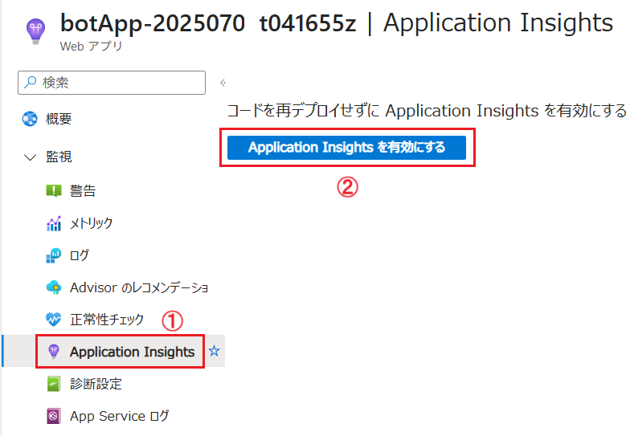
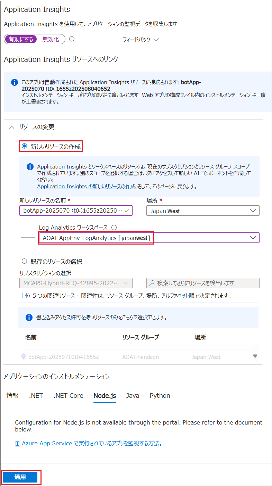
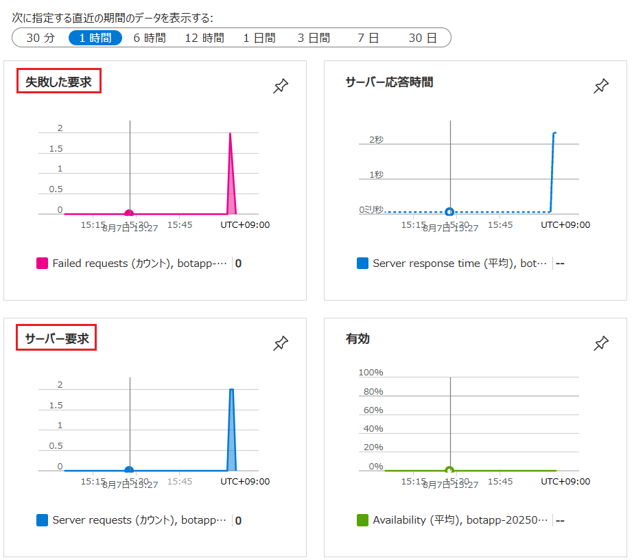
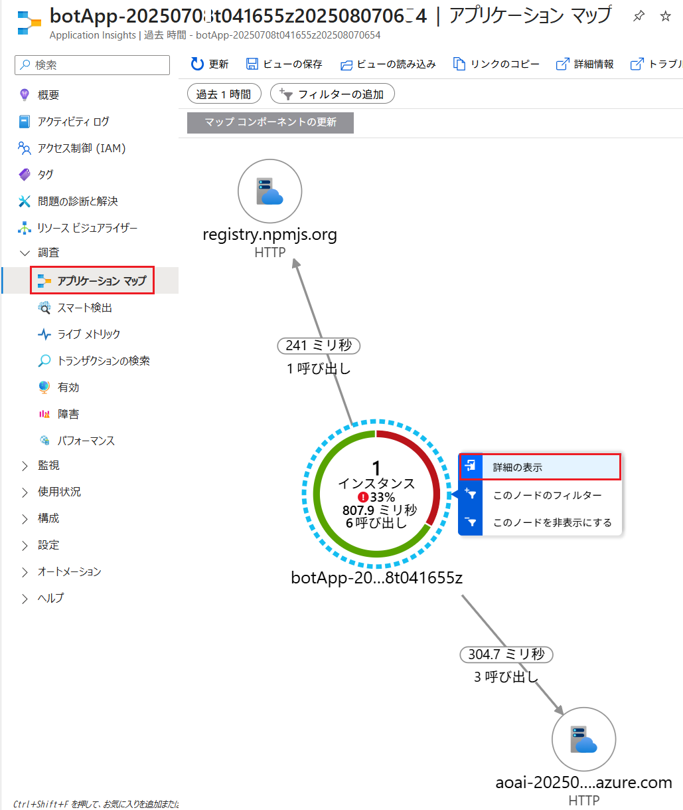
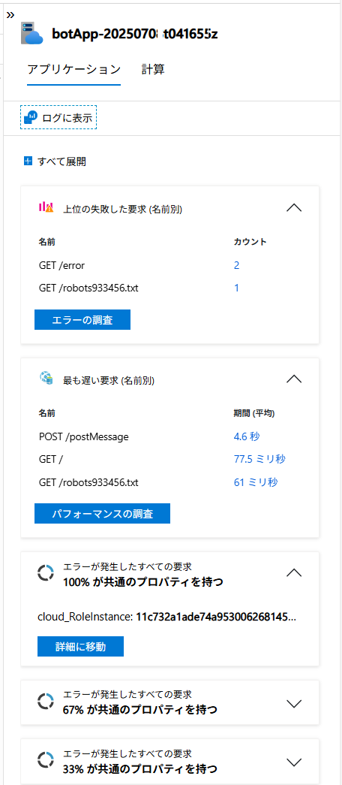
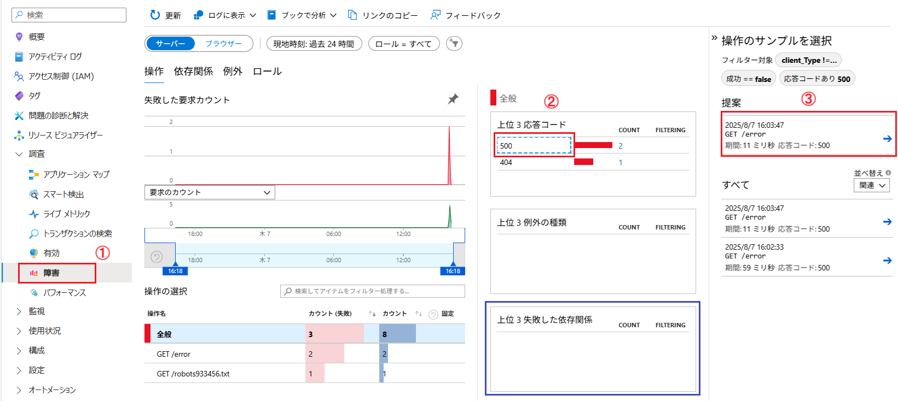

# 演習 2-6-3 : Application Insights 使用したアプリケーションの監視

[Application Insights](https://learn.microsoft.com/ja-jp/azure/azure-monitor/app/app-insights-overview) は、アプリケーションのパフォーマンスや利用状況を監視するためのサービスです。Application Insights を使用すると App Service に限らず、さまざまなホスト環境で動作しているアプリケーションの情報を取得することができます。

このタスクでは、App Service でホストされている演習用ボット アプリケーションに対して、Application Insights を有効にし、エラーを発生させて原因を調査する手順を説明します。

具体的な手順は以下のとおりです。

\[**手順**\]

1. Azure ポータルで App Servive **MovieApp-XYZ/staging** を選択し、画面に左のメニューより \[**Application Insights**\] をクリックします。

    はじめてアクセスした場合は遷移先の画面に \[**Application Insights を有効にする**\] ボタンが表示されるのでクリックします。

    

2. \[**Application Insights**\] の画面が表示されるので、画面上部のトグル ボタンが \[**有効にする**\] になっていることを確認します。

    

3. 同画面の \[**リソースの変更**\] セクションで、オプションボタン \[**新しいリソースの作成**\] がチェックされ、\[**Log Analytics ワークスペース**\] にこの演習で作成したワークスペースが選択されていることを確認します。もし違うものが選択されている場合は、ドロップダウン リストから演習で作成したワークスペースを選択してください

    

    設定が完了したら画面下にある \[**適用**\] ボタンをクリックします。

4. Application Insights にエラーを検出させるために演習用アプリケーションの以下の URL にアクセスして HTTP500 エラーを発生させます。

   ```
   https://<app-name>.azurewebsites.net/error
   ```
    
    (※) ここで、<app-name> は演習で使用している App Service の名前に置き換えてください

    この URL にアクセスすると、HTTP500 エラーが発生するので、メトリックやログで分かりやすいように、この操作を時間の間隔を少しあけて複数回行ってください。

     

5. Application Insights で取得された情報を確認します。

    リソースグループ\[**AOAI-AppEnv-handson**\] を開き、前の手順で作成した Application Insights のアイコンをクリックします。

6. \[**概要**\] 画面が表示されるので、同画面のグラフ \[**失敗した要求**\]、\[**サーバー要求**\] にリクエストが検出されていることを確認します

    

7. 左のメニューから \[**アプリケーション マップ**\] をクリックすると、アプリケーションの依存関係が表示されるので、アプリケーション名ををクリックするか、マウスをホバーした際に表示さるメニューから \[**詳細を表示**\] をクリックします。

   

    画面右に表示されるブレードにエラーやパフォーマンスの情報が表示されているのを確認します。

   

8. 画面左のメニューの \[**障害**\] をクリックすると、アプリケーションで発生したエラーについての情報が表示されます。

    画面の右側に \[**全般**\] エラー `500`、`404`と並んでいますが、もし、アプリケーションが内部でデータベース等を参照していてそこでエラーが発生している場合は、`SQL` や `Redis` などのボックスも表示されます。
    
    
    今回エラーは、アプリケーションのコードで意図的に発生させている HTTP500 エラーを意図的に発生させているので `SQL` をクリックし、さらに表示されたブレードの \[**提案**\] ボックスをクリックします。

    


   
