# 演習 3-3-1 : メトリック アラートの設定

メトリックはパフォーマンスデータを数値化して監視できますが、メトリックの値が特定の閾値を超えた場合にアラートを発行することもできます。

たとえば使用しているリソースの CPU やメモリの使用率が想定以上に高くなった場合にアラートを発行して管理者に対応を促したり、障害を検知し、修復のためのアクションを自動的に実行することもできます。

また HTTP のステータスも監視できるので、これを使用してエラーが発生した際にアラートを発行することもできます。

この演習で実施する作業は以下のとおりです。

1. App Service でのメトリック アラートの設定
2. OpenAI Service でのメトリック アラートの設定
3. AI Search でのメトリック アラートの設定
4. Storage アカウントでのメトリック アラートの設定

## 1. App Service でのメトリック アラートの設定


この演習では演習用ボットアプリケーションをホストしている App Service に対し、HTTP500 エラーが発生した際にアラートを発行する設定を行います。

具体的な手順は以下のとおりです。

\[**手順**▶️\]

1. [Azure ポータル](http://portal.azure.com) にログインし、演習で使用している App Service のリソース画面を表示します

2. 画面左側のメニューで \[**概要**\] が選択されていることを確認し、画面内の \[**既定のドメイン**\] の URL をクリックします

3. 新しいタブで演習用アプリケーションが表示されるので、Web ブラウザーのナビゲーションバーの URL を以下のように書き換えます

    ```
    https://<app-name>.azurewebsites.net/error
    ```

    (※) ここで、\<app-name\> は演習で使用している App Service の名前に置き換えてください

    この URL にアクセスすると、HTTP500 エラーが発生するので、メトリックやログで分かりやすいように、この操作を時間の間隔を少しあけて複数回行ってください。

    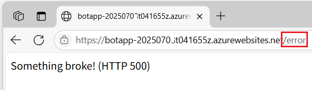

3.  画面左のメニューから項目 \[**監視**\] の下にある \[**メトリック**\]を選択し、遷移した画面で検出条件の各ドロップダウン ボックスを以下のように設定します

    |項目|値|
    |---|---|
    |スコープ| `botApp-<unique-code>` |
    |メトリック名前空間| `スロット 標準的なメトリック` |
    |メトリック| `HTTP Server Errors` |

    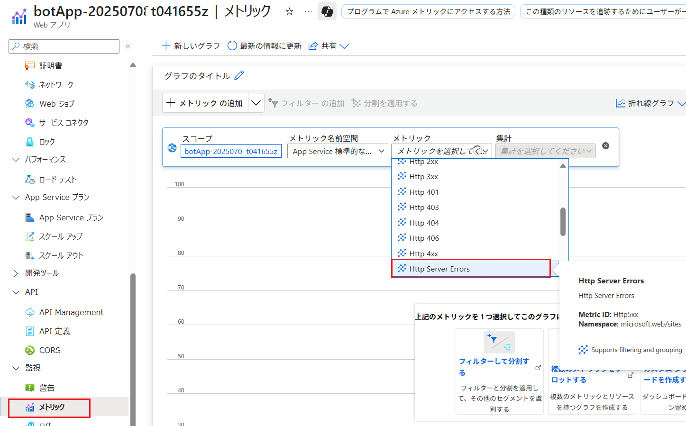 

    設定と同時に前の手順にで発生された HTTP500 エラーの合計数グラフに表示されることを確認します。また各グラフのスパイク位置をクリックすると、その回数が表示されます。

    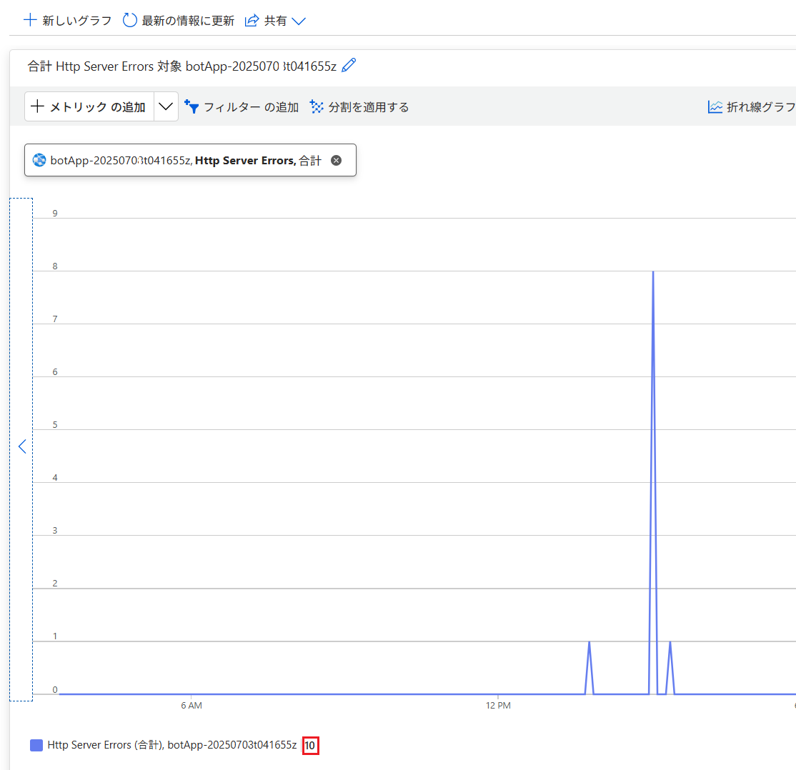

4. HTTP Server Error 発生時にアラート メッセージが送信されるように設定します。
    グラフ上部の \[**新しいアラート ルール**\] をクリックします

    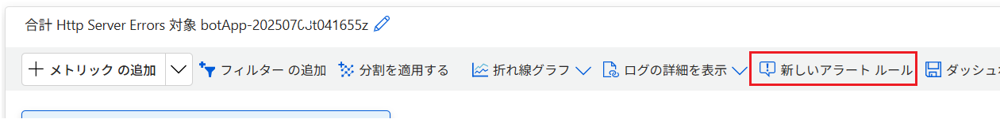

5. \[**アラート ルールの作成**\] 画面に遷移するので、\[**条件**\] タブの各項目を以下のように設定します

    |項目|値|
    |---|---|
    |シグナル名 \*| \[**Http Server Errors**\] |

    **アラート ロジック**

    |項目|値|
    |---|---|
    |しきい値| \[**Static**\] |
    |集計の種類| \[**最大値**\] |
    |演算子| \[**次の値より大きい**\] |
    |単位| \[**カウント**\] |
    |しきい値 \*| `3` | 

    **ディメンジョンで分割する**

    (既定のまま)

    **評価するタイミング**

    |項目|値|
    |---|---|
    |確認する間隔| \[**1 分**\] (※)|
    |ルックバック期間| \[**5 分**\] |

    (※) 演習では早めに結果を確認したいため最小時間に設定してあります。

    設定が完了したら画面下にある \[**次へ: アクション**\] ボタンをクリックします
 
    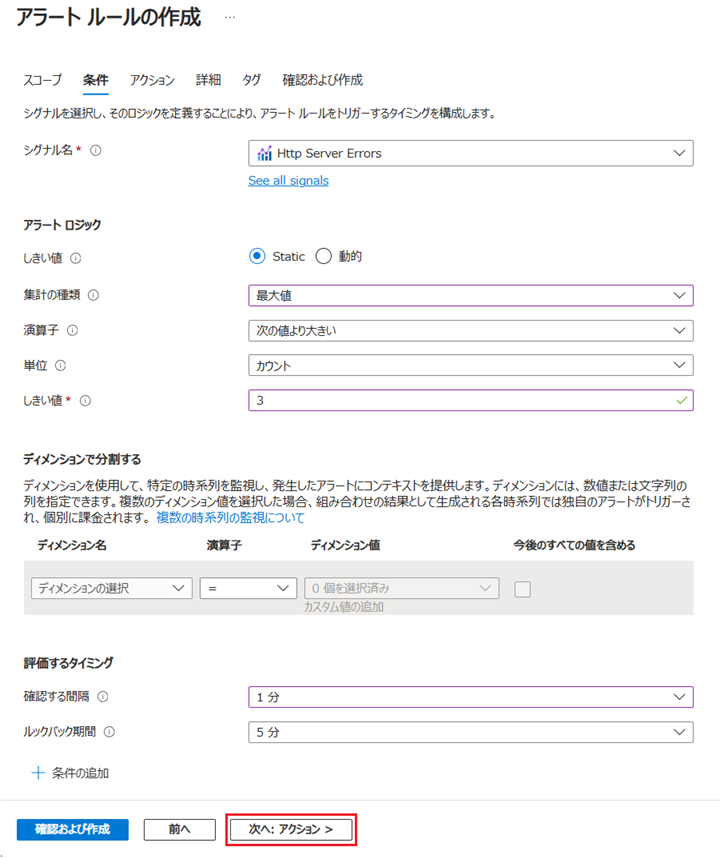

 6. \[**アクション**\] タブに遷移するので、\[**クイック アクションの使用 (プレビュー)　1 つ以上のクイック操作を選択します。**\] オプション ボタンをクリックし、画面右に表示された \[**クイック アクションの使用 (プレビュー)**\] ブレードの各設定を以下のように設定し、\[**保存**\] ボタンをクリックします

    |項目|値|
    |---|---|
    |アクション グループ名 \*| `Alert_HttpServer_Error` |
    |表示名 \*| `BotWebAppErr` |
    |アクション| \[**メール**\] にチェック|

    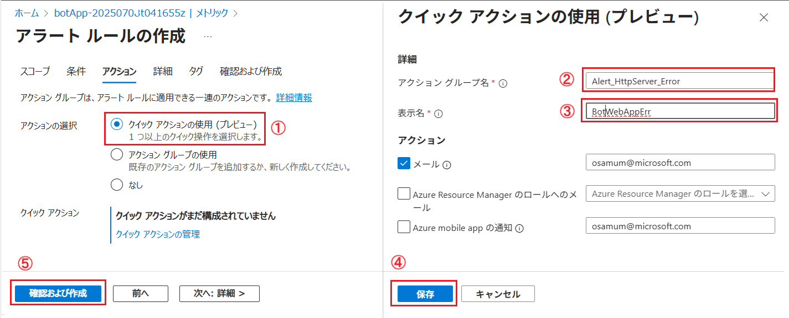

    ブレードが閉じ、\[**アラート ルールの作成**\] 画面に戻ったら \[**次へ : 詳細 \>**\] ボタンをクリックします

6. \[**詳細**\] タブに遷移するので、同画面の各項目を以下のように設定します

    **プロジェクトの詳細**

    |項目|値|
    |---|---|
    |サブスクリプション \*| 現在お使いのサブスクリプション |
    |リソース グループ \*| \[**AOAI-AppEnv-handson**\] |

    **アラート ルールの詳細**

    |項目|値|
    |---|---|
    |重大度 \*| \[**1 - エラー**\] |
    |アラート ルール名 \*| `HttpServerError_Notice` |
    |アラート ルールの説明| `アプリケーションのサーバーサイドでエラーが発生した際に通知します` |

    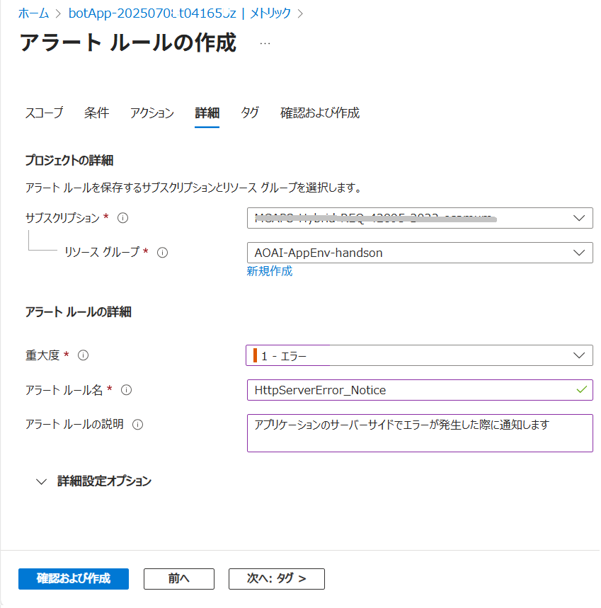

    設定が完了したら \[**確認および作成**\] ボタンをクリックし、\[**作成**\] ボタンが表示されたらクリックします

    アラートルールの作成が完了するまで待ちます

7. アラートルールの作成が完了したら、演習用アプリケーションにアクセスして HTTP500 エラーを 3 回以上発生させます

    ```
    https://<app-name>.azurewebsites.net/error
    ```

    (※) ここで、\<app-name\> は演習で使用している App Service の名前に置き換えてください

    しばらくすると、アラート ルールの \[**通知**\] タブで設定したメールアドレスにアラートメールが届くので内容を確認してください。

    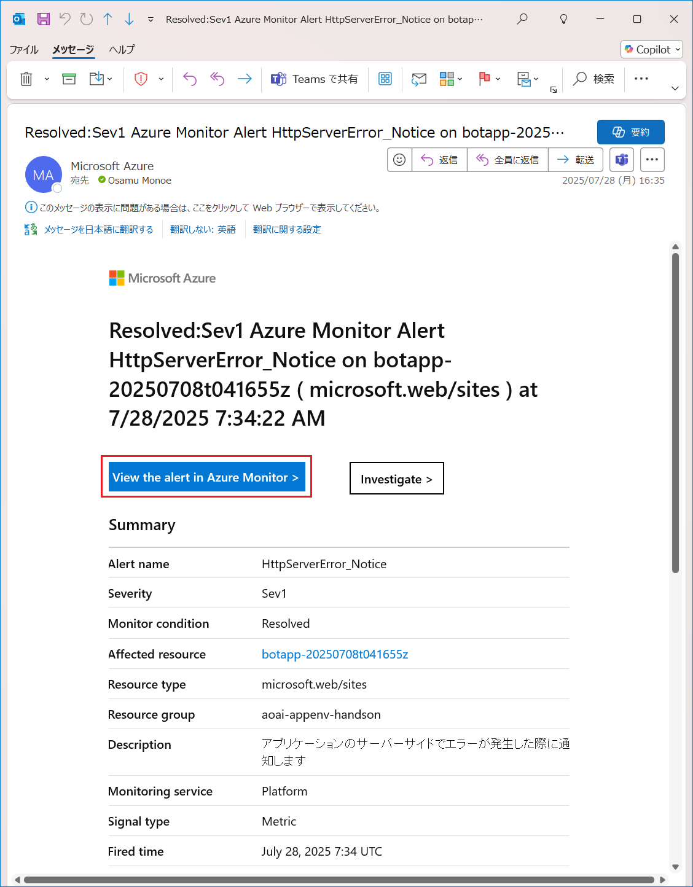

8.  メール内の \[**View the alert in Azure Monitor \>**\] ボタンをクリックすると、Web ブラウザーで \[**メトリクス アラートの詳細**\] 画面が表示されることを確認します

    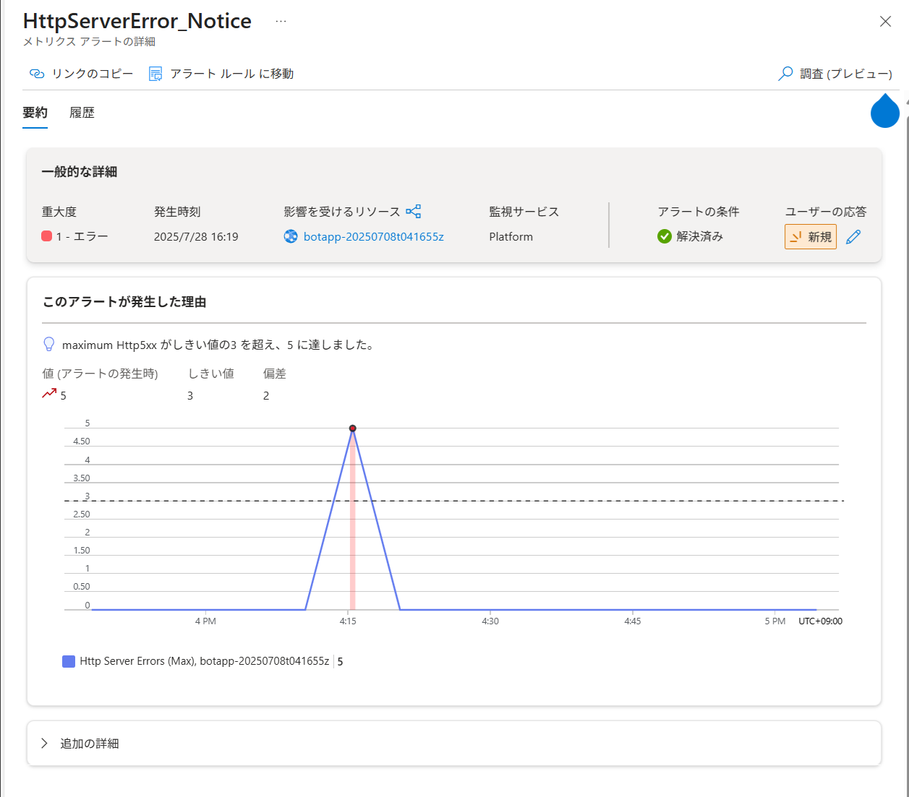

    ここでは、アラートの状態や発生した時間、アクションの履歴などを確認することができます。

    同様にメール内の \[**Investigate \>**\] ボタンをクリックすると、Web ブラウザーで \[**Application Insights**\] 画面が表示されますが、ここまでの手順では Application Insights は設定していないため、アプリケーションの詳細な情報は表示されません。

ここまでの手順でアラートメッセージの設定作業は完了です。

この演習では Azure Monitor のメトリックの機能を使用して App Service でホストするアプリケーションのサーバーサイドのエラー (HTTP500.x)を監視し、エラーが発生した際にメールを送信するアラート ルールを作成しました。

メトリックでは HTTP のステータス以外でも CPU 使用率やメモリ使用量などのパフォーマンスデータ、そのた監視対象が提供するさまざまなデータを監視することができます。

また、今回の手順ではアラートルールの作成で \[クイック アクション\] を使用してメールでの通知のみを設定しましたが、アクション グループを作成するか、もしくは今回作成したアクショングループに新規にアラートルールを追加してさまざまな通知の種類、アクション タイプを設定することもできます。

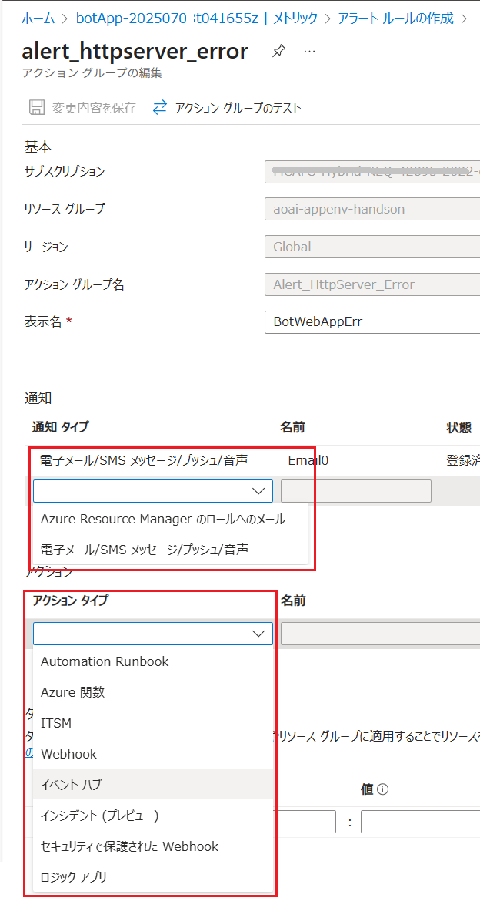

よって、たとえば事前に障害が発生する兆候と回避方法を把握している場合にはメトリックで検知し、**アクション**から Webhook や Function でそれを回避するためのアクションを実行することもできます。

同様にもし、障害が発生した場合でも、修復方法がわかっている場合は障害を検知し**アクション**を使用して自動回復する仕組みを用意しておくこともできます。

その他、この演習ではメトリックを異常検知のトリガーとしてしか使用しませんでしたが、App Service の \[**メトリック**\] メニューを選択した際に表示されるメトリック エクスプローラーでは複数のデータソースを組み合わせたり、グラフの種類を変更したりすることで、より詳細な監視を行うことができます。

詳細については以下のドキュメントをご参照ください。　

* [**Azure Monitor メトリックス エクスプローラーを使用してメトリックを分析する**](https://learn.microsoft.com/ja-jp/azure/azure-monitor/essentials/analyze-metrics)

App Service で使用できるメトリックについては以下のドキュメントをご参照ください。

* [**Azure App Service のアプリの監視 - メトリックを理解する**](https://learn.microsoft.com/ja-jp/azure/app-service/web-sites-monitor#understand-metrics)

<br>

## 2. OpenAI Service でのメトリック アラートの設定

Azure OpenAI サービスでのメトリック アラートの設定方法は App Service と同様です。

ただし、選択できるメトリックの種類は OpenAI サービスに特化したものを選択することができます。

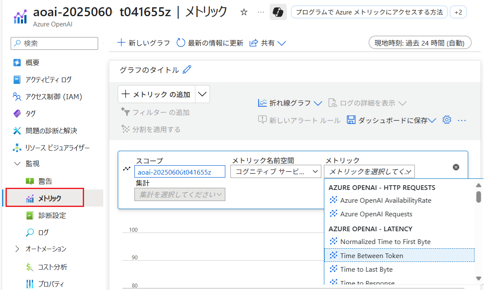

この演習用アプリケーションを監視する場合に設定するメトリックの例としては、以下のようなものが考えられます。

#### 📈 Azure OpenAI サービス監視メトリック例

| カテゴリ       | メトリック名                          | 説明                                                                 | 対象モデル                         |
|----------------|----------------------------------------|----------------------------------------------------------------------|------------------------------------|
| リクエスト     | AzureOpenAIRequests                    | API 呼び出し回数（ステータスコード別に分割可能）                    | 全モデル                           |
| 可用性         | AzureOpenAIAvailabilityRate            | 可用性率（成功リクエストの割合）                                    | 全モデル                           |
| レイテンシ     | AzureOpenAITimeToResponse              | 最初の応答までの時間                                                 | 全モデル                           |
|                | AzureOpenAITTLTInMS                    | 最後のバイトが返るまでの時間                                        | 全モデル                           |
|                | AzureOpenAINormalizedTTFTInMS          | 最初のバイトが返るまでの時間（正規化）                              | 全モデル                           |
|                | AzureOpenAITokenPerSecond              | トークン生成速度                                                     | 全モデル                           |
| 使用量         | ProcessedPromptTokens                  | 入力トークン数                                                       | 全モデル                           |
|                | GeneratedTokens                        | 出力トークン数                                                       | 全モデル                           |
|                | TokenTransaction                       | 入力＋出力トークンの合計                                             | 全モデル                           |
|                | ActiveTokens                           | キャッシュされていないトークン数（PTU 利用時）                       | 全モデル                           |
| 安全性         | RAIHarmfulRequests                     | 有害と判定されたリクエスト数                                         | 全モデル                           |
|                | RAIRejectedRequests                    | コンテンツフィルターにより拒否されたリクエスト数                    | 全モデル                           |
|                | RAITotalRequests                       | 安全性チェック対象となったリクエスト数                               | 全モデル                           |
| DALL·E 3       | ContentSafetyImageAnalyzeRequestCount  | 画像モデレーション呼び出し回数                                      | DALL·E 3                           |

#### 推奨アラート例

| 条件                                 | 意味・目的                         |
|--------------------------------------|------------------------------------|
| **AzureOpenAIAvailabilityRate** < 99%    | サービス障害の可能性               |
| **AzureOpenAITimeToResponse** > 2000ms   | レイテンシ異常                     |
| **RAIHarmfulRequests** 増加傾向          | セキュリティリスクの兆候           |
| **AzureOpenAIRequests** 急増             | スパイク検知、コスト管理           |


Azure OpenAI サービスでメトリック アラートに設定可能なメトリックの詳細については以下のドキュメントをご参照ください。ただし、日本語版では、メトリック名まで翻訳されてしまっているため、英語版のドキュメントと照らし合わせてご確認ください。

* [**Microsoft.CognitiveServices/accounts でサポートされているメトリック**](https://learn.microsoft.com/ja-jp/azure/azure-monitor/reference/supported-metrics/microsoft-cognitiveservices-accounts-metrics) (日本語)

* [**Supported metrics for Microsoft.CognitiveServices/accounts**](https://learn.microsoft.com/en-us/azure/azure-monitor/reference/supported-metrics/microsoft-cognitiveservices-accounts-metrics) (英語)

* [**Azure OpenAI 監視データのリファレンス**](https://learn.microsoft.com/ja-jp/azure/ai-foundry/openai/monitor-openai-reference) (日本語)
* [**Azure OpenAI Monitoring Data Reference**](https://learn.microsoft.com/en-us/azure/ai-foundry/openai/monitor-openai-reference) (英語)

なお、Azure OpenAI サービスの監視する方法についての詳細は以下のドキュメントをご参照ください。

* [**Azure OpenAI を監視する**](https://learn.microsoft.com/ja-jp/azure/ai-foundry/openai/how-to/monitor-openai)

<br>

## 3. AI Search でのメトリック アラートの設定

Azure AI Search でのメトリック アラートの設定方法は App Service と同様です。

ただし、選択できるメトリックの種類は AI Searchに特化したものを選択することができます。

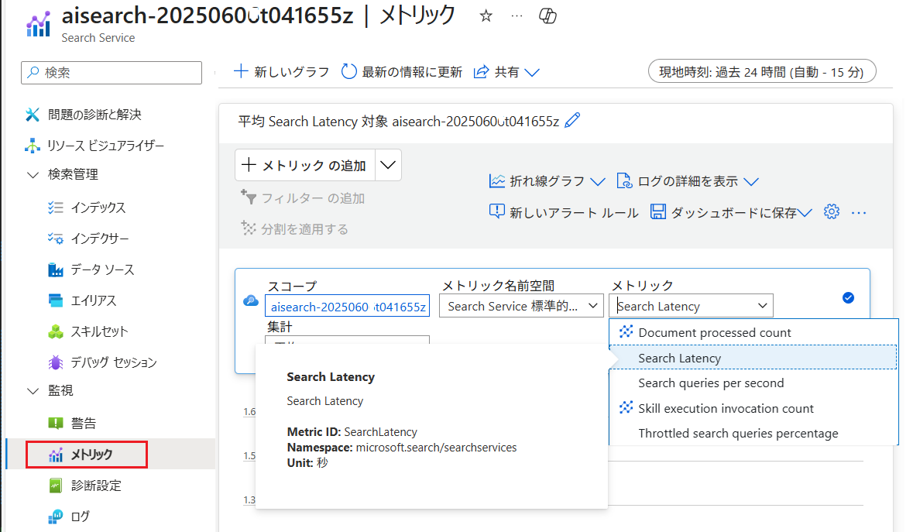

AI Search を RAG のデータソースとして使用する、この演習用アプリケーションを監視する場合に設定するメトリックの例としては、以下のようなものが考えられます。


#### 📈 Azure AI Search 監視メトリック例

| メトリック名 | 説明 | 単位 | 集計 |
|---|---|---|---|
| **SearchLatency** | 検索クエリの平均待機時間 | 秒 | 平均 |
| **SearchQueriesPerSecond** | 1 秒あたりの検索クエリ数（QPS） | カウント/秒 | 平均 |
| **SkillExecutionCount** | スキルセットの実行回数 | カウント | 合計・カウント |
| **ThrottledSearchQueriesPercentage** | スロットルされた検索クエリの割合 | パーセント | 平均 |
| **DocumentsProcessedCount** | インデクサーが処理したドキュメント数 | カウント | 合計・カウント |

#### 監視対象としてのポイント

* **SearchLatency** が高い場合、検索パフォーマンスの低下が疑われます。
* **ThrottledSearchQueriesPercentage** が上昇している場合、リソース不足や負荷過多の兆候の可能性があります。
* **DocumentsProcessedCount** はインデックス更新の正常性を確認する指標です。
* **SearchQueriesPerSecond** はトラフィック量の把握に有効で、急激な増加は負荷対策の検討材料になります。
* **SkillExecutionCount** は AI スキルの利用状況を把握するのに役立ちます。

AI Search でメトリック アラートに設定可能なメトリックの詳細については以下のドキュメントをご参照ください。ただし、日本語版では、メトリック名まで翻訳されてしまっているため、英語版のドキュメントと照らし合わせてご確認ください。

* [**Azure Monitor のサポートされるメトリック**](https://learn.microsoft.com/ja-jp/azure/azure-monitor/reference/metrics-index#supported-metrics-per-resource-type) (日本語)
* [**Supported metrics with Azure Monitor**](https://learn.microsoft.com/en-us/azure/azure-monitor/reference/supported-metrics/microsoft-search-searchservices-metrics) (英語)
* [**Azure AI 検索の監視データのリファレンス**](https://learn.microsoft.com/ja-jp/azure/search/monitor-azure-cognitive-search-data-reference) (日本語)
* [**Azure AI Search monitoring data reference**](https://learn.microsoft.com/en-us/azure/search/monitor-azure-cognitive-search-data-reference) (英語)

なお、Azure AI Search でのクエリ要求を監視する方法についての詳細は以下のドキュメントをご参照ください。

* [**Azure AI Search でクエリ要求を監視する**](https://learn.microsoft.com/ja-jp/azure/search/search-monitor-queries)


<br>


## 4. Azure Storage アカウントでのメトリック アラートの設定

Azure OpenAI サービスでのメトリック アラートの設定方法は App Service と同様です。

ただし、選択できるメトリックの種類は Storage アカウントに特化したものを選択することができます。

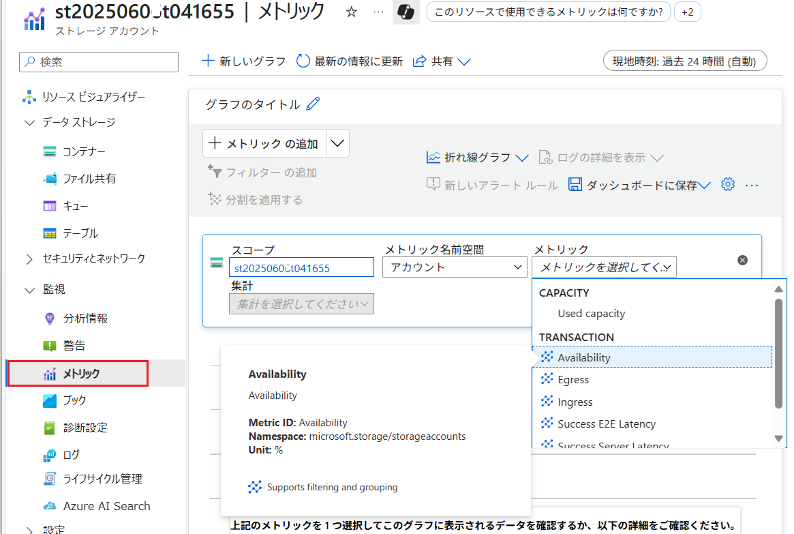


Storage アカウントでメトリック アラートに設定可能なメトリックの詳細については以下のドキュメントをご参照ください。ただし、日本語版では、メトリック名まで翻訳されてしまっているため、英語版のドキュメントと照らし合わせてご確認ください。

* [**Microsoft.Storage/storageAccounts でサポートされているメトリック**](https://learn.microsoft.com/ja-jp/azure/azure-monitor/reference/supported-metrics/microsoft-storage-storageaccounts-metrics) (日本語)
* [**Supported metrics for Microsoft.Storage/storageAccounts**](https://learn.microsoft.com/en-us/azure/azure-monitor/reference/supported-metrics/microsoft-storage-storageaccounts-metrics) (英語)
* [**Azure Blob Storage 監視データのリファレンス**](https://learn.microsoft.com/ja-jp/azure/storage/blobs/monitor-blob-storage-reference) (日本語)
* [**Azure Blob Storage Monitoring Data Reference**](https://learn.microsoft.com/en-us/azure/storage/blobs/monitor-blob-storage-reference) (英語)

## 次へ

👉　[**演習 3-3-2 : Log Analytics を使用したログの分析**](Ex03-3-2.md)

---

👈　[演習 3-3 : 高度なログ監視](Ex03-3.md)

🏚️　[README に戻る](README.md)

