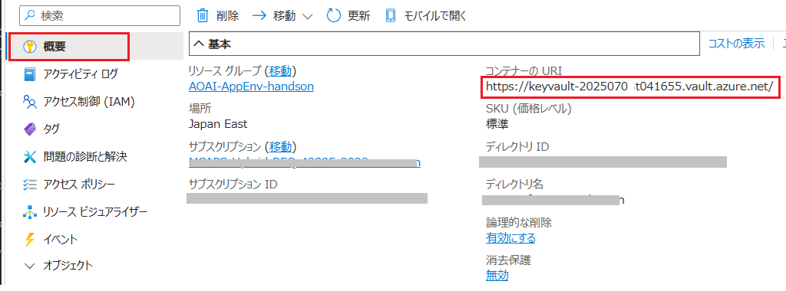
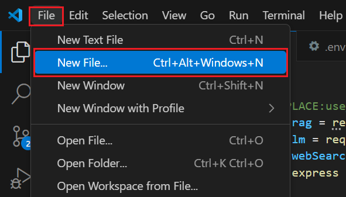
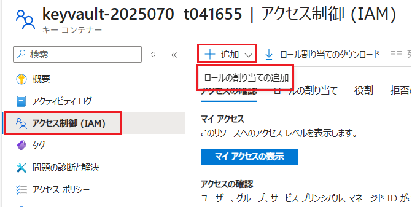
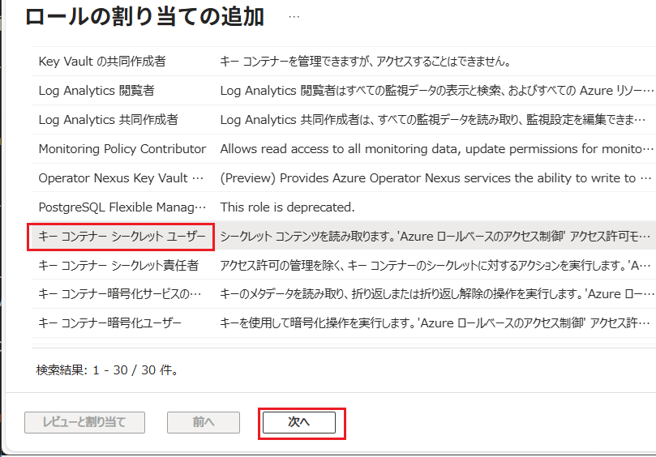

# 演習 4-1 : Key Vault へのキーの登録と利用

Azure Key Vault を使用して、演習用アプリケーションが使用する API キーを暗号化して保持し、参照する際には Azure EntraID のクレデンシャルを使用してアクセスする方法を説明します。

この演習で実施する作業は以下のとおりです。

1. Azure Key Vault の作成とAPI キーの登録
2. アプリケーションからの Key Vault へのアクセス
   * アプリケーション コードの変更
   * 開発ユーザーの Key Vault へのアクセス許可設定
   * 開発環境での動作確認
3. App Service での動作確認
   * App Service から Key Vault へのアクセス許可設定
   * アプリケーションの際デプロイと動作確認
  
なお、この演習では開発環境で Azure CLI を使用しますので、事前に [Azure CLI のインストール](https://learn.microsoft.com/ja-jp/cli/azure/install-azure-cli?view=azure-cli-latest) を実施しておいてください。

<br>

## 演習 4-1-1 : Azure Key Vault の作成とAPI キーの登録

Azure Key Vault リソースを作成し、演習用アプリケーションが使用している OpenAI サービスと AI Search の API キーを登録します。

具体的な手順は以下のとおりです。

[**手順**]


1. [Azure Portal](http://portal.azure.com) にログインします。

2. ポータル画面上部の \[**+**\] リソースの作成 アイコンか、表示されていない場合は画面左上のハンバーガーメニューをクリックし、\[**リソースの作成**\] をクリックします

    

3. \[**リソースの作成**\] 画面に遷移するので、検索ボックスに `Key Vault` と入力し、表示された検索結果の \[**Key Vault**\] のタイルをクリックします

    

4. \[**Key Vault**\] の画面に遷移するので、\[**作成**\] ボタンをクリックします

5. \[**キー コンテナーの作成**\] 画面に遷移するので、各項目を以下のように設定し、画面下部の \[**確認および作成**\] ボタンをクリックします

    | 項目 | 設定値 |
    |---|---|
    | サブスクリプション　| お使いのサブスクリプション |
    | リソース グループ | \[**AOAI-AppEnv-handson**\] |
    | Key Vault 名\* | `keyvault-<random>` |
    | 地域\* | \[**Japan East**\] |
    | 価格レベル\* | \[**標準**\] |
    | 論理的な削除| *既定のまま* |
    | 削除されたコンテナーを保持する日数\* | *既定のまま* |
    | 消去保護\* | *既定のまま* |

    

    \[**確認および作成**\] ボタンをクリックし\[**作成**\] ボタンが表示されたらクリックします。

6. デプロイが完了すると \[**リソースに移動**\] ボタンが表示されるのでクリックし、作成した Key Vault のリソース画面に移動します

    作成された Key Vault に Azure OpenAI サービス、Azure AI Search サービスの API キーをシークレットとして登録します。

7. 画面左のメニューから \[オブジェクト\] - \[**シークレット**\] を選択し、遷移した画面上部の \[**+ 生成/インポート**\] ボタンをクリックします

    

8. \[**シークレットの作成**\] 画面に遷移するので、各項目を以下のように設定します

    ここでは Azure OpenAI サービスの API キーを登録します。

    | 項目 | 設定値 |
    |---|---|
    | アップロード オプション| \[手動\] |
    | 名前 \* | `handsonBot-llm-key` |
    | シークレット値 \* | `<%Azure OpenAI サービスの API キー%>` |
    | コンテンツの種類 | `API Key` |
    | アクティブ化する日を設定する| *既定のまま* |
    | 有効期限を設定する| *既定のまま* |
    | 有効| **はい** |
    | タグ| *既定のまま* |

    

    設定が完了したら画面下部の \[**作成**\] ボタンをクリックします

9. 遷移先の画面で再度、画面上部の \[**+ 生成/インポート**\] ボタンをクリックし、前の手順で同様に Azure AI Search の API キーも登録します

    各項目を以下のように設定します。

    | 項目 | 設定値 |
    |---|---|
    | アップロード オプション| \[手動\] |
    | 名前 \* | `handsonBot-search-key` |
    | シークレット値 \* | `<%Azure AI Search の 管理者キー%>` |
    | コンテンツの種類 | `API Key` |
    | アクティブ化する日を設定する| *既定のまま* |
    | 有効期限を設定する| *既定のまま* |
    | 有効| **はい** |
    | タグ| *既定のまま* |

    設定が完了したら画面下部の \[**作成**\] ボタンをクリックします

10. \[**シークレット**\] 画面に遷移するので、登録したシークレットが表示されることを確認します

    

    リストされたシークレットの名前をクリックするとシークレットの詳細画面に遷移するので、正しく内容が登録されていることを確認してください。

11. 画面左のメニューから \[**概要**\] を選択し、遷移した画面内の \[**コンテナーの URI**\] の URL をメモ帳などに貼り付けて保持しておきます

    

ここまでの作業で、Azure Key Vault の作成と API キーの登録、コンテナーの URI の取得が完了しました。

<br>

## 演習 4-1-2 : アプリケーションからの Key Vault へのアクセス

前のセクションで作成した Azure Key Vault に登録した API キーを、開発環境の演習用アプリケーションから参照できるようにします。

これにはアプリケーションのコードを変更するとともに、アプリケーションのコード実行時に使用する Azure Entra ID のユーザーに Key Vault へのアクセス権を付与する必要があります。

なお、ローカル開発環境の演習用アプリケーションのプロジェクトは、[演習 4-2 : マネージド ID によるサービス間認証](Ex04-2.md) では全く異なる編集を追加するので、ここでの作業は**現在のプロジェクトをコピーし、コピーしたものを使用してください**。

<br>

### ⌨️ アプリケーション コードの変更 

Azure Key Vault からシークレットを取得するための以下のモジュールをインストールし、各モジュールが提供するメソッドを使用したコードを記述します。

* [Azure Key Vault Key client library for JavaScript](https://www.npmjs.com/package/@azure/keyvault-keys)
* [Azure Key Vault Secret client library for JavaScript](https://www.npmjs.com/package/@azure/keyvault-secrets)
* [Azure Identity client library for JavaScript](https://www.npmjs.com/package/@azure/identity)

具体的な手順は以下のとおりです。

[**手順**]

1. Visual Studio Code で、演習用アプリケーションのプロジェクトを開きます

2. Azure Key Vault へのアクセスを行うためのライブラリをインストールします
   
   Visual Studio Code の \[View\] - \[Terminal\] をクリックし、表示されたターミナル ウィンドウで以下のコマンドを順に実行します。

    ```bash
    npm install @azure/keyvault-keys
    npm install @azure/keyvault-secrets
    npm install @azure/identity
    ```
3. プロジェクト内の **.env** ファイルを開き、以下の 3 つの環境変数を設定します

    | 環境変数名 | 説明 |
    |---|---|
    | KEY_VAULT_ENDPOINT | Azure Key Vault のエンドポイント URL を記述|
    | KEY_VAULT_SECRET_LLM | `handsonBot-llm-key` |
    | KEY_VAULT_SECRET_SEARCH | `handsonBot-search-key` |

    ```env
    #Azure Key Vault リソースへの接続情報
    KEY_VAULT_ENDPOINT= ここに Azure KeyVault のコンテナーの URI を記述 
    KEY_VAULT_SECRET_LLM=handsonBot-llm-key
    KEY_VAULT_SECRET_SEARCH=handsonBot-search-key
    ```

    変数 **KEY_VAULT_ENDPOINT** には前の作業でメモ帳等に保持した Key Vault のコンテナーの URI を設定してください。

4. Visual Studio Code のメニュー \[File\] - \[New File...\] をクリックし、 `keymgr.js` という名前で新しいファイルをプロジェクトのルート ディレクトリに追加します

    

5. 作成した **keymgr.js** ファイルに以下のコードを貼り付けます

    ```JavaScript
    const { DefaultAzureCredential } = require('@azure/identity');
    const { SecretClient } = require('@azure/keyvault-secrets');
    const dotenv = require('dotenv');
    dotenv.config();
    // Key Vault のエンドポイント（Azure ポータルの「コンテナーの URI」）
    const keyVaultUrl = process.env['KEY_VAULT_ENDPOINT'];
    const llmSecretName = process.env['KEY_VAULT_SECRET_LLM'];
    const SearchSecretName = process.env['KEY_VAULT_SECRET_SEARCH'];

    // 認証情報を取得（Azure CLI ログイン済み、またはマネージド ID を使用）
    const credential = new DefaultAzureCredential();

    // シークレットクライアントを作成
    const client = new SecretClient(keyVaultUrl, credential);

    // シークレット名を指定して取得
    async function getSecret(secretName) {
        try {
            const secret = await client.getSecret(secretName);
            console.log(`Read secret:${secretName} from KeyVault`);
            return secret.value;
        } catch (err) {
            console.error(`Can't read secret:${secretName} from KeyVault. Reason : ${err.message}`);
            return null;
        }
    }

    async function setSecretEnv() {
        process.env.AZURE_OPENAI_API_KEY = await getSecret(llmSecretName);
        process.env.SEARCH_API_KEY = await getSecret(SearchSecretName);
    }

    //他のファイルから呼び出せるようにエクスポート
    module.exports = { setSecretEnv };

    
    //Key Vault からシークレットを取得して環境変数に設定したのを確認するテストコード
    setSecretEnv().then(() => {
        console.log('AZURE_OPENAI_API_KEY:' + process.env.AZURE_OPENAI_API_KEY);
        console.log('SEARCH_API_KEY:' + process.env.SEARCH_API_KEY);
    }).catch(err => {
        console.error("Error setting environment variables from Key Vault:", err);
    });
    ```

    キーボードの \[Ctrl\] + \[S\] を押下押してファイルを保存します。

ここまでの作業で、Azure Key Vault からシークレットを取得し、環境変数に設定するコードが完成しました。

しかし、このコードを実行するには、コードを実行するユーザーに Key Vault へのアクセス権を付与する必要があります。次のセクションでその手順を説明します。

<br>


### 開発ユーザーの Key Vault へのアクセス許可設定

ローカル開発環境で実行されている演習用アプリケーションから Azure Key Vault にアクセスするためのアクセス許可設定を行います。

この手順では開発作業を行っているユーザー アカウントに対して Key Vault へのアクセス権を付与します。

具体的な手順は以下のとおりです。

[**手順**]

1. Visual Studio Code から Azure にログインし、ログインしたユーザーの情報を確認します

    Visual Studio Code のターミナルで以下のコマンドを実行します。
    
    ```bash
    az login
    ```
    ログイン画面が表示され、Azure へのログインを求められるので指示に従ってログインしてください。ログインが完了したら、以下のコマンドを実行してログインしたユーザーの情報をメモ帳等で保持します。

    ```bash
    az account show
    ```

    この情報を使用して現在のユーザーアカウントに対し Key Vault へのアクセス権を付与します。

2. [Azure ポータル](https://portal.azure.com/)にログインして、前のセクションで作成した Key Vault のリソース画面を表示します
   
   画面左のメニューから \[**アクセス制御 (IAM)**\] をクリックし、 遷移した画面の上部にある \[**+ 追加**\] - \[**ロールの割り当ての追加**\] をクリックします

    

3. \[**ロール割り当ての追加**\] 画面の \[ロール\]タブに遷移し、ロールの一覧が表示されるので、\[**キー コンテナー シークレット ユーザー**\] を選択し、画面下部の \[**次へ**\] ボタンをクリックします

    

5. \[**メンバー**\] タブの画面に遷移するので、オプションボタン \[**アクセスの割り当て先**\] にチェックが付いた状態で、\[**+ メンバーを選択する**\] リンクをクリックします

    

6. 画面右に\[**メンバーを選択する**\] ブレードが表示されるので、前の手順でメモ帳等に保持したログインユーザーのメールアドレスを検索ボックスに入力し、表示されたユーザーを選択して画面下部の \[**選択**\] ボタンをクリックします

7. ブレードが閉じるので画面下部の \[**レビューと割り当て**\] ボタンをクリックします

これで、現在 Visual Studio Code で作業しているユーザーに Key Vault のシークレットへのアクセス権が付与されました。

<br>

### 開発環境での動作確認

開発環境の演習用アプリケーションに追加したコードを実行し、Azure Key Vault に登録した API キーを参照できることを確認します。

具体的な手順は以下のとおりです。

[**手順**]

1. ローカル開発環境の Visual Studio Code のターミナル画面で以下のコマンドを実行し、**keymgr.js** のコードが正しく動作することを確認します

    ```bash
    node keymgr.js
    ```

    正しく動作するとターミナル画面に AZURE_OPENAI_API_KEY と SEARCH_API_KEY の値が表示されます。

2. **keymgr.js** のコードが正しく動作したことを確認したら同ファイル内のテスト用コードを以下のようにコメントアウトするか削除します

    ```JavaScript
    //Key Vault からシークレットを取得して環境変数に設定したのを確認するテストコード
    /*
    setSecretEnv().then(() => {
        console.log('AZURE_OPENAI_API_KEY:' + process.env.AZURE_OPENAI_API_KEY);
        console.log('SEARCH_API_KEY:' + process.env.SEARCH_API_KEY);
    }).catch(err => {
        console.error("Error setting environment variables from Key Vault:", err);
    });
    */
    ```
    キーボードの \[Ctrl\] + \[S\] を押下押してファイルを保存します。

3. **keymgr.js** のコードを演習用アプリケーションにマージします

    プロジェクト内の **app.js** ファイルを開き、ファイルの先頭にあるコメント `//[REPLACE:use_keyVault]` を以下のコードに置き換えます

    ```JavaScript
    //Azure KeyVault からシークレットを取得して環境変数に設定(EntraID 使用の際は削除)
    const keyManager = require('./keymgr.js');
    keyManager.setSecretEnv();
    //---
    ```

    キーボードの \[Ctrl\] + \[S\] を押下押してファイルを保存します。

4. プロジェクト内の **.env** ファイルを開き、環境変数 `AZURE_OPENAI_API_KEY` と `SEARCH_API_KEY` の行を削除するかコメントアウトします

    ```env
   
    #AZURE_OPENAI_API_KEY= ここに Azure OpenAI サービスの API キーを記述 
    #Azure AI Search の 管理者キー
    #SEARCH_API_KEY= ここに Azure AI Search の 管理者キーを記述 
    ```

    キーボードの \[Ctrl\] + \[S\] を押下押してファイルを保存します。

5. Visual Studio Code のターミナルで以下のコマンドを実行し、演習用アプリケーションが正しく動作することを確認します

    ```bash
    npm start
    ```
    なお、ターミナル画面に以下の表示が出力されるのを待ってからブラウザで `http://localhost:3000` にアクセスしてください。

    ```
    Server is running on http://localhost:3000
    ```

6. 演習用アプリケーションの画面が表示されたら、チャット画面で質問を入力し、Azure OpenAI サービスと Azure AI Search が正しく動作することを確認します

ここまでの作業で、開発環境の演習用アプリケーションから Azure Key Vault に登録した API キーを参照できるようになりました。

デプロイした App Service でも同様に Key Vault から API キーを参照できるようにするにはコードの変更は不要ですが、App Service の実行に使用する ID に Key Vault へのアクセス権を付与する必要があります。これについては次の演習で説明します。

<br>

