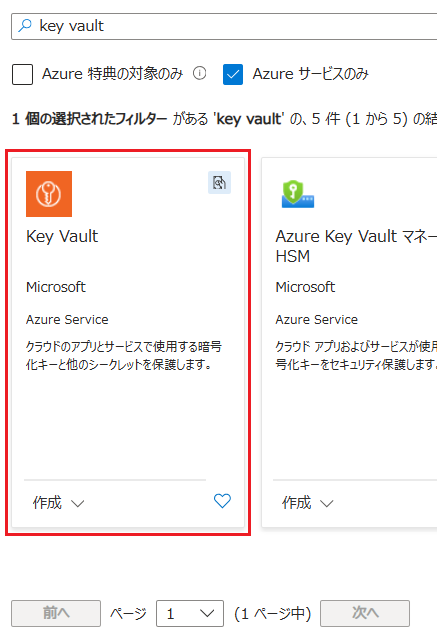
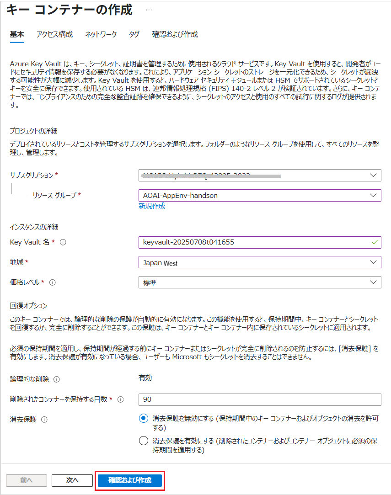
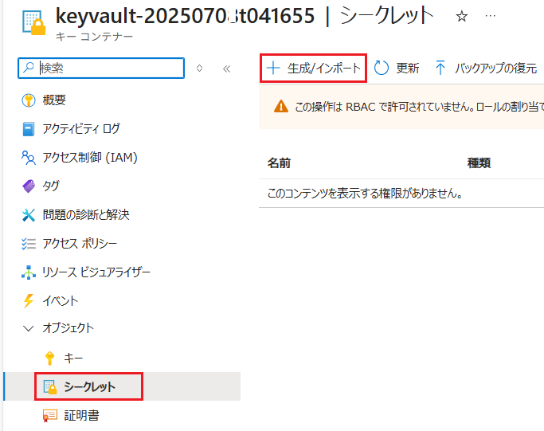
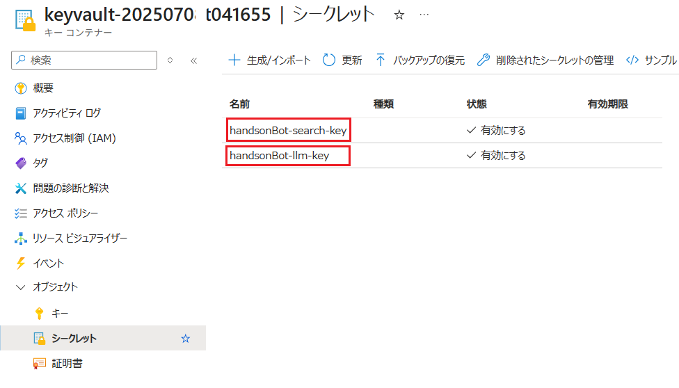

# 演習 4-1 : Key Vault へのキーの登録と利用

Azure Key Vault を使用して、演習用アプリケーションが使用する API キーを暗号化して保持し、参照する際には Azure EntraID のクレデンシャルを使用してアクセスする方法を説明します。

この演習で実施する作業は以下のとおりです。

1. Azure Key Vault の作成とAPI キーの登録
2. アプリケーションからの Key Vault へのアクセス
   * アプリケーション コードの変更
   * 開発ユーザーの Key Vault へのアクセス許可設定
   * 開発環境での動作確認
3. App Service での動作確認
   * App Service から Key Vault へのアクセス許可設定
   * アプリケーションの際デプロイと動作確認
  
なお、この演習では開発環境で Azure CLI を使用しますので、事前に [Azure CLI のインストール](https://learn.microsoft.com/ja-jp/cli/azure/install-azure-cli?view=azure-cli-latest) を実施しておいてください。

 

## 演習 4-1-1 : Azure Key Vault の作成とAPI キーの登録

Azure Key Vault リソースを作成し、演習用アプリケーションが使用している OpenAI サービスと AI Search の API キーを登録します。

具体的な手順は以下のとおりです。

[**手順**]

1. [Azure Portal](http://portal.azure.com) にログインします。

2. ポータル画面上部の \[**+**\] リソースの作成 アイコンか、表示されていない場合は画面左上のハンバーガーメニューをクリックし、\[**リソースの作成**\] をクリックします

    

3. \[**リソースの作成**\] 画面に遷移するので、検索ボックスに `Key Vault` と入力し、表示された検索結果の \[**Key Vault**\] のタイルをクリックします

    

4. \[**Key Vault**\] の画面に遷移するので、\[**作成**\] ボタンをクリックします

5. \[**キー コンテナーの作成**\] 画面に遷移するので、各項目を以下のように設定し、画面下部の \[**確認および作成**\] ボタンをクリックします

    | 項目 | 設定値 |
    |---|---|
    | サブスクリプション　| お使いのサブスクリプション |
    | リソース グループ | \[**AOAI-AppEnv-handson**\] |
    | Key Vault 名\* | `keyvault-<random>` |
    | 地域\* | \[**Japan East**\] |
    | 価格レベル\* | \[**標準**\] |
    | 論理的な削除| *既定のまま* |
    | 削除されたコンテナーを保持する日数\* | *既定のまま* |
    | 消去保護\* | *既定のまま* |

    

    \[**確認および作成**\] ボタンをクリックし\[**作成**\] ボタンが表示されたらクリックします。

6. デプロイが完了すると \[**リソースに移動**\] ボタンが表示されるのでクリックし、作成した Key Vault のリソース画面に移動します

    作成された Key Vault に Azure OpenAI サービス、Azure AI Search サービスの API キーをシークレットとして登録します。

7. 画面左のメニューから \[オブジェクト\] - \[**シークレット**\] を選択し、遷移した画面上部の \[**+ 生成/インポート**\] ボタンをクリックします

    

8. \[**シークレットの作成**\] 画面に遷移するので、各項目を以下のように設定します

    ここでは Azure OpenAI サービスの API キーを登録します。

    | 項目 | 設定値 |
    |---|---|
    | アップロード オプション| \[手動\] |
    | 名前 \* | `handsonBot-llm-key` |
    | シークレット値 \* | `<%Azure OpenAI サービスの API キー%>` |
    | コンテンツの種類 | `API Key` |
    | アクティブ化する日を設定する| *既定のまま* |
    | 有効期限を設定する| *既定のまま* |
    | 有効| **はい** |
    | タグ| *既定のまま* |

    

    設定が完了したら画面下部の \[**作成**\] ボタンをクリックします

9. 遷移先の画面で再度、画面上部の \[**+ 生成/インポート**\] ボタンをクリックし、前の手順で同様に Azure AI Search の API キーも登録します

    各項目を以下のように設定します。

    | 項目 | 設定値 |
    |---|---|
    | アップロード オプション| \[手動\] |
    | 名前 \* | `handsonBot-search-key` |
    | シークレット値 \* | `<%Azure AI Search の 管理者キー%>` |
    | コンテンツの種類 | `API Key` |
    | アクティブ化する日を設定する| *既定のまま* |
    | 有効期限を設定する| *既定のまま* |
    | 有効| **はい** |
    | タグ| *既定のまま* |

    設定が完了したら画面下部の \[**作成**\] ボタンをクリックします

10. \[**シークレット**\] 画面に遷移するので、登録したシークレットが表示されることを確認します

    

    リストされたシークレットの名前をクリックするとシークレットの詳細画面に遷移するので、正しく内容が登録されていることを確認してください。

ここまでの作業で、Azure Key Vault の作成と API キーの登録が完了しました。

 

## 演習 4-1-2 : アプリケーションからの Key Vault へのアクセス

前のセクションで作成した Azure Key Vault に登録した API キーを、開発環境の演習用アプリケーションから参照できるようにします。

これにはアプリケーションのコードを変更するとともに、アプリケーションのコード実行時に使用する Azure Entra ID のユーザーに Key Vault へのアクセス権を付与する必要があります。