# 演習 4-2 : マネージド ID によるサービス間認証

ここまでの作業で、演習用アプリケーションは Azure OpenAI と Azure AI Search に接続する際の認証情報として API キーを使用していました。演習 4-1 では、これを安全に管理するための Azure Key Vault の利用する方法について学びましたが、"認証に API キーを使用する" という点では同じです。より安全に Azure サービス間の認証を行うもう一つの方法として、Azure の[マネージド ID](https://learn.microsoft.com/ja-jp/entra/identity/managed-identities-azure-resources/overview) を利用する方法があります。

**マネージド ID とは**

マネージド ID は、Azure コンピューティング リソースに対して Azure AD による ID を自動的に割り当て、Azure リソースへの認証を簡素化する機能です。マネージド ID を使用すると、アプリケーション コード内で資格情報を管理する必要がなくなり、セキュリティが向上します。

この演習では、Azure App Service にシステム割り当てマネージド ID を有効化し、その ID に対して Azure OpenAI と Azure AI Search へのアクセス権を付与し、アプリケーションからそれらのサービスに接続する方法を説明します。

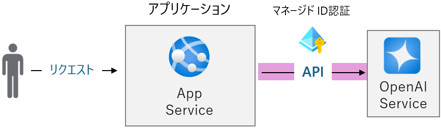

この演習で実施する作業は以下のとおりです。

1. [OpenAI サービス、AI Search へのアクセス許可設定(開発ユーザー)](#%E3%82%BF%E3%82%B9%E3%82%AF-1--openai-%E3%82%B5%E3%83%BC%E3%83%93%E3%82%B9ai-search-%E3%81%B8%E3%81%AE%E3%82%A2%E3%82%AF%E3%82%BB%E3%82%B9%E8%A8%B1%E5%8F%AF%E8%A8%AD%E5%AE%9A%E9%96%8B%E7%99%BA%E3%83%A6%E3%83%BC%E3%82%B6%E3%83%BC)
2. [演習用アプリケーションのコードの変更](#%E3%82%BF%E3%82%B9%E3%82%AF-2--%E3%82%A2%E3%83%97%E3%83%AA%E3%82%B1%E3%83%BC%E3%82%B7%E3%83%A7%E3%83%B3-%E3%82%B3%E3%83%BC%E3%83%89%E3%81%AE%E5%A4%89%E6%9B%B4)
3. [OpenAI サービス、AI Search へのアクセス許可設定(App Service)](#%E3%82%BF%E3%82%B9%E3%82%AF-3--openai-%E3%82%B5%E3%83%BC%E3%83%93%E3%82%B9ai-search-%E3%81%B8%E3%81%AE%E3%82%A2%E3%82%AF%E3%82%BB%E3%82%B9%E8%A8%B1%E5%8F%AF%E8%A8%AD%E5%AE%9Aapp-service)
4. [アプリケーションのデプロイと動作確認](#%E3%82%BF%E3%82%B9%E3%82%AF-4--%E3%82%A2%E3%83%97%E3%83%AA%E3%82%B1%E3%83%BC%E3%82%B7%E3%83%A7%E3%83%B3%E3%81%AE%E3%83%87%E3%83%97%E3%83%AD%E3%82%A4%E3%81%A8%E5%8B%95%E4%BD%9C%E7%A2%BA%E8%AA%8D)

<br>

## 1 : OpenAI サービス、AI Search へのアクセス許可設定(開発ユーザー)

ローカル開発環境で実行する演習用アプリケーションから、 Azure OpenAI サービスと Azure AI Search にアクセスするためのアクセス許可設定を行います。

具体的な手順は以下のとおりです。

\[**手順**▶️\]

1. Visual Studio Code から Azure にログインし、ログインしたユーザーの情報を確認します

    Visual Studio Code のメニュー \[View\] - \[Terminal\] をクリックし、表示されたターミナル ウィンドウで以下のコマンドを実行します。

    ```bash
    az login
    ```
    ログイン画面が表示され、Azure へのログインを求められるので指示に従ってログインしてください。ログインが完了したら、以下のコマンドを実行してログインしたユーザーの情報をメモ帳等で保持します。

    ```bash
    az account show
    ```

    この情報を使用して現在のユーザーアカウントに対して演習用アプリケーションが使用している Azure OpenAI Key Vault へのアクセス権を付与します。

2. [Azure ポータル](https://portal.azure.com/)にログインして、演習用アプリケーションが使用している Azure OpenAI サービスのプロパティ画面を開き、画面左のメニューから \[**アクセス制御(IAM)**\] を選択し、\[**+ 追加**\] - \[**ロールの割り当て**\] をクリックします

    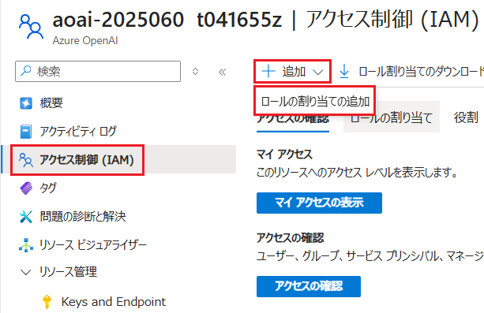

3. \[**ロール割り当ての追加**\] 画面の \[ロール\]タブに遷移し、ロールの一覧が表示されるので、\[**Cognitive Services OpenAI User**\] を選択し、画面下部の \[**次へ**\] ボタンをクリックします

    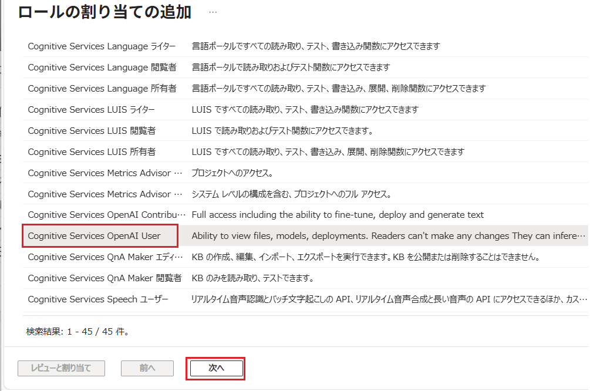

4. \[**メンバー**\] タブの画面に遷移するので、オプションボタン \[アクセスの割り当て先\] で \[**ユーザー、グループ、またはサービス プリンシパル**\] にチェックが付いた状態で、\[**+ メンバーを選択する**\] リンクをクリックします

    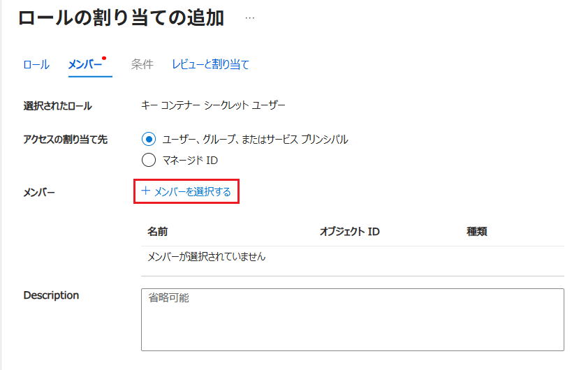

5. 画面右に\[**メンバーを選択する**\] ブレードが表示されるので、前の手順でメモ帳等に保持したログインユーザーのメールアドレスを検索ボックスに入力し、表示されたユーザーを選択して画面下部の \[**選択**\] ボタンをクリックします

6. ブレードが閉じるので画面下部の \[**レビューと割り当て**\] ボタンをクリックします

    ここまでの作業、現在 Visual Studio Code で作業しているユーザーに Azure OpenAI サービスの API へのアクセス権が付与されました。

7. 演習用アプリケーションが使用している Azure AI Search サービスのプロパティ画面を開き、ここまでの手順を参考に、Visual Studio Code で作業しているユーザーのアカウントに対しロールを割り当ててください。

    なお、Azure AI Search サービスで割り当てるロールは \[**検索インデックス データ閲覧者**\] です。

    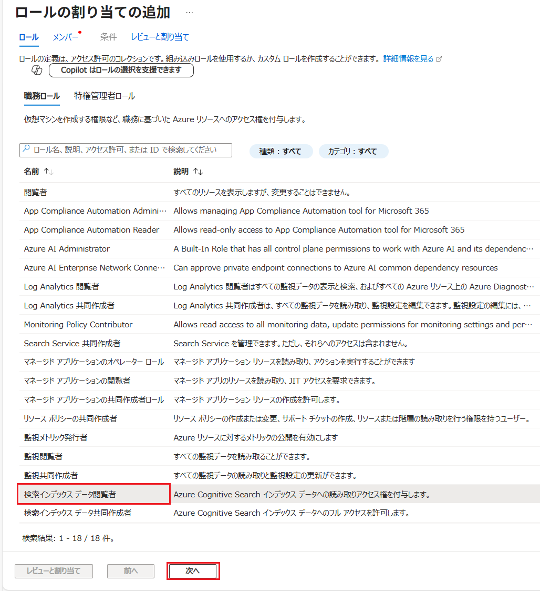

8. Azure AI Search 画面左のメニュー \[設定\] - \[**キー**\] をクリックします
   
   遷移した画面の項目 \[**API アクセス制御**\] で \[**両方**\] を選択し、「この検索サービスの API アクセス制御を更新しますか?」と表示されたら \[**はい**\] ボタンをクリックします。

   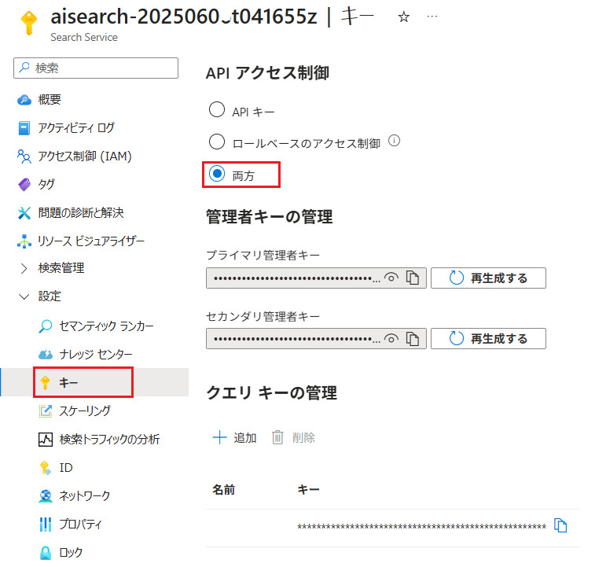

    この設定を行わないと、マネジメント ID を使用して Azure AI Search サービスにアクセスすることができませんので注意が必要です。

ここまでの作業で、Visual Studio Code で作業しているユーザーのアカウントに対し、OpenAI サービス、AI Search の機能にアクセスするためのロールを割り当てることができました。

<br>

## 2 : アプリケーション コードの変更 

Azure リソースにマネージド ID を利用したアクセスを行うための以下のモジュールをインストールし、モジュールが提供するメソッドを使用したコードを記述します。

* [Azure Identity client library for JavaScript](https://www.npmjs.com/package/@azure/identity)

なお、この変更は [演習 4-1-2 : アプリケーションからの Key Vault へのアクセス](Ex04-1.md#%E3%82%BF%E3%82%B9%E3%82%AF-2--%E3%82%A2%E3%83%97%E3%83%AA%E3%82%B1%E3%83%BC%E3%82%B7%E3%83%A7%E3%83%B3%E3%81%8B%E3%82%89%E3%81%AE-key-vault-%E3%81%B8%E3%81%AE%E3%82%A2%E3%82%AF%E3%82%BB%E3%82%B9) で**実施したコードの変更とは互換がありません**。もし、それ以前のプロジェクトをバックアップされている場合はそちらを使用してください。

具体的な手順は以下のとおりです。

\[**手順**▶️\]

1. Visual Studio Code で、演習用アプリケーションのプロジェクトを開きます

2. 演習用アプリケーションから へのアクセスを行うためのライブラリをインストールします
   
   Visual Studio Code の \[View\] - \[Terminal\] をクリックし、表示されたターミナル ウィンドウで以下のコマンドを順に実行します。

    ```bash
    npm install @azure/identity
    ```
3. プロジェクト内の **lm.js** ファイルを開き、ファイルの先頭にあるコメント `//[REPLACE:use_EntraID_authentication]` を以下のコードで置き換えます

    ```JavaScript
    const { 
    DefaultAzureCredential, 
    getBearerTokenProvider 
    } = require("@azure/identity");

    // keyless authentication    
    const credential = new DefaultAzureCredential();
    const scope = "https://cognitiveservices.azure.com/.default";
    const azureADTokenProvider = getBearerTokenProvider(credential, scope);
    ```
4. 同ファイル内の 76 行め付近にある以下のコメント下のコードを

    ```JavaScript
    //Azure OpenAI クライアントの初期化 (API キーを使用した認証)
    const client = new AzureOpenAI({ endpoint, apiKey, apiVersion, deployment });
    ```

    以下のコードで置き換えます

    ```JavaScript
    //Azure OpenAI クライアントの初期化 (Azure マネージド ID を使用した認証)
    const client = new AzureOpenAI({ endpoint, apiKey:'',azureADTokenProvider, deployment, apiVersion });
    ```

    キーボードの \[Ctrl\] + \[S\] を押下してファイルを保存します。

    もし、この手順の **lm.js** ファイルの変更方法がよくわからない場合は、以下のファイルをダウンロードして、ファイル名を `lm.js` に変更し、プロジェクト内の **lm.js** と置き換えてください。

    *[**マネージド ID 認証を使用する場合の lm.js**](assets/samples/managedID_lm.js)

5. プロジェクト内の **imgGen.js** ファイルを開き、ファイルの先頭にあるコメント `//[REPLACE:use_EntraID_authentication]` を以下のコードで置き換えます

    ```JavaScript
    const { 
        DefaultAzureCredential, 
        getBearerTokenProvider 
    } = require("@azure/identity");

    // keyless authentication    
    const credential = new DefaultAzureCredential();
    const scope = "https://cognitiveservices.azure.com/.default";
    const azureADTokenProvider = getBearerTokenProvider(credential, scope);
    ```

6. 同ファイル内の 33 行目付近にある以下のコメント下のコードを

    ```JavaScript
     //Azure OpenAI クライアントの初期化 (API キーを使用した認証)
    const client = new AzureOpenAI({ endpoint, apiKey, apiVersion, deployment: deploymentName });
    ```

    以下のコードで置き換えます

    ```JavaScript
    //Azure OpenAI クライアントの初期化 (Azure マネージド ID を使用した認証)
    const client = new AzureOpenAI({ endpoint, apiKey:'',azureADTokenProvider, deployment, apiVersion });
    ```

    キーボードの \[Ctrl\] + \[S\] を押下してファイルを保存します。

    もし、この手順の **imgGen.js** ファイルの変更方法がよくわからない場合は、以下のファイルをダウンロードして、ファイル名を `imgGen.js` に変更し、プロジェクト内の **imgGen.js** と置き換えてください。

    *[**マネージド ID 認証を使用する場合の imgGen.js**](assets/samples/managedID_imgGen.js)

7. プロジェクト内の **rag.js** ファイルを開き、ファイルの先頭にあるコメント `//[REPLACE:use_EntraID_authentication]` を以下のコードで置き換えます

    ```JavaScript
    const {
        DefaultAzureCredential,
        getBearerTokenProvider
    } = require("@azure/identity");

    // keyless authentication    
    const credential = new DefaultAzureCredential();
    const scope = "https://cognitiveservices.azure.com/.default";
    const azureADTokenProvider = getBearerTokenProvider(credential, scope);
    ```

8. 同ファイル内の 35 行目付近にある以下のコメント下のコードを

    ```JavaScript
    //埋め込みモデルのクライアントを作成 (API キーを使用した認証)
    const embeddingClient = new AzureOpenAI({ embedding_endpoint, embedding_apiKey, apiVersion, deployment: embedding_deployment });
    ```

    以下のコードで置き換えます

    ```JavaScript
    //埋め込みモデルのクライアントを作成  (Azure マネージド ID を使用した認証)
    const embeddingClient = new AzureOpenAI({ endpoint: embedding_endpoint, apiKey: '', azureADTokenProvider, deployment: embedding_deployment, apiVersion });
    ```

    続けて、ファイル内の 68 行目付近にある以下のコメント下のコードを

    ```JavaScript
     //Azure AI Search のクライアントを作成
    const searchClient = new SearchClient(search_endpoint, search_indexName, new AzureKeyCredential(search_apiKey));
    ```

    以下のコードで置き換えます

    ```JavaScript
    //Azure AI Search のクライアントを作成 (Azure マネージド ID を使用した認証)
    const searchClient = new SearchClient(search_endpoint, search_indexName, credential);
    ```

    キーボードの \[Ctrl\] + \[S\] を押下してファイルを保存します。

    もし、この手順の **rag.js** ファイルの変更方法がよくわからない場合は、以下のファイルをダウンロードして、ファイル名を `rag.js` に変更し、プロジェクト内の **rag.js** と置き換えてください。

    *[**マネージド ID 認証を使用する場合の imgGen.js**](assets/samples/managedID_rag.js)

9. もし、 [演習 4-1](Ex04-1.md) の作業によって、プロジェクト内の **app.js** ファイルの先頭のコードが**以下のように変更されている場合**は、

    ```JavaScript
    //Azure KeyVault を使用する場合
    let rag, lm, webSearch;
    const keyManager = require('./keymgr.js');
    (async () => {
        await keyManager.setSecret
        rag = require('./AOAI/rag.js');
        lm = require('./AOAI/lm.js');
        webSearch = require('./AOAI/webSearch.js')
    })();
    ```

    以下のコードに置き換えます

    ```JavaScript
    const rag = require('./AOAI/rag.js');
    const lm = require('./AOAI/lm.js');
    const webSearch = require('./AOAI/webSearch.js');
    ```
    キーボードの \[Ctrl\] + \[S\] を押下してファイルを保存します。

10. プロジェクト内の **.env** を開き、必要ない以下の環境変数設定を削除するか、先頭に `#` を付与してコメントアウトします

    ```.env
    #AZURE_OPENAI_API_KEY=xxxxxx
    #AZURE_SEARCH_API_KEY=xxxxxx
    ```

    [演習 4-1](Ex04-1.md) の作業で以下の環境変数を追加している場合は、同様に削除するか、先頭に `#` を付与してコメントアウトします

    ```.env
    #Azure Key Vault リソースへの接続情報
    KEY_VAULT_ENDPOINT=KeyVaultのエンドポイント
    KEY_VAULT_SECRET_LLM=handsonBot-llm-key
    KEY_VAULT_SECRET_SEARCH=handsonBot-search-key
    ```

    キーボードの \[Ctrl\] + \[S\] を押下してファイルを保存します。

11. Visual Studio Code のターミナルで以下のコマンドを実行し、演習用アプリケーションが正しく動作することを確認します

    ```bash
    az login
    npm start
    ```
    なお、ターミナル画面に以下の表示が出力されるのを待ってからブラウザで `http://localhost:3000` にアクセスしてください。

    ```
    Server is running on http://localhost:3000
    ```

12. 演習用アプリケーションの画面が表示されたら、チャット画面で質問を入力し、Azure OpenAI サービスと Azure AI Search が正しく動作することを確認します

    

    正しく動作しない場合は、Visual Studio Code のターミナルにエラーメッセージが表示されていないか確認してください。もし、エラーメッセージに `Tenant ID` という文字が含まれている場合は、以下のように `az login` コマンドに `--tenant` オプションを付与し、Azure で使用しているテナント ID を指定して再度ログインを試みてください。

    ```bash
    az login --tenant <Tenant ID>
    ```

ここまでの作業で、開発環境の演習用アプリケーションからマネージド ID を使用して Azure OpenAI サービス、Azure AI Search の API に参照できるようになりました。

デプロイした App Service でも同様にマネージド ID を使用して API を参照できるようにするにはコードの変更は不要ですが、App Service の実行に使用するマネージド ID に Azure OpenAI サービス、Azure AI Search へのアクセス権を付与する必要があります。これについては次の演習で説明します。

<br>

### 3 : OpenAI サービス、AI Search へのアクセス許可設定(App Service) 

ローカルの開発環境で動作確認ができたら、演習用アプリケーションをデプロイする App Service から OpenAI サービスと Azure AI Search にアクセスするためのアクセス許可設定を行います。

これには App Service のシステム割り当てマネージド ID に対して OpenAI サービスと Azure AI Search へのアクセス権を付与します。

なお、ここまでの演習の手順に従えば、ローカル開発環境からのデプロイは GitHub のリポジトリを介して自動的に staging のデプロイ スロットに対して行われるようになっています。

よってここでの手順は、staging(待機) スロットに対して行います。

具体的な手順は以下のとおりです。

\[**手順**▶️\]

1. [Azure ポータル](http://portal.azure.com)で、演習用アプリケーションの **staging の** App Service のリソース画面を表示します

2. 画面左のメニューから \[設定\]-\[**ID**\] をクリックし、遷移した画面の \[システム割り当て済み\] タブの \[**状態**\] のトグル スイッチ \[**オン**\] になっていることを確認します
   
    もし \[オフ\] の場合は、\[**オン**\] にし、画面上部の \[**保存**\] ボタンをクリックします。

    

    「システム割り当てマネージド ID を有効化する」というメッセージが表示されるので \[**はい**\] ボタンをクリックします。

3. この演習で使用している Azure OpenAI サービスのプロパティ画面を開きます
   
   画面左のメニューから \[**アクセス制御(IAM)**\] を選択し、遷移した画面上の \[**+ 追加**\] - \[**ロールの割り当て**\] をクリックします

    

4. \[**ロール割り当ての追加**\] 画面の \[ロール\]タブに遷移し、ロールの一覧が表示されるので、\[**Cognitive Services OpenAI User**\] を選択し、画面下部の \[**次へ**\] ボタンをクリックします

    

5. \[**メンバー**\] タブの画面に遷移するので、オプションボタン \[アクセスの割り当て先\] で \[**マネージド ID**\] にチェックが付いた状態で、\[**+ メンバーを選択する**\] リンクをクリックします

    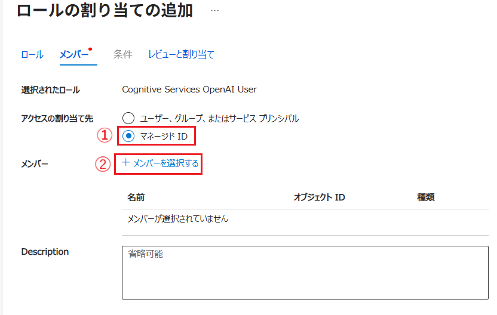

6. 画面右に\[**メンバーを選択する**\] ブレードが表示されるので、同ブレード内の \[マネージド ID\] で \[**App Service (スロット)**\] を選択します
   
   その下に、同じサブスクリプション内でマネージド ID が有効化されている App Service の **production(運用) 以外の**スロットの一覧が表示されるので、演習用アプリケーションの **staging** スロットの App Service を選択します。

    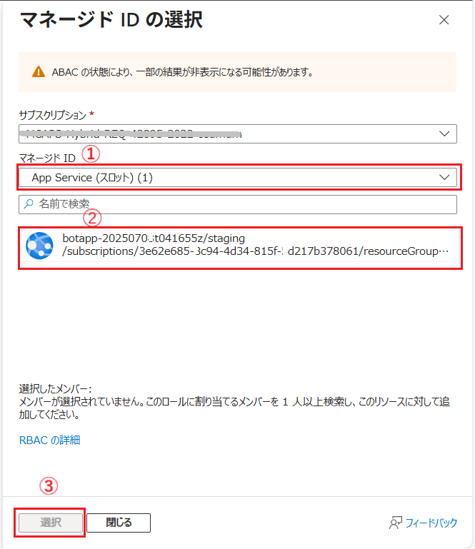

    各項目を設定したら画面下部の \[**選択**\] ボタンをクリックします。

    ブレードが閉じて、元の画面に戻りますが、再度\[**+ メンバーを選択する**\] リンクをクリックし、 App Service の **production** スロットの App Service に対しても同様にロールを割り当ててください。これはスワップ後もアプリケーションが正しく動作するようにするためです。

    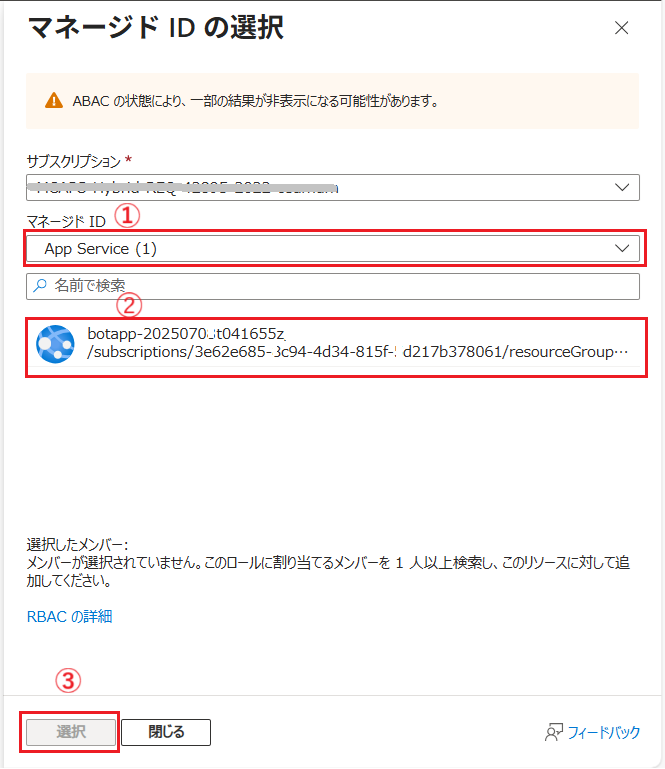

7. App Service の staging スロットと、production スロットの両方に対してロールが割り当てられたことを確認したら、もとの画面下部の \[**レビューと割り当て**\] ボタンをクリックします

    ここまでの作業で、App Service で、コードがデプロイされる staging (待機) 側 と、スワップ後に本サービスとして動作する production (運用) 側の 2 つのデプロイスロットに対して Azure OpenAI サービスの API へのアクセス権が付与されました。

8. 演習用アプリケーションが使用している Azure AI Search サービスのプロパティ画面を開き、ここまでの手順を参考に、App Service の 2 つのデプロイスロットに対しロールを割り当ててください。

    なお、Azure AI Search サービスで割り当てるロールは \[**検索インデックス データ閲覧者**\] です。

    

9. Azure AI Search 画面左のメニュー \[設定\] - \[**キー**\] をクリックします
   
   遷移した画面の項目 \[**API アクセス制御**\] の設定で \[**両方**\] が選択されていることを確認します。

   

    この設定を行わないと、マネジメント ID を使用して Azure AI Search サービスにアクセスすることができませんので注意が必要です。

ここまでの作業で、App Service の 2 つのデプロイスロットに対し、OpenAI サービス、AI Search の機能にアクセスするためのロールを割り当てることができました。

<br>

### 4 : アプリケーションのデプロイと動作確認

コードを変更した演習用アプリケーションを App Service の staging スロットにデプロイし、API キーなしでも正常に OpenAI サービスと AI Search の API を参照し、アプリケーションが正常に動作することを確認します。

このハンズオンのシナリオでは、前のセクションで説明したように GitHub のリポジトリを介して自動的に staging のデプロイ スロットに対して行われるようになっているので、GitHub にコードをプッシュします。ただし、デプロイ先の環境変数は自動ではセットされないので、不要になった Azure OpanAI サービスと Azure AI Search の API キーや [演習 4-1](Ex04-1.md) で設定した Azure Key Vault 関連の環境変数を削除します。

具体的な手順は以下のとおりです。

\[**手順**▶️\]

1. 演習用アプリケーションのプロジェクトを開いた状態の Visual Studio Code のターミナル ウィンドウ、あるいは OS のターミナル画面のプロジェクトのルート ディレクトリで以下のコマンドを順に実行し、変更したコードを GitHub のリポジトリにプッシュします

    ```bash
    git add .
    git commit -m "Use managed ID authentication"
    git push origin main
    ```
3. Azure ポータルで、演習用アプリケーションの **staging の** App Service のリソース画面を表示し、同画面の左のメニューから \[設定\] - \[**環境変数**\] をクリックします

    設定されている環境変数の一覧が表示されるので、もし、環境変数 **AZURE_OPENAI_API_KEY** と **SEARCH_API_KEY** が残っている場合は削除します。削除するには各環境変数の右端にあるゴミ箱アイコンをクリックします。

    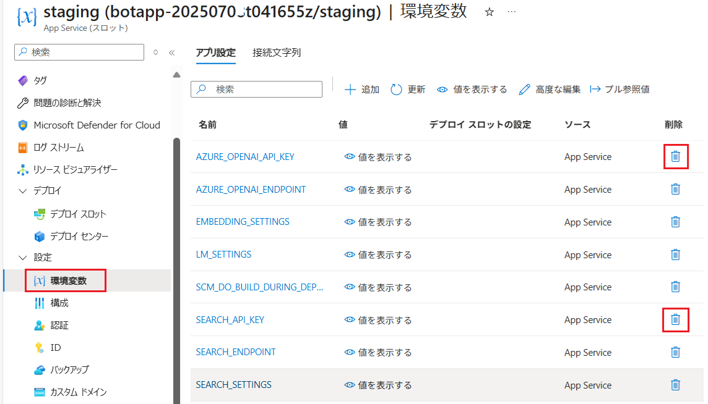

    続いて、[演習 4-1](Ex04-1.md) で設定した Key Vault 関連の環境変数も、もしあれば削除します。(※スロットをスワップしているので無いはずですが念のため確認してください)

    * **KEY_VAULT_ENDPOINT**
    * **KEY_VAULT_SECRET_LLM**
    * **KEY_VAULT_SECRET_SEARCH**

4. 画面左のメニュー \[デプロイ\] - \[**デプロイ センター**\] をクリックし、デプロイが完了していることを確認します

    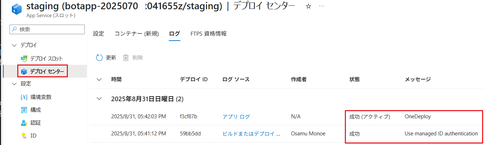

5.  デプロイ先の **staging** 環境のアプリケーションの URL にアクセスし、ボットと会話して正しく動作していることを確認します

    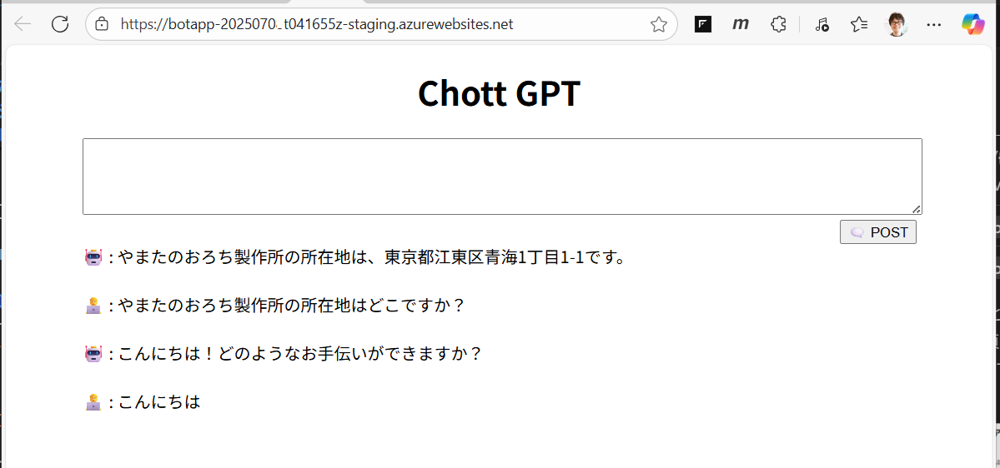

5. **staging** 環境のアプリケーションが正しく動作していることを確認したら、演習用アプリケーションをホストしている App Service 画面のメニュー \[デプロイ スロット\]　\[**デプロイ スロット**\] をクリックし、遷移した画面の上部にある \[**スロットのスワップ**\] ボタンをクリックします

    


ここまでの手順で、演習用アプリケーションから OpenAI サービスと Azure AI Search サービスの API にアクセスする際、API キーを使用せずにマネージド ID を使用して接続できるようになりました。

なお、Staging スロットの App Service にも同様の設定を行わないと、Staging スロットのアプリケーションは動作しませんので、同様の手順で Staging スロットの App Service にもアクセス許可の設定を行ってください。

また、スワップ直後の Staging スロットのアプリケーションのコードは、それまで Production で動作していた古いコードになるので、スワップが完了したら、再度 GitHub にコードをプッシュして最新のコードに更新するかどうかは運用ポリシーに従って判断してください。

<br>

# まとめ

この演習では、Azure のサービスが提供する API ににアクセスする際に、API キーを使用せずに Azure のマネージド ID を使用して認証を行う方法について学びました。

Azure では多くのサービスが[マネージド ID に対応しており](https://learn.microsoft.com/ja-jp/entra/identity/managed-identities-azure-resources/managed-identities-status#services-supporting-managed-identities)、Azure のサービス間の接続であれば、ほとんどの場合 API キーを使用する必要はありません。

実際のところこのハンズオン環境では、この演習で API キーを使用せずにマネージド ID のみで接続することが可能になったので、[演習 4-1](Ex04-1.md) デプロイした Key Vault のリソースは不要となったので、削除しても問題ありません。

マネージド ID を使用することで、API キーのような資格情報をコード内で使用する必要がなくなり、セキュリティが向上します。

とはいえ、実際のアプリケーションでは常に Azure 上で動作するサービスだけを利用して動作しているとは限らず、オンプレミスや他のクラウド上で動作するサービスの API を利用する場合も多々あります。そのため、API キーを使用した認証が必要になるケースも考えられます。

その際は、[演習 4-1](Ex04-1.md) で学んだ Azure Key Vault を使用した API キーの安全な管理方法を組み合わせて使用することをお勧めします。

## 参考

* [**Azure リソースのマネージド ID とは**](https://learn.microsoft.com/ja-jp/entra/identity/managed-identities-azure-resources/overview)

* [**マネージド ID をサポートする Azure サービスとリソースの種類**](https://learn.microsoft.com/ja-jp/entra/identity/managed-identities-azure-resources/managed-identities-status#services-supporting-managed-identities)


## 次へ

👉　[**演習 5 :  サービスの閉域化**](Ex05.md)

---

👈　[演習 4-1 :  Key Vault へのキーの登録と利用](Ex04-1.md)

🏚️　[README に戻る](README.md)
