# 演習 5-1 : OpenAI サービスの閉域化設定

Azure Virtual Network リソースをデプロイして仮想ネットワーク環境を作成し、この演習でデプロイした Azure OpenAI リソース対してプライベート エンドポイントを作成します。

その後、同じ仮想ネットワーク内に Azure 仮想マシンをデプロイし、名前解決を含めた接続を確認します。

最後に、Azure OpenAI リソースのネットワーク設定を変更して、パブリックネットワークからの接続を無効化し、仮想ネットワーク内に公開されているプライベート エンドポイント経由でのみアクセス可能な状態にします。

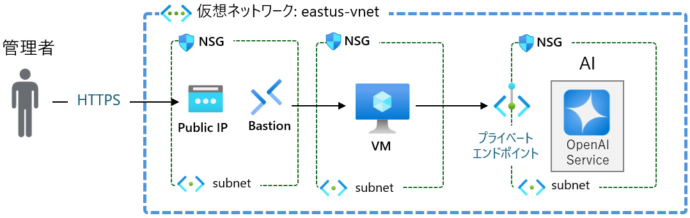


実行する作業は以下のとおりです。

1. [仮想ネットワーク環境の作成](#1--%E4%BB%AE%E6%83%B3%E3%83%8D%E3%83%83%E3%83%88%E3%83%AF%E3%83%BC%E3%82%AF%E7%92%B0%E5%A2%83%E3%81%AE%E4%BD%9C%E6%88%90)
2. [Azure OpenAI サービスのプライベート エンドポイント作成](#2--azure-openai-%E3%82%B5%E3%83%BC%E3%83%93%E3%82%B9%E3%81%AE%E3%83%97%E3%83%A9%E3%82%A4%E3%83%99%E3%83%BC%E3%83%88-%E3%82%A8%E3%83%B3%E3%83%89%E3%83%9D%E3%82%A4%E3%83%B3%E3%83%88%E4%BD%9C%E6%88%90)
3. [Azure 仮想マシンのデプロイと接続確認](#3--azure-%E4%BB%AE%E6%83%B3%E3%83%9E%E3%82%B7%E3%83%B3%E3%81%AE%E3%83%87%E3%83%97%E3%83%AD%E3%82%A4%E3%81%A8%E6%8E%A5%E7%B6%9A%E7%A2%BA%E8%AA%8D)

<br>

## 1 : 仮想ネットワーク環境の作成

Azure Portal を使用して仮想ネットワーク環境を作成します。

具体的な手順は以下のとおりです。

\[**手順**▶️\]

1. Azure Portal [ホーム画面](https://portal.azure.com/#home) の上部の検索ボックスに `仮想ネットワーク` と入力し、検索結果から `仮想ネットワーク` を選択します

    

2. \[**仮想ネットワーク**\] の画面に遷移するので、画面上部にある \[**+ 作成**\] ボタンをクリックします

3. \[**仮想ネットワークの作成**\] 画面の \[**基本**\] タブに遷移するので、各項目を以下のように設定します

    |項目|設定値|
    |:---|:---|
    |サブスクリプション|使用するサブスクリプション|
    |リソース グループ|\[**AOAI-AppEnv-handson**\]|
    |名前|`handson-eastus-vnet`|
    |リージョン|\[**(US) East US**\]|
    
    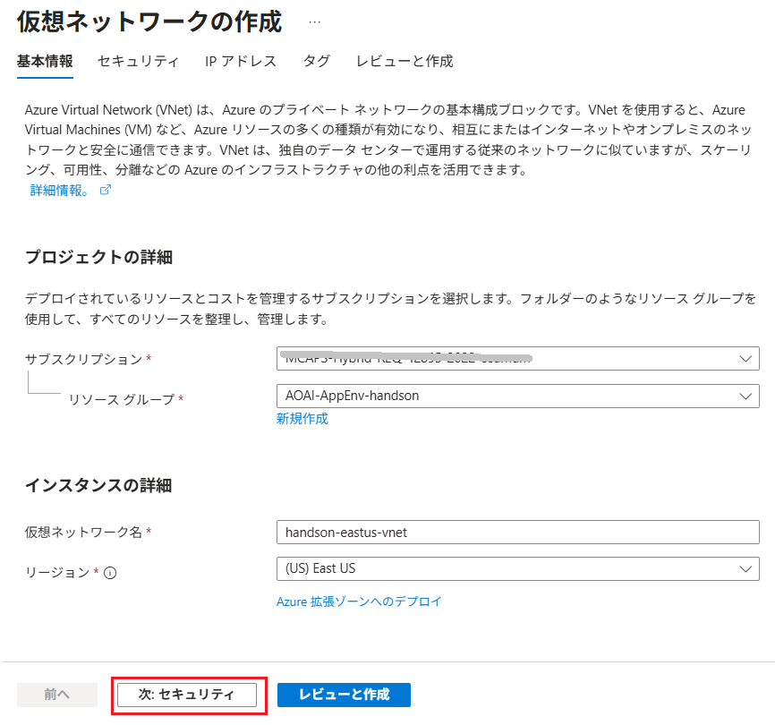

    設定が完了したら \[**次: セキュリティ**\] ボタンをクリックします

4. \[**セキュリティ**\] タブに遷移するので、各項目を以下のように設定します

    **Azure Bastion**

    |項目|設定値|
    |:---|:---|
    |Azure Bastion を有効にする|\[**Bastion を有効にする**\]|
    |Azure Bastion ホスト名|`handson-eastus-vnet-Bastion`(※既定のまま)|
    |Azure Bastion のパブリック IP アドレス|入力ボックス下の \[パブリック IP アドレスを作成\] リンクをクリックし、表示された\[**パブリック IP アドレス**\] ダイアログ ボックスで既定の設定のまま \[**OK**\] ボタンをクリック|

    **Azure Firewall** と **Azure DDoS ネットワーク保護** は既定のままとします

    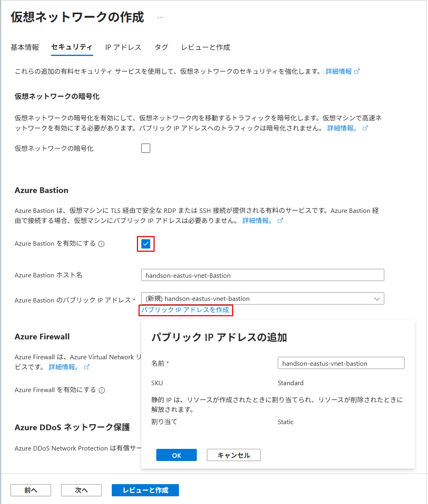
   
   設定が完了したら \[**次: IP アドレス**\] ボタンをクリックします

5. \[**IP アドレス**\] タブに遷移するので、アドレス空間情報が表示されているボックスの \[**サブネット**\] フィールドの **default**　をクリックします

    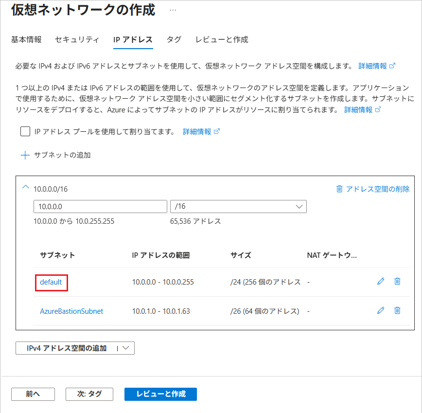

6. 画面右に \[**サブネットの編集**\] ブレードが表示されるので、各項目を以下のように設定します

    |項目|設定値|
    |:---|:---|
    |サブネットの目的|`Default`|
    |名前 \*|`handson-subnet`|
    
    **IPv4**、**IPv6**、**プライベート サブネット**、**セキュリティ** はすべて既定のままです

    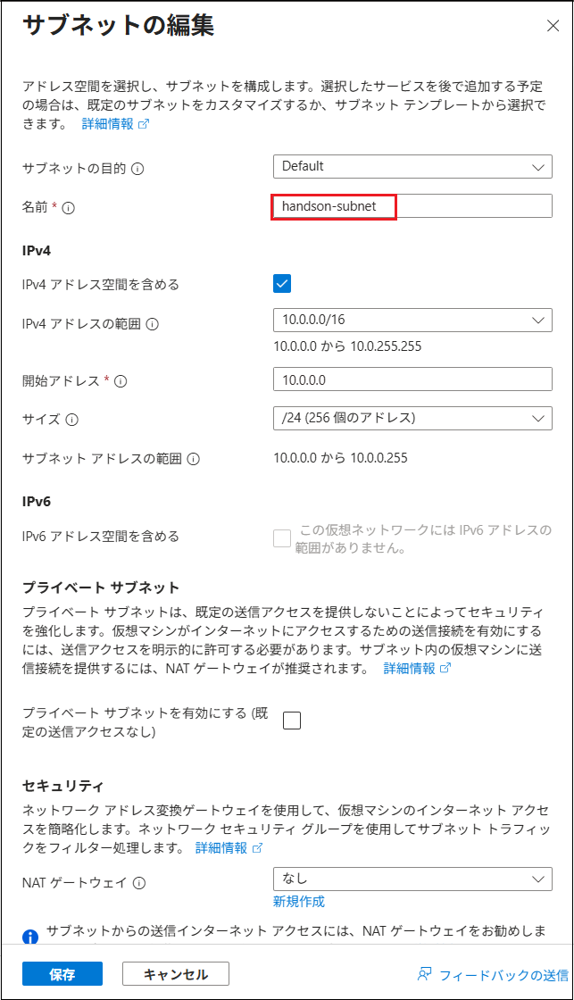

    設定が完了したら \[**保存**\] ボタンをクリックし\[**サブネットの編集**\] ブレードを閉じます

7. \[**レビューと作成**\] ボタンをクリックし、\[**作成**\] ボタンが表示されたらクリックします 

ここまでの手順で仮想ネットワーク環境の作成は完了です。

<br>

## 2 : Azure OpenAI サービスのプライベート エンドポイント作成

仮想ネットワーク環境に Azure OpenAI サービスを公開するためのプライベート エンドポイントを作成します。

具体的な手順は以下のとおりです。

\[**手順**▶️\]

1. [Azure ポータル](https://portal.azure.com)でこの演習で使用している Azure OpenAI サービスのリソース ページを開き、画面左のメニューから \[リソース管理\] - \[**ネットワーク**\] を選択します

    遷移した画面で \[**Private endpoint connections**\] タブを選択し、画面上部の \[**+ Private endpoint**\] ボタンをクリックします

    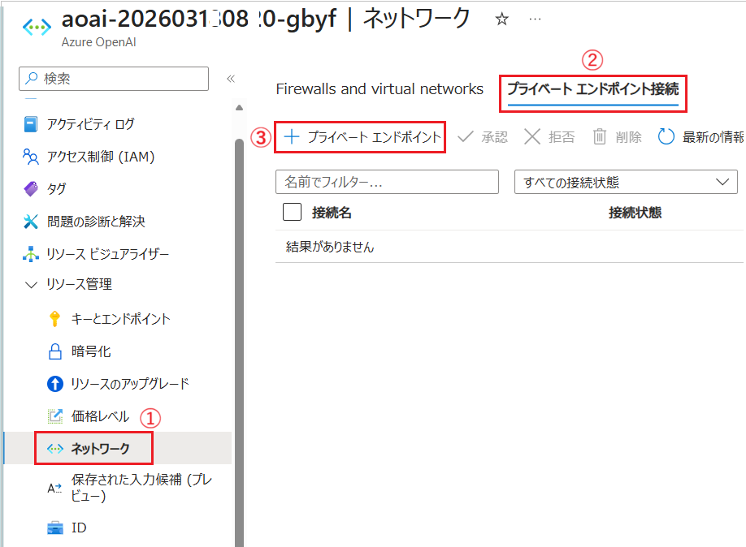

2. \[**プライベート エンドポイントを作成する**] 画面に遷移するので、各項目を以下のように設定します

    **プロジェクトの詳細**

    |項目|設定値|
    |:---|:---|
    |サブスクリプション|使用するサブスクリプション|
    |リソース グループ|\[**AOAI-AppEnv-handson**\]|

    **インスタンスの詳細**

    |項目|設定値|
    |:---|:---|
    |名前 \*|`handson-aoai-endpoint`|
    |ネットワーク インターフェイス名 \*|(自動生成されるもの)|
    |地域 \*|\[**(US) East US**\]|

    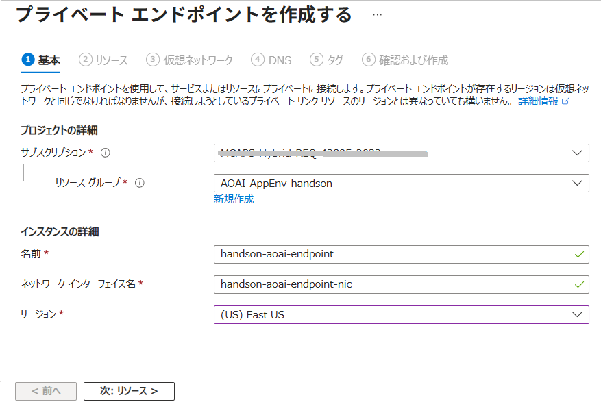

    設定が完了したら \[**次: リソース >**\] ボタンをクリックします

3. \[**リソース**\] 画面に遷移するので、各項目すべて既定のまま \[**次: 仮想ネットワーク >**\] ボタンをクリックします

    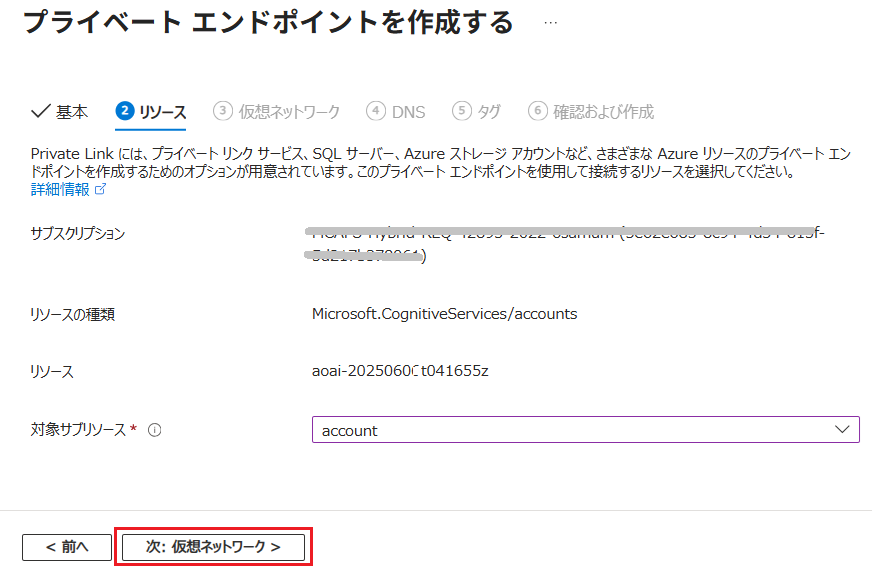

4.  \[**仮想ネットワーク**\] 画面に遷移するので、各項目が以下のように設定されていることを確認します

    **ネットワーク**

    |項目|設定値|
    |:---|:---|
    |仮想ネットワーク \*|\[**handson-eastus-vnet (AOAI-AppEnv-handson)**\]|
    |サブネット \*|\[**handson-subnet**\]|


    **プライベート IP 構成**

    |項目|設定値|
    |:---|:---|
    |IP アドレスを動的に割り当てる|チェックする|

    **アプリケーション セキュリティ グループ**

    なにも指定しない (既定のまま)

    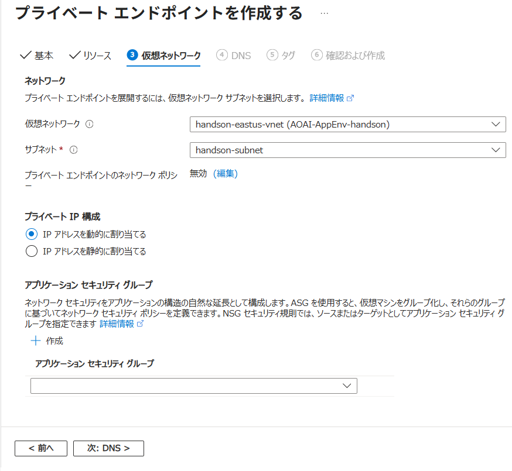

    設定が完了したら \[**次: DNS >**\] ボタンをクリックします

5. \[**DNS**\] 画面に遷移するので既定のままなにも設定せず \[**次: タグ >**\] ボタンをクリックします

6. \[**タグ**\] 画面に遷移するので同様に既定のままなにも設定せず \[**次: 確認および作成 >**\] ボタンをクリックします

7. \[**作成**\] ボタンが有効になったらクリックします

    ここまでの手順でプライベート エンドポイントの作成は完了です。

    この設定で演習で使用している Azure OpenAI リソースは仮想ネットワーク **handson-eastus-vnet** 内の環境からアクセス可能になりました。

    なお、この段階ではまだインターネットからもアクセスできる状態となっています。

<br>

## 3 : Azure 仮想マシンのデプロイと接続確認

>[!NOTE] 
>操作中 `お使いのサブスクリプションでは、East US での仮想マシンの作成がサポートされていません。別の場所を選んでください` というメッセージが表示される場合はこの手順をスキップしてください。この内容は演習 5-2-3 : Azure 仮想マシンのデプロイと接続確認でもカバーされます。

仮想ネットワーク環境内からこの演習で使用している Azure OpenAI サービスのエンドポイントにアクセスできることを確認します。

これには、仮想ネットワーク環境内にテスト用の仮想マシンを作成し、その仮想マシンのコンソールからエンドポイントにアクセスします。

仮想マシンから Azure OpenAI サービスへの正常な接続を確認後、インターネットからの Azure OpenAI サービスへの接続を無効にします。

具体的な手順は以下のとおりです。

\[**手順**▶️\]


1.  [Azure Portal](http://portal.azure.com) にログインし、ポータル画面上部の \[**+**\] リソースの作成 アイコンか、表示されていない場合は画面左上のハンバーガーメニューをクリックし、\[**リソースの作成**\] をクリックします

    

2. \[**リソースの作成**\] 画面に遷移するので、検索ボックスに `仮想マシン` と入力し、表示された検索結果の \[**仮想マシン**\] のタイルをクリックします

    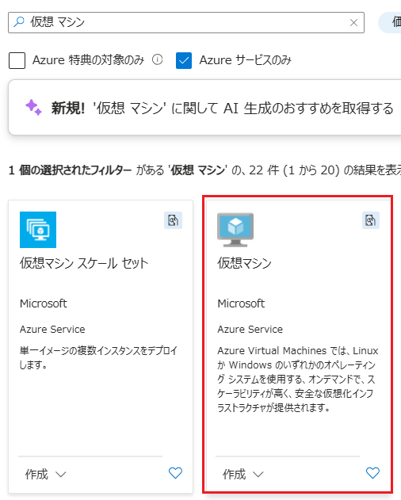

3. \[**仮想マシン**\] の画面に遷移するので、\[**作成**\] ボタンをクリックします


4. \[**仮想マシンの作成**\] の画面の \[**基本**\] タブに遷移するので各項目を以下のように設定します

    **プロジェクトの詳細**

    |項目|設定値|
    |:---|:---|
    |サブスクリプション \*|使用するサブスクリプション|
    |リソース グループ|\[**AOAI-AppEnv-handson**\]|

    **インスタンスの詳細**

    |項目|設定値|
    |:---|:---|
    |仮想マシン名 \*|`aoai-mon-vm`|
    |地域 \*|\[**(US) East US**\]|
    |可用性オプション|\[**インフラストラクチャ冗長は必要ありません**\]|
    |セキュリティの種類|\[**Standard**\]|
    |イメージ \*|\[**[Ubuntu Server 24.04 LTS - x64 Gen2]**\](※ Bash が動作するものであればどれでもかまいません)|
    |VM アーキテクチャ|\[**x64**\]|
    |サイズ|(※任意のものを選択します。価格の安いものでかまいません)|

    **管理者アカウント**

    |項目|設定値|
    |:---|:---|
    |認証の種類 \*|\[**パスワード**\]|
    |ユーザー名 \*|`handson-vmadmin`|
    |パスワード \*|`P@ssw0rd1234`|
    |パスワードの確認 \*|`P@ssw0rd1234`|

    **受信ポートの規則**

    |項目|設定値|
    |:---|:---|
    |パブリック受信ポート \*|\[**なし**\]|

    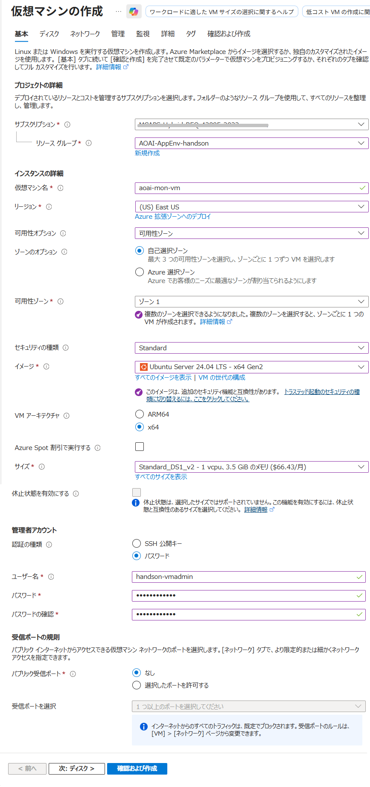

    設定が完了したら \[**次: ディスク >**\] ボタンをクリックします

5. \[**ディスク**\] タブの画面に遷移しますが、既定のままで \[**次: ネットワーク >**\] ボタンをクリックします

    なお、\[**OS ディスクの種類**\]　で、より安価なディスクを選択してもかまいません。

6. \[**ネットワーク**] タブの画面に遷移するので各項目が既定で以下のように設定されていることを確認します

    **ネットワーク インターフェイス**

    |項目|設定値|
    |:---|:---|
    |仮想ネットワーク \*|\[**handson-eastus-vnet**\]|
    |サブネット \*|\[**handson-subnet (10.0.0.0/24)**\]|
    |パブリック IP|\[**(新規) vnet-mon-aoai-vm-ip**\]|
    |NIC ネットワーク セキュリティ グループ|\[**詳細**\ にチェック]|
    |ネットワーク セキュリティ グループの構成 /*|\[**(新規) vnet-mon-vm-nsg**\]|
    |VM が削除されたときにパブリック IP と NIC を削除する|チェックしない(※任意)|
    |高速ネットワークを有効にする|チェック|

    **負荷分散**

    |項目|設定値|
    |:---|:---|
    |負荷分散のオプション|\[**なし**\]にチェック|

     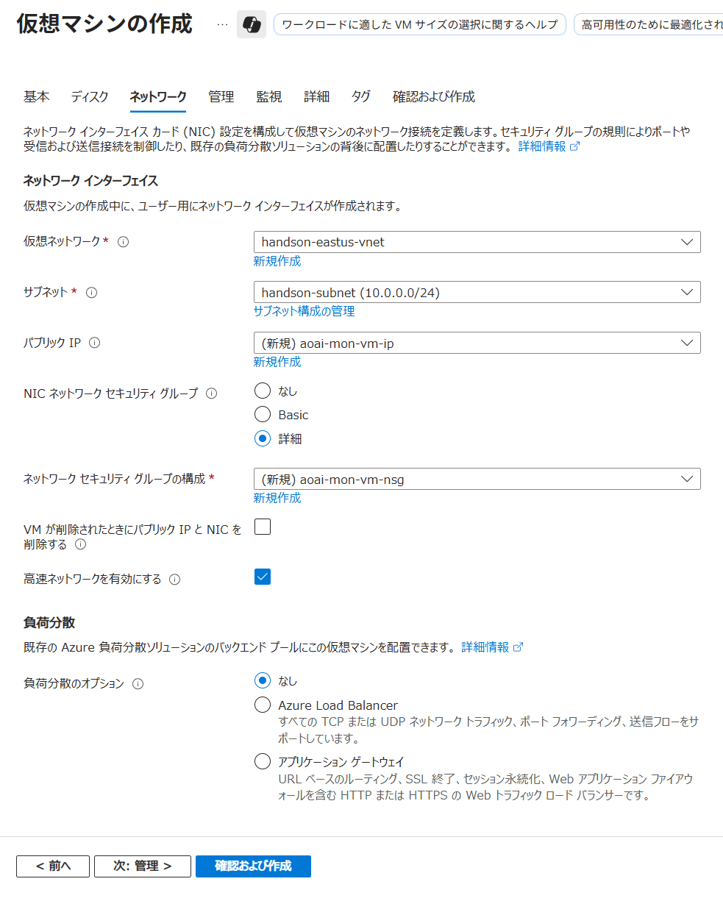

    設定が完了したら \[**確認および作成**\] ボタンをクリックし、\[**作成**\] ボタンが有効になったらクリックしてデプロイを開始します。

7. 仮想マシンのデプロイが完了すると \[**リソースに移動**\] ボタンが表示されるので、クリックして作成した仮想マシンのリソース画面に遷移します

8. 画面左のメニューから \[**Bastion**\] をクリックし、遷移した画面の各項目を以下のように設定します

    |項目|設定値|
    |:---|:---|
    |認証の種類|\[**VM パスワード**\]|
    |ユーザー名 \*|`handson-vmadmin`|
    |VM パスワード \*|`P@ssw0rd1234`|
    |新しいブラウザー タブで開く|**チェックしない**|

    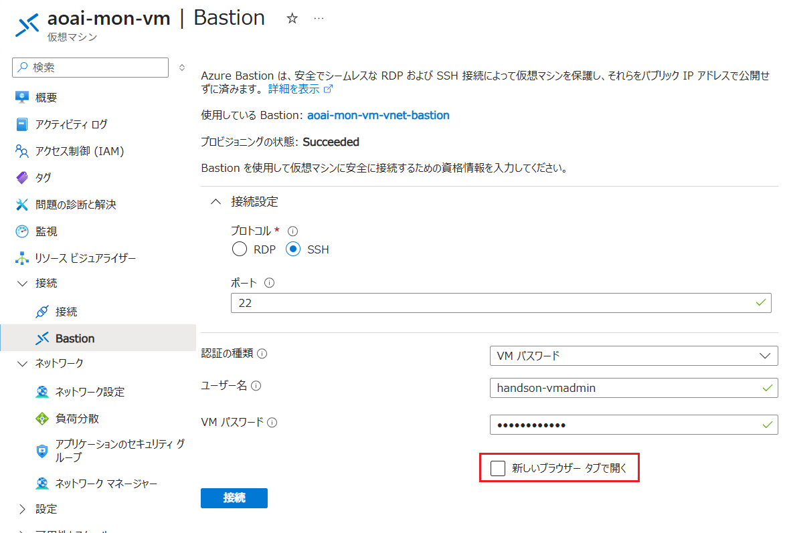

    設定が完了したら \[**接続**\] ボタンをクリックします

9. 仮想マシンへの接続が完了すると、Azure ポータル画面内に仮想マシンのターミナル画面が表示されます

    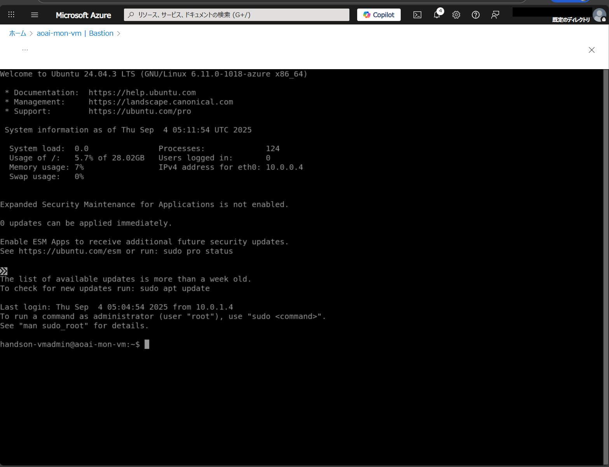


10. ここまでの演習でメモした Azure OpenAI サービスのエンドポイントと API キーを使用して、仮想マシンのターミナル画面で実行するためのコマンドを作成します

    メモ帳などを使用して以下のようにコマンド内の `%AOAI-ENDPOINT%` と `%AOAI-APIKEY%` の部分を実際の値に置き換えたコマンドを作成します

    ```bash
    curl "%AOAI-ENDPOINT%/openai/deployments/gpt-4o-mini/chat/completions?api-version=2025-01-01-preview" \
    -H "Content-Type: application/json" \
    -H "api-key: %AOAI-APIKEY%" \
    -d '{
        "messages": [
            {
                "role":"user",
                "content":"こんにちは"
            }
        ]
    }'
    ```

    作成したコマンドをコピーします

11. 仮想マシンのターミナル画面に戻り、画面上に表示されている \[**\>\>\**] の部分をクリックします

    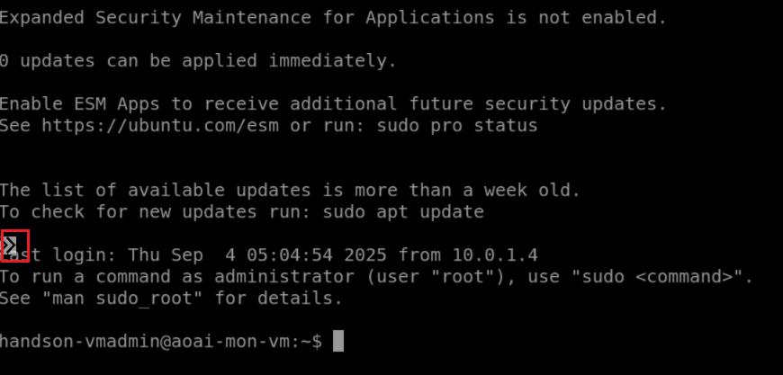

    クリップボードの UI が表示されるので、コピーしたコマンドを貼り付けて \[**\<\<**\] ボタンをクリックします

    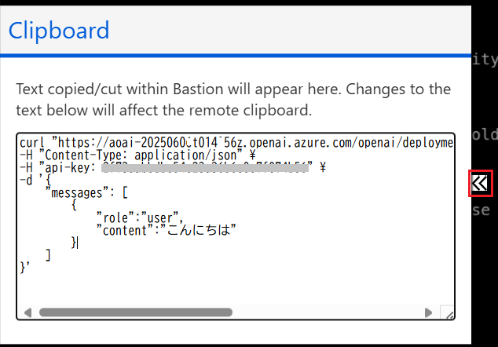

    ターミナル画面上でマウスの右ボタンをクリックすると、クリップボードの内容が貼り付けられるので、Enter キーを押してコマンドを実行します

    Azure OpenAI サービスからの応答が JSON 形式で返されることを確認します

    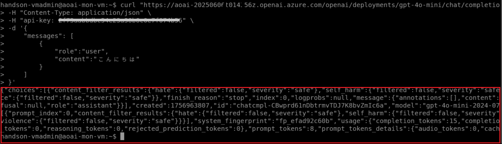

12. 同じコマンドをローカルの開発環境のターミナル画面で実行し、同様の応答が返ることを確認します

    なお、Windows のターミナル画面が PowerShell の場合は、`bash` コマンドで Bash 環境に切り替えてから実行してください

    ここでは、まだインターネットから Azure OpenAI サービスにアクセスできる状態であることを確認しています。

13. この演習で使用している Azure OpenAI サービスへのインターネットからのアクセスを無効にします

    Azure ポータルで、Azure OpenAI サービスのリソース画面を開き、画面左のメニューから \[リソース管理\] - \[**Networkig**\] を選択します。

    遷移した画面で \[**Firewalls and virtual networks**\] タブ内の \[**無効**\] オプションボタンをクリックして、画面上部の \[**Save**\] ボタンをクリックします

    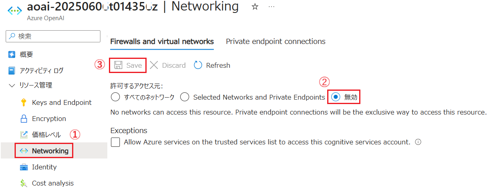

    
14. ローカルの開発環境のターミナル画面で、再度同じコマンドを実行し、以下のようなエラーが返されることを確認します

    ```json
    {"error":{"code":"403","message": "Public access is disabled. Please configure private endpoint."}}
    ```
15. 仮想マシンのターミナル画面に戻り、同じコマンドを実行し、正常に応答が返されることを確認します

    

ここまでの手順で、仮想ネットワーク環境内からのみ Azure OpenAI サービスの Private Endpoint にアクセスできるように構成しました。

なお、この手順でデプロイした仮想マシンはこの後の演習では使用しないので、不要であれば削除してかまいません。

<br>


# まとめ

この演習では、Azure Virtual Network リソースをデプロイして仮想ネットワーク環境を作成し、Azure OpenAI サービスに対してプライベート エンドポイントを作成しました。また、仮想ネットワーク内からのみ Azure OpenAI サービスにアクセスできるように構成しました。

このハンズオンの演習では PaaS サービスのエントリーポイントの制限方法としてベースライン アーキテクチャで推奨している**プライベート エンドポイント**を使用ましたが、サービスのエントリーポイントの制限方法としてもうひとつ**サービス エンドポイント**があります。

### プライベート エンドポイントとサービス エンドポイントについて

この演習で作成したプライベートエンド ポイントは、Azure のサービスに既定で提供されているのはパブリックなネットワークのエンドポイントを、**プライベート リンクというサービスを使用して任意の仮想ネットワーク内にエンドポイントを公開する**ものです。

これにより、仮想ネットワーク内から公開されたエンドポイントに対して**パブリック ネットワークを経由せずにアクセスできる**(※)ようになります。(※ 仮想ネットワーク内にエンドポイントが存在するため)

また、プライベート エンドポイントを提供するサービス側で、パブリックネットワークからのアクセスを無効にすることで、**仮想ネットワーク内からのみサービスにアクセスできる**ように構成できます。

もうひとつのエントリーポイントの制限方法として、**サービス エンドポイント**があります。

サービス エンドポイントは、仮想ネットワーク内にエンドポイントは公開しません。

そのため、仮想ネットワーク内のリソースからこのリソースのエンドポイントにアクセスするには、**パブリック ネットワークを経由します**。

しかし、エンドポイントを提供するサービス側のネットワーク ルール設定で、**任意の仮想ネットワークからのアクセスのみを許可する**ように構成することができ、パブリックネットワークからのアクセスを無効にすることで、プライベート エンドポイントと同様に **仮想ネットワーク内からのみサービスにアクセスできる**ように構成できます。

これが**サービス エンドポイント**です。

Azure のサービスによっては、プライベート エンドポイントとサービス エンドポイントの両方をサポートしているものもありますが、どちらか一方しかサポートしていないものもあります。

Azure 上のサービス同士の通信は、Azure のバックボーン ネットワークを経由するため、前述の仕組みの違いはあれ、どちらの方法を使用してもセキュアな通信が可能です。

要件やコスト、運用の観点から適切な方法を選択してください。

* **\[参考\] Azure OpenAI サービスで **サービス エンドポイント**を使用する場合**

    Azure ポータルで、Azure OpenAI サービスのリソース画面を開き、画面左のメニューから \[リソース管理\] - \[**Networkig**\] を選択します。

     遷移した画面で \[**Firewalls and virtual networks**\] タブ内の　[**Selected Networks and Private Endpoints**\]を選択し、さらに展開された UI で \[**+ 既存の仮想ネットワークを追加**\] リンクをクリックします

    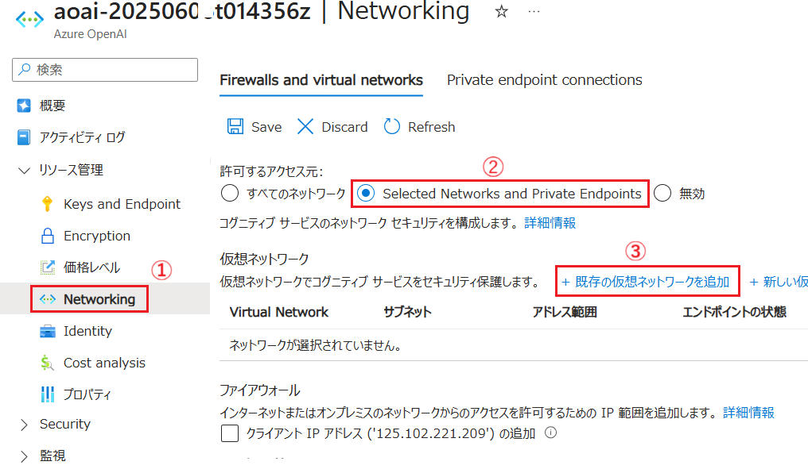

    画面右に \[**仮想ネットワークの追加**\] ブレードが表示されるので、接続を許可かる仮想ネットワークとサブネットを選択してください。

    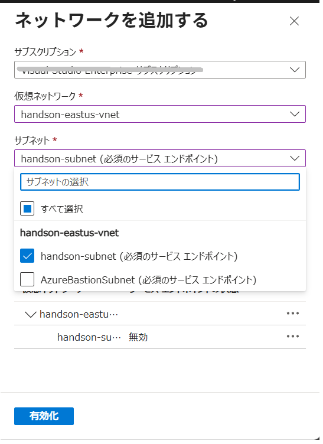

    これにより、サービス エンドポイントが構成され、選択した仮想ネットワーク内からのみ Azure OpenAI サービスにアクセスできるようになります。

<br>

## 次へ

👉　[**演習 5-2 : AI Search サービスの閉域化設定**](Ex05-2.md)

---

👈　[演習 5 : サービスの閉域化](Ex05.md)

🏚️　[README に戻る](README.md)
