# 演習 5-2 : AI Search の閉域化設定

[演習 5 : サービスの閉域化](Ex05.md) と同様にAzure Virtual Network リソースをデプロイして仮想ネットワーク環境を作成し、Azure AI Search サービスに対してプライベート エンドポイントを作成します。

その後、同様に作成した仮想ネットワーク内に Azure 仮想マシンをデプロイし、名前解決を含めた接続を確認します。ただし、今回は Windows 仮想マシンをデプロイします。

また、この演習で作成する仮想ネットワーク `handson-japaneast-vnet` から、[演習 5-1 : OpenAI サービスの閉域化設定](Ex05-1.md) で作成した仮想ネットワーク `handson-japaneast-vnet` へ 仮想ネットワーク ピアリングを設定し、両リージョン間での通信ができるようにします。 

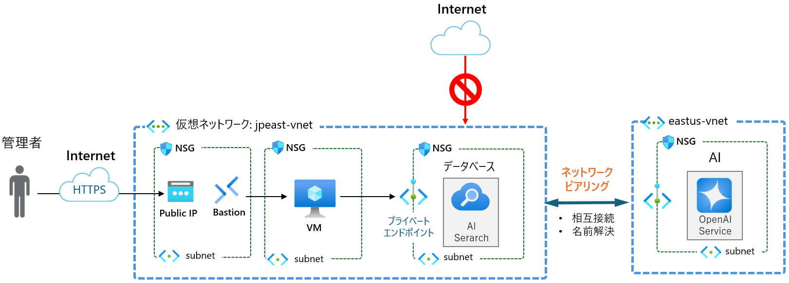

この演習で実施する作業は以下のとおりです。

1. [仮想ネットワーク環境の作成](#%E3%82%BF%E3%82%B9%E3%82%AF-1--%E4%BB%AE%E6%83%B3%E3%83%8D%E3%83%83%E3%83%88%E3%83%AF%E3%83%BC%E3%82%AF%E7%92%B0%E5%A2%83%E3%81%AE%E4%BD%9C%E6%88%90)
2. [Azure AI Search のプライベート エンドポイント作成](#%E3%82%BF%E3%82%B9%E3%82%AF-2--azure-ai-search-%E3%81%AE%E3%83%97%E3%83%A9%E3%82%A4%E3%83%99%E3%83%BC%E3%83%88-%E3%82%A8%E3%83%B3%E3%83%89%E3%83%9D%E3%82%A4%E3%83%B3%E3%83%88%E4%BD%9C%E6%88%90)
3. [Azure 仮想マシンのデプロイと接続確認](#%E3%82%BF%E3%82%B9%E3%82%AF-3--azure-%E4%BB%AE%E6%83%B3%E3%83%9E%E3%82%B7%E3%83%B3%E3%81%AE%E3%83%87%E3%83%97%E3%83%AD%E3%82%A4%E3%81%A8%E6%8E%A5%E7%B6%9A%E7%A2%BA%E8%AA%8D)
4. [仮想ネットワークのピアリング設定](#%E3%82%BF%E3%82%B9%E3%82%AF-4--%E4%BB%AE%E6%83%B3%E3%83%8D%E3%83%83%E3%83%88%E3%83%AF%E3%83%BC%E3%82%AF%E3%81%AE%E3%83%94%E3%82%A2%E3%83%AA%E3%83%B3%E3%82%B0%E8%A8%AD%E5%AE%9A)

<br>

## 1 : 仮想ネットワーク環境の作成

Azure Portal を使用して仮想ネットワーク環境を作成します。

操作手順としては、デプロイするリージョン、仮想ネットワークとサブネットの名前、アドレス空間、以外は [演習 5 : サービスの閉域化](Ex05.md)と同様です。

具体的な手順は以下のとおりです。

\[**手順**▶️\]

1. Azure Portal [ホーム画面](https://portal.azure.com/#home) の上部の検索ボックスに `仮想ネットワーク` と入力し、検索結果から `仮想ネットワーク` を選択します

    

2. \[**仮想ネットワーク**\] の画面に遷移するので、画面上部にある \[**+ 作成**\] ボタンをクリックします

3. \[**仮想ネットワークの作成**\] 画面の \[**基本**\] タブに遷移するので、各項目を以下のように設定します

    |項目|設定値|
    |:---|:---|
    |サブスクリプション|使用するサブスクリプション|
    |リソース グループ|\[**AOAI-AppEnv-handson**\]|
    |名前|`handson-jpeast-vnet`|
    |リージョン|\[**(Asia Pacific) Japan East**\]|

    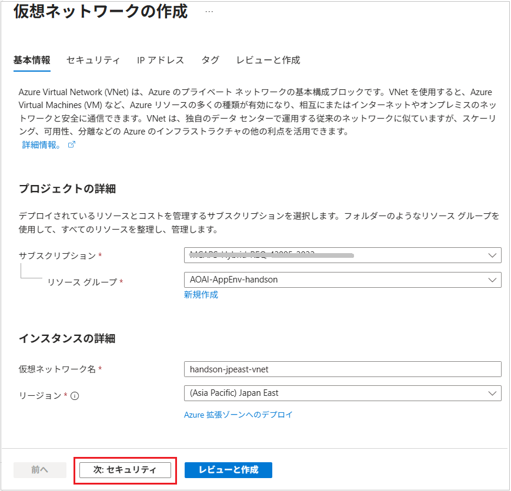

    設定が完了したら \[**次: セキュリティ**\] ボタンをクリックします

4. \[**セキュリティ**\] タブに遷移するので、各項目を以下のように設定します

    **Azure Bastion**

    |項目|設定値|
    |:---|:---|
    |Azure Bastion を有効にする|\[**Bastion を有効にする**\]|
    |Azure Bastion ホスト名|`handson-jpeast-vnet-Bastion`(※既定のまま)|
    |Azure Bastion のパブリック IP アドレス|入力ボックス下の \[パブリック IP アドレスを作成\] リンクをクリックし、表示された\[**パブリック IP アドレス**\] ダイアログ ボックスで既定の設定のまま \[**OK**\] ボタンをクリック|

    **Azure Firewall** と **Azure DDoS ネットワーク保護** は既定のままとします

    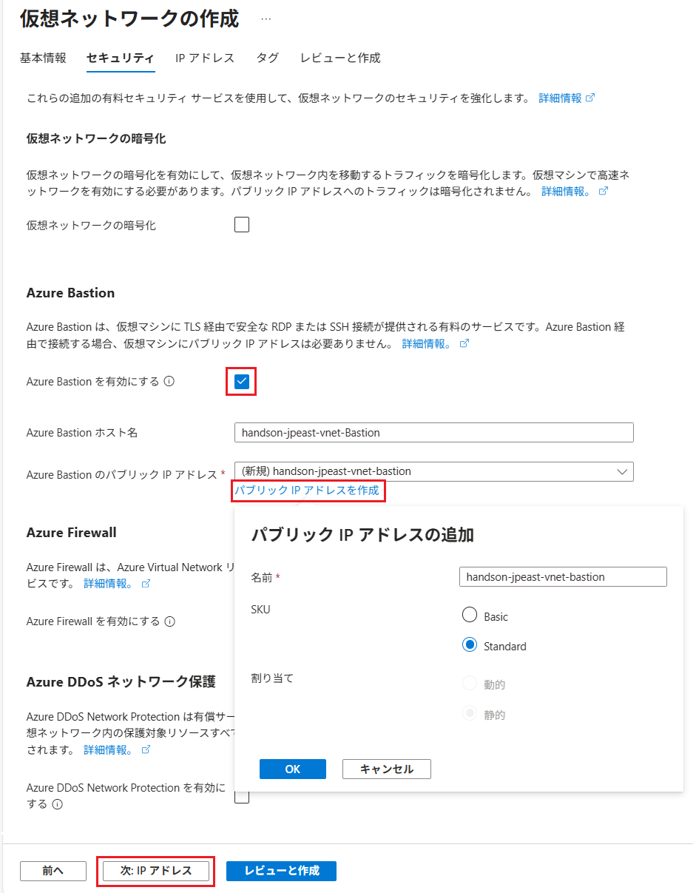

   設定が完了したら \[**次: IP アドレス**\] ボタンをクリックします

5. \[**IP アドレス**\] タブに遷移するので、アドレス空間情報が表示されているボックスには以下のように表示されているのを確認します

    ```
    このアドレス プレフィックスは、仮想ネットワーク 'handson-eastus-vnet' と重複しています。これらの仮想ネットワークをピアリングする場合は、アドレス空間を変更してください
    ```

   アドレス範囲の `10.0.0.0/16` を `10.1.0.0/16` に変更します

    \[**サブネット**\] フィールドの **default**　をクリックします

    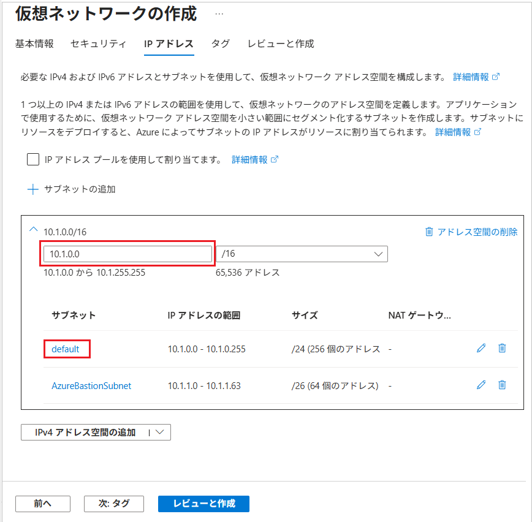

6. 画面右に \[**サブネットの編集**\] ブレードが表示されるので、各項目を以下のように設定します

    |項目|設定値|
    |:---|:---|
    |サブネットの目的|`Default`|
    |名前 \*|`handson-subnet`|
    
    **IPv4**、**IPv6**、**プライベート サブネット**、**セキュリティ** はすべて既定のままです

    

    設定が完了したら \[**保存**\] ボタンをクリックし\[**サブネットの編集**\] ブレードを閉じます

7.  \[**レビューと作成**\] ボタンをクリックし、\[**作成**\] ボタンが表示されたらクリックします 

ここまでの手順で仮想ネットワーク環境の作成は完了です。

<br>

## 2 : Azure AI Search のプライベート エンドポイント作成

仮想ネットワーク環境に Azure AI Search サービスを公開するためのプライベート エンドポイントを作成します。

具体的な手順は以下のとおりです。

\[**手順**▶️\]

1. [Azure ポータル](https://portal.azure.com)でこの演習で使用している Azure AI Search のリソース ページを開き、画面左のメニューから \[設定\] - \[**ネットワーク**\] を選択します


    遷移した画面で \[**プライベート エンドポイント接続**\] タブを選択し、画面上部の \[**+ プライベート エンドポイントを作成する**\] ボタンをクリックします

    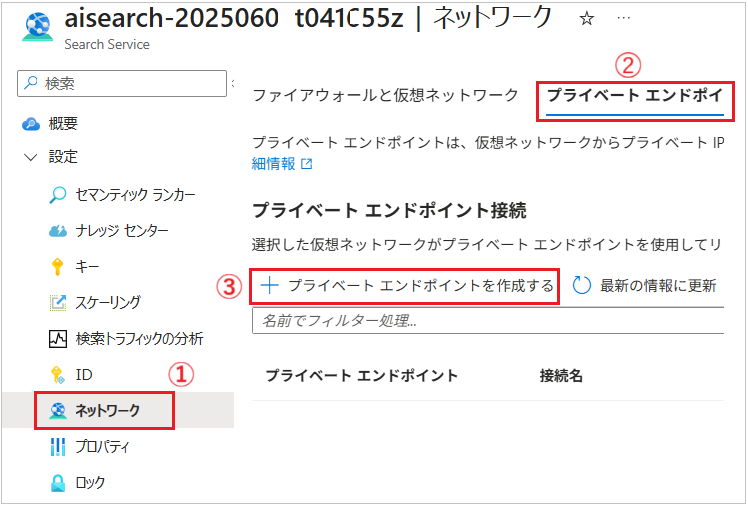

2. \[**プライベート エンドポイントを作成する**] 画面に遷移するので、各項目を以下のように設定します

    **プロジェクトの詳細**

    |項目|設定値|
    |:---|:---|
    |サブスクリプション|使用するサブスクリプション|
    |リソース グループ|\[**AOAI-AppEnv-handson**\]|

    **インスタンスの詳細**

    |項目|設定値|
    |:---|:---|
    |名前 \*|`handson-aisearch-endpoint`|
    |ネットワーク インターフェイス名 \*|(自動生成されるもの)|
    |地域 \*|\[**(Asia Pacific) Japan East**\]|

    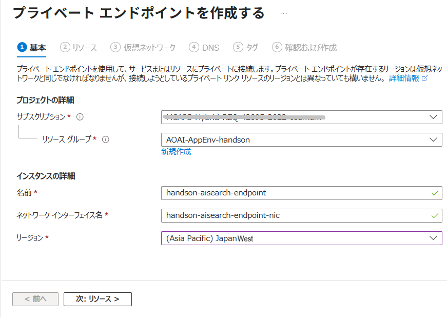

    設定が完了したら \[**次: リソース >**\] ボタンをクリックします

3. \[**リソース**\] 画面に遷移するので、各項目を以下のように設定します

    |項目|設定値|
    |:---|:---|
    |接続方法|\[**マイ ディレクトリ内の Azure リソースに接続します。**\]にチェック|
    |サブスクリプション\*|*お使いのサブスクリプション*|
    |リソースの種類 \*|\[**Microsoft.Search/searchServices**\]|
    |リソース \*|\[**(この演習で使用している Azure AI Search リソース名)**\]|
    |対象サブリソース \*|\[**searchService**\]|  
    
    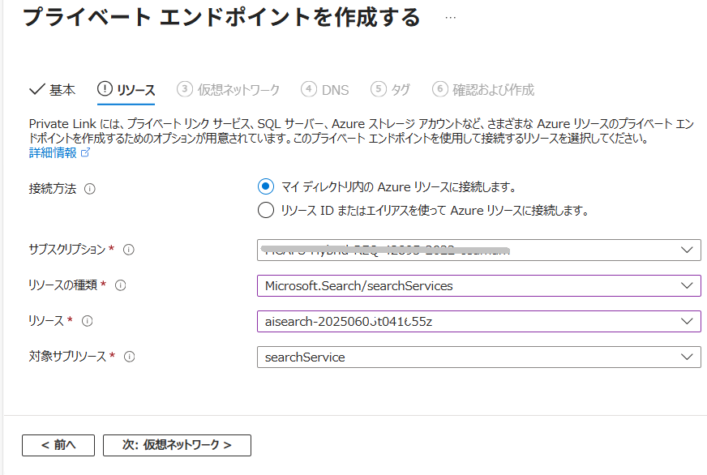
    
    設定が完了したら \[**次: 仮想ネットワーク >**\] ボタンをクリックします

4.  \[**仮想ネットワーク**\] 画面に遷移するので、各項目が以下のように設定されていることを確認します

    **ネットワーク**

    |項目|設定値|
    |:---|:---|
    |仮想ネットワーク \*|\[**handson-jpeast-vnet (AOAI-AppEnv-handson)**\]|
    |サブネット \*|\[**handson-subnet**\]|


    **プライベート IP 構成**

    |項目|設定値|
    |:---|:---|
    |IP アドレスを動的に割り当てる|チェックする|

    **アプリケーション セキュリティ グループ**

    なにも指定しない (既定のまま)

    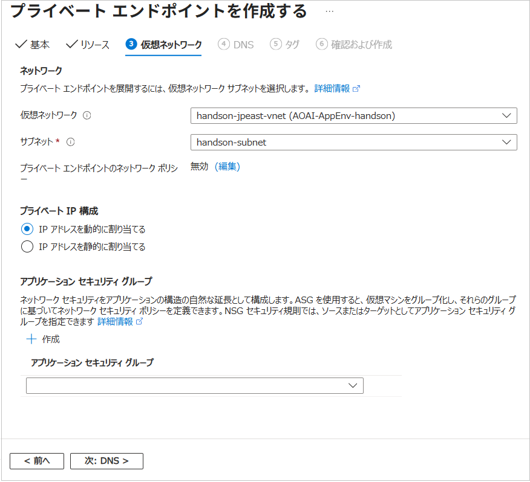

    設定が完了したら \[**次: DNS >**\] ボタンをクリックします

5. \[**DNS**\] 画面に遷移するので既定のままなにも設定せず \[**次: タグ >**\] ボタンをクリックします

6. \[**タグ**\] 画面に遷移するので同様に既定のままなにも設定せず \[**次: 確認および作成 >**\] ボタンをクリックします

7. \[**作成**\] ボタンが有効になったらクリックします

    ここまでの手順でプライベート エンドポイントの作成は完了です。

    この設定で演習で使用している Azure AI Searchは仮想ネットワーク **handson-jpeast-vnet** 内の環境からアクセス可能になりました。

    なお、この段階ではまだインターネットからもアクセスできる状態となっています。

<br>

## 3 : Azure 仮想マシンのデプロイと接続確認

仮想ネットワーク環境内からこの演習で使用している Azure AI Search リソースのエンドポイントにアクセスできることを確認します。

これには、仮想ネットワーク環境内にテスト用の仮想マシンを作成し、その仮想マシンのコンソールからエンドポイントにアクセスします。

今回デプロイする仮想マシンはこれ以降、仮想ネットワーク内の Azure リソースにアクセスするためのジャンプボックスとして使用するため、デスクトップ環境をもつ **Windows Server** をデプロイします。なお、外部ネットワークからこの仮想マシンに直接アクセス可能とはせず、[Azure Bastion](https://learn.microsoft.com/ja-jp/azure/bastion/bastion-overview) 経由で接続するように構成します。

仮想マシンから Azure AI Search への正常な接続を確認後、インターネットからアプリケーションへの接続を無効にします。

具体的な手順は以下のとおりです。

\[**手順**▶️\]

1.  [Azure Portal](http://portal.azure.com) にログインし、ポータル画面上部の \[**+**\] リソースの作成 アイコンか、表示されていない場合は画面左上のハンバーガーメニューをクリックし、\[**リソースの作成**\] をクリックします

    

2. \[**リソースの作成**\] 画面に遷移するので、検索ボックスに `仮想マシン` と入力し、表示された検索結果の \[**仮想マシン**\] のタイルをクリックします

    

3. \[**仮想マシン**\] の画面に遷移するので、\[**作成**\] ボタンをクリックします


4. \[**仮想マシンの作成**\] の画面の \[**基本**\] タブに遷移するので各項目を以下のように設定します

    **プロジェクトの詳細**

    |項目|設定値|
    |:---|:---|
    |サブスクリプション \*|使用するサブスクリプション|
    |リソース グループ|\[**AOAI-AppEnv-handson**\]|

    **インスタンスの詳細**

    |項目|設定値|
    |:---|:---|
    |仮想マシン名 \*|`handson-mon-vm`|
    |地域 \*|\[**(Asia Pacific) Japan East**\]|
    |可用性オプション|\[**インフラストラクチャ冗長は必要ありません**\]|
    |セキュリティの種類|\[**Standard**\]|
    |イメージ \*|\[**[Windows Server 2025 Datacenter:Azure Edition - x64 Gen2]**\]|
    |VM アーキテクチャ|\[**x64**\]|
    |サイズ|(※任意のものを選択します。価格の安いものでかまいません)|

    **管理者アカウント**

    |項目|設定値|
    |:---|:---|
    |認証の種類 \*|\[**パスワード**\]|
    |ユーザー名 \*|`handson-vmadmin`|
    |パスワード \*|`P@ssw0rd1234`|
    |パスワードの確認 \*|`P@ssw0rd1234`|

    **受信ポートの規則**

    |項目|設定値|
    |:---|:---|
    |パブリック受信ポート \*|\[**なし**\]|

    **ライセンス**

    |項目|設定値|
    |:---|:---|
    |既存の Windows Server ライセンスを使用しますか?|チェックしない|

    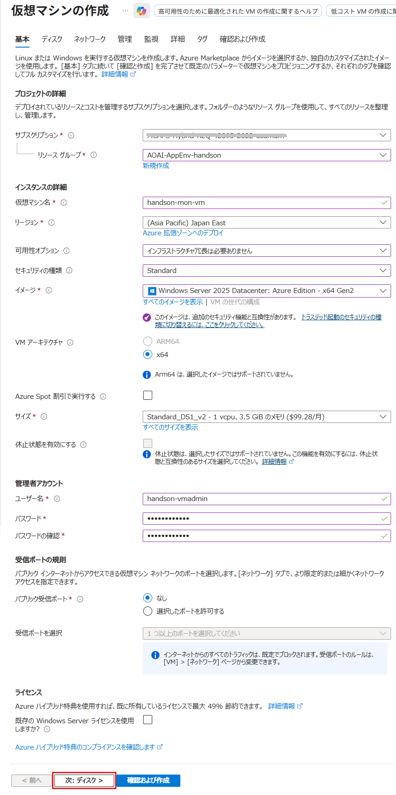

    設定が完了したら \[**次: ディスク >**\] ボタンをクリックします

5. \[**ディスク**\] タブの画面に遷移しますが、既定のままで \[**次: ネットワーク >**\] ボタンをクリックします

    なお、\[**OS ディスクの種類**\]　で、より安価なディスクを選択してもかまいません。

6. \[**ネットワーク**] タブの画面に遷移するので各項目が既定で以下のように設定されていることを確認します。なお、**仮想ネットワーク** と **サブネット** はこの演習で作成したものを選択します。

    **ネットワーク インターフェイス**

    |項目|設定値|
    |:---|:---|
    |仮想ネットワーク \*|\[**handson-eastus-vnet**\]|
    |サブネット \*|\[**handson-subnet (10.0.0.0/24)**\]|
    |パブリック IP|\[**なし**\]|
    |NIC ネットワーク セキュリティ グループ|\[**詳細**\ にチェック]|
    |ネットワーク セキュリティ グループの構成 /*|\[**(新規) handson-mon-vm-nsg**\]|
    |VM が削除されたときにパブリック IP と NIC を削除する|(※任意)|
    |高速ネットワークを有効にする|チェック|

    **負荷分散**

    |項目|設定値|
    |:---|:---|
    |負荷分散のオプション|\[**なし**\]にチェック|

     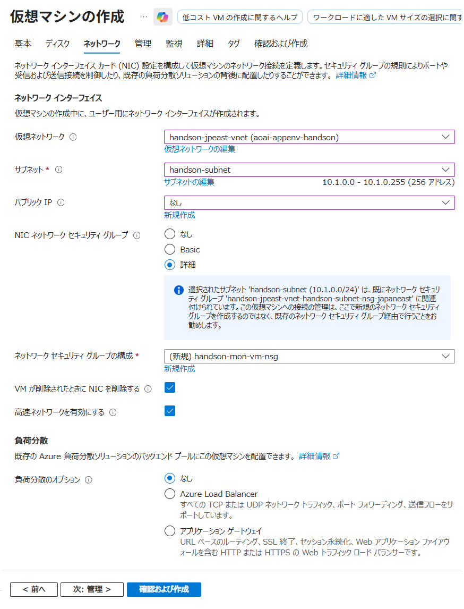

    設定が完了したら \[**確認および作成**\] ボタンをクリックし、\[**作成**\] ボタンが有効になったらクリックしてデプロイを開始します。

7. 仮想マシンのデプロイが完了すると \[**リソースに移動**\] ボタンが表示されるので、クリックして作成した仮想マシンのリソース画面に遷移します

8. 画面左のメニューから \[**Bastion**\] をクリックし、遷移した画面の各項目を以下のように設定します

    |項目|設定値|
    |:---|:---|
    |キーボードの言語|\[**日本語**\]|
    |認証の種類|\[**VM パスワード**\]|
    |ユーザー名 \*|`handson-vmadmin`|
    |VM パスワード \*|`P@ssw0rd1234`|
    |新しいブラウザー タブで開く|**チェック**|

    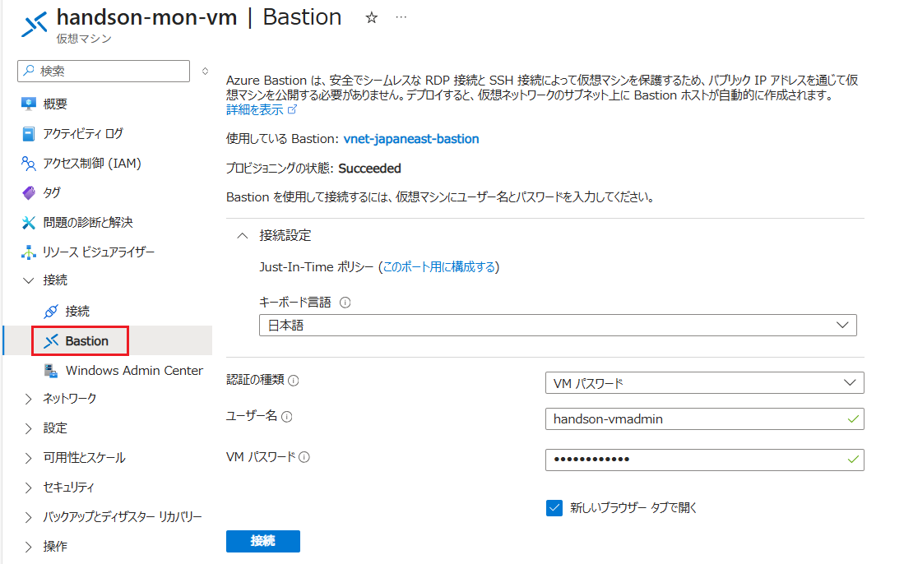

    設定が完了したら \[**接続**\] ボタンをクリックします

9. Web ブラウザーの新しいたタブが開き、仮想マシンへの接続が完了すると、Azure ポータル画面内に仮想マシンのデスクトップ画面が表示されるので、画面下部のタスクバーにあるスタートボタン(Windows アイコン)をクリックし、表示されたメニューから \[**Terminal**\] アイコンをクリックします

    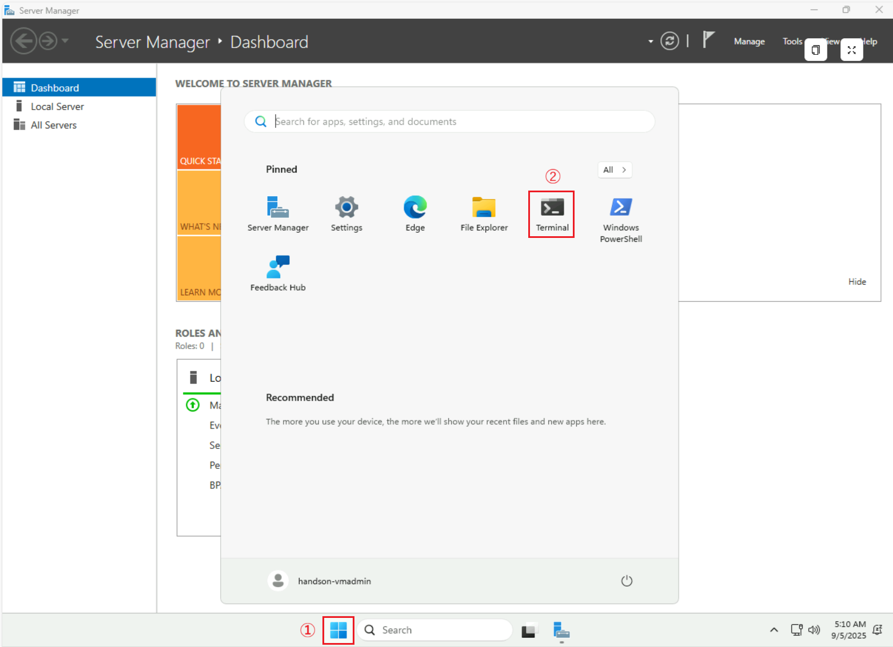

10. Windows ターミナルが起動したら、仮想ネットワーク内の Azure AI Search リソースにアクセスできることを確認します

    ただし、Windows ターミナルは既定の状態では Bash コマンドは使用できないため PowerShell コマンドを記述します。 メモ帳などを使用して以下のようにコマンド内の `%AISEARCH-ENDPOINT%` と `%AISEARCH-APIKEY%` の部分を実際の値に置き換えたコマンドを作成します

    ```powershell
    $response = Invoke-WebRequest -Uri "%AISEARCH-ENDPOINT%/indexes?api-version=2024-07-01" `
    -Method Get `
    -Headers @{ "api-key" = "%AISEARCH-APIKEY%" }

    $response.Content
    ```

    作成したコマンドをコピーします

11. 仮想マシンのターミナル画面上でマウスの右ボタンをクリックすると、貼り付けに関する確認メッセージが表示されるので \[**Paste anyway**\] ボタンをクリックします

    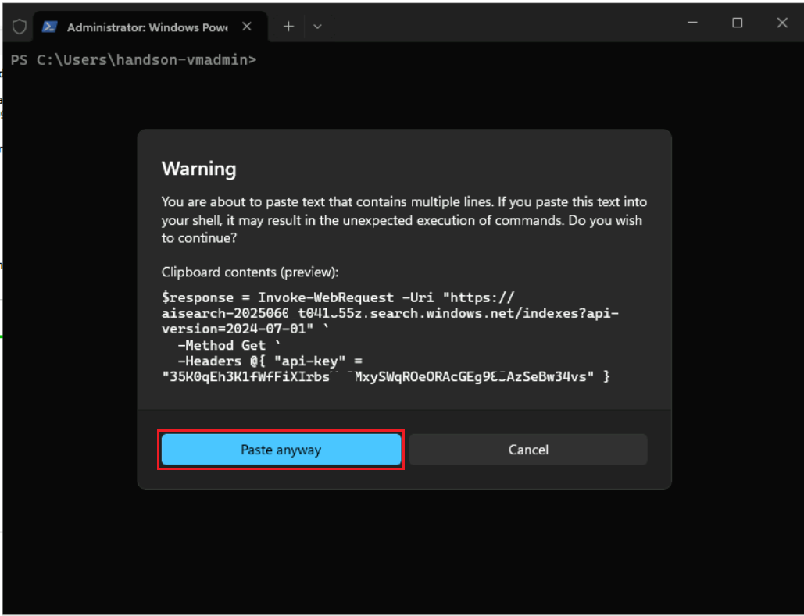    

    貼り付けられたコマンドを実行し、正しく応答が返ってくることを確認します。

    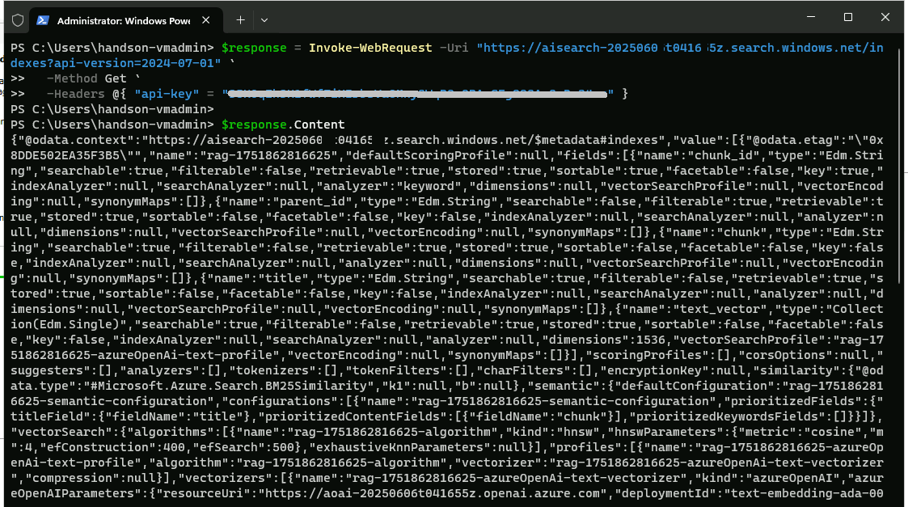

12. ローカルの開発環境のターミナル画面で、同じコマンドを実行しますが、ローカルの開発環境が Mac や Linux の場合は以下の Bash コマンドを使用します。メモ帳などを使用して以下のようにコマンド内の `%AISEARCH-ENDPOINT%` と `%AISEARCH-APIKEY%` の部分を実際の値に置き換えたコマンドを作成します

    ```bash
    curl -i -X GET "%AISEARCH-ENDPOINT%indexes?api-version=2024-07-01" -H "api-key: %AISEARCH-APIKEY%"
    ```

    コマンドを実行し、正しく応答が返ってくることを確認します。

13. この演習で使用している Azure AI Search へのインターネットからのアクセスを無効にします

    Azure ポータルで、Azure AI Searchのリソース画面を開き、画面左のメニューから \[設定\] - \[**ネットワーク**\] を選択します。

    遷移した画面で \[**ファイヤーウォールと仮想ネットワーク**\] タブ内の \[**無効**\] オプションボタンをクリックします。

    \[**このサービスのエンドポイント接続をプライベートにしますか?**\] という確認メッセージが表示されるので \[**OK**\] ボタンをクリックします。

    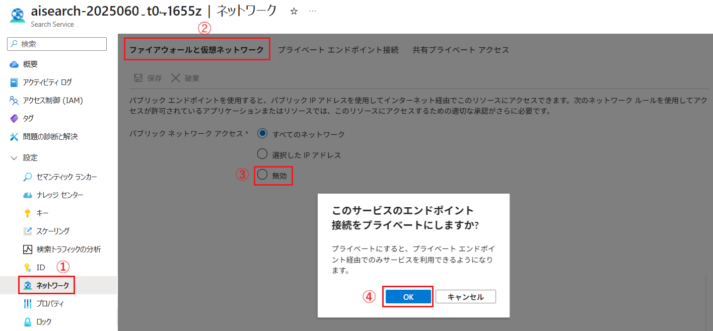

    画面下部の \[**保存**\] ボタンをクリックします
    
14. ローカルの開発環境のターミナル画面で、再度同じコマンドを実行し、以下のようなエラーが返されることを確認します

    ```json
    {"error":{"code":"","message":"Request is denied as the source is not allowed by applicable rules. The service is set 'publicNetworkAccess: Disabled'. Please review all service's network security settings to ensure the client is allowed."}}
    ```
15. 仮想マシンのターミナル画面に戻り、同じコマンドを実行し、仮想マシンでは正常に応答が返されることを確認します

     

ここまでの手順で、仮想ネットワーク環境内からのみ Azure AI Search のプライベートエンド ポイント にアクセスできるように構成しました。

なお、Azure AI Search では現在、サービス エンドポイントは設定できません。

<br>

## 4 : 仮想ネットワークのピアリング設定

ここまでの演習の作業により、このハンズオン環境にはリージョンの異なる以下の二つの仮想ネットワークが存在しています。

|仮想ネットワーク名|デプロイされたAzure リソース|
|:---|:---|
|**handson-eastus-vnet**|OpenAI サービス|
|**handson-jpeast-vnet**|AI Search サービス,仮想マシン,(App Service も追加します)|

これらの仮想ネットワーク内の Azure リソース同士は現状は通信できませんが、[仮想ネットワーク ピアリング](https://learn.microsoft.com/ja-jp/azure/virtual-network/virtual-network-peering-overview) 機能を使用して接続することができます。

このタスクでは、両仮想ネットワーク間でピアリングを設定し、両リージョン間で通信できるようにします。

具体的な手順は以下のとおりです。

\[**手順**▶️\]

1. [Azure ポータル](http://portal.azure.com)で、仮想ネットワーク **handson-jpeast-vnet** のプロパティ画面を開き、画面左のメニューから \[設定\] - \[**ピアリング**\] を選択します
   
   遷移した画面上部にある \[**+ 追加**\] ボタンをクリックします。

   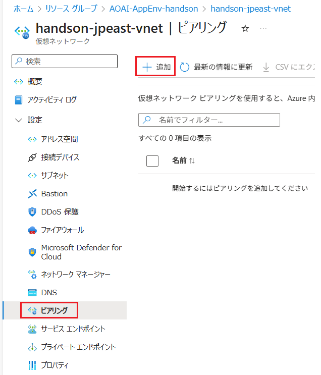

2. ピアリングの設定画面で、以下の情報を入力します。


    **リモート仮想ネットワークの概要**
   
    |項目|設定値|
    |:---|:---|
    |ピアリング リンクの名前 \*|`eastus-to-jpeast`|
    |仮想ネットワークのデプロイ モデル|\[**Resource Manager**\] にチェック|
    |リソース ID を知っている|*チェックしない*|
    |サブスクリプション|*使用するサブスクリプション*|
    |仮想ネットワーク \*|`handson-useast-vnet`|
    |トラフィックの許可|`この仮想ネットワークからのトラフィックを許可する`にチェック|

    **リモート仮想ネットワーク ピアリングの設定**

    |項目|設定値|
    |:---|:---|
    |'handson-eastus-vnet' に 'handson-jpeast-vnet' へのアクセスを許可する|**チェック**|
    |'handson-jpeast-vnet' からのトラフィック転送の受信を 'handson-eastus-vnet' に許可する|**チェック**|
    |'handson-eastus-vnet' 内のゲートウェイまたはルート サーバーに 'handson-jpeast-vnet' へのトラフィックの転送を許可する|**チェックしない**|
    |'handson-jpeast-vnet' のリモート ゲートウェイまたはルート サーバーを使用するために 'handson-eastus-vnet' を有効にする|**チェックしない**|

    **ローカル仮想ネットワークの概要**

    |項目|設定値|
    |:---|:---|
    |ピアリング リンクの名前 \*|`jpeast-to-eastus`|

    **ローカル仮想ネットワーク ピアリングの設定**
    
    |項目|設定値|
    |:---|:---|
    |'handson-jpeast-vnet' に 'handson-eastus-vnet' へのアクセスを許可する|**チェック**|
    |'handson-eastus-vnet' からのトラフィック転送の受信を 'handson-jpeast-vnet' に許可|**チェック**|
    |'handson-jpeast-vnet' 内のゲートウェイまたはルート サーバーに 'handson-eastus-vnet' へのトラフィックの転送を許可する|**チェックしない**|
    |'handson-eastus-vnet' のリモート ゲートウェイまたはルート サーバーを使用するために 'handson-jpeast-vnet' を有効にする|**チェックしない**|

   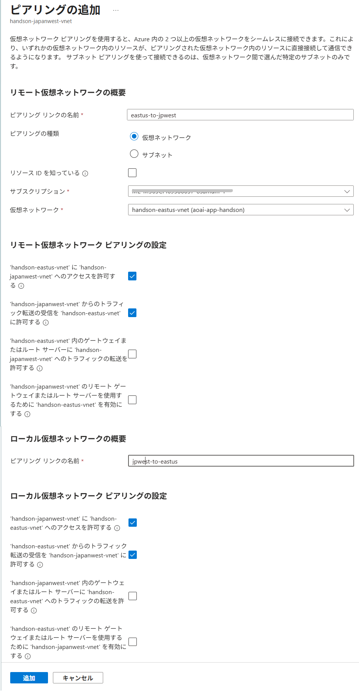

    設定が完了したら \[**追加**\] ボタンをクリックし、ピアリングを作成します。

    ここまでの手順で、仮想ネットワーク同士は通信可能になりましたが、名前解決はできない状態です。プライベート エンドポイント作成時に追加されたプライベート DNS ゾーンに [仮想ネットワークリンク](https://learn.microsoft.com/ja-jp/azure/dns/private-dns-virtual-network-links) を追加して名前解決できるようにします。

3. Azure ポータルで、リソース グループ **AOAI-AppEnv-handson** のプロパティ画面を開き、画面内にあるリソースの一覧からこの演習で使用している Azure OpenAI のプライベート エンドポイント作成時に自動的に作成されたプライベート DNS ゾーンをクリックします。

    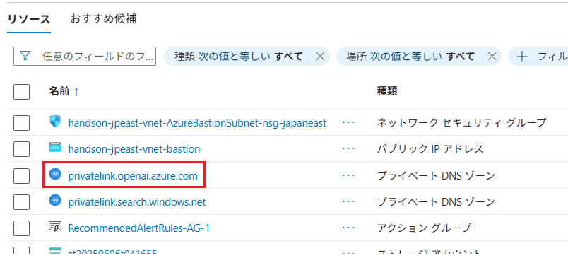

4. プライベート DNS ゾーンのプロパティ画面に遷移するので、画面左のメニューから \[設定\] - \[**仮想ネットワークリンク**\] を選択します

    遷移した画面上部にある \[**+ 追加**\] ボタンをクリックします

    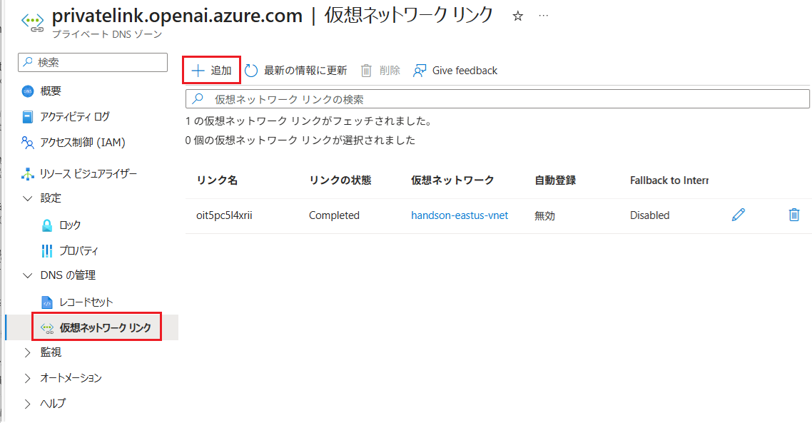

5. \[**仮想ネットワーク リンクを追加します**\] 画面に遷移するので、各項目を以下のように設定します

    |項目|設定値|
    |:---|:---|
    |リンク名|`for-jpeast-vnet`|
    |サブスクリプション \*|*お使いのサブスクリプション*|
    |仮想ネットワーク \*|`handson-jpeast-vnet`|
    |自動登録を有効にする|**チェック**(※)|
    |Enable fallback internet|チェックしない|

    (※)この設定により、仮想ネットワークに接続されている仮想マシンに対する、このプライベート DNS ゾーンでの DNS レコードの自動作成が可能になります。

    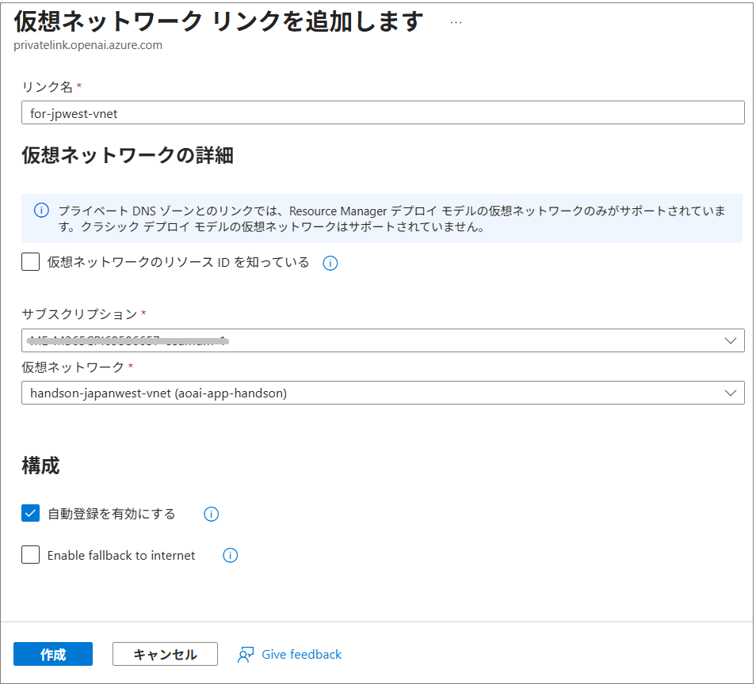

    設定が完了したら \[**作成**\] ボタンをクリックし、仮想ネットワークリンクを作成します。

    ここまでの手順で、両仮想ネットワーク間で名前解決ができるようになりました。

6. [タスク 3 : Azure 仮想マシンのデプロイと接続確認](#%E3%82%BF%E3%82%B9%E3%82%AF-3--azure-%E4%BB%AE%E6%83%B3%E3%83%9E%E3%82%B7%E3%83%B3%E3%81%AE%E3%83%87%E3%83%97%E3%83%AD%E3%82%A4%E3%81%A8%E6%8E%A5%E7%B6%9A%E7%A2%BA%E8%AA%8D) で仮想ネットワーク　**handson-jpeast-vnet** 内にデプロイした仮想マシンにから、仮想ネットワーク**handson-eastus-vnet** の内の Azure OpenAI サービスのエンドポイントにアクセスできることを確認します。

7. Bastion 経由で仮想マシンに接続し、Windows ターミナル画面を開きます。

    メモ帳などを使用して以下のようにコマンド内の %AOAI-ENDPOINT% と %AOAI-APIKEY% の部分を実際の値に置き換えたコマンドを作成します。

    ```powershell
    $uri = "%AOAI-ENDPOINT%/openai/deployments/gpt-4o-mini/chat/completions?api-version=2025-01-01-preview"
    $headers = @{
        "Content-Type" = "application/json"
        "api-key" = "%AOAI-APIKEY%"
    }
    $body = @{
        messages = @(
            @{
                role = "user"
                content = "こんにちは"
            }
        )
    } | ConvertTo-Json -Depth 3
    $response = Invoke-RestMethod -Uri $uri -Method Post -Headers $headers -Body $body
    $response 
    ```
    作成したコマンドをコピーし、仮想マシンのターミナル画面上でマウスの右ボタンをクリックして貼り付け、実行し、正常に応答が返ってくることを確認します。

    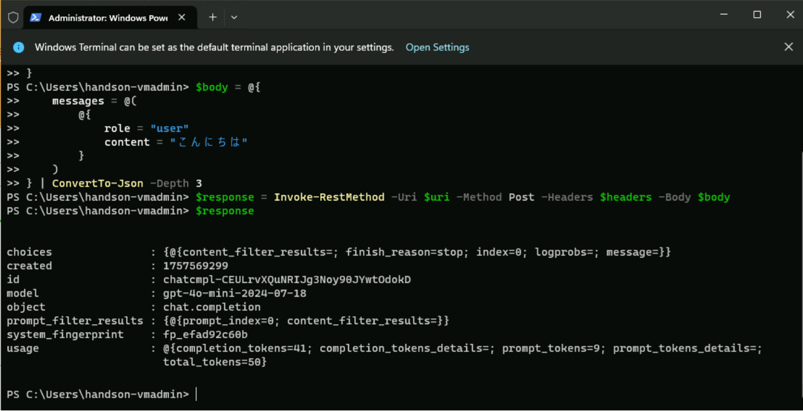

ここまでの手順で、異なるリージョンにデプロイされた二つの仮想ネットワーク間でピアリングを設定し、両リージョン間で通信できるようになりました。

<br>

## まとめ
この演習では、Azure AI Search サービスに対してプライベート エンドポイントを作成し、仮想ネットワーク環境内からのみアクセスできるように構成しました。

また、[演習 5-1](Ex05-1.md) で作成した仮想ネットワーク **handson-eastus-vnet** とこの演習で作成した仮想ネットワーク **handson-jpeast-vnet** 間でピアリングを設定し、両リージョン間で通信できるようにしました。

これで App Service にデプロイされている演習用アプリケーションが動作する際にアクセスする Azure OpenAI サービスと Azure AI Search サービスの両方が閉域化されましたが、この状態では App Service から両サービスにアクセスできません。

次の演習では、App Service から両サービスにアクセスできるようにするための設定を行い、演習用アプリケーションが正常に動作することを確認し、その後、App Service 自身も閉域化します。

<br>

## 次へ

👉　[**演習 5-3 : App Service からの閉域化されたサービスへのアクセス**](Ex05-3.md)

---

👈　[演習 5-1 : OpenAI サービスの閉域化設定](Ex05-1.md)

🏚️　[README に戻る](README.md)
