# 演習 5-3 : App Service からの閉域化されたサービスへのアクセス

この演習では、演習用アプリケーションがデプロイされた App Service から、ここまでの演習で閉域化されたAzure OpenAI サービスと Azure AI Search サービスにアクセスできるようにします。

その後、App Service 自身も閉域化し、インターネットに公開されないようにします。

実行する作業は以下のとおりです。

1. [App Service から仮想ネットワーク内のリソースへのアクセス設定](#%E3%82%BF%E3%82%B9%E3%82%AF-1--app-service-%E3%81%8B%E3%82%89%E4%BB%AE%E6%83%B3%E3%83%8D%E3%83%83%E3%83%88%E3%83%AF%E3%83%BC%E3%82%AF%E5%86%85%E3%81%AE%E3%83%AA%E3%82%BD%E3%83%BC%E3%82%B9%E3%81%B8%E3%81%AE%E3%82%A2%E3%82%AF%E3%82%BB%E3%82%B9%E8%A8%AD%E5%AE%9A)
2. [App Service の閉域化設定](#%E3%82%BF%E3%82%B9%E3%82%AF-2--app-service-%E3%81%AE%E9%96%89%E5%9F%9F%E5%8C%96%E8%A8%AD%E5%AE%9A)

 

## タスク 1 : App Service から仮想ネットワーク内のリソースへのアクセス設定

App Service から仮想ネットワーク内のリソースへのアクセスするには、目的の仮想ネットワークに App Service が接続するためのサブネットを作成し、App Service の [仮想ネットワーク統合](https://learn.microsoft.com/ja-jp/azure/app-service/overview-vnet-integration) 機能を使用して、App Service と仮想ネットワークを接続します。

>[!NOTE] なお、この設定はあくまでも App Service から仮想ネットワーク内のリソースへのアウトバウンド接続を可能にするものであり、仮想ネットワークから App Service へのインバウンド接続を可能にするものではありません。インバウンド接続を可能にするには、App Service に対して [プライベート エンドポイント](https://learn.microsoft.com/ja-jp/azure/app-service/networking/private-endpoint) を作成する必要があります。

具体的な手順は以下のとおりです。

\[**手順**\]

1. [Azure ポータル](https://portal.azure.com/)で、仮想ネットワーク **handson-jpeast-vnet** の画面を開きます
   
2. 遷移した画面左側のメニューから \[設定\] - \[**サブネット**\] をクリックし、遷移した画面上部のメニューから \[**+ サブネット**\] をクリックします

   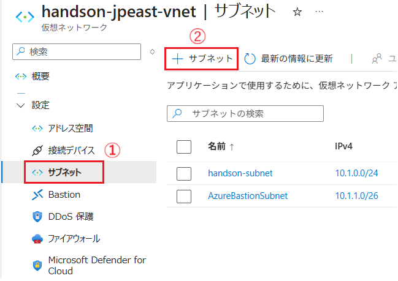

3. 画面左に \[**サブネットの追加**\] ブレードが表示されるので各項目を以下のように設定します

    |項目|設定値|
    |:---|:---|
    |目的|Default|
    |名前 \*|`botApp-subnet`|
    |IPv4 アドレス空間を含める |**チェック**|
    |IPv4 アドレスの範囲|(既定で設定されているもの)|
    |開始アドレス \*|(既定で設定されているもの)|
    |サイズ|(既定で設定されているもの)|
    |IPv6 アドレス空間を含める|チェックしない|
    |プライベート サブネットを有効にする (既定の送信アクセスなし)|チェックしない|
    |NAT ゲートウェイ|なし|
    |ネットワークセキュリティグループ|なし|
    |ルートテーブル|なし|
    |サービス|\[**Microsoft.web**\]|
    |サブネットをサービスに委任|\[**Microsoft.Web/serverFrams**\]|
    |プライベート エンドポイント ネットワーク ポリシー|無効|

    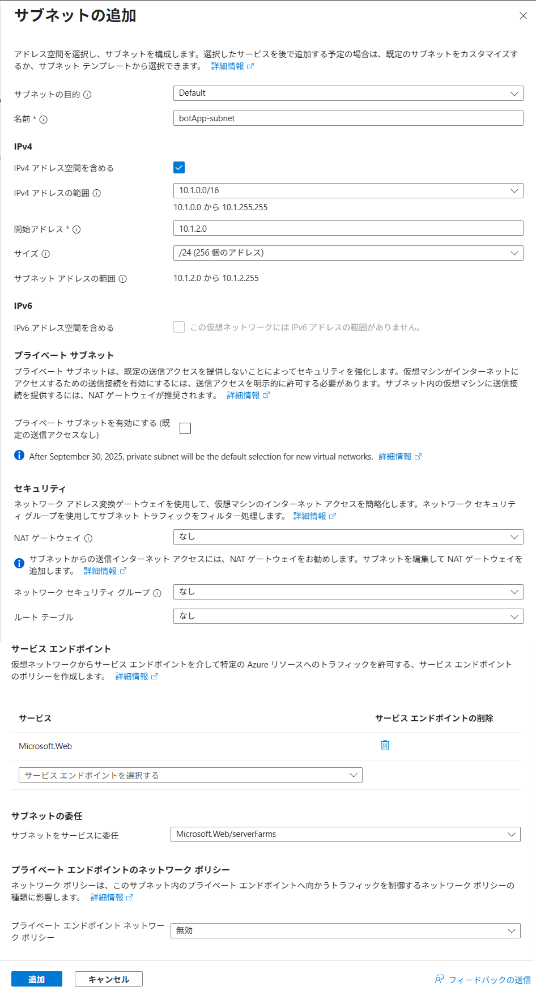

    設定が完了したら画面下部の \[**追加**\] ボタンをクリックすると、サブネットが作成されます。

4. アプリケーションがデプロイされている App Service (※Production のほう) の画面を開き、画面左側のメニューから \[設定\] - \[**ネットワーク**\] をクリックします

5. \[**ネットワーク**\] の画面に遷移するので、項目 \[**送信トラフィックの構成**] の \[**仮想ネットワーク統合**\] - \[**構成されていません**\]　をクリックします

   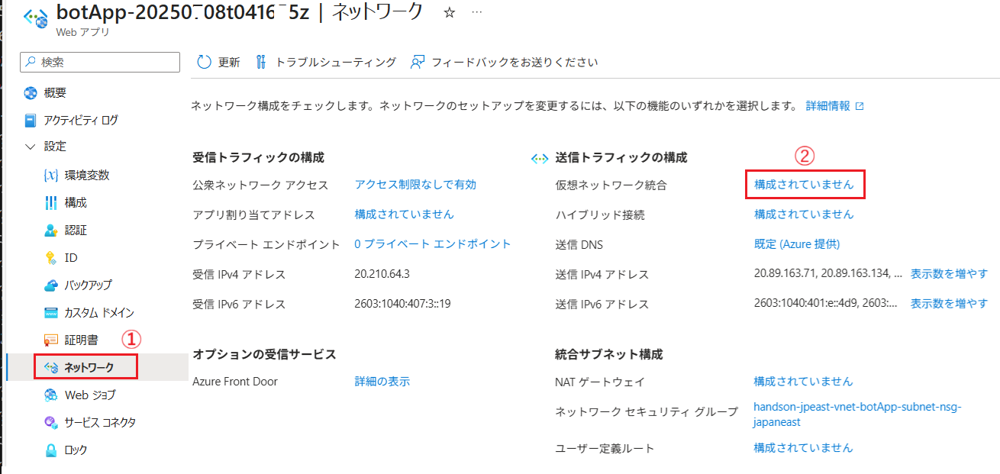

6. \[**仮想ネットワーク統合**\] の画面に遷移するので、\[**仮想ネットワーク統合の追加**\] ボタンをクリックします

   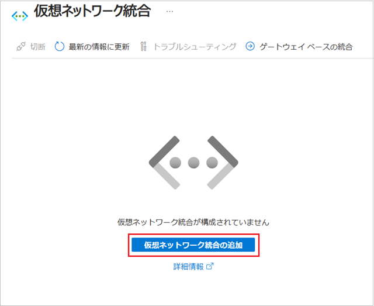

7. 画面右に \[**仮想ネットワーク統合の追加**\] ブレードが表示されるので各項目を以下のように設定します

    |項目|設定値|
    |:---|:---|
    |サブスクリプション |*お使いのサブスクリプション*|
    |仮想ネットワーク |\[**handson-jpeast-vnet**\]|
    |サブネット |\[**botApp-subnet**\]|

   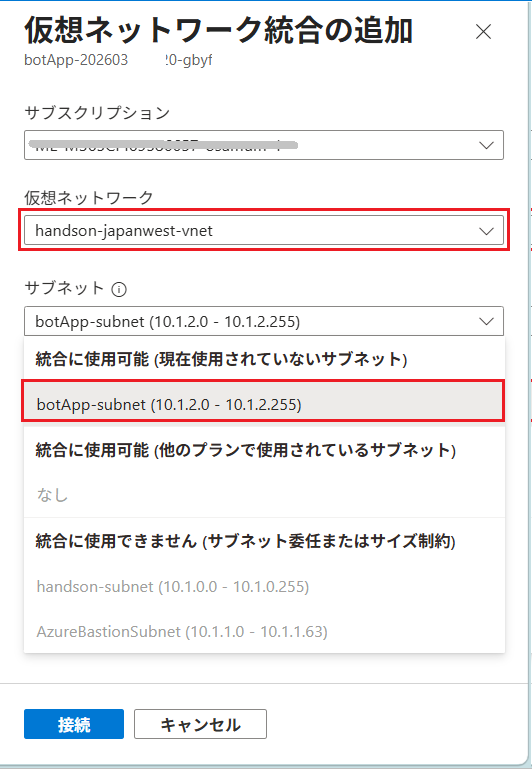

     設定が完了したら \[**接続**\] ボタンをクリックし、接続を開始します。

    接続が完了すると以下のような画面が表示されます。

   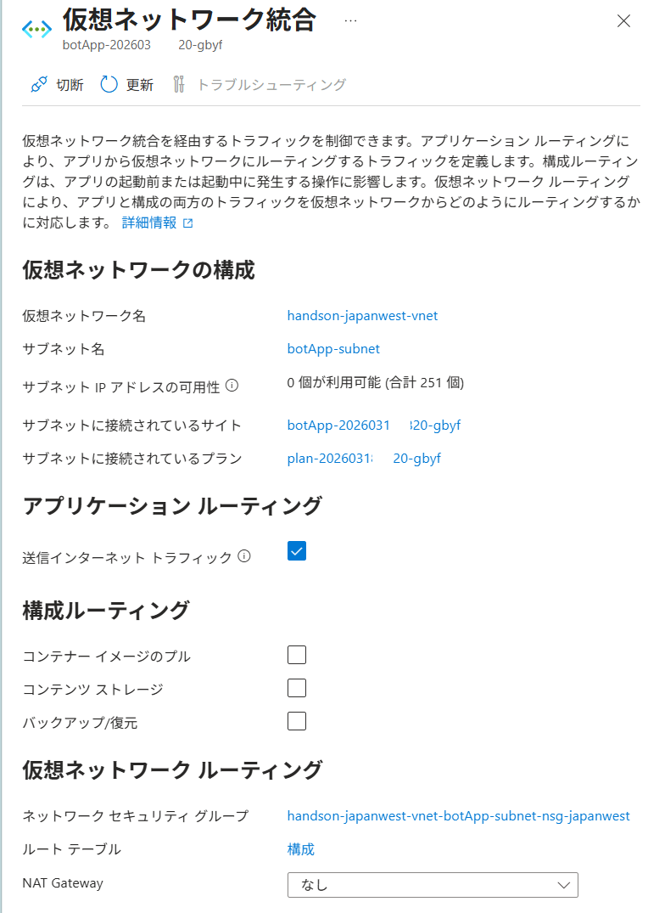

   \[通知\] メニューに 「仮想ネットワークに正常に接続されました」と表示されますが、実際に変更が反映されるまで数分かかる場合があります。

   画面右上の \[X\] ボタンをクリックして画面を閉じます。

8. 画面左のメニューから \[**概要**\] をクリックし、遷移した \[**概要**\] 画面内の \[**既定のドメイン**\] の URL をクリックすると、アプリケーションの UI が表示されるので、ボットと会話してみて、正常に動作することを確認します

   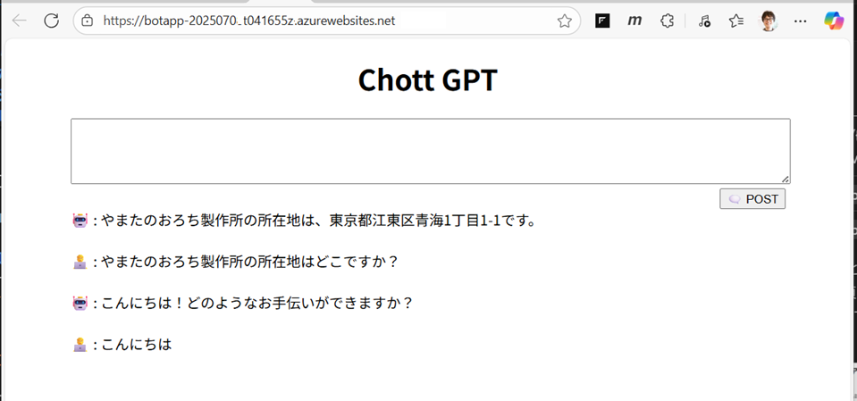

   もし、動作しない場合は、App Service \[概要\] 画面上部にある \[**再起動**\] ボタンをクリックして App Service を再起動してから、再度アプリケーションの UI を開いて動作を確認してください。

   それでも動作しない場合は、\[**ログストリーム**\] メニューを開いてエラーの内容を確認してください。

   

ここまでの手順で、App Service から仮想ネットワーク内のリソース (Azure OpenAI サービス、Azure AI Search サービス) へのアクセスが可能になりました。

なお、**Staging** スロットの App Service にも同様の設定を行わないと、Staging スロットのアプリケーションは動作しませんので、同様の手順で Staging スロットの App Service にも仮想ネットワーク統合の設定を行ってください。その際に使用するサブネットは、Production スロットの App Service と同じものを使用しても構いません。

 

## タスク 2 : App Service の閉域化設定

App Service から仮想ネットワーク内のリソースへのアクセスが可能になりましたが、仮想ネットワーク内のリソースから App Service へのアクセスはできません。

次の演習では、Application Gateway を使用し、仮想ネットワーク内の App Service にリクエストをルーティングします。そのため、App Service でプライベート エンドポイントを作成し、その後、パブリックネットワークからのアクセスを遮断します。

具体的な手順は以下のとおりです。

\[**手順**\]

1. App Service のプライベート エンドポイントが使用するサブネットを仮想ネットワーク **handson-jpeast-vnet** に作成します

   [Azure ポータル](https://portal.azure.com/)で、仮想ネットワーク **handson-jpeast-vnet** の画面を開きます

2. 遷移した画面左側のメニューから \[設定\] - \[**サブネット**\] をクリックし、遷移した画面上部のメニューから \[**+ サブネット**\] をクリックします

   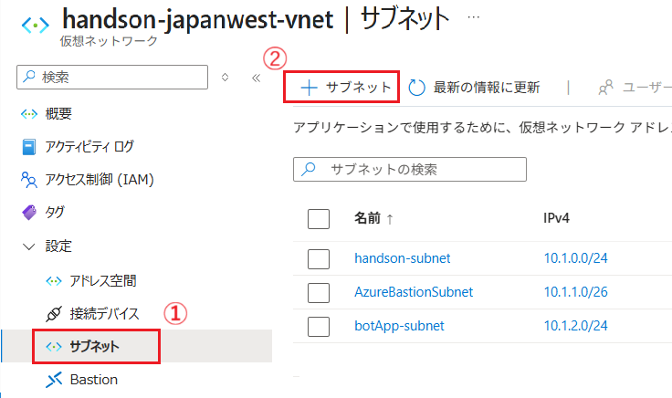

3. 画面右に \[**サブネットの追加**\] ブレードが表示されるので各項目を以下のように設定します

    |項目|設定値|
    |:---|:---|
    |目的|Default|
    |名前 \*|`botApp-PE-subnet`|
    |IPv4 アドレス空間を含める |**チェック**|
    |IPv4 アドレスの範囲|(既定で設定されているもの)|
    |開始アドレス \*|(既定で設定されているもの)|
    |サイズ|(既定で設定されているもの)|
    |IPv6 アドレス空間を含める|チェックしない|
    |プライベート サブネットを有効にする (既定の送信アクセスなし)|**チェック**|
    |NAT ゲートウェイ|なし|
    |ネットワークセキュリティグループ|なし|
    |ルートテーブル|なし|
    |サービス|\[**Microsoft.Web**\]|
    |サブネットをサービスに委任|\[**(なし)**\]|
    |プライベート エンドポイント ネットワーク ポリシー|\[**ネットワーク セキュリティ グループ**\]|

    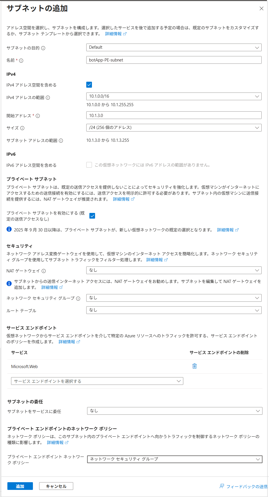

    設定が完了したら画面下部の \[**追加**\] ボタンをクリックすると、サブネットが作成されます。
 
4.  アプリケーションがデプロイされている App Service (※Production のほう) の画面を開き、画面左側のメニューから \[設定\] - \[**ネットワーク**\] をクリックします

5. \[**ネットワーク**\] の画面に遷移するので、\[**プライベート エンドポイント**\] - \[**0 プライベート エンドポイント**\] リンクをクリックします

   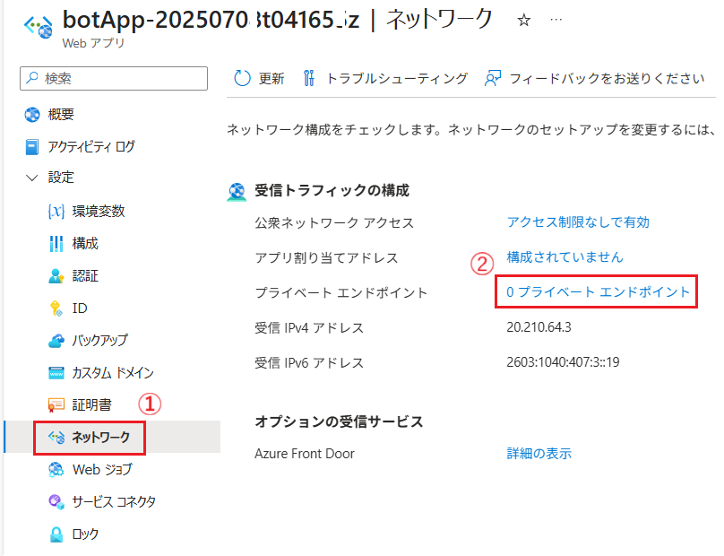

6. \[**プライベート エンドポイント接続**\] の画面に遷移するので、画面上部の \[**+ プライベート エンドポイントの追加**\] ボタンをクリックします

   

7. 画面右に \[**プライベート エンドポイントの追加**\] ブレードが表示されるので、各タブを以下のように設定します

   |項目|設定値|
   |:---|:---|
   |名前 \*|`subnet-botApp-privateEndpoint`|
   |サブスクリプション \*|*お使いのサブスクリプション*|
   |仮想ネットワーク \*|\[**handson-jpeast-vnet**\]|
   |サブネット \*|\[**botApp-PE-subnet**\]|
   |プライベート DNS の統合 \*|**はい**|

   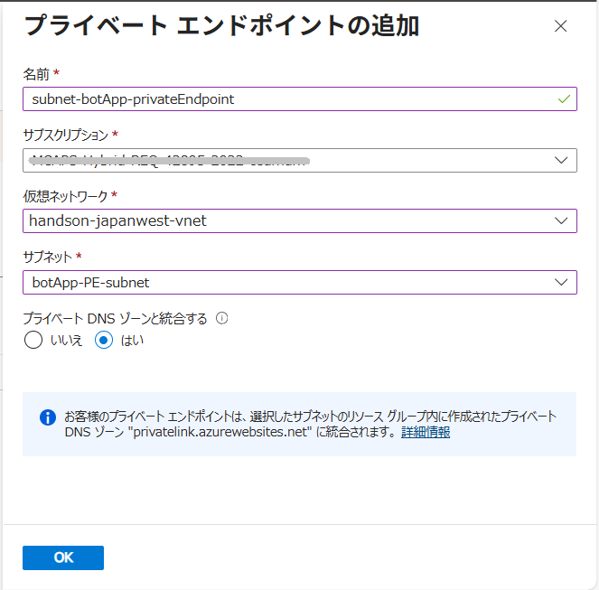

   設定が完了したら画面下部の \[OK\] ボタンをクリックします。

8. 仮想ネットワーク内にエンドポイントが作成されたので、パブリックネットワークからのアクセスを遮断します。

   App Service のメニュー \[**ネットワーク**\] 画面内で、項目 \[**受信トラフィックの構成**] の \[公衆ネットワーク アクセス\] - \[**アクセス制限なしで有効**\] リンクをクリックします

   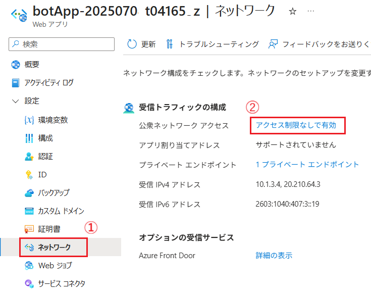

9. \[**アクセス制限**\] の画面に遷移するので、\[**無効**\] オプションボタンにチェックし、画面上部の \[保存\] ボタンをクリックします

   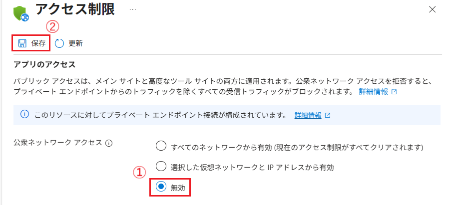

   \[**アクセスの更新の確認**\] 確認ボックスが表示されるので、\[**このチェックボックスをオンにすると、アクセス制限の更新に同意したことになります**\] チェックボックスにチェックを入れ、\[**続行**\] ボタンをクリックします。

   ここまでの、App Service は閉域化(仮想ネットワーク内からのみアクセス可能)され、インターネットからアクセスできなくなりました。

10. ローカル環境のブラウザで、演習用アプリケーションの URL にアクセスし、アクセスが拒否されることを確認します。

    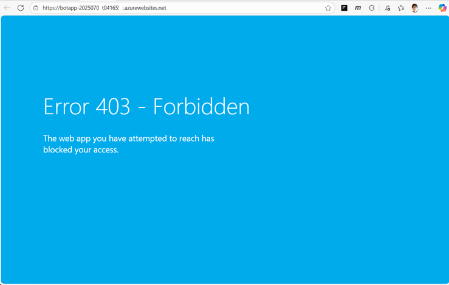

11. [演習 5-1-3](Ex05-1.md#%E3%82%BF%E3%82%B9%E3%82%AF-3--azure-%E4%BB%AE%E6%83%B3%E3%83%9E%E3%82%B7%E3%83%B3%E3%81%AE%E3%83%87%E3%83%97%E3%83%AD%E3%82%A4%E3%81%A8%E6%8E%A5%E7%B6%9A%E7%A2%BA%E8%AA%8D) で作成した仮想ネットワーク **handson-jpeast-vnet** に接続された Azure VM から、演習用アプリケーションの URL にアクセスし、演習用アプリケーションが使用できることを確認します。

    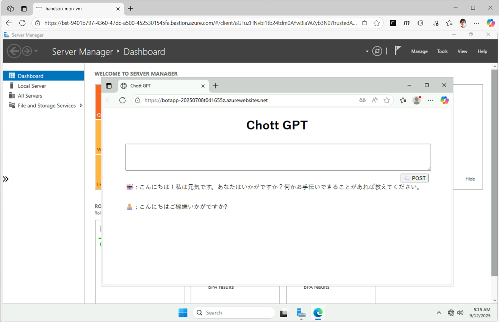

ここまでの手順で、演習用アプリケーションがデプロイされた App Service (Production 側)を閉域化し、仮想ネットワーク内からのみアクセス可能にしました。

 

## 補足 : 閉域化された Azure リソースの管理について

閉域化された Azure リソースは、インターネットからアクセスできないため、Azure ポータルから直接管理することができません。

今回閉域化された Azure リソースの管理を Azure ポータルから行うには、仮想ネットワーク内にデプロイされている仮想マシン内の Web ブラウザーからアクセスして行います。

今回のシナリオでは、アプリケーションのデプロイは、デプロイスロットを使用して、閉域化してしない App Service の Staging スロットに対して行い、動作確認後に Production スロットにスワップすることで対応します。

Staging スロットのパブリックネットワークからのアクセスが不安である場合は、デプロイを実施する間だけ起動し、それ以外は停止しておくことでパブリックネットワークからの脅威を低減できます。

運用ポリシーの関係で、Staging スロットも閉域化する必要がある場合は、Staging スロットにもプライベート エンドポイントを作成し、パブリックネットワークからのアクセスを遮断します。

この環境でのアプリケーションのデプロイ方法は以下のものが考えられます :

1. **仮想ネットワーク内にデプロイされた仮想マシンをジャンプボックスとして利用**
   
   VNET 内の仮想マシンに Bastion で接続し、手動で GitHub リポジトリのプロジェクトを pull し、Staging スロットの App Service に対してデプロイを行います。手動での作業となりますが、作業がないときは、仮想マシンを停止しておけるので経済的です。

2. **仮想ネットワーク内にデプロイされた仮想マシンに Github Actionsのself-hosted runner を構築する**

   VNET 内の仮想マシンに Github Actions の [**self-hosted runner**](https://docs.github.com/ja/actions/reference/runners/self-hosted-runners) を構築し、GitHub Actions で Staging スロットの App Service に対してデプロイを行います。デプロイが自動化されますが、仮想マシンを常時起動しておく必要があるため、コストがかかります。

3. **企業内の GitHub ホストランナー向けの Azure プライベート ネットワークを利用する**

   [GitHub Team プラン](https://docs.github.com/ja/get-started/learning-about-github/githubs-plans#github-team)を持つ Organization オーナーであれば、[GitHub ホストランナー向けの Azure プライベート ネットワーク](https://docs.github.com/ja/enterprise-cloud@latest/admin/configuring-settings/configuring-private-networking-for-hosted-compute-products/about-azure-private-networking-for-github-hosted-runners-in-your-enterprise)を利用できます。これを利用すると複数の VNET サブネットを GitHub に接続し、ランナー グループを介してランナーのプライベート リソース アクセスを管理できます。

 

## まとめ

この演習では、演習用アプリケーションがデプロイされた App Service から仮想ネットワーク内のリソースへのアクセス設定と、App Service の閉域化設定を行いました。

App Service に追加したプライベート リンクにより仮想ネットワーク内にエンドポイントが公開され、次の演習で追加される Application Gateway が仮想ネットワークを介して App Service にアクセスできるようになりました。

## 次へ

👉　[**演習 6 : Application Gateway を介した Web アプリケーションの公開**](Ex06.md)

---

👈　[演習 5-2 : AI Search の閉域化設定](Ex05-2.md)

🏚️　[README に戻る](README.md)