# 演習 5-4 : App Service へのカスタムドメインの設定

Azure App Service のエンドポイントに任意のカスタムドメインを設定する手順について説明します。

この手順は、サービスのフロントエンドとして、Azure Application Gateway や Azure Front Door を使用せず、直接インターネットから App Service にアクセスする場合や、 Application Gateway を介してアクセスする場合に cookie 等の設定上の利用(※1)で、App Service 側でカスタムドメインを設定したい場合に必要となります。

よって、Application Gateway で HTTPS を使用しない(※2)や、 Application Gateway で SSL 終端を行い、App Service にはパブリック ドメイン名でアクセスする場合などは、この演習をスキップしても問題ありません。

(※1) これについては Azure テクニカル サポートのブログ [**Application Gateway - App Service 間のリダイレクトの問題**](https://jpaztech.github.io/blog/network/appgw-appservice-redirectissue/) をご参照ください。

(※2) セキュリティ上の観点から、インターネットに公開する場合は HTTPS を使用ないことは推奨されません。

## 前提条件

この演習では、以下のものが必要です。

- 有効な独自ドメイン (例: `contoso.com` など)
  
  サードパーティーのドメイン レジストラで取得したドメインで構いませんが Azure ポータルから直接購入することができます。今回の手順ではドメイン名の購入方法には触れませんので、Azure ポータルからのドメイン名を購入する方法については [**App Service ドメインの購入と管理**](https://learn.microsoft.com/ja-jp/azure/app-service/manage-custom-dns-buy-domain) をご参照ください。

- 証明書ファイル\(Application Gateway 等のサービスと連携する必要がある場合\) 

    App Service でカスタムドメインを設定すると、[無料のマネージド証明書が生成され HTTPS 通信が可能になります](https://learn.microsoft.com/ja-jp/azure/app-service/configure-ssl-certificate?tabs=apex%2Crbac%2Cazure-cli#create-a-free-managed-certificate)。この証明書は HTTPS 通信を行うための基本的要件を満たしており更新も自動的に行われます。よって、一般的な Web サイトや社内向けアプリなど、
「証明書を単純に HTTPS 用として使えれば良い」という用途であれば、
無料マネージド証明書で十分であるため、外部の証明書を用意する必要はありません。

    しかし、この証明書は pfx や cer などの形式でエクスポートすることができません。そのため、Application Gateway や CDN、他サービスでも同じ証明書を使いたい場合は外部の証明書を用意する必要があります。

    また、企業法務ポリシーや 複数の SAN\(Subject Alternative Name\)の指定など、無料マネージド証明書では対応できない要件がある場合も、外部の証明書を用意する必要があります。

この演習で実行する作業は以下のとおりです。

1. [Key Vault への証明のアップロード (※)](#1-key-vault-%E3%81%B8%E3%81%AE%E8%A8%BC%E6%98%8E%E3%81%AE%E3%82%A2%E3%83%83%E3%83%97%E3%83%AD%E3%83%BC%E3%83%89)
2. [App Service へのカスタムドメインの追加](#2-app-service-%E3%81%B8%E3%81%AE%E3%82%AB%E3%82%B9%E3%82%BF%E3%83%A0%E3%83%89%E3%83%A1%E3%82%A4%E3%83%B3%E3%81%AE%E8%BF%BD%E5%8A%A0)

(※SSL に外部証明書を使用する場合、Application Gateway 等のサービスと SSL を使用して通信する場合に必要)

 

## 1. Key Vault への証明のアップロード 

>[!NOTE] 
> この手順は、App Service で無料マネージド証明書を使用する場合は不要です。外部の証明書を使用する場合にのみ実行してください。なお、演習 6 で Appication Gateway で SSL を設定する場合はこの手順を実行してください。

Azure App Service のカスタムドメインの HTTPS 通信に使用する証明書を安全に保持するため、証明書をAzure Key Vault にアップロードします。

具体的な手順は以下のとおりです。

\[**手順**▶️\]

1. [Azure ポータル](https://portal.azure.com/)で、[演習 4-1 : Key Vault へのキーの登録と利用](Ex04-1.md#1--azure-key-vault-%E3%81%AE%E4%BD%9C%E6%88%90%E3%81%A8api-%E3%82%AD%E3%83%BC%E3%81%AE%E7%99%BB%E9%8C%B2) で作成した Key Vault の画面を開き、画面左側のメニューから \[オブジェクト\] - \[**証明書**\]をクリックします

    遷移した画面の上部にある \[**+ 生成/インポート**\] ボタンをクリックします

    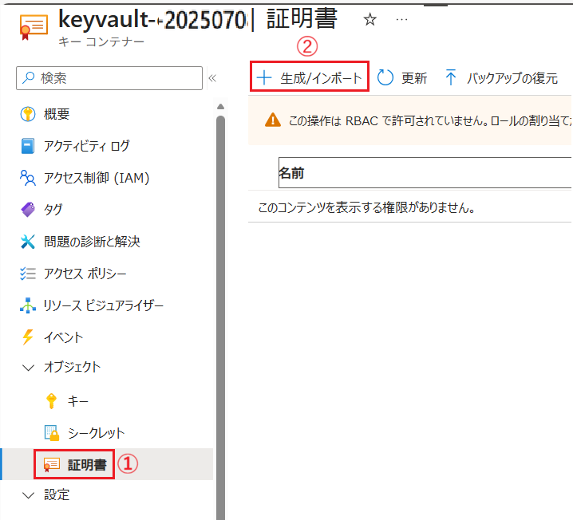

2. \[**証明書の作成**\] 画面の各項目を以下のように設定します

    | 項目 | 設定内容 |
    |---|---|
    | 証明書の作成方法 | \[**インポート**\] を選択 |
    | 証明書の名前 | *任意の名前*|
    | 証明書ファイルのアップロード| 📁 マークのボタンをクリックして、ローカルの証明書ファイル(*.pfx)を選択 |
    | パスワード | 証明書ファイルのパスワードを入力 |

    各項目を設定したら、画面下部の \[**作成**\] ボタンをクリックします

    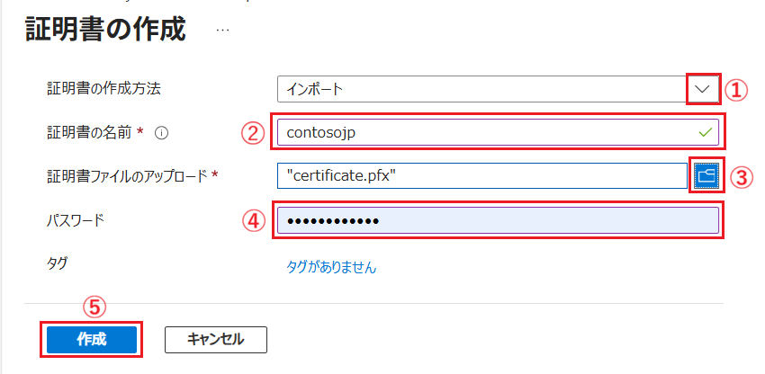

    \[**証明書**\] 画面に戻るので、アップロードした証明書が表示されていることを確認します

    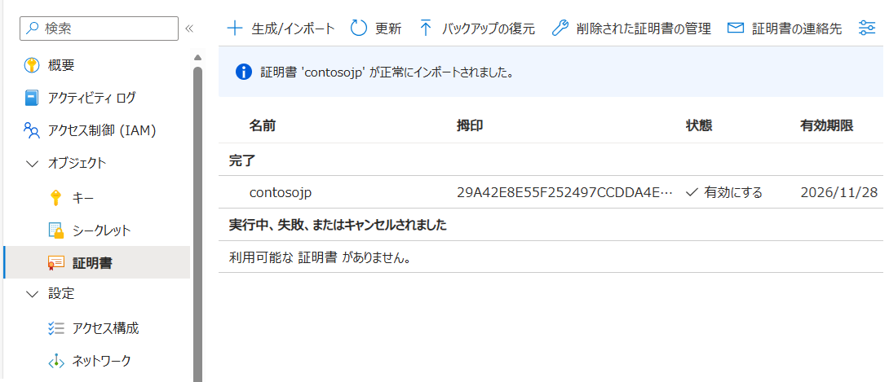

3. App Service から Key Vault の証明書にアクセスできるように、Key Vault のアクセス ポリシーを設定します。手順については [App Service から Key Vault へのアクセス許可設定](https://github.com/osamum/aoai-app-basic-hosting/blob/main/Ex04-1.md#3-1--app-service-%E3%81%8B%E3%82%89-key-vault-%E3%81%B8%E3%81%AE%E3%82%A2%E3%82%AF%E3%82%BB%E3%82%B9%E8%A8%B1%E5%8F%AF%E8%A8%AD%E5%AE%9A) と同様ですが、付与する権限は **Key Vault Certificates User** です。

    なお、この権限は App Service の権限付与 UI のドロップダウンボックスに既定では表示されないので、以下のように 検索ボックスに `certificate` と入力して検索してください。

    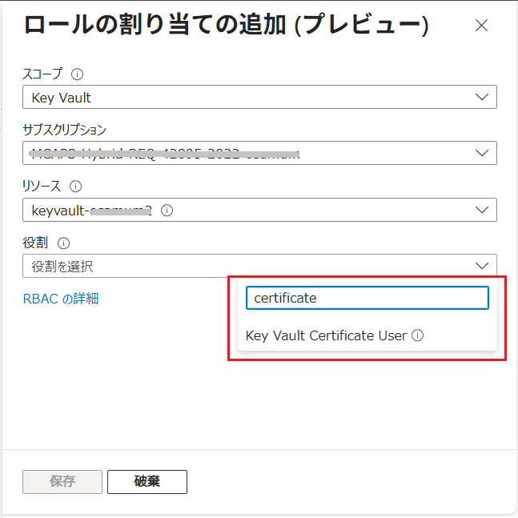

ここまでの手順で Key Vault への証明書のアップロードは完了し、 App Service から証明書にアクセスできるようになりました。

 

## 2. App Service へのカスタムドメインの追加

Azure App Service にカスタムドメインを追加します。

なお、これにはドメイン登録サービス取得したドメイン名と、そのドメインの DNS レコードでの作業が必要です。

具体的な手順は以下のとおりです。

\[**手順**▶️\]

1. [Azure ポータル](https://portal.azure.com/)で、演習用アプリケーションの App Service の画面を開き、画面左側のメニューから \[設定\] - \[**カスタム ドメイン**\] をクリックします

    遷移した画面の上部にある \[**+ カスタム ドメインの追加**\] ボタンをクリックします

    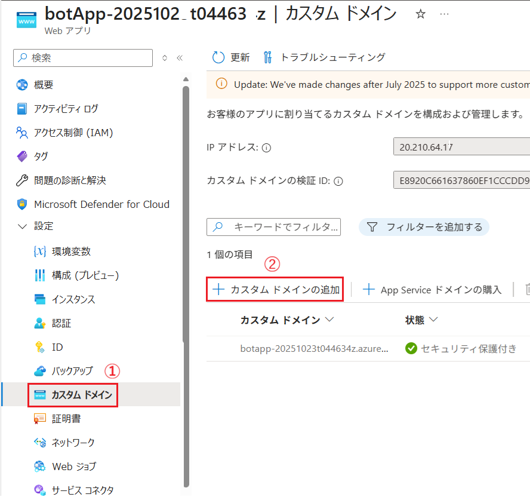

2. 画面右に \[**カスタム ドメインの追加**\] ブレードが表示されるので、各項目を以下のように設定します

    | 項目 | 設定内容 |
    |---|---|
    | ドメイン プロバイダー \*| \[**その他のすべてのドメイン サービス**\] |
    | TLS または SSL 証明書 \*| \[**後で証明書を追加**\] (※1)|
    | ドメイン名 \* | 追加するカスタムドメイン名 (例: `www.contoso.com`) |
    |ホスト名レコードの種類 \* | \[**CNAME**\] (※2)|

    (※1) Application Gateway 等のサービスと連携せず、App Service をそのままインターネットに公開して使用する場合は \[**App Service マネージド証明書**\] を選択すると無料のマネージド証明書が生成され HTTPS 通信が可能になります。 この場合、証明書の追加手順は不要です。

    (※2) App Service はプランによってパブリック IP アドレスが変更される場合があるため CNAME レコードを指定しています。IP アドレスで指定を行う場合には A レコードを使用する場合は \[**A Record**\] を選択し、以降の手順も A レコード用に読み替えてください。

    ここまでの設定の入力を行うと、画面下部に **CNAME** と **TXT** の情報が表示されるので、ドメイン登録サービスが管理しているサービスに DNS レコードとして追加します。

    その後、同ブレードの画面下部の \[**検証**\] ボタンをクリックして DNS レコードの設定が正しいことを確認します。

    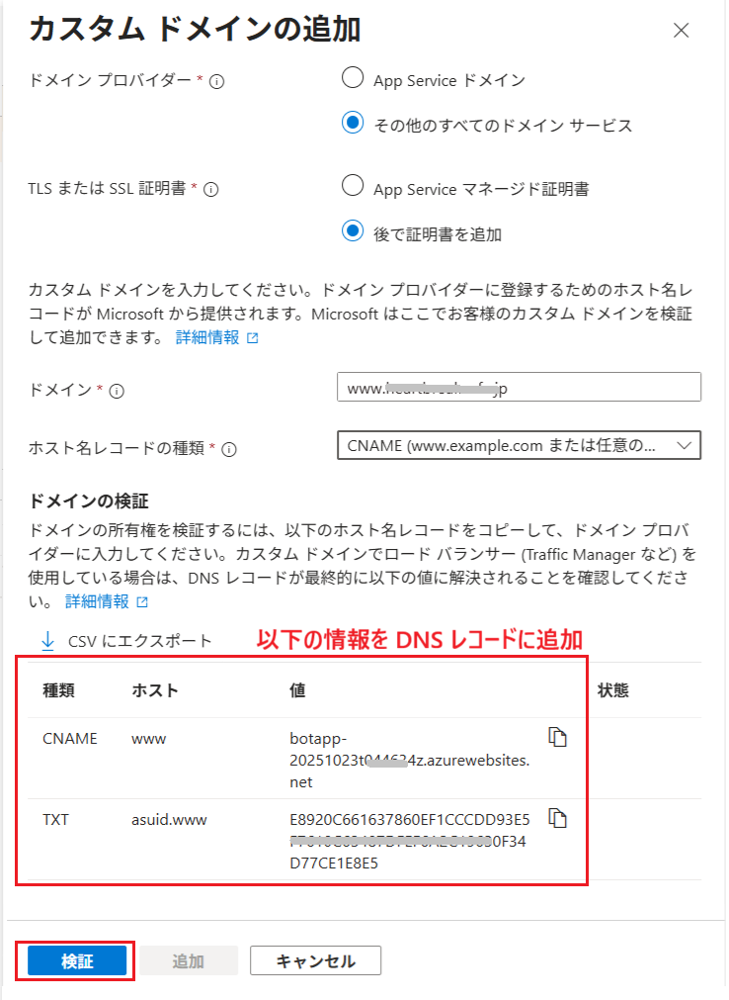

    `検証に合格しました。選択 追加 これで完了です。` と表示されたら、画面下部の \[**追加**\] ボタンをクリックします

    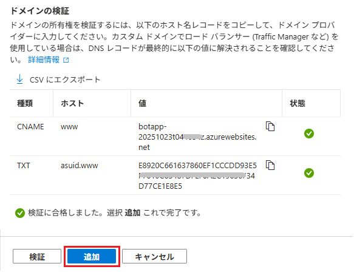

3. \[**カスタム ドメイン**\] 画面に戻るので、追加したカスタムドメインが表示されていることを確認します

    \[**状態**\] のカラムが `バインディングなし` となっている(※)ので、その横の \[**バインドの追加**\] ボタンをクリックします

    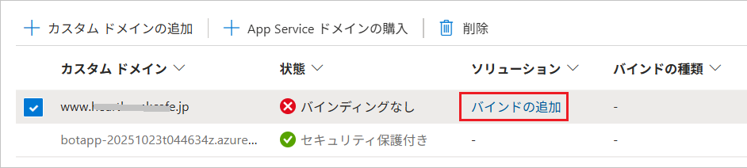

    (※) カスタム ドメインを追加する際の設定で `App Service マネージド証明書` を選択した場合は、証明書の生成が完了すると有効化されます。また\[**バインドの追加**\]は不要です。

    \[**TLS/SSL バインドの追加**\] ブレードが表示されるので、各項目を以下のように設定します

    | 項目 | 設定内容 |
    |---|---|
    | 証明書 \*| \[**新しい証明書の追加**\] |
    | TLS/SSL の種類 \* | \[**SNI SSL**\] にチェック|
    |ソース \* | \[**キーコンテナーからインポートする**\] |

    画面下部に表示される \[**キー コンテナーの証明書の選択**\] ボタンをクリックします。

    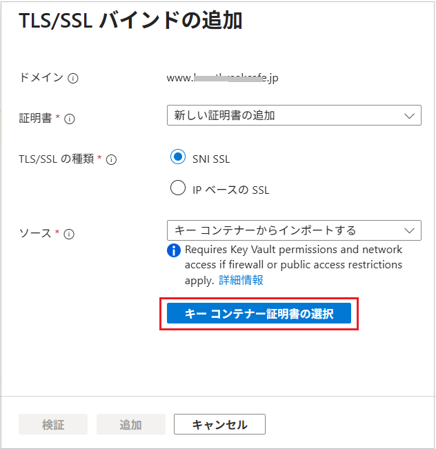

4. \[**Azure Key Vault からの証明書の選択**\] ブレードが表示されるので、以下のように各項目を設定します

    | 項目 | 設定内容 |
    |---|---|
    | サブスクリプション \*| *お使いのサブスクリプション* |
    | キー コンテナー \*| *証明書をアップロードしたKey Vault* |
    | 証明書 \* | *アップロードした証明書* |

    各項目を設定したら、画面下部の \[**選択**\] ボタンをクリックします。

    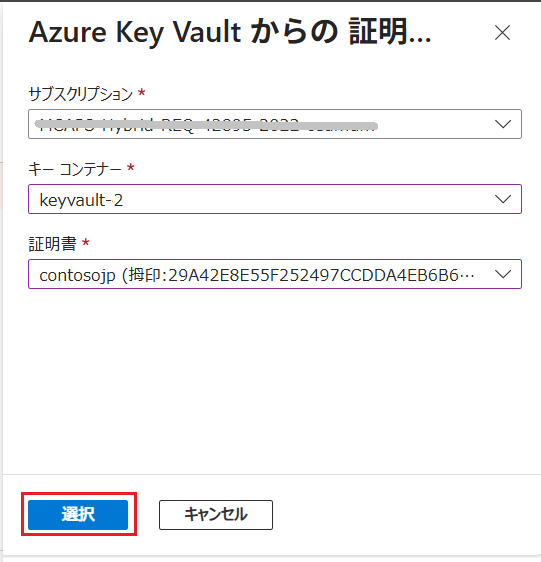

5. \[**TLS/SSL バインドの追加**\] ブレードに戻るので、画面下部の \[**検証**\] ボタンをクリックし、`この証明書を使用して、このカスタム ドメインをセキュリティで保護できます。` と表示されたら、画面下部の \[**追加**\] ボタンをクリックします

    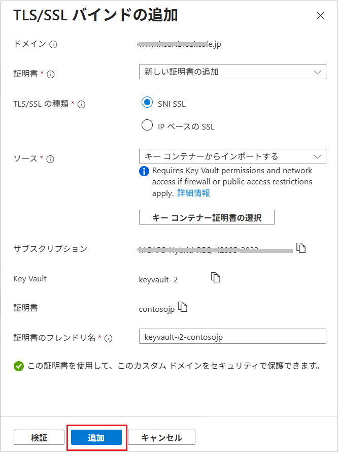
   
   インポートが開始され、完了すると \[**カスタム ドメイン**\] 画面に追加したドメインがリストされます。

    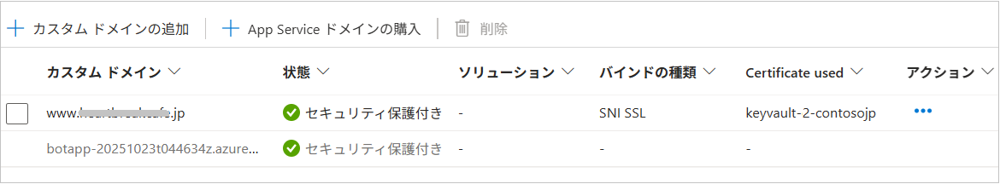

ここまでの手順で App Service へのカスタムドメインの追加は完了です。

Web ブラウザーで `https://<カスタムドメイン名>/` にアクセスして、演習用アプリケーションの画面が表示されることを確認してください。

なお、App Service の自動認証を使用している場合は、Microsoft Entra ID の画面を開き、\[**アプリの登録**\] メニューの \[**すべてのアプリケーション**\] タブで App Service の名前を検索してクリックしてください。

遷移した画面の左側のメニューから \[管理\] - \[**認証**\] をクリックし、遷移した画面上部の \[**+ リダイレクト URL の追加**\] ボタンをクリックして、表示されたブレードで \[**Web**\] を選択し、以下の認証用リダイレクト URL を追加してください。

`https://<カスタムドメイン名>/.auth/login/aad/callback` 

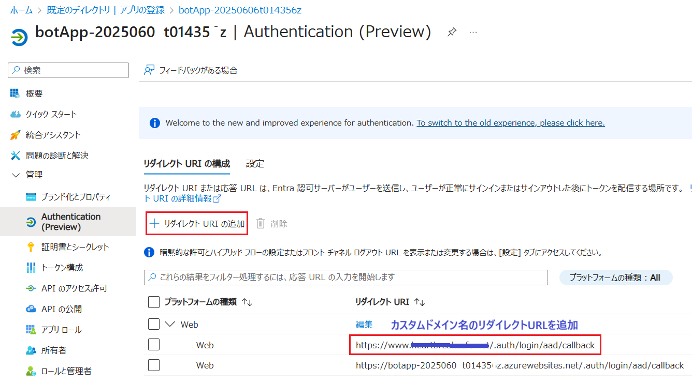

この設定を行うことで、App Service の自動認証がカスタムドメイン経由でアクセスした場合にも正しく動作するようになります。

 

ここまでの作業で演習用アプリケーションにカスタムドメインが追加され、Web ブラウザーで `https://<カスタムドメイン名>/` にアクセスして、演習用アプリケーションの画面が表示されるようになりました。

### 参考

* [**概要: Azure App Service でカスタム ドメイン名を使用する**](https://learn.microsoft.com/ja-jp/azure/app-service/overview-custom-domains)

## 次へ

👉　[**演習 6 : Application Gateway を介した Web アプリケーションの公開**](Ex06.md)

---

👈　[演習 5-3 : App Service からの閉域化されたサービスへのアクセス](Ex05-3.md)

🏚️　[README に戻る](README.md)