# 演習 6-1 : Application Gateway を介したアプリケーションの公開(HTTPS)

[演習 5-3](Ex05-3.md) で仮想ネットワーク内に閉域化されてた App Service に対して、Application Gateway を介してインターネットからアクセスできるように構成します。

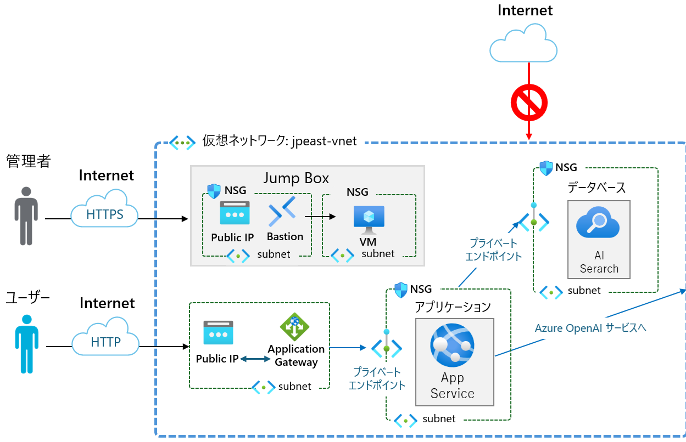

Azure Application Gateway は、Web アプリケーションに対するトラフィックを管理できる Web トラフィック (OSI レイヤー 7) ロード バランサーです。 Application Gateway では、URI パスやホスト ヘッダーなど、HTTP 要求の追加属性に基づいてルーティングを決定できます。

Azure Application Gateway が提供する機能の詳細については以下のドキュメントを参照してください。

* [**Azure Application Gateway の機能**](https://learn.microsoft.com/ja-jp/azure/application-gateway/features)

このタスクでは Application Gateway 用に新規に仮想ネットワークを追加し、この仮想ネットワークとサブネットに対して App Service ネットワーク設定でアクセスを許可するルール設定を行います。

## この演習で構成する通信の仕様について

この演習では Application Gateway と Web ブラウザーなどのクライアント間は HTTPS 通信を行います。

 Application Gateway で HTTS で使用する SSL の終端を行い、バックエンド プールとして登録した App Service とは HTTP 通信を行う構成とすると App Service の負荷を軽減でき、構成も簡単になります。
 
 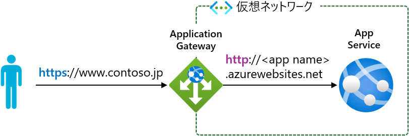
 
 
 しかし、近年の Web アプリケーションの SDK やミドルウェアなどで HTTPS 通信を前提としているものが多いため、この演習では Application Gateway と App Service 間も HTTPS 通信を行う構成とします。

 Application Gateway とバックエンド プールとして登録した App Service 間で HTTPS 通信を行う場合、[Application Gateway 側にのみカスタム ドメインを設定し、App Service 側には App Service 既定のドメイン名(FQDN)でアクセスする](https://learn.microsoft.com/ja-jp/azure/application-gateway/configure-web-app?tabs=defaultdomain%2Cazure-portal)場合などは、App Service 側でカスタム ドメインを設定する必要はありません。

  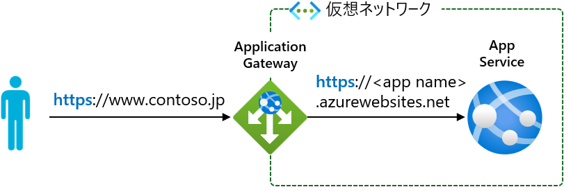
 

 しかし、以下のサポート ブログに記載されているように、Application Gateway のフロント エンドにカスタム ドメインを設定しており、バックエンドに指定した App Service 側でリダイレクトの応答が返されるシナリオでは前述の構成だと意図せず App Service の 既定の FQDN が利用されてしまい期待した動作とならない場合があります。 

 * [**Application Gateway - App Service 間のリダイレクトの問題**](https://jpaztech.github.io/blog/network/appgw-appservice-redirectissue/)
  
この問題の対処方法として上記のブログ記事では 2 つの方法が紹介されています。

1 つは [Application Gateway の書き換え規則を使い、リダイレクト URL を書き換える方法](https://jpaztech.github.io/blog/network/appgw-appservice-redirectissue/#application-gateway-rewrite)ですが、この方法では referer ヘッダーや Cookie などにもドメインが含まれていて書き換えでの対応が複雑となる場合には対応できません。

この演習では、もう 1 つの方法である [カスタム ドメインをつかう](https://jpaztech.github.io/blog/network/appgw-appservice-redirectissue/#%E3%82%AB%E3%82%B9%E3%82%BF%E3%83%A0-%E3%83%89%E3%83%A1%E3%82%A4%E3%83%B3%E3%82%92%E3%81%A4%E3%81%8B%E3%81%86)を参考に、App Service 側にもカスタム ドメインを設定し、Application Gateway と App Service 間も HTTPS 通信を行う構成とします。

 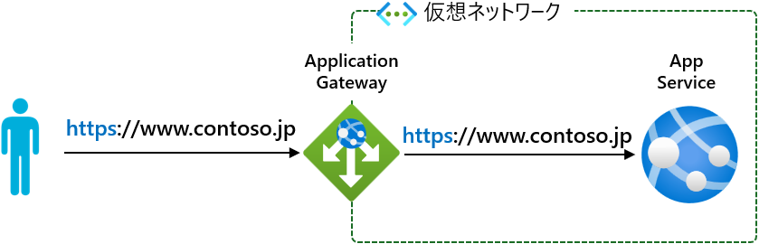

この演習で実施する作業は以下の通りです。

**準備**

1. バックエンド検明書（.cer）のダウンロード
2. 演習用 App Service へのバックエンド証明書の追加
3. App Service プライベート エンドポイントのカスタム ドメイン用プライベート DNS ゾーンの追加

**Application Gateway の追加**

1. [Application Gateway 用サブネットの追加](#1-application-gateway-%E7%94%A8%E3%82%B5%E3%83%96%E3%83%8D%E3%83%83%E3%83%88%E3%81%AE%E8%BF%BD%E5%8A%A0)
2. [Application Gateway の作成](#2-application-gateway-%E3%81%AE%E4%BD%9C%E6%88%90)

<br>

## 準備

Application Gateway がバックエンド プールの App Service と HTTPS で通信する際必要になるバックエンド検証用証明書（.cer）をダウンロードし、演習用 App Service に追加します。

また、演習用 App Service を Application Gateway のバックエンド プールとして指定する際、カスタムドメイン名が名前解決できるように App Service のプライベートエンドポイント用のプライベート DNS ゾーンを追加します。

### 1. バックエンド検明書（.cer）のダウンロード

 App Service に設定した SSL 証明書の公開鍵部分を公開キー証明書( .cer )ファイルとしてダウンロードします。この作業は Key Vault にアップロードした証明書からバックエンド検証用証明書（.cer）をダウンロードします。

 この手順を実行するには、[演習 5-4 : App Service へのカスタムドメインの設定](Ex05-4.md) で App Service に設定した SSL 証明書が Key Vault にアップロードされている必要があります。

 なお、コマンド等を使用してすでに バックエンド検証用証明書（.cer）を抽出済みの場合は、この手順をスキップして構いません。

具体的な手順は以下のとおりです。

\[**手順**▶️\]

1. [Azure ポータル](https://portal.azure.com/)にログイン、[演習 4-1](Ex04-1.md#1--azure-key-vault-%E3%81%AE%E4%BD%9C%E6%88%90%E3%81%A8api-%E3%82%AD%E3%83%BC%E3%81%AE%E7%99%BB%E9%8C%B2) で作成した Key Vault の画面を開きます

2. 画面左側のメニューから \[オブジェクト\] - \[**証明書**\]をクリックします
   
   遷移した画面に [演習 5-4-1 Key Vault への証明のアップロード](Ex05-4.md#1-key-vault-%E3%81%B8%E3%81%AE%E8%A8%BC%E6%98%8E%E3%81%AE%E3%82%A2%E3%83%83%E3%83%97%E3%83%AD%E3%83%BC%E3%83%89) でアップロードした証明書がリストされるのでクリックします

   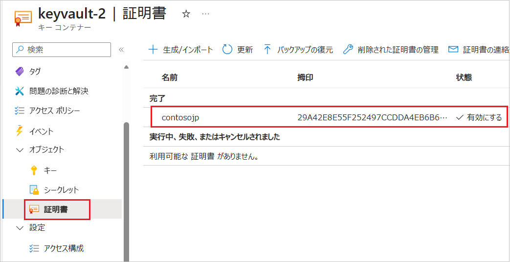

3. 証明書のバージョンがリストされるので、最新のバージョンをクリックします

    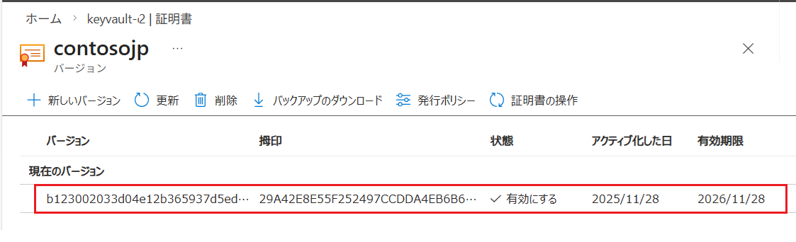

4. 遷移した画面の上部にある \[**↓ CER 形式でダウンロード**\] ボタンをクリックします

    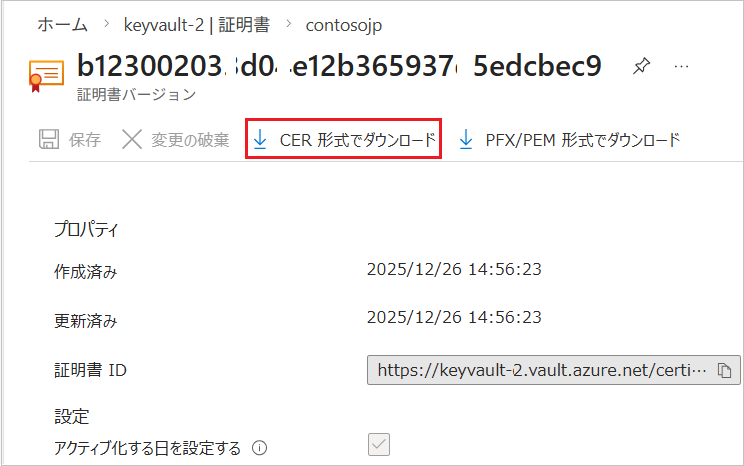

    Web ブラウザーによっては以下のような警告が表示される場合がありますが、証明書をダウンロードして任意のフォルダーに保存してください。
    
    `<証明書名>.cer はデバイスに問題を起こす可能性があります。このまま保持しますか?`

    また、同タブ内の \[**シークレット識別子**\] の内容もコピーしておいてください。この値は手順 [2.Application Gateway の作成](2-application-gateway-%E3%81%AE%E4%BD%9C%E6%88%90) のバックエンドプールの \[リスナー\]タブの設定で使用します。

    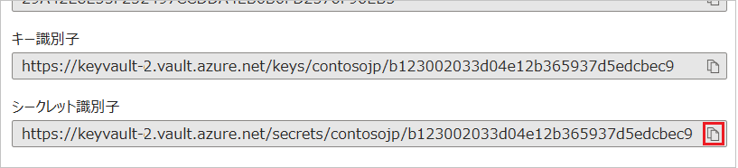

ここまでの作業でバックエンド検証用証明書（.cer）を取得することができました。

この検証用証明書は App Service と Application Gateway の両方で使用します。

<br>　　

### 2. 演習用 App Service へのバックエンド証明書の追加

前の作業でダウンロードしたバックエンド検証用証明書（.cer）を演習用 App Service に追加します。

具体的な手順は以下のとおりです。

\[**手順**▶️\]

1. [Azure ポータル](https://portal.azure.com/)で、演習用 App Service の画面を開き、画面左側のメニューから \[設定\] - \[**証明書**\]をクリックします

    \[証明書\] の画面に遷移するので \[**公開キー(.cer)**\] タブをアクティブにし、同タブ内の \[**+ 証明書の追加**\] ボタンをクリックします。

    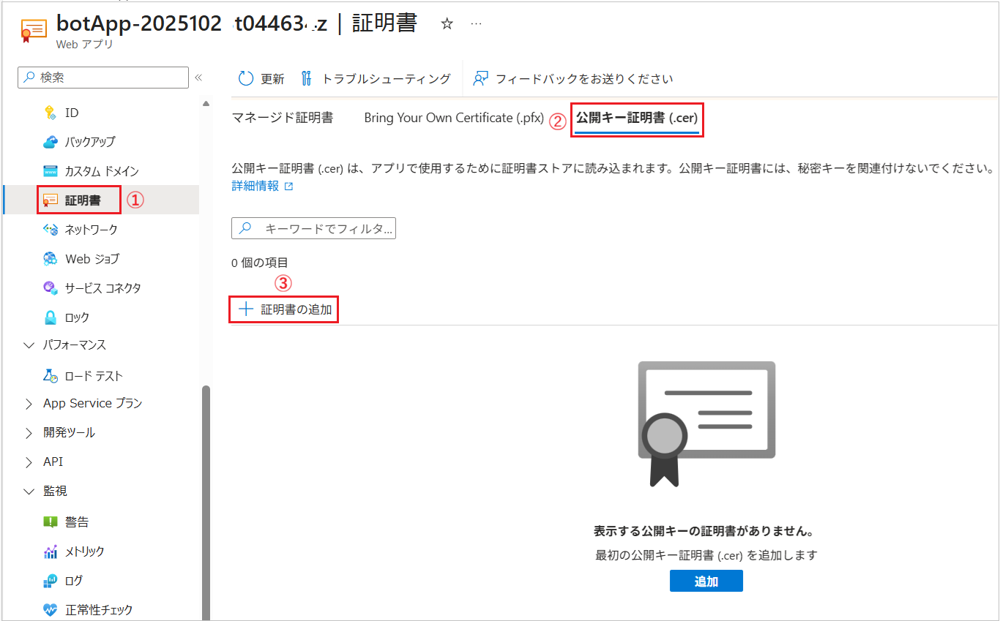

2. 画面右に \[公開キー証明書の追加\] ブレードが表示されるので、各項目を以下のように設定します

    | 項目 | 設定内容 |
    |---|---|
    | CER 証明書ファイル \*| *📁 マークのボタンをクリックして、前の手順でダウンロードしたバックエンド検証用証明書（.cer）を選択* |
    | 証明書のフレンドリ名 \*| *任意の名前* |

    各項目を設定したら、画面下部の \[**追加**\] ボタンをクリックします

    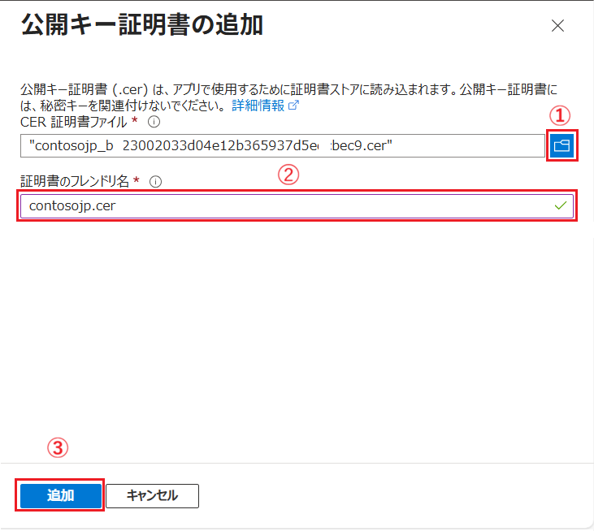

    \[公開キー(.cer)\] タブに戻るので、追加した証明書が表示されていることを確認します

    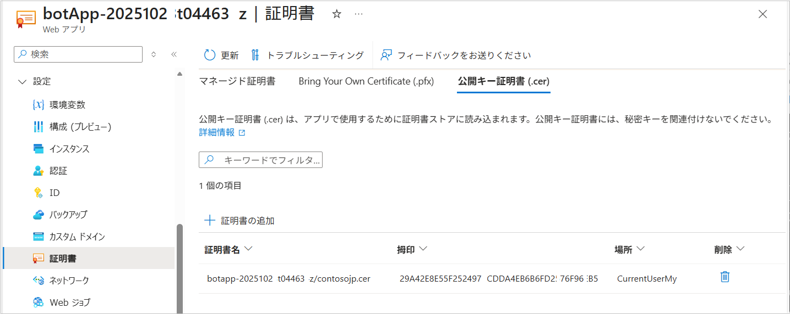

ここまでの手順で演習用 App Service にバックエンド検証用証明書（.cer）を追加することができました。

<br>

### 3. App Service プライベート エンドポイントのカスタム ドメイン用プライベート DNS ゾーンの追加

演習用 App Service を Application Gateway のバックエンド プールとして指定する際、カスタムドメイン名が名前解決できるように App Service のプライベートエンドポイント用のプライベート DNS ゾーンを追加します。

具体的な手順は以下のとおりです。

\[**手順**▶️\]

1. Azure ポータル [ホーム画面](https://portal.azure.com/#home) ログインし、画面上部の \[**+**\] リソースの作成 アイコンか、表示されていない場合は画面左上のハンバーガーメニューをクリックし、\[**リソースの作成**\] をクリックします

    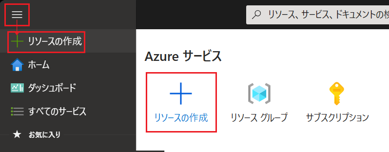

2. \[**リソースの作成**\] 画面に遷移するので、検索ボックスに `dns ゾーン` と入力し検索します
   
    検索結果にまったく同じデザインのタイルが 2 つ表示されますが、どちらかがプライベート DNS ゾーンです。多くの場合、左側のタイルがプライベート DNS ゾーンなのでそちらをクリックします。
    
    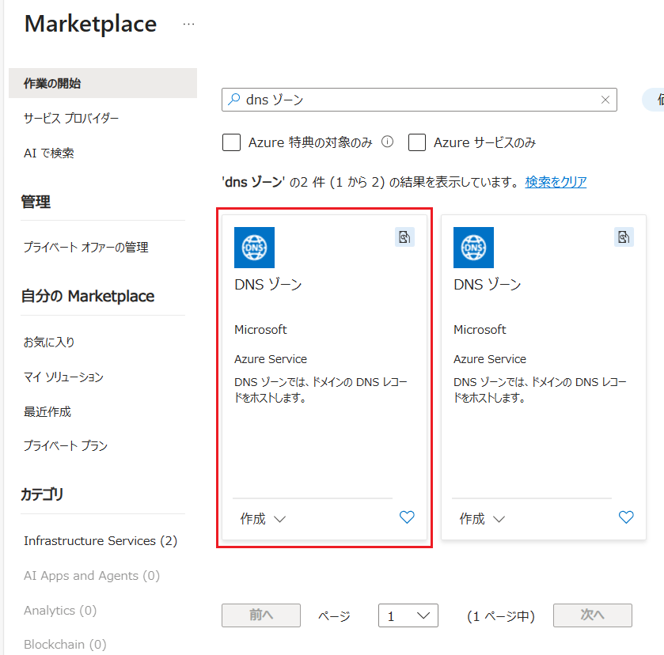

3. \[**DNS ゾーン**\] の画面に遷移するので、\[プラン\] が `Private DNS Zone` であることを確認し、\[**作成**\] ボタンをクリックします

    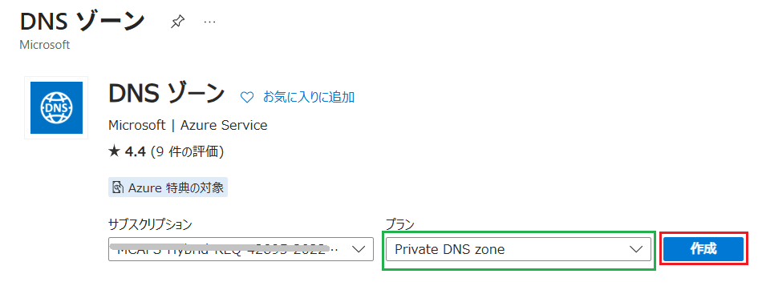

4. \[**DNS ゾーンの作成**\] 画面の \[**基本**\] タブがアクティブになっているので、各項目を以下のように設定します

    | 項目 | 設定内容 |
    |---|---|
    | サブスクリプション \* | *演習用リソースを作成したサブスクリプション* |
    | リソース グループ \* | **AOAI-AppEnv-handson** |
    | 名前 \* | *`<カスタムドメイン名>` の形式で、演習用 App Service に設定したカスタムドメイン名を入力*<br>例: `www.contoso.jp` |
    | リージョン \* | *任意のリージョン* |

    各項目を設定したら、画面上部の \[**Virtual Network Links**\]  タブをクリックします。(※プライベート DNS レコードの追加はリソース作成後に行います)

    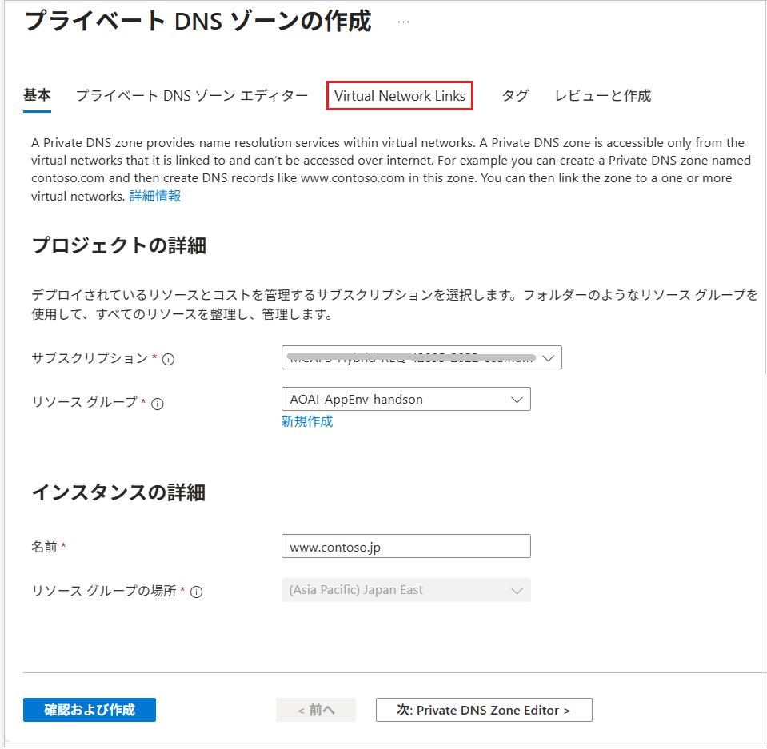

5. \[**Virtual Network Links**\] タブがアクティブになるので、同タブ内の \[**+ 仮想ネットワークを追加します**\] ボタンをクリックします

    画面右に \[仮想ネットワーク リンクを追加します\] ブレードが表示されるので、各項目を以下のように設定します。

    | 項目 | 設定内容 |
    |---|---|
    | リンク名 \* | `link-jpeast-vnet` |
    | サブスクリプション \* | *演習用リソースを作成したサブスクリプション* |
    | 仮想ネットワーク \* | \[**handson-jpeast-vnet**\] |
    | 自動登録を有効にする | *既定のまま* |

    各項目を設定したら、画面下部の \[**作成**\] ボタンをクリックします。

6. \[Virtual Network Links\] タブに戻るので、追加した仮想ネットワーク リンクが表示されていることを確認し、画面上部の \[**確認および作成**\] ボタンをクリックします

    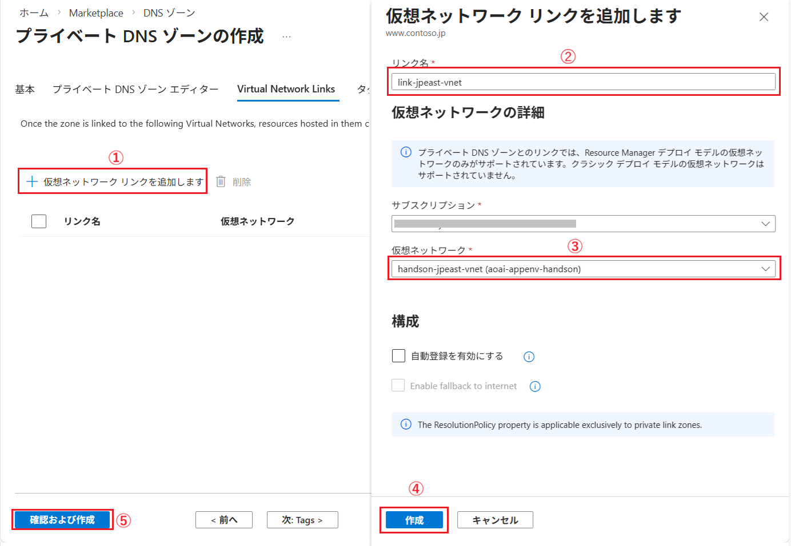

    `検証に合格しました` と表示されるのを確認し、画面下部の \[**作成**\] ボタンをクリックします。

    作成が完了したら、画面内の \[**リソースに移動**\] ボタンをクリックします。

7. 作成したプライベート DNS ゾーンの画面に遷移するので、画面左のメニュー \[設定\] - \[**レコードセット**\] をクリックし、さらに遷移した画面内上部の \[**+ 追加**\] ボタンをクリックします

    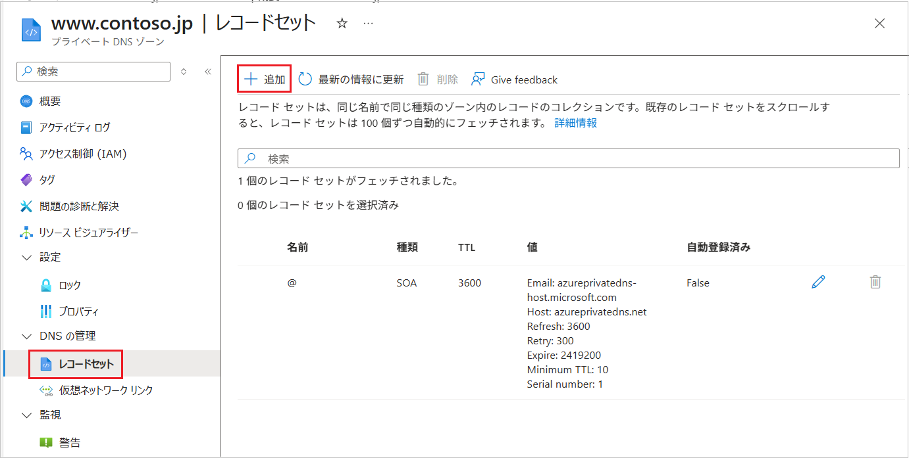

8. 画面右に \[レコードセットの追加\] ブレードが表示されるので、各項目を以下のように設定します

    | 項目 | 設定内容 |
    |---|---|
    | 名前 \* | `www` (演習用 App Service に設定したカスタムドメイン名が `www.contoso.jp` の場合)|
    | 種類 \* | \[**A - IPv4 Address records**\] |
    | TTL \* | `1` (既定のまま) |
    | TTL の単位\* | \[**時間**\] |
    | IP アドレス \* | *演習用 App Service のプライベート エンドポイントの IP アドレス* |

    各項目を設定したら、画面下部の \[**追加**\] ボタンをクリックします。

    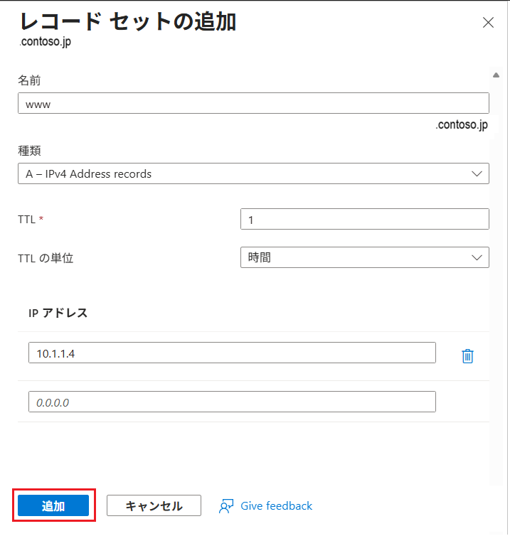

    ブレードが閉じ、レコードセットの一覧に戻るので、追加したレコードセットが表示されていることを確認します。

    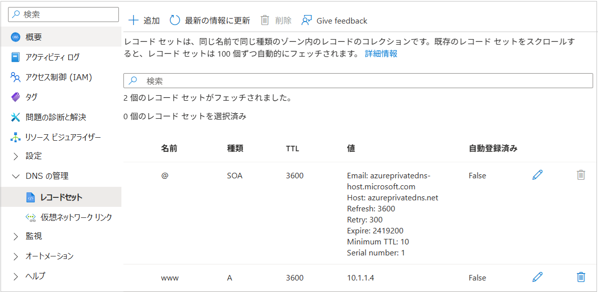

9. 仮想ネットワーク内で設定したカスタムドメインが、正しく演習用 App Service のプライベートエンドポイントの IP アドレスに名前解決されるかを確認します
    
    仮想ネットワーク **handson-jpeast-vnet** 上の [演習 5-2-3 Azure 仮想マシンのデプロイと接続確認](Ex05-2.md#3--azure-%E4%BB%AE%E6%83%B3%E3%83%9E%E3%82%B7%E3%83%B3%E3%81%AE%E3%83%87%E3%83%97%E3%83%AD%E3%82%A4%E3%81%A8%E6%8E%A5%E7%B6%9A%E7%A2%BA%E8%AA%8D) で作成した Azure 仮想マシン **handson-mon-vm** に BASTION で接続し、コマンド プロンプトを開き、以下のコマンドを実行します。

    ```shell
    nslookup <カスタムドメイン名>
    ```
    応答に指定したドメイン名と、演習用 App Service のプライベート エンドポイントの IP アドレスが表示されることを確認します。

    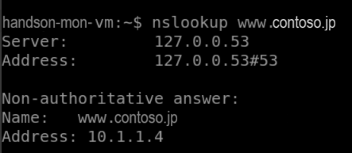

ここまでの手順で、演習用 App Service のプライベートエンドポイント用のプライベート DNS ゾーンを追加し、仮想ネットワーク内でカスタムドメイン名が名前解決できるように構成することができました。

<br>

## Application Gateway の追加

Application Gateway をデプロイし、クライアントからカスタムドメインで指定された HTTPS リクエストを仮想ネットワーク `handson-jpeast-vnet` 内に閉域化されている演習用 App Service に転送できるように構成します。

### 1. Application Gateway 用サブネットの追加

Azure ポータルを使用して仮想ネットワーク `handson-jpeast-vnet` に Application Gateway 用のサブネットを追加します。

具体的な手順は以下のとおりです。

\[**手順**▶️\]

1. [Azure ポータル](https://portal.azure.com/)で、仮想ネットワーク **handson-jpeast-vnet** の画面を開きます
   
2. 遷移した画面左側のメニューから \[設定\] - \[**サブネット**\] をクリックし、遷移した画面上部のメニューから \[**+ サブネット**\] をクリックします

3. \[**サブネットの追加**\] ブレードが表示されるので名前以外の各項目は規定のまま以下のように設定します

    |項目|設定値|
    |:---|:---|
    |サブネットの目的|\[**Default**\]|
    |名前 \*|`handson-AG-subnet`|
    |IPv4 アドレス空間を含める|**チェック**|
    |IPv4 のアドレス範囲 |*既定で設定されたもの*|
    |開始アドレス|*既定で設定されたもの*|
    |IPv6 アドレス空間を含める \*|チェックしない|
    |プライベート サブネットを有効にする (既定の送信アクセスなし)|**チェック**|
    |NAT ゲートウェイ|なし|
    |ネットワークセキュリティグループ|なし|
    |ルート テーブル|なし|
    |サービス|選択しない|
    |サブネットをサービスに委任|なし|
    |プライベート エンドポイント ネットワーク ポリシー|選択しない|

    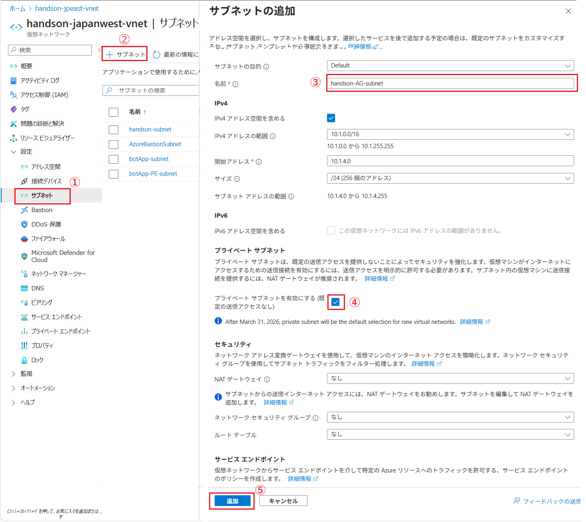

    設定が完了したら \[**追加**\] ボタンをクリックします。

ここまでの手順で、仮想ネットワーク `handson-jpeast-vnet` に Application Gateway 用のサブネットが追加されました。

<br>

### 2. Application Gateway の作成

Application Gateway のリソースを新規作成し、作成した仮想ネットワークとサブネットを関連付け、演習用アプリケーションがデプロイされている App Service (Production) を Application Gateway のバックエンドプールに追加します。

クライアントからのリクエストは HTTPS を前提とし、リクエストに含まれる referer ヘッダーや Cookie などにもカスタム ドメイン名が含まれていても正しく動作するように、バックエンド プールの指定にはカスタム ドメインを使用し、Application Gateway と App Service 間も HTTPS 通信を行う構成とします。

具体的な手順は以下のとおりです。

\[**手順**▶️\]

1. Azure ポータル [ホーム画面](https://portal.azure.com/#home) ログインし、画面上部の \[**+**\] リソースの作成 アイコンか、表示されていない場合は画面左上のハンバーガーメニューをクリックし、\[**リソースの作成**\] をクリックします

    

2. \[**リソースの作成**\] 画面に遷移するので、検索ボックスに `Application Gateway` と入力し、表示された検索結果の \[**Application Gateway**\] のタイルをクリックします

    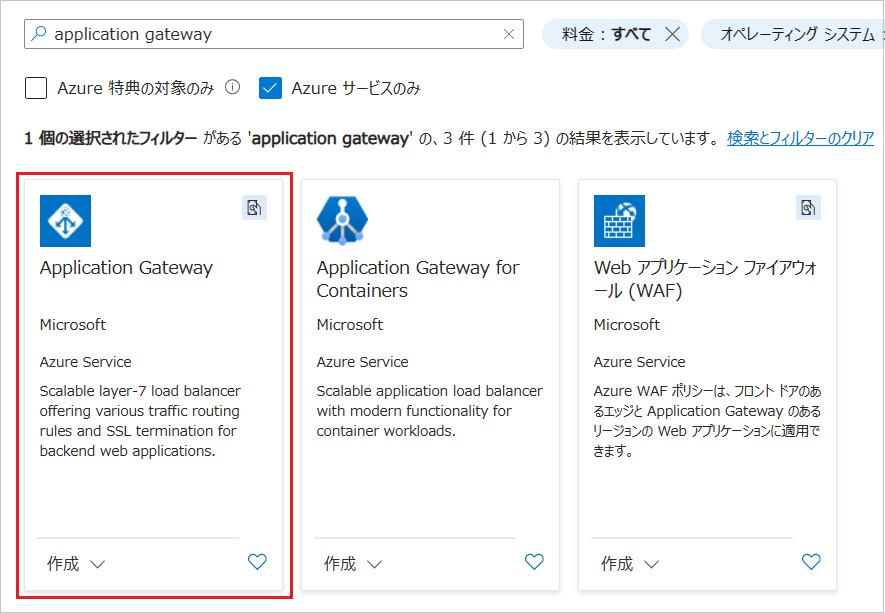

3.  \[**Application Gateway**\] の画面に遷移するので、\[**作成**\] ボタンをクリックします

4. \[**アプリケーション ゲートウェイの作成**\] の \[**基本**\] タブ画面に遷移するので、各項目を以下のように設定します

    |項目|設定値|
    |:---|:---|
    |サブスクリプション \*|使用するサブスクリプション|
    |リソース グループ \*|\[**AOAI-AppEnv-handson**\]|
    |ゲートウェイ名 \*|`handson-AG`|
    |地域 \*|\[**(Asia Pacific) Japan East**\]|
    |レベル|\[**Standard v2**\]|
    |自動スケール|はい|
    |最小インスタンス数 \*|0|
    |最大インスタンス数 \*|10|
    |可用性ゾーン|既定、もしくは 1 |
    |HTTP2|無効|
    |FIPS モード 140-2|無効|
    |仮想ネットワーク \*| \[`handson-jpeast-vnet`\]|
    |サブネット \*|\[`handson-AG-subnet`\]|

    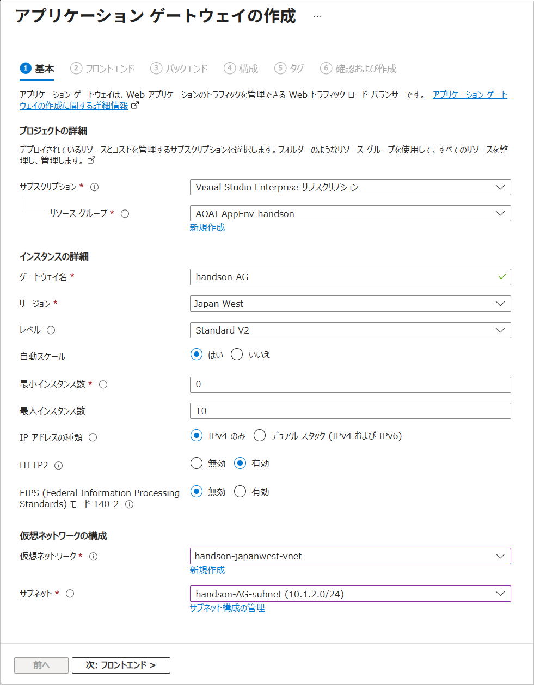

    設定が完了したら画面下部の \[**次:フロントエンド \>**\] ボタンをクリックします。

5. \[**フロントエンド**\] タブの画面に遷移するので、\[**フロントエンド IP の種類**\] で、\[**パブリック**\] にチェックし、\[**パブリック IP アドレス**\] のドロップダウンボックスの下にある \[**新規作成**\] リンクをクリックします。

    \[**パブリック IP アドレスの追加**\] ポップアップが表示されるので、\[**名前 \***\] に `handson-AG-pip` と入力し \[**OK**\] ボタンをクリックします。

    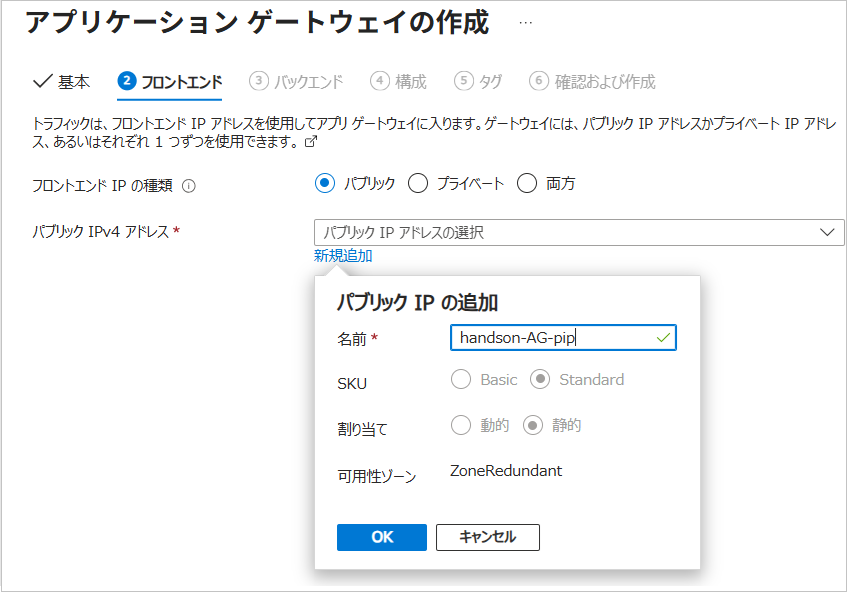

    \[**次 : バックエンド \>**\] ボタンをクリックします。

6.  \[**バックエンド**\] タブの画面に遷移するので、\[**バックエンド プールの作成**\] リンクをクリックします

    画面右に \[**バックエンド プールの作成**\] ブレードが表示されるので、各項目を以下のように設定します

    |項目|設定値|
    |:---|:---|
    |名前 \*|`handson-AG-backendpool`|
    |ターゲットを持たないバックエンド プールを追加します|いいえ|
    |ターゲットの種類| \[**IP アドレスまたは FQDN**\]|
    |ターゲット \*| \[*演習用App Service に割り当てされたカスタムドメイン*\] (※例: www.contoso.jp) |

    設定が完了したら \[**追加**\] ボタンをクリックします。

    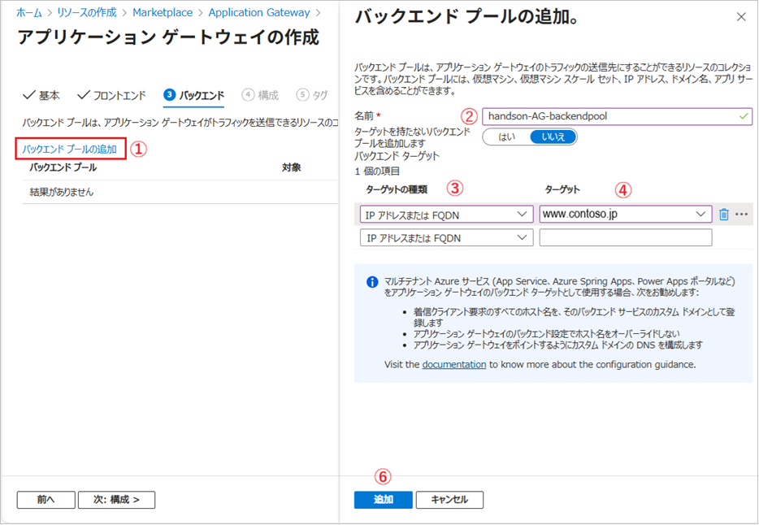

    \[**バックエンド**\] タブの画面に戻るので、\[**次 : 構成 \>**\] ボタンをクリックします。

7. \[**構成**\] タブの画面に遷移するので、画面中央の \[**+ ルーティング規則の追加**\] タイルをクリックします

    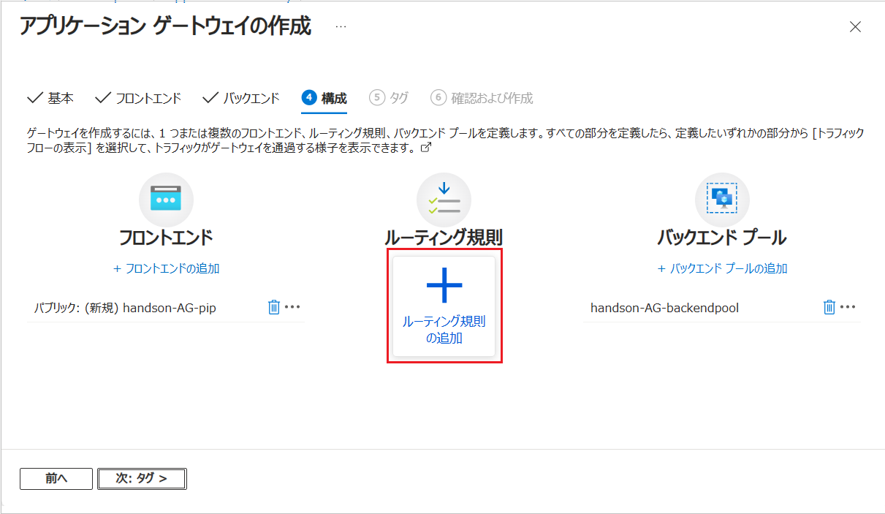

    画面右に \[**+ ルーティング規則の追加**\] ブレードが表示されるので、各項目を以下のように設定します

    |項目|設定値|
    |:---|:---|
    |ルール名 \*|`handson-AG-routingRule`|
    |優先度　\*|`100`|

    \[**\* リスナー**\] タブ

    |項目|設定値|
    |:---|:---|
    |リスナー名 \*|`handson-AG-listener`|
    |フロントエンド IP \*|\[**パブリック**\]|
    |プロトコル|\[**HTTPS**\]|
    |ポート \*|\[**443**\]|
    |**HTTPS 設定**||
    |証明書の選択|\[**キー コンテナーから証明書を選択する**\] にチェック(※)|
    |証明書名　\*|*任意の名前*|
    |マネージド ID \*|*ドロップダウンボックスに表示される演習用 App Service のマネージド ID*|
    |キー コンテナー \*|*ハンズオンで作成した Key Vault の名前*|
    |証明書 \*|*コピーしておいた証明書のシークレット識別子*|
    |リスナーの種類|\[**Basic**\]|
    |カスタム エラー ページ|既定のまま指定しない|

    (※) Key Vault へのアクセスがうまくいかない場合は、\[**証明書のアップロード**\] を選択して *.pfx ファイルをアップロードし、パスワードを入力してください。

    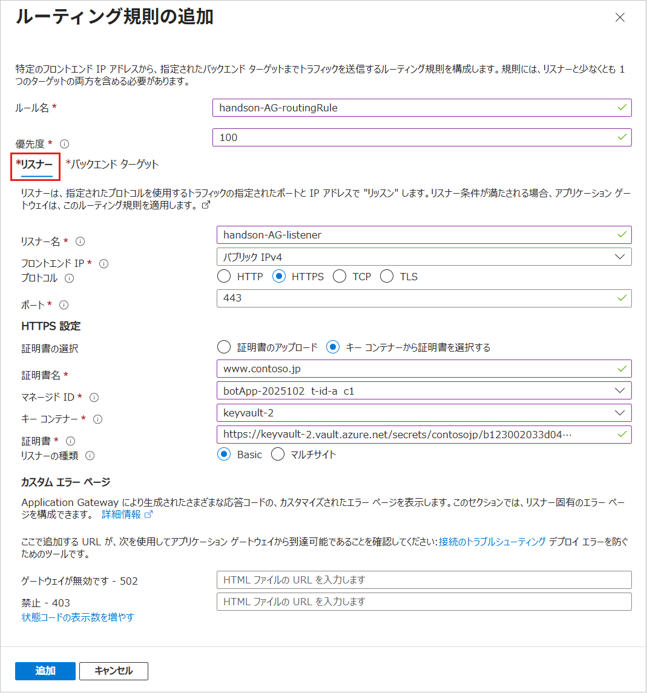

    
    \[**\* バックエンド ターゲット**\] タブ

    |項目|設定値|
    |:---|:---|
    |ターゲットの種類\*|\[**バックエンド プール**\]|
    |バックエンド ターゲット \*|\[**handson-AG-backendpool**\]|
    |バックエンド 設定 \*|\[**handson-AG-backendSetting**\] (※)**新規追加** リンクをクリックすると \[**バックエンド設定の追加**\] ブレードが表示されるので別表の項目のとおりに設定して作成|

    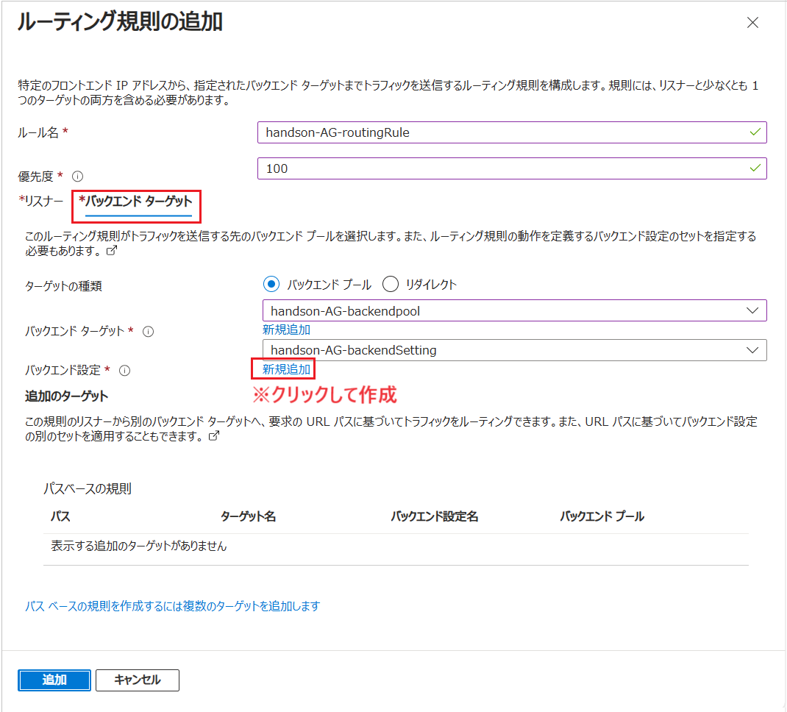


    \[**バックエンド設定の追加**\] ブレード

    |項目|設定値|
    |:---|:---|
    |バックエンド設定名 \*|`handson-AG-backendSetting`|
    |バックエンド プロトコル| \[**HTTPS**\]|
    |バックエンド ポート \*| `443`|
    |**バックエンド HTTPS 検証設定**||
    |バックエンド証明書の検証の種類|\[**検証の完了**\] にチェック|
    |バックエンド サーバー証明書の発行者|外部証明書を使用する場合:\[**パブリック CA**\]、自己生成証明書を使用する場合:\[**プライベート CA**\]にチェック|
    |CER 証明書 \*(※パブリック CA を選択した場合は表示されません)|*📁 マークのボタンをクリックして、前の手順でダウンロードしたバックエンド検証用証明書（.cer）を選択*|
    |Cookie ベースのアフィニティ| \[**無効化**\]|
    |接続のドレイン| \[**有効化**\]|
    |ドレイン タイムアウト (秒)|*既定のまま*|
    |専用バックエンド接続|**無効**|
    |要求のタイムアウト(秒) \*| `20`|
    |バックエンド パスのオーバーライド|指定なし|
    |新しいホスト名でオーバーライドする|\[**いいえ**\]|
    |カスタム プローブを作成する|*既定のまま*|

    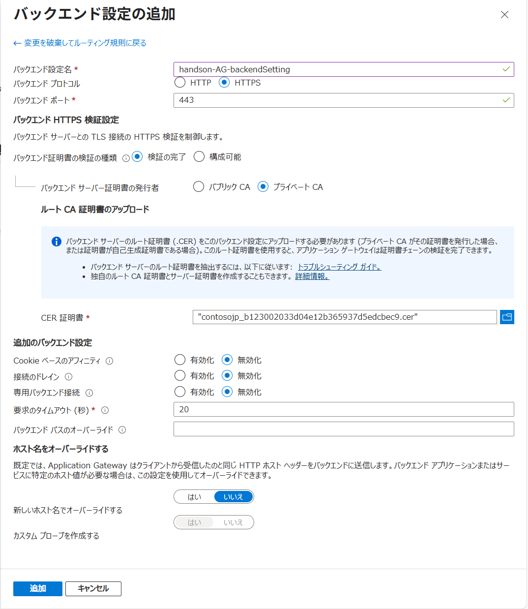

     設定したら \[**追加**\] ボタンをクリックし、\[**+ ルーティング規則の追加**\] ブレードに戻ります。

    \[**\* バックエンド ターゲット**\] タブの項目 \[**バックエンド 設定 \***\] に先ほど作成した \[**handson-AG-backendSetting**\] が選択されていることを確認し、\[**追加**\] ボタンをクリックします。

8. \[**構成**\] タブの画面に戻るので、\[**次 : タグ \>**\] ボタンをクリックし、遷移した画面で \[**確認および作成**\] ボタンをクリックします。

    \[**作成**\] ボタンが有効になったら、デプロイを開始します。

    デプロイが完了すると \[**リソースに移動**\] ボタンが表示されるのでクリックして作成した Application Gateway のリソース画面に遷移します。

9. 画面左のメニューから \[**概要**\] をクリックし、遷移した画面の \[**フロントエンド　パブリック IP**\] の IP アドレス部分をコピーします。

    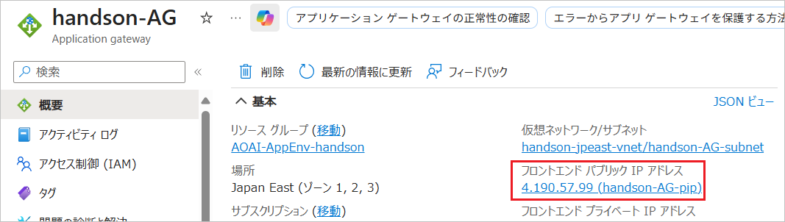

10. コピーした Applicaton Gateway の IP アドレスを使用して、ドメイン登録サービスが管理しているサービスに DNS レコードを追加します

    | 項目 | 設定内容 |
    |---|---|
    | レコードの種類 | A レコード |
    | ホスト名 | *演習用 App Service に設定したカスタムドメイン名のホスト部分* (例: `www` ) |
    | 値 | *前の手順でコピーした Application Gateway のパブリック IP アドレス* |
    | TTL | *任意の値* |

    なお、[演習 5-4 : App Service へのカスタムドメインの設定](Ex05-4.md) でドメイン登録サービスに追加した App Service のカスタム ドメインの DNS レコードは使用しないので削除して構いません。


11. Web ブラウザーのアドレスバーにカスタムドメイン名を使用して、Application Gateway を介して演習用アプリケーションにアクセスできることを確認します。

    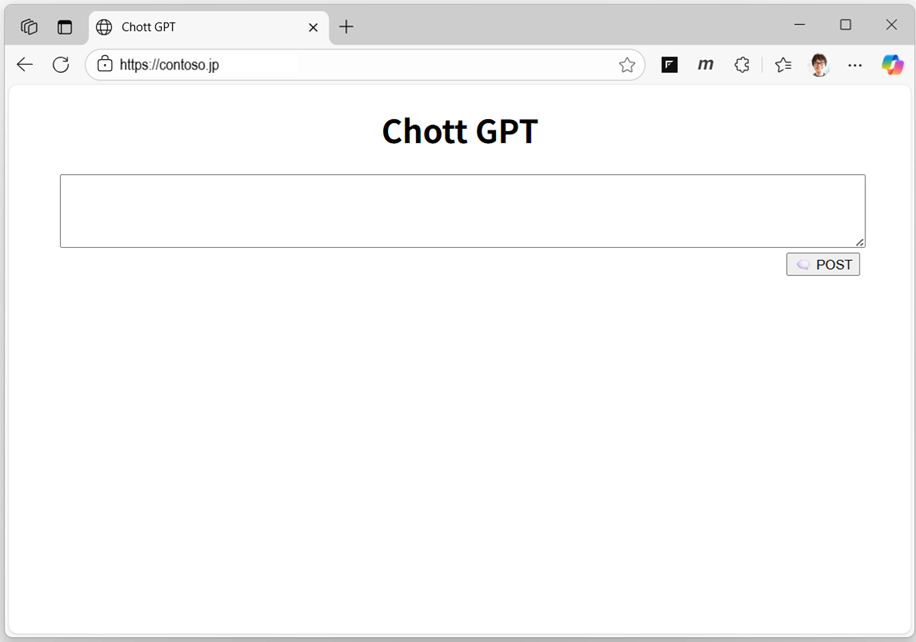

ここまでの手順により、Application Gateway を経由して仮想ネットワーク内の演習用アプリケーションへのアクセスが可能になりました。

<br>

# まとめ

この演習では Application Gateway を追加して、パブリックネットワークからのリクエストを仮想ネットワーク内の App Service にルーティングする構成を行いました。

これにより演習用アプリケーション利用する Azure リソースは仮想ネットワーク内に閉域化され、パブリックネットワークからのリクエストは Application Gateway を経由することで一本化することができました。


この演習では、App Services のベースライン アーキテクチャに従い、プライベート エンドポイントを使用して Application Gateway との接続を行っていますが、以下の図のようにサービス エンドポイントを使用してセキュアに接続することも可能です。

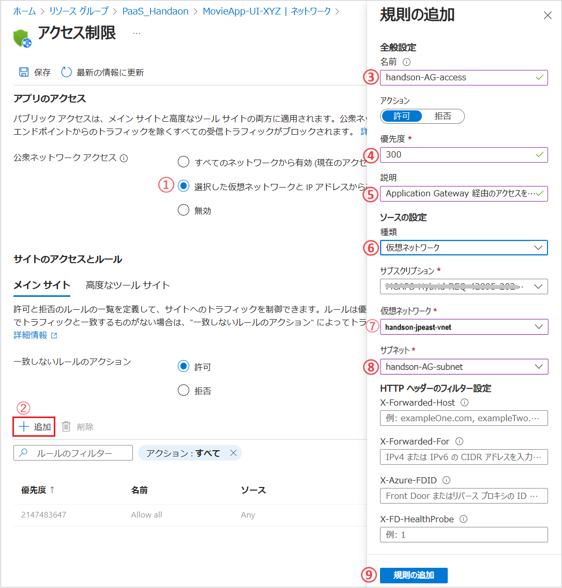

また、この演習は、カスタムドメインと SSL 証明書が用意できない場合の学習目的での手順として HTTP を使用しましたが、実際のシナリオでは HTTS と Application Gateway とバックエンドの App Service の両方でカスタム ドメインを使用することが推奨されています。

具体的な手順は以下のドキュメントを参照してください。

* [**Application Gateway を使用した App Service の構成**](https://learn.microsoft.com/ja-jp/azure/application-gateway/configure-web-app?tabs=customdomain%2Cazure-portal)

<br>

## 次へ

👉　[**演習 6-2 : セキュリティ設定の追加**](Ex06-2.md)

---

👈　[演習 6 : パブリック ネットワーク向けのエンドポイントの公開](Ex06.md)

🏚️　[README に戻る](README.md)