# 演習 6-1-E : Application Gateway を介したアプリケーションの公開(HTTP)

>[!NOTE]
>この演習では、SSL 証明書を必要としない **HTTP** を使用した Application Gateway の構成を行います。HTTP は通信が暗号化されないため、実際のサービスの運用環境向けには推奨されません。あくまでも学習目的での手順として実施してください。

[演習 5-3](Ex05-3.md) で仮想ネットワーク内に閉域化されてた App Service に対して、Application Gateway を介してインターネットからアクセスできるように構成します。

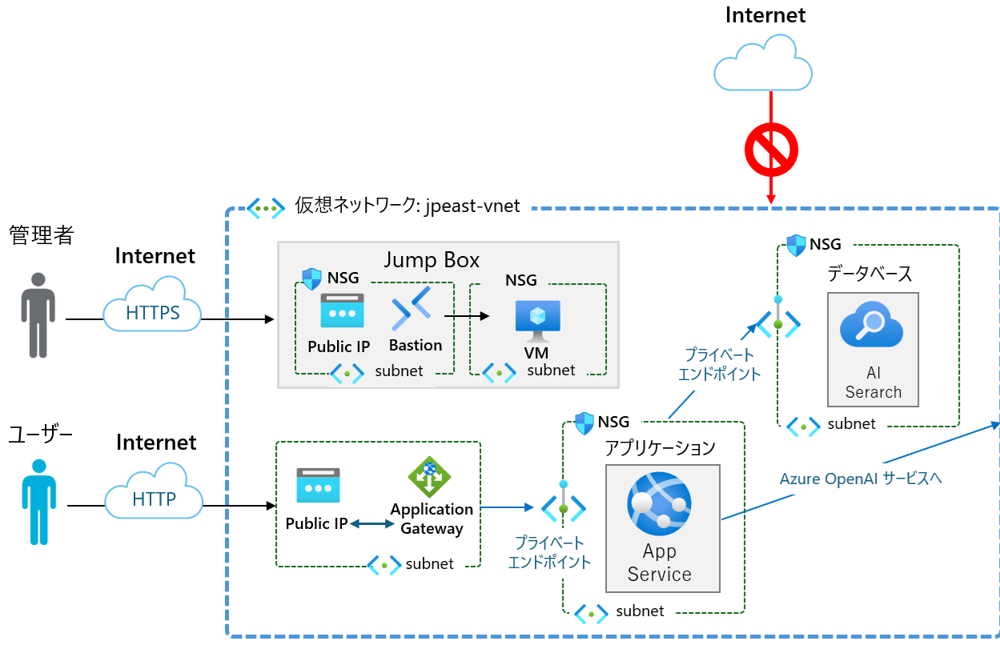

Azure Application Gateway は、Web アプリケーションに対するトラフィックを管理できる Web トラフィック (OSI レイヤー 7) ロード バランサーです。 Application Gateway では、URI パスやホスト ヘッダーなど、HTTP 要求の追加属性に基づいてルーティングを決定できます。

Azure Application Gateway が提供する機能の詳細については以下のドキュメントを参照してください。

* [**Azure Application Gateway の機能**](https://learn.microsoft.com/ja-jp/azure/application-gateway/features)

このタスクでは Application Gateway 用に新規に仮想ネットワークを追加し、この仮想ネットワークとサブネットに対して App Service ネットワーク設定でアクセスを許可するルール設定を行います。

この演習で実施する作業は以下の通りです。

1. [Application Gateway 用 仮想ネットワーク作成とサブネットの追加](#1-application-gateway-%E7%94%A8%E3%82%B5%E3%83%96%E3%83%8D%E3%83%83%E3%83%88%E3%81%AE%E8%BF%BD%E5%8A%A0)
2. [Application Gateway の作成](#2-application-gateway-%E3%81%AE%E4%BD%9C%E6%88%90)

なお、HTTP を使用するこの演習の準備として以下を行ってください。

## 準備

1. 演習用アプリケーションがデプロイされている App Service (Production) のメニュー \[設定\] - \[**構成**\] 画面を開き、\[**全般設定**\] タブ内の \[**HTTPS のみ**\] を **オフ** に設定します。

    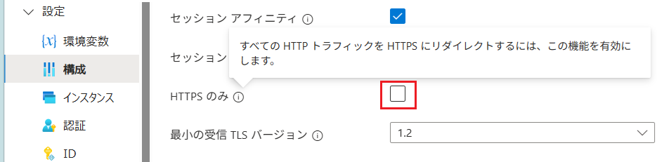

2. 演習用アプリケーションがデプロイされている App Service (Production) に自動認証が設定されている場合は、認証設定を無効化してください。

    * [**App Service 自動認証の無効化手順**](Ex03-2-3.md#disable-authentication)

 

## 1. Application Gateway 用サブネットの追加

Azure ポータルを使用して仮想ネットワーク `handson-jpeast-vnet` に Application Gateway 用のサブネットを追加します。

具体的な手順は以下のとおりです。

\[**手順**▶️\]

1. [Azure ポータル](https://portal.azure.com/)で、仮想ネットワーク **handson-jpeast-vnet** の画面を開きます
   
2. 遷移した画面左側のメニューから \[設定\] - \[**サブネット**\] をクリックし、遷移した画面上部のメニューから \[**+ サブネット**\] をクリックします

3. \[**サブネットの追加**\] ブレードが表示されるので名前以外の各項目は規定のまま以下のように設定します

    |項目|設定値|
    |:---|:---|
    |サブネットの目的|\[**Default**\]|
    |名前 \*|`handson-AG-subnet`|
    |IPv4 アドレス空間を含める|**チェック**|
    |IPv4 のアドレス範囲 |*既定で設定されたもの*|
    |開始アドレス|*既定で設定されたもの*|
    |IPv6 アドレス空間を含める \*|チェックしない|
    |プライベート サブネットを有効にする (既定の送信アクセスなし)|**チェック**|
    |NAT ゲートウェイ|なし|
    |ネットワークセキュリティグループ|なし|
    |ルート テーブル|なし|
    |サービス|選択しない|
    |サブネットをサービスに委任|なし|
    |プライベート エンドポイント ネットワーク ポリシー|選択しない|

    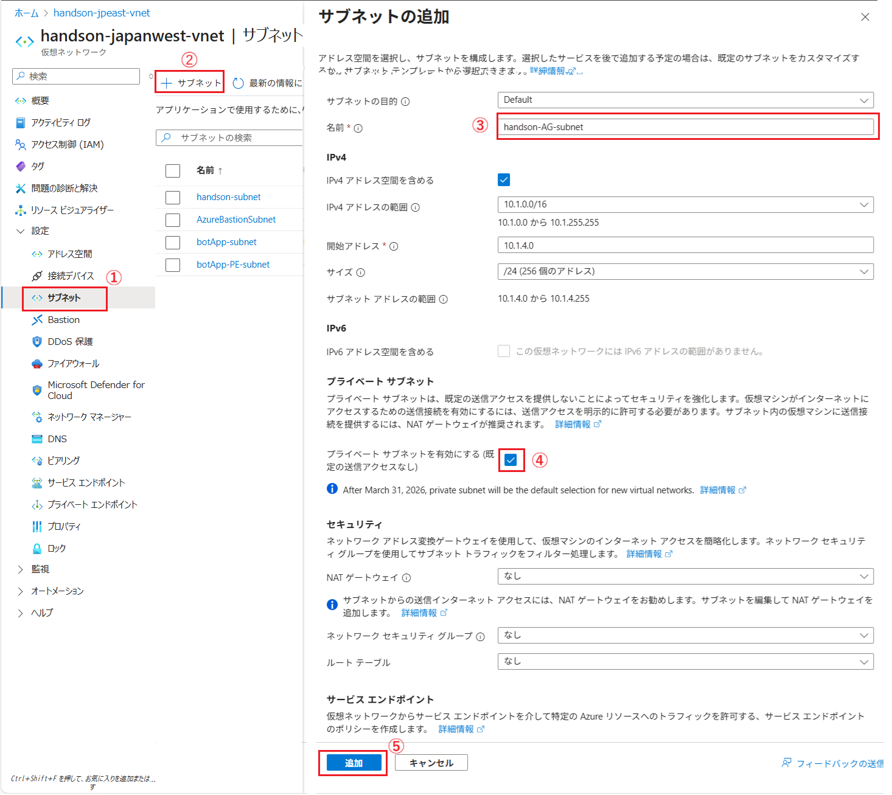

    設定が完了したら \[**追加**\] ボタンをクリックします。

ここまでの手順で、仮想ネットワーク `handson-jpeast-vnet` に Application Gateway 用のサブネットが追加されました。

 

## 2. Application Gateway の作成

Application Gateway のリソースを新規作成し、作成した仮想ネットワークとサブネットを関連付け、演習用アプリケーションがデプロイされている App Service (Production) をバックエンドプールに追加します。

具体的な手順は以下のとおりです。

\[**手順**▶️\]

1. Azure ポータル [ホーム画面](https://portal.azure.com/#home) ログインし、画面上部の \[**+**\] リソースの作成 アイコンか、表示されていない場合は画面左上のハンバーガーメニューをクリックし、\[**リソースの作成**\] をクリックします

    

2. \[**リソースの作成**\] 画面に遷移するので、検索ボックスに `Application Gateway` と入力し、表示された検索結果の \[**Application Gateway**\] のタイルをクリックします

    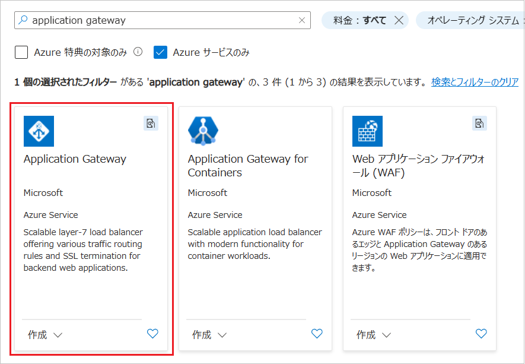

3.  \[**Application Gateway**\] の画面に遷移するので、\[**作成**\] ボタンをクリックします

4. \[**アプリケーション ゲートウェイの作成**\] の \[**基本**\] タブ画面に遷移するので、各項目を以下のように設定します

    |項目|設定値|
    |:---|:---|
    |サブスクリプション \*|使用するサブスクリプション|
    |リソース グループ \*|\[**AOAI-AppEnv-handson**\]|
    |ゲートウェイ名 \*|`handson-AG`|
    |地域 \*|\[**(Asia Pacific) Japan East**\]|
    |レベル|\[**Standard v2**\]|
    |自動スケール|はい|
    |最小インスタンス数 \*|0|
    |最大インスタンス数 \*|10|
    |可用性ゾーン|既定、もしくは 1 |
    |HTTP2|無効|
    |仮想ネットワーク \*| \[`handson-jpeast-vnet`\]|
    |サブネット \*|\[`handson-AG-subnet`\]|

    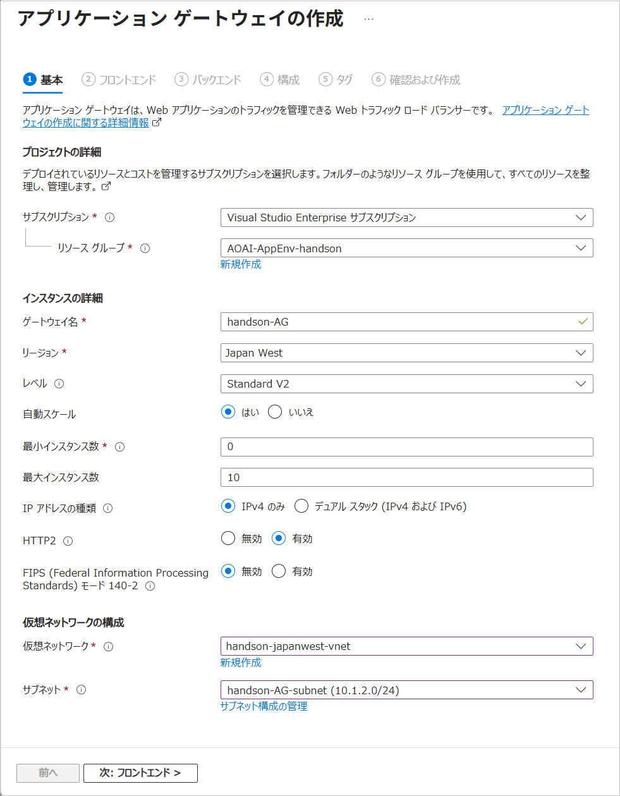

    設定が完了したら画面下部の \[**次:フロントエンド \>**\] ボタンをクリックします。

5. \[**フロントエンド**\] タブの画面に遷移するので、\[**フロントエンド IP の種類**\] で、\[**パブリック**\] にチェックし、\[**パブリック IP アドレス**\] のドロップダウンボックスの下にある \[**新規作成**\] リンクをクリックします。

    \[**パブリック IP アドレスの追加**\] ポップアップが表示されるので、\[**名前 \***\] に `handson-AG-pip` と入力し \[**OK**\] ボタンをクリックします。

    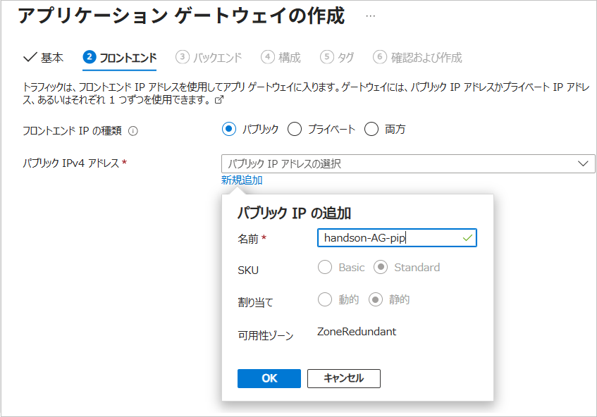

    \[**次 : バックエンド \>**\] ボタンをクリックします。

6.  \[**バックエンド**\] タブの画面に遷移するので、\[**バックエンド プールの作成**\] リンクをクリックします

    画面右に \[**バックエンド プールの作成**\] ブレードが表示されるので、各項目を以下のように設定します

    |項目|設定値|
    |:---|:---|
    |名前 \*|`handson-AG-backendpool`|
    |ターゲットを持たないバックエンド プールを追加します|いいえ|
    |ターゲットの種類| \[**App Service**\]|
    |ターゲット \*| \[**botApp-** *ユニークな値*\](※演習用アプリケーションがデプロイされている App Service の名前) |

    設定が完了したら \[**追加**\] ボタンをクリックします。

    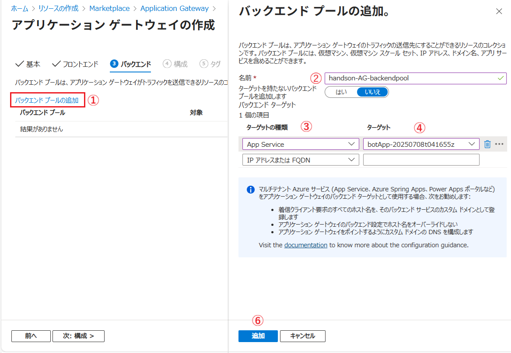

    \[**バックエンド**\] タブの画面に戻るので、\[**次 : 構成 \>**\] ボタンをクリックします。

7.  \[**構成**\] タブの画面に遷移するので、画面中央の \[**+ ルーティング規則の追加**\] タイルをクリックします

    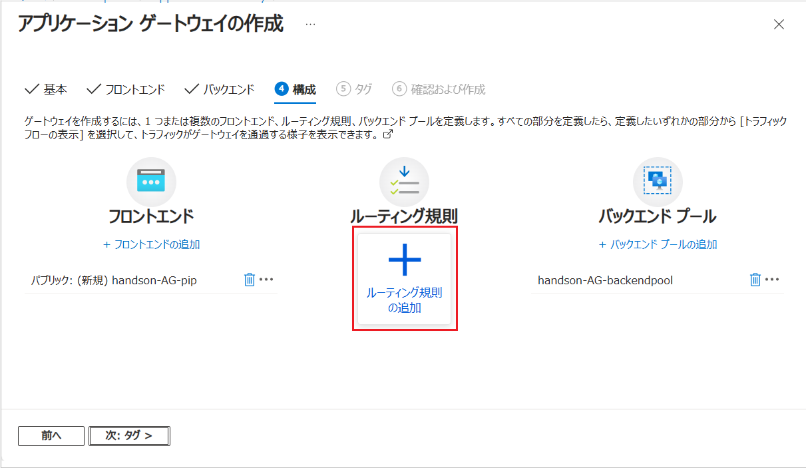

    画面右に \[**+ ルーティング規則の追加**\] ブレードが表示されるので、各項目を以下のように設定します

    |項目|設定値|
    |:---|:---|
    |ルール名 \*|`handson-AG-routingRule`|
    |優先度　\*|`100`|

    \[**\* リスナー**\] タブ

    |項目|設定値|
    |:---|:---|
    |リスナー名 \*|`handson-AG-listener`|
    |フロントエンド IP \*|\[**パブリック**\]|
    |プロトコル|\[**HTTP**\]|
    |ポート \*|\[**80**\]|
    |リスナーの種類|\[**Basic**\]|
    |カスタム エラー ページ|既定のまま指定しない|

    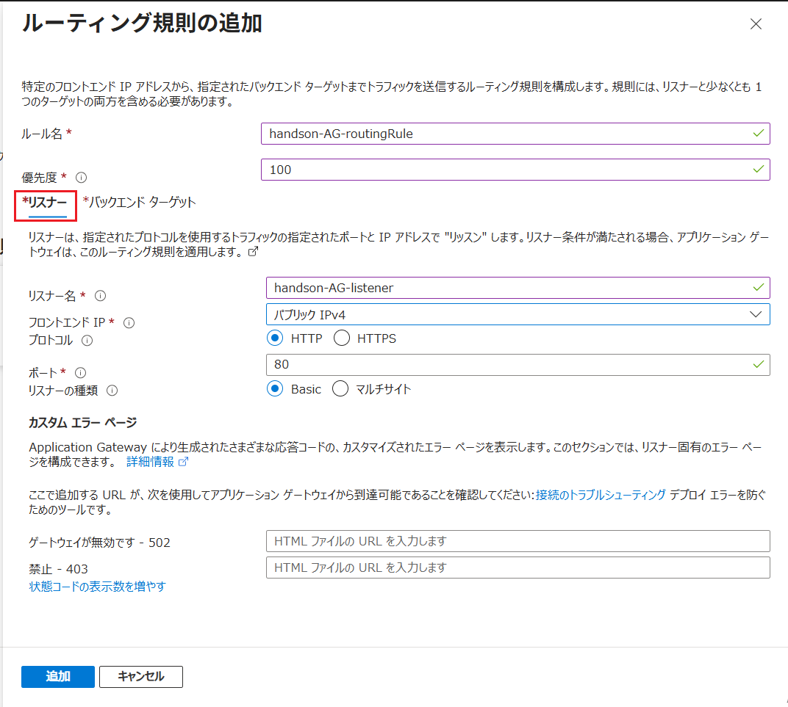

    
    \[**\* バックエンド ターゲット**\] タブ

    |項目|設定値|
    |:---|:---|
    |ターゲットの種類\*|\[**バックエンド プール**\]|
    |バックエンド ターゲット \*|\[**handson-AG-backendpool**\]|
    |バックエンド 設定 \*|\[**handson-AG-backendSetting**\] (※)**新規追加** リンクをクリックすると \[**バックエンド設定の追加**\] ブレードが表示されるので別表の項目のとおりに設定して作成|

    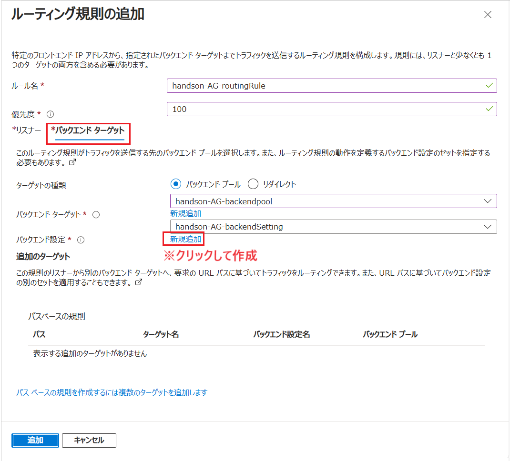

    \[**バックエンド設定の追加**\] ブレード

    |項目|設定値|
    |:---|:---|
    |バックエンド設定名 \*|`handson-AG-backendSetting`|
    |バックエンド プロトコル| \[**HTTP**\]|
    |Cookie ベースのアフィニティ| \[**無効化**\]|
    |接続のドレイン| \[**有効化**\]|
    |ドレイン タイムアウト (秒)|*既定のまま*|
    |専用バックエンド接続|**無効**|
    |要求のタイムアウト(秒) \*| `20`|
    |バックエンド パスのオーバーライド|指定なし|
    |新しいホスト名でオーバーライドする|\[**はい**\]|
    |ホスト名をオーバーライドする|\[**バックエンドターゲットからホスト名を選択する**\]|
    |カスタム プローブを作成する|\[**はい**\]|

    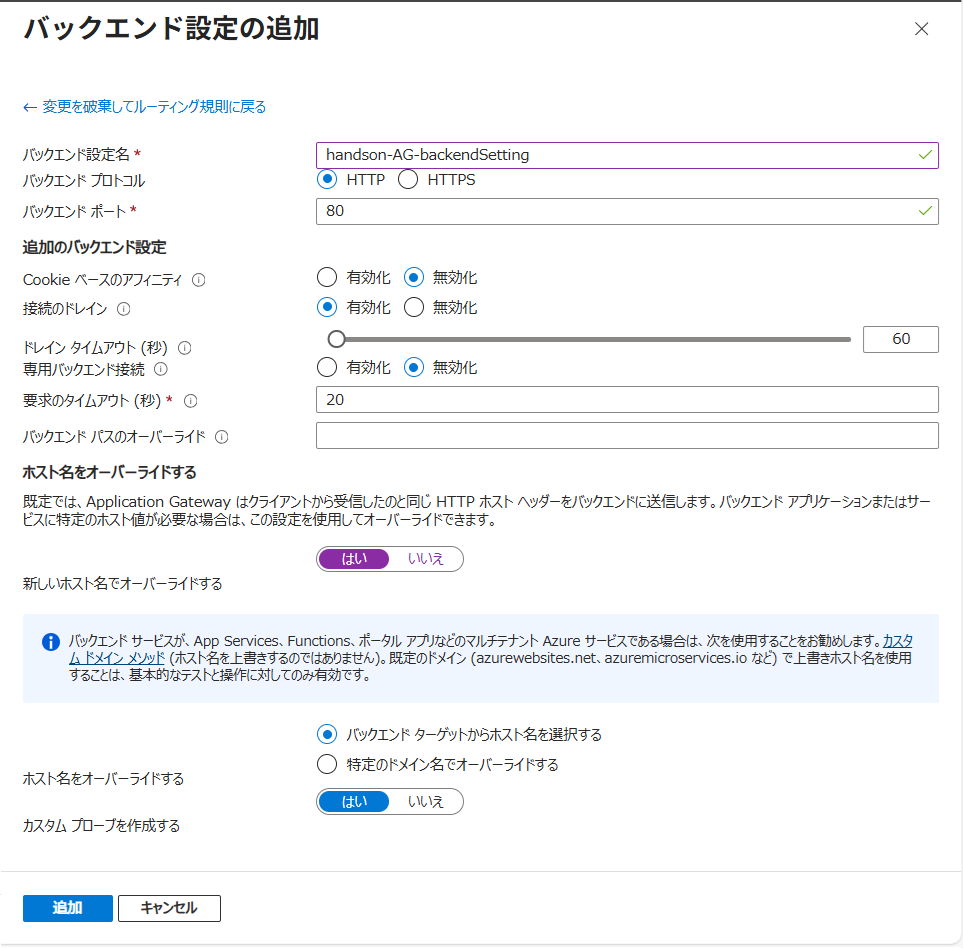

     設定したら \[**追加**\] ボタンをクリックし、\[**+ ルーティング規則の追加**\] ブレードに戻ります。

    \[**\* バックエンド ターゲット**\] タブの項目 \[**バックエンド 設定 \***\] に先ほど作成した \[**handson-AG-backendSetting**\] が選択されていることを確認し、\[**追加**\] ボタンをクリックします。

8. \[**構成**\] タブの画面に戻るので、\[**次 : タグ \>**\] ボタンをクリックし、遷移した画面で \[**確認および作成**\] ボタンをクリックします。

    \[**作成**\] ボタンが有効になったらクリックしてデプロイを開始します。

    デプロイが完了すると \[**リソースに移動**\] ボタンが表示されるのでクリックして作成した Application Gateway のリソース画面に遷移します。

9. 画面左のメニューから \[**概要**\] をクリックし、遷移した画面の \[**フロントエンド　パブリック IP**\] の IP アドレス部分をコピーします。

    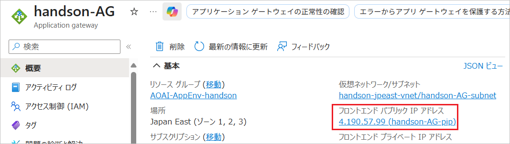

    
10. コピーした IP アドレスで以下のように URL を記述して Web ブラウザーのアドレスバーに貼り付け演習用アプリケーションの画面が表示されることを確認します

    `http://<コピーした IP アドレス>/`  (例: `http://203.0.113.0/`)`

    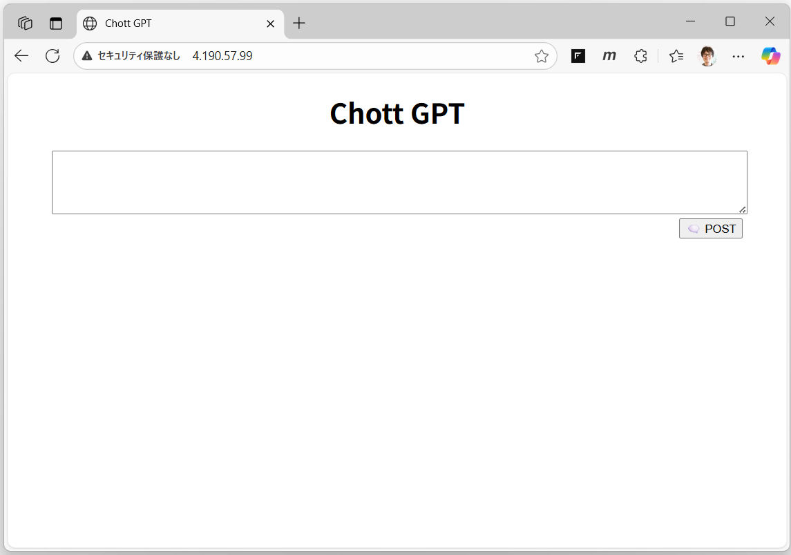

ここまでの手順により、Application Gateway を経由して仮想ネットワーク内の演習用アプリケーションへのアクセスが可能になりました。

 

# まとめ

この演習では Application Gateway を追加して、パブリックネットワークからのリクエストを仮想ネットワーク内の App Service にルーティングする構成を行いました。

これにより演習用アプリケーション利用する Azure リソースは仮想ネットワーク内に閉域化され、パブリックネットワークからのリクエストは Application Gateway を経由することで一本化することができました。

この演習では、App Services のベースライン アーキテクチャに従い、プライベート エンドポイントを使用して Application Gateway との接続を行っていますが、以下の図のようにサービス エンドポイントを使用してセキュアに接続することも可能です。

また、この演習は、カスタムドメインと SSL 証明書が用意できない場合の学習目的での手順として HTTP を使用しましたが、実際のシナリオでは HTTS と Application Gateway とバックエンドの App Service の両方でカスタム ドメインを使用することが推奨されています。

具体的な手順は以下のドキュメントを参照してください。

* [**Application Gateway を使用した App Service の構成**](https://learn.microsoft.com/ja-jp/azure/application-gateway/configure-web-app?tabs=customdomain%2Cazure-portal)

 

---

👈　[演習 6 : パブリック ネットワーク向けのエンドポイントの公開](Ex06.md)

🏚️　[README に戻る](README.md)