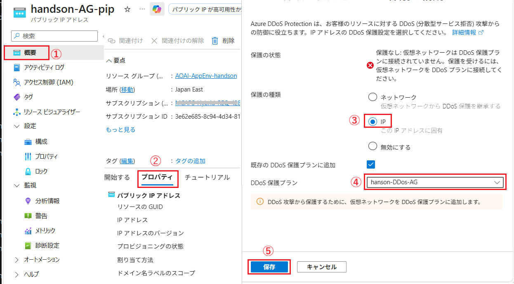

# 演習 6-2 : セキュリティ設定の追加

 Application Gateway について、ベースラインアーキテクチャで推奨されているセキュリティ設定を追加します。

 この演習では、以下の作業を行います。

 1. Web Application Firewall ポリシーの作成と適用
 2. DDoS 保護プランの設定
      
 

 ## 1. Web Application Firewall ポリシーの作成と適用

 [Web Application Firewall](https://learn.microsoft.com/ja-jp/azure/web-application-firewall/overview) は、一般的な悪用や脆弱性から Web アプリケーションを一元的に保護するための機能です。Application Gateway に WAF ポリシーを適用することで、Open Web Application Security Project (OWASP) コア ルール セットに基づいて、SQL インジェクションやクロスサイト スクリプティングなどの一般的な攻撃からアプリケーションを保護できます。
 
 この機能は、Web Application Firewall 単体ではデプロイできず、以下のいずれかのサービスに関連付けて使用します。

* [Application Gateway](https://learn.microsoft.com/ja-jp/azure/web-application-firewall/ag/ag-overview)
* [Azure Front Door](https://learn.microsoft.com/ja-jp/azure/web-application-firewall/afds/afds-overview)
* [Azure Content Delivery Network (CDN)](https://learn.microsoft.com/ja-jp/azure/web-application-firewall/cdn/cdn-overview)
  
この作業では、Application Gateway に関連付ける WAF ポリシーを作成し、Application Gateway に適用します。

* [Application Gateway 用の Web アプリケーション ファイアウォール ポリシーの作成](https://learn.microsoft.com/ja-jp/azure/web-application-firewall/ag/create-waf-policy-ag)

## 2. DDoS 保護プランの設定

Azure DDoS Protection は、Azure Virtual Network 内のリソースを分散型サービス拒否 (DDoS) 攻撃から保護するためのサービスです。

Azure DDoS Protection は、レイヤー 3 とレイヤー 4 のネットワーク レイヤーで保護されますが、Web Application Firewall (WAF) と組み合わせることで、[レイヤー 7 のアプリケーション レイヤーでの保護](https://learn.microsoft.com/ja-jp/azure/web-application-firewall/shared/application-ddos-protection#azure-waf-with-azure-application-gateway)も提供します。

Application Gateway WAF SKU を使用すると、多くの L7 DDoS 攻撃を軽減できます。

https://learn.microsoft.com/ja-jp/azure/ddos-protection/ddos-protection-features#metric-for-an-ip-address-under-ddos-attack