# 演習 6-2 : セキュリティ設定の追加

 Application Gateway について、ベースラインアーキテクチャで推奨されているセキュリティ設定を追加します。

 この演習では、以下の作業を行います。

 1. Web Application Firewall ポリシーの作成と適用
 2. DDoS 保護プランの設定
      
 

 ## 1. Web Application Firewall ポリシーの作成と適用

 [Web Application Firewall](https://learn.microsoft.com/ja-jp/azure/web-application-firewall/overview) は、一般的な悪用や脆弱性から Web アプリケーションを一元的に保護するための機能です。Application Gateway に WAF ポリシーを適用することで、Open Web Application Security Project (OWASP) コア ルール セットに基づいて、SQL インジェクションやクロスサイト スクリプティングなどの一般的な攻撃からアプリケーションを保護できます。
 
 この機能は、Web Application Firewall 単体ではデプロイできず、以下のいずれかのサービスに関連付けて使用します。

* [Application Gateway](https://learn.microsoft.com/ja-jp/azure/web-application-firewall/ag/ag-overview)
* [Azure Front Door](https://learn.microsoft.com/ja-jp/azure/web-application-firewall/afds/afds-overview)
* [Azure Content Delivery Network (CDN)](https://learn.microsoft.com/ja-jp/azure/web-application-firewall/cdn/cdn-overview)
  
この作業では、Application Gateway に関連付ける WAF ポリシーを作成し、Application Gateway に適用します。

具体的な手順は以下の通りです。

\[**手順**\]

1.  Application Gateway に WAF ポリシーを適用可能にするために、対象となる Application Gateway のレベルを **WAF V2** に変更する必要があります。

    Azure ポータルで、このハンズオンで作成した Application Gateway `handson-AG` の設定画面を開きます。

2. 画面左側のメニューで、\[設定\] - \[**構成**\] を選択し、遷移した画面の \[**レベル**\] ドロップダウンボックスで \[**WAF_v2**\] を選択します。

   画面左上の \[保存\] ボタンをクリックし、レベル変更を保存します。

    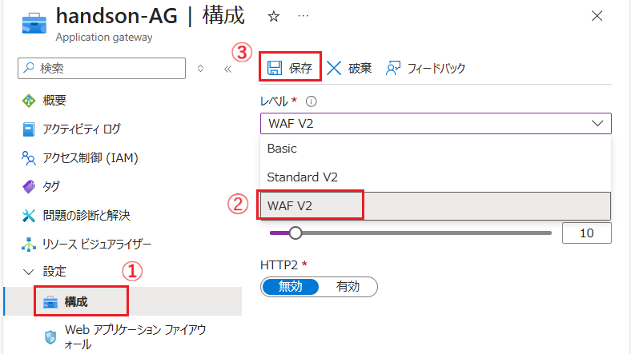

3. Azure ポータル画面上部の検索ボックスに `WAF ポリシー` と入力し、表示された検索結果から \[**Web Application Firewall ポリシー (WAF)**\] を選択します

    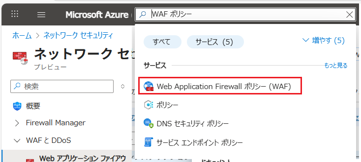

4. \[**ネットワーク セキュリティ | Web アプリケーション ファイヤーウォール**\] 画面で、画面上部の \[+ 作成\] ボタンをクリックします

    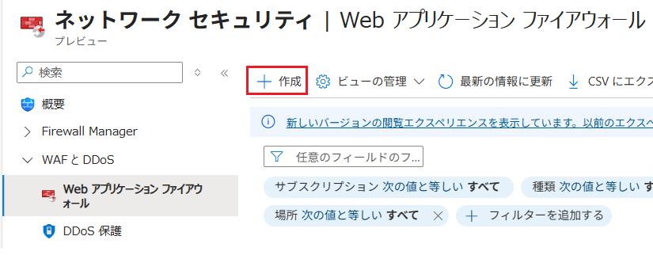

5. \[**Web アプリケーション ファイアウォール ポリシーの作成**\] 画面で、以下の項目を設定します

    **プロジェクトの詳細**

    | 項目 | 設定値 |
    |---|---|
    | 次に対するポリシー: \* | \[**リージョンの WAF (Application Gateway)**\] にチェック|
    | サブスクリプション | *このハンズオンで使用しているサブスクリプション* |
    | リソース グループ | \[**AOAI-AppEnv-handson**\] |

    **インスタンスの詳細**

    | 項目 | 設定値 |
    |---|---|
    | 名前: \* | `handson-WAF-AG` |
    | 場所: \* | \[**(Asia Pacific) Japan East**\] |
    | ポリシーを有効にする: \* | \[**有効**\] にチェック |
    | ポリシー モード: \* | \[**検出**\] にチェック |

    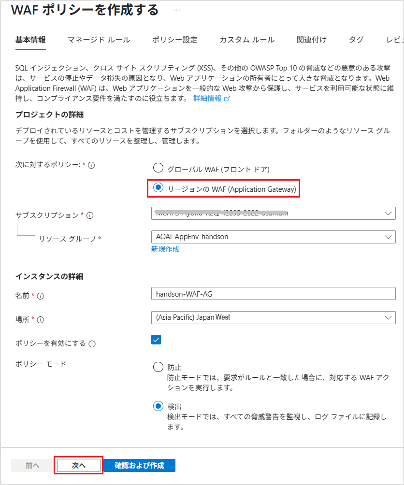

    設定が完了したら、画面下部の \[次へ\] ボタンをクリックします。

6. \[**マネージドルール**\] タブ画面に遷移するので、適用されるルール セットを確認します

    (※確認のみでとくに作業は不要です)

    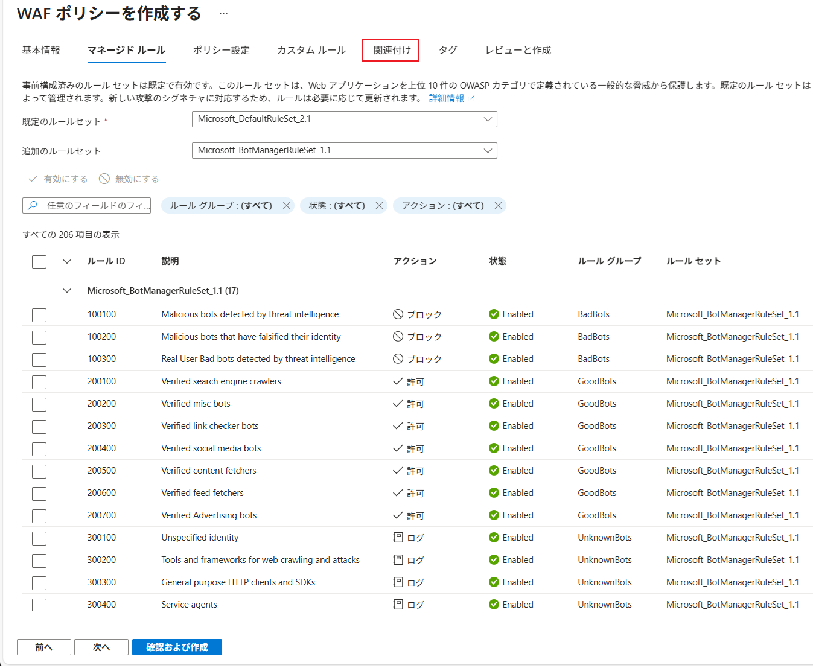

    今回は \[カスタム ルール\] は設定しないので、画面上部の \[**関連付け**\] タブをクリックします。

7. \[**関連付け**\] タブ画面に遷移するので、\[**+ 関連付けの追加**\] ボタンをクリックし、表示されたドロップダウンメニューから \[**Application Gateway**\] を選択します

8. 画面右に \[**アプリケーションゲートウェイを関連付け...**\] ブレードが表示されるので、以下の項目を設定します
    | 項目 | 設定値 |
    |---|---|
    | Application Gateway (WAF v2 SKU) | \[**handson-AG**\] |
    | 現在の構成と異なる場合でも Web Application Firewall ポリシーの構成を適用する | \[**チェック**\] |

    各項目を設定したら同ブレード下部の \[**追加**\] ボタンをクリックし、\[**関連付け**\] タブ画面下部の \[**確認および作成**\] ボタンをクリックします。

    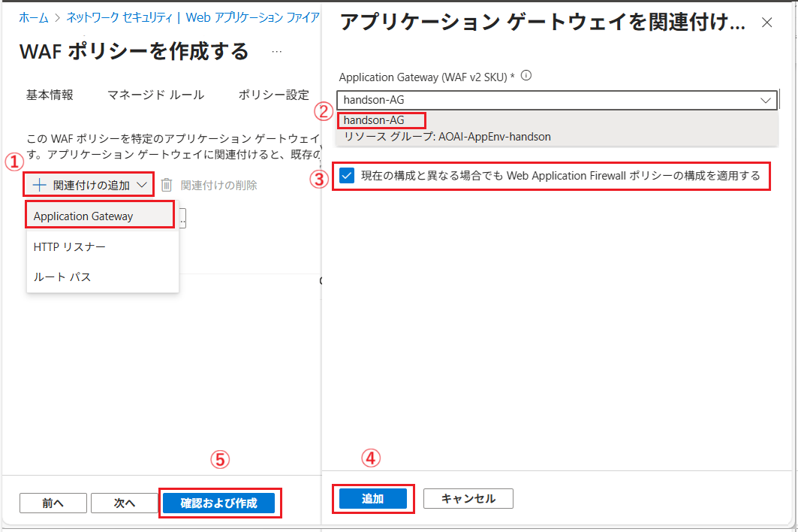

    ここまでの手順で、WAF ポリシーを作成し、Application Gateway に関連付けを行うことができました。

9. この演習で作成した Application Gateway `handson-AG` で、Web Application Firewall のメトリック アラートと、診断設定が有効になっていることを確認します。

    Azure ポータルで、Application Gateway `handson-AG` の設定画面を開き、画面左側のメニューで \[監視\] - \[**メトリック**\] を選択します。
    
    メトリック チャート上にあるボックスの \[**メトリック**\] ドロップダウン ボックスをクリックし、表示されたメトリック一覧の中に **WAF** というプレフィックスが付いたメトリックが存在することを確認します。
 
    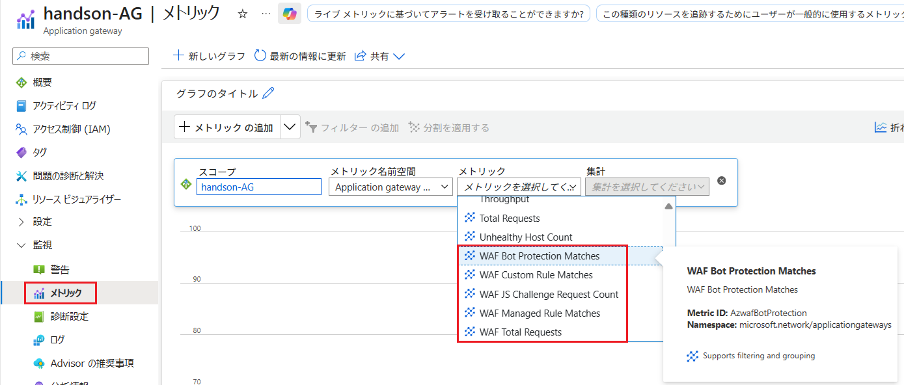

    各メトリックの詳細については、以下の記事を参照し、適宜メトリック アラートを設定してください。(※メトリック名まで日本語に翻訳されているので注意してください)

    * [**Application Gateway WAF v2 のメトリック**](https://learn.microsoft.com/ja-jp/azure/web-application-firewall/ag/application-gateway-waf-metrics#application-gateway-waf-v2-metrics)

10. 同 Application Gateway の診断設定で、**Web Application Firewall** とその他の診断設定を追加します

    画面左側のメニューから \[監視\] - \[**診断設定**\] を選択し、遷移した画面で \[**+ 診断設定を追加する**\] ボタンをクリックします。

    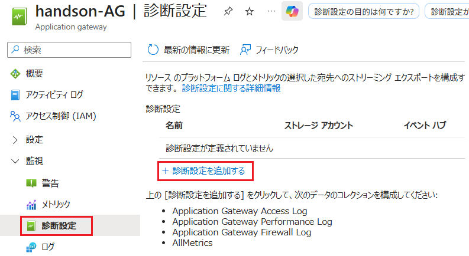

11. \[**診断設定**\] 画面に遷移するので、\[ログ\] の \[カテゴリ\] に、**Web Application Firewall Log** が存在することを確認し、画面の各項目を以下のように設定します

    | 項目 | 設定値 |
    |---|---|
    | 診断設定の名前: \* | `AOAI-AG-DiagSetting` |
    

    **ログ** 
    
    **all logs** にチェック(※以下の3項目すべてにチェックが入ります)

    * ApplicationGatewayAccessLog
    * ApplicationGatewayPerformanceLog
    * ApplicationGatewayFirewallLog

    **宛先の詳細**

    | 項目 | 設定値 |
    |---|---|
    | **Log Analytics ワークスペース** | \[**チェック**\] |
    | サブスクリプション | *このハンズオンで使用しているサブスクリプション* |
    | ワークスペース | \[**AOAI-LogAnalytics**\] |
    |ターゲット テーブル|*既定のまま*| 

    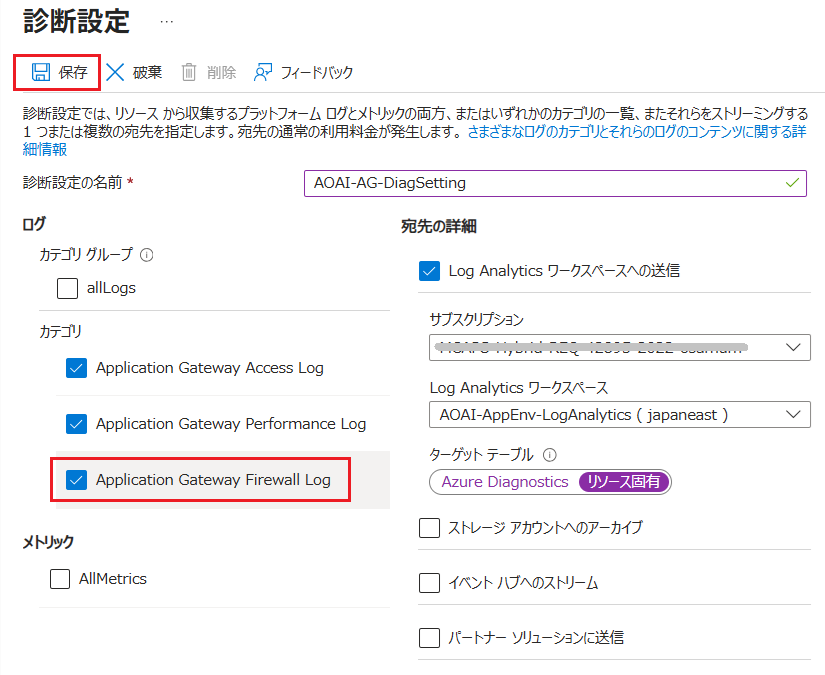

    各項目を設定したら画面上部の \[**保存**\] ボタンをクリックし、診断設定を保存します。

    ここまでの作業で、Application Gateway に WAF を含む診断設定を追加することができました。

    Application Gateway の診断ログの分析方法については、以下の記事の内容を参考に行ってください。

    * [**Log Analytics を使用して Application Gateway Web アプリケーション ファイアウォール (WAF) のログを調べる**](https://learn.microsoft.com/ja-jp/azure/web-application-firewall/ag/log-analytics?source=recommendations)

この作業では、Web Application Firewall (WAF) ポリシーを作成し、Application Gateway に適用しました。

これにより、Application Gateway では WAF のメトリックを検出できるようになり、WAF ログを Log Analytics ワークスペースに送信できるようになりました。

Azure Application Gateway での Azure Web Application Firewall (WAF) のベスト プラクティスについては、以下の記事を参照してください。

* [**Azure Application Gateway での Azure Web Application Firewall (WAF) のベスト プラクティス**](https://learn.microsoft.com/ja-jp/azure/web-application-firewall/ag/best-practices)

 

## 2. DDoS 保護プランの設定

[Azure DDoS Protection](https://learn.microsoft.com/ja-jp/azure/ddos-protection/ddos-protection-overview) は、Azure Virtual Network 内のリソースを分散型サービス拒否 (DDoS) 攻撃から保護するためのサービスです。

この作業では、送信元のパブリック IP で Azure DDoS Protection を有効にして、レイヤー 3 (L3) およびレイヤー 4 (L4) の DDoS 攻撃からパブリック IP を保護します。

具体的な手順は以下の通りです。

\[**手順**\]

1. Azure ポータル画面上部の検索ボックスに `DDoS` と入力し、表示された検索結果から \[**DDoS 保護プラン**\] を選択します

    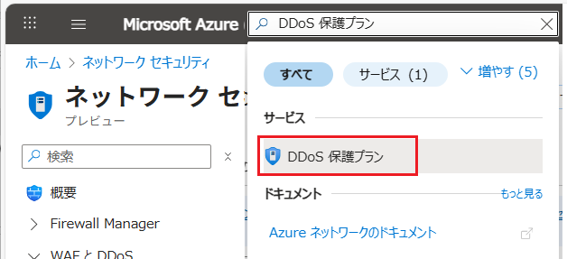

2. \[ネットワーク セキュリティ | **DDoS 保護**\] 画面に遷移するので、画面上部の \[**+ 作成**\] ボタンをクリックします

    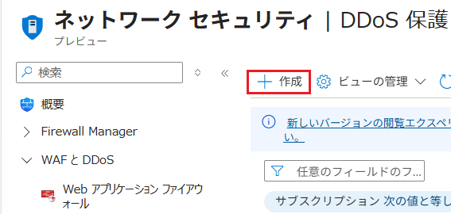

3. \[**DDoS 保護プランの作成**\] 画面が表示されるので、以下の項目を設定します

    **プロジェクトの詳細**

    | 項目 | 設定値 |
    |---|---|
    | サブスクリプション | *このハンズオンで使用しているサブスクリプション* |
    | リソース グループ | \[**AOAI-AppEnv-handson**\] |

    **インスタンスの詳細**

    | 項目 | 設定値 |
    |---|---|
    | 名前: \* | `handson-DDos-AG` |
    | 場所: \* | \[**(Asia Pacific) Japan East**\] |

    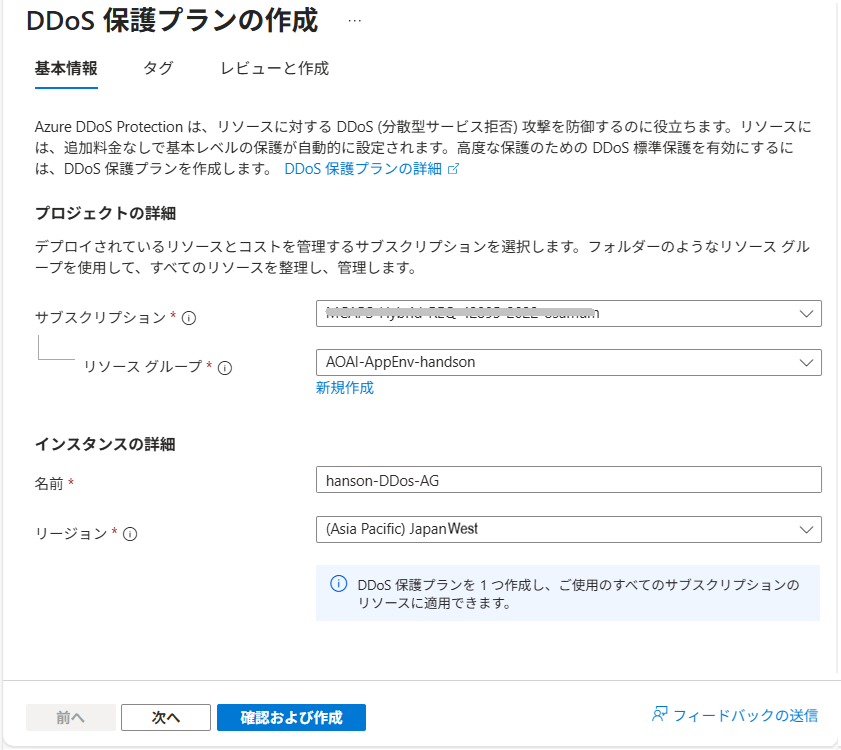

    各項目を設定したら画面下部の \[確認および作成\] ボタンをクリックし、内容を確認した上で \[作成\] ボタンをクリックします。

4. DDoS 保護プランの作成が完了したら、パブリック IP アドレス `handson-AG-PIP` に DDoS 保護プランを適用します。

    Azure ポータルで、パブリック IP アドレス `handson-AG-PIP` の[**概要**] 画面を開きます。
    
5. 同画面の [**プロパティ**] タブをアクティブにし、タブ内の \[**DDoS 保護**\] リンクをクリックします

6. 画面右に \[**DDoS 保護の構成**\] ブレードが表示されるので、以下の項目を設定します

    | 項目 | 設定値 |
    |---|---|
    | 保護の種類 | \[**IP**\] にチェック |
    | 既存の DDoS 保護プランに追加 | **チェック** |
    | DDoS 保護プラン | \[**handson-DDos-AG**\] |

    各項目を設定したら同ブレード下部の \[**保存**\] ボタンをクリックし、DDoS 保護プランの適用を保存します。

    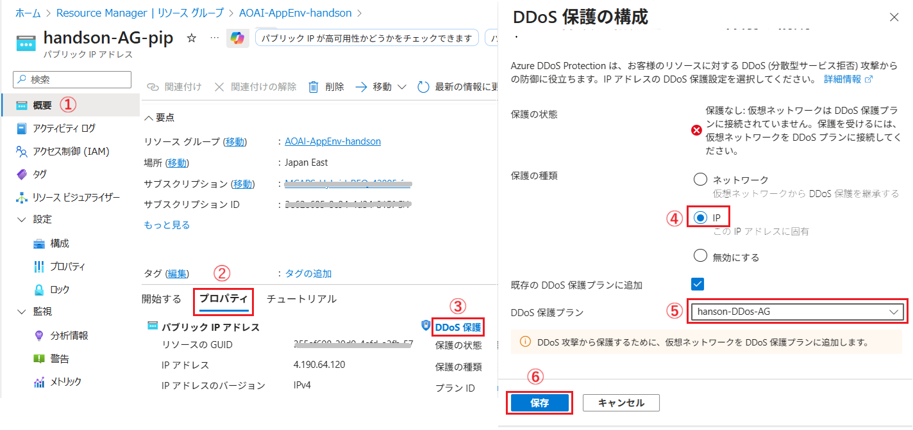

    ここまでの作業で、パブリック IP アドレス `handson-AG-PIP` に DDoS 保護プランを適用することができました。

7. この演習で作成した パブリック IP アドレス `handson-AG-PIP` で、DDoS 保護のメトリック アラートと、診断設定が有効になっていることを確認します。

    Azure ポータルで、パブリック IP アドレス `handson-AG-PIP` の設定画面を開き、画面左側のメニューで \[監視\] - \[**メトリック**\] を選択します。
    
    メトリック チャート上にあるボックスの \[**メトリック**\] ドロップダウン ボックスをクリックし、表示されたメトリック一覧の **Data Path Availability** 中に **DDos** というプレフィックスが付いたメトリックが存在することを確認します。

    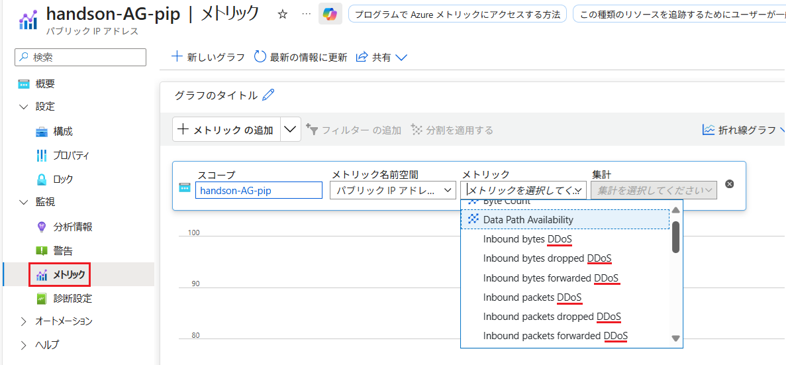

    各メトリックの詳細については、以下の記事を参照し、適宜メトリック アラートを設定してください。(※メトリック名まで日本語に翻訳されているので注意してください)

    * Azure DDoS Protection を監視する - [**パブリック IP アドレスからのメトリックを表示する**](https://learn.microsoft.com/ja-jp/azure/ddos-protection/monitor-ddos-protection#view-metrics-from-public-ip-address)

8. 同 パブリック IP アドレス の診断設定で、**DDoS Protection** とその他の診断設定を追加します

    画面左側のメニューから \[監視\] - \[**診断設定**\] を選択し、遷移した画面で \[**+ 診断設定を追加する**\] ボタンをクリックします。

    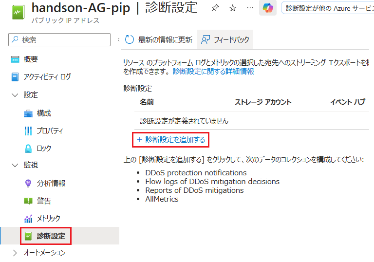

9.  \[**診断設定**\] 画面に遷移するので、\[ログ\] の \[カテゴリ\] に、**DDoS** という文字を含むログ カテゴリが存在することを確認し、画面の各項目を以下のように設定します

    | 項目 | 設定値 |
    |---|---|
    | 診断設定の名前: \* | `AOAI-PIP-DiagSetting` |

    **ログ** 
    
    **all logs** にチェック(※以下の 3 項目すべてにチェックが入ります)

    * DDoS protection notifications
    * Flow logs of DDoS mitigation decisions
    * Reports of DDoS mitigations

    **メトリック**

    | 項目 | 設定値 |
    |---|---|
    | AllMetrics | **チェック** |

    **宛先の詳細**

    | 項目 | 設定値 |
    |---|---|
    | **Log Analytics ワークスペース** | \[**チェック**\] |
    | サブスクリプション | *このハンズオンで使用しているサブスクリプション* |
    | ワークスペース | \[**AOAI-LogAnalytics**\] |

    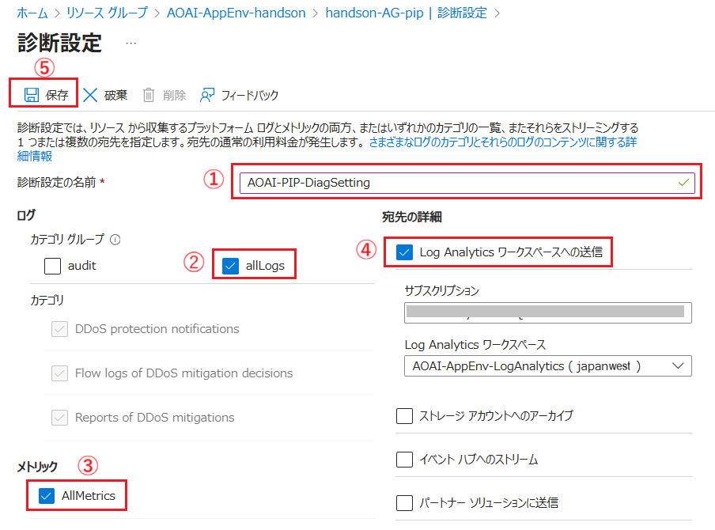

    各項目を設定したら画面上部の \[**保存**\] ボタンをクリックし、診断設定を保存します。

    ここまでの作業で、パブリック IP アドレス `handson-AG-PIP` に DDoS 保護を含む診断設定を追加することができました。

    パブリック IP アドレスのAzure DDoS Protection 診断ログ アラートの設定方法については、以下のドキュメントの内容を参考に行ってください。

    * [**チュートリアル: Azure DDoS Protection 診断ログ アラートを構成する**](https://learn.microsoft.com/ja-jp/azure/ddos-protection/ddos-diagnostic-alert-templates)

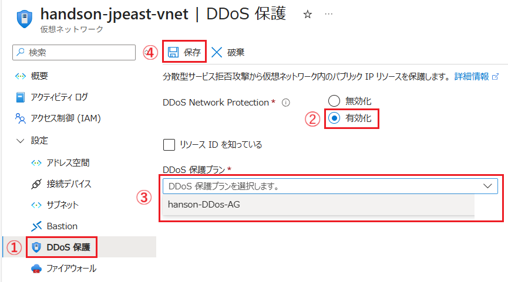
https://learn.microsoft.com/ja-jp/azure/ddos-protection/ddos-protection-features#metric-for-an-ip-address-under-ddos-attack

Web Application Firewall (WAF) と組み合わせることで、[レイヤー 7 のアプリケーション レイヤーでの保護](https://learn.microsoft.com/ja-jp/azure/web-application-firewall/shared/application-ddos-protection#azure-waf-with-azure-application-gateway)も提供します。

[パブリック IP アドレスで DDoS IP 保護を有効にする](https://learn.microsoft.com/ja-jp/azure/ddos-protection/manage-ddos-ip-protection-portal#enable-ddos-ip-protection-on-a-public-ip-address)
