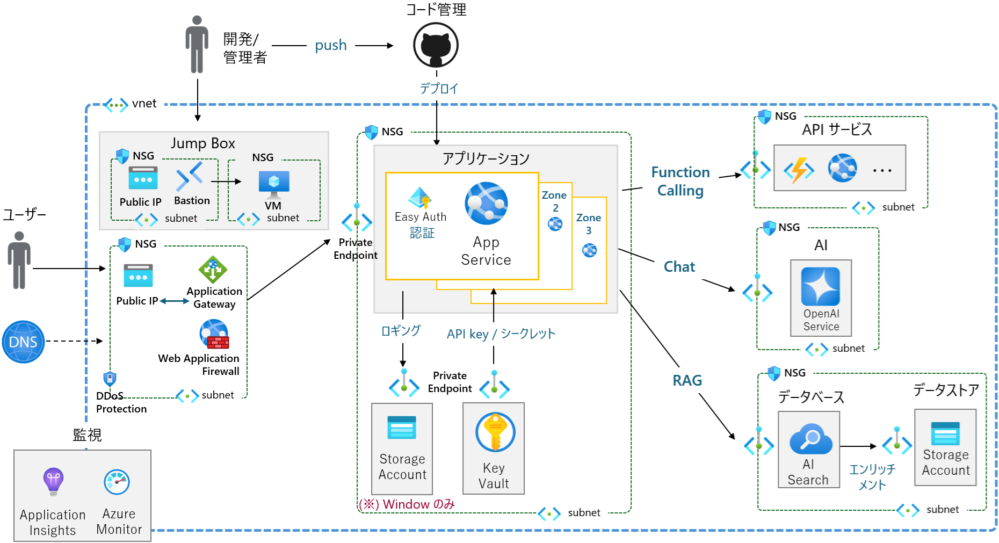

# AOAI App Basic Hosting Hands-on

## 概要

このハンズオンは [Azure OpenAI サービス](https://learn.microsoft.com/ja-jp/azure/architecture/ai-ml/architecture/azure-openai-baseline-landing-zone)を使用するアプリケーションをサービスとしてホストするための環境を構築するハンズオンです。

Microsoft Azure 上に実際にリソースを作成し、Azure OpenAI サービスを使用して動作する演習用アプリケーションをデプロイして Azure のベースライン アーキテクチャに準拠した運用環境を構築します。

演習で構築するシステム構成は [Azure ランディング ゾーンでの Azure OpenAI チャット ベースライン アーキテクチャ](https://learn.microsoft.com/ja-jp/azure/architecture/ai-ml/architecture/baseline-openai-e2e-chat) を元にしていますが、演習に使用するアプリケーションは **Azure AI Foundry プロジェクトを使用しない**一般的な構成であるため [Azure でホストされる Web アプリケーションのベースライン](https://learn.microsoft.com/ja-jp/azure/architecture/web-apps/app-service/architectures/baseline-zone-redundant)に沿いつつ一部に変更を加えています。

## 目的

Azure のベースライン アーキテクチャとして紹介されている環境の構築方法を学ぶことと、演習終了後に実際に運用を構築する際の設定手順の参照として利用できるようにすることを目的としています。

 

## ハンズオンの内容

このハンズオンでは、事前準備を含めシナリオに沿って以下の内容を学習します。

### 事前準備

* Bicep を使用した演習で使用する Azure リソースの作成
* リポジトリ テンプレートを使用した演習用アプリケーション用リポジトリの作成
* App Service への GitHub リポジトリからアプリケーションのデプロイ
* Azure AI Search のインデックス作成

### ハンズオンの演習

* App Service 自動認証
* Key Vault へのキーの登録
* マネージド ID によるサービス間認証
* アプリケーションのゾーン冗長
* 仮想ネットワークの構築と閉域化
* 仮想ネットワークピアリング
* プライベートエンドポイントの作成
* 仮想マシンと Bastion を使用した Jump Box の構築
* Application Gateway を介した Web アプリケーションの公開
* DDOS Protection の有効化

以下の項目については [Azure App Service ハンズオン](https://github.com/osamum/Azure-AppService-handson)の手順を使用して学習します。

* App Service のホスティングに関する設定の確認
* App Service ログの設定と有効化
* バックアップ
* デプロイ スロット
* GitHub リポジトリを使用した CI/CD
* 可用性設定
    - スケールアップ
    - スケールアウト
    - 自動スケーリング
* 高度なログ監視
    - メトリック アラートの設定
    - Log Analytics を使用したログの分析
    - Application Insights 使用したアプリケーションの監視
  
 

## 対象者

クラウドサービスにおれる IaaS、PaaS、SaaS の違いを理解しており、Azure の基本的な操作に慣れている方を対象としています。

具体的には Microsoft 資格試験である MCP AZ-900 を取得されているか、取得者と同程度の知識を有している方を対象としています。

MCP AZ-900 の内容については以下をご覧ください。

* [試験 AZ-900: Microsoft Azure の基礎の学習ガイド](https://learn.microsoft.com/ja-jp/credentials/certifications/resources/study-guides/az-900)

 

## ハンズオンの前提条件

このハンズオンでは、以下のアカウントとツール類が必要となります。

アカウント

* [**Microsoft Azure** アカウント](https://learn.microsoft.com/ja-jp/dotnet/azure/create-azure-account)
* [**GitHub** アカウント](https://github.com/signup)
  
    (※) Visual Studio Code 等から Azure App Service へのデプロイ方法をご存じの場合は、GitHub アカウントがなくても一部の演習をスキップしてハンズオンを実施することができます。

ツール

  * [**Visual Studio Code**](https://code.visualstudio.com/)
  * [**Node.js**](https://nodejs.org/ja/)
  * [**Git ツール**](https://git-scm.com/downloads)
  
    (※) GitHub リポジトリから zip 形式でのダウンロードの方法をご存じの場合は、Git ツールがなくても一部の演習をスキップしてハンズオンを実施することができます。