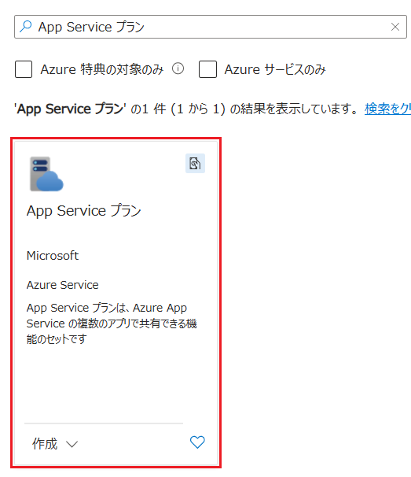
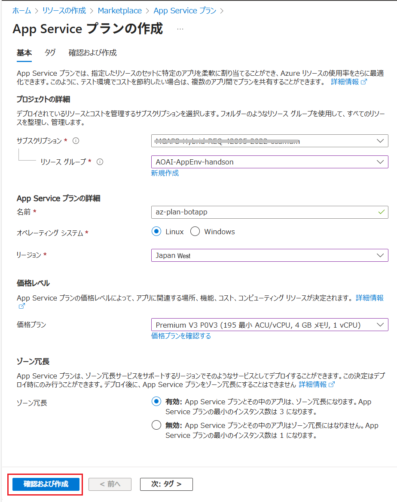
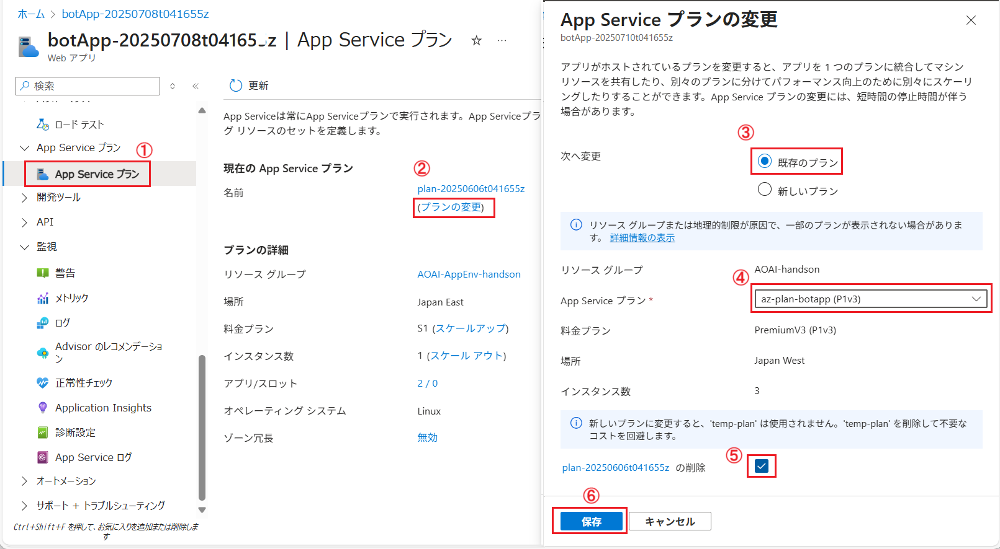
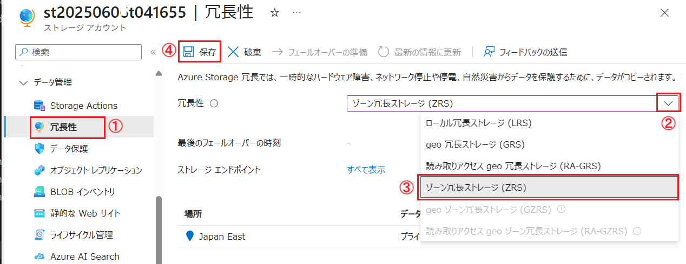
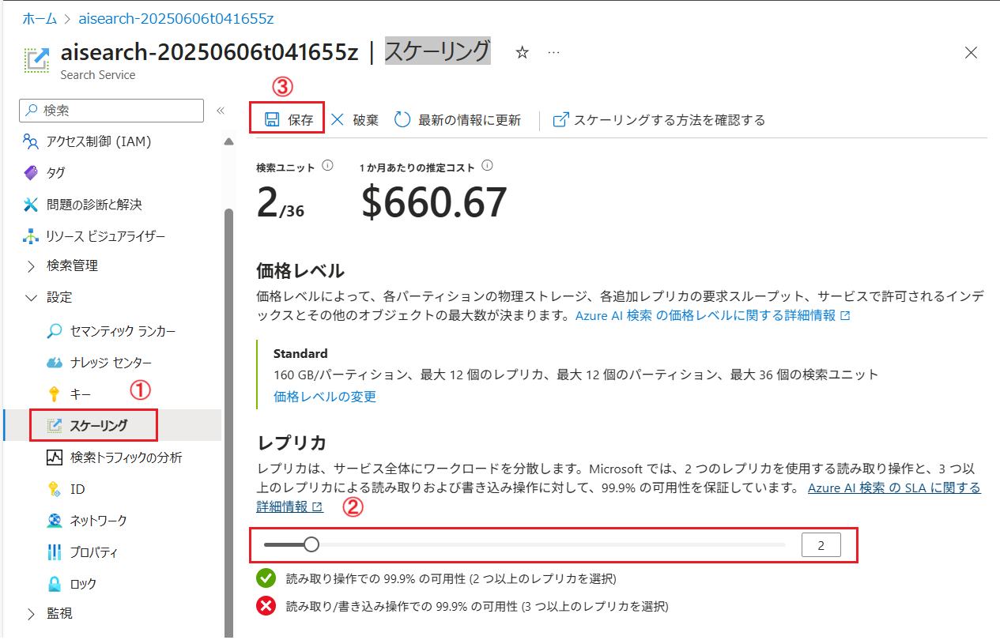

# 演習 2-5 : 可用性設定

運用環境ではサービスの継続性（可用性）」を確保することが重要です。

負荷の増減は当然として、一時的な障害や断続的な障害が発生にも影響を最小限に抑え、必要なレベルのサービスを継続させる必要があります。これらのイベントは障害によって突発的に、メンテナンスなどによって定常的にも発生するためあらかじめ対策を講じておく必要があります。

こういった可用性を担保する対策として以下のようなものがあります。

## ✅ 可用性対策の分類と目的

| 対策カテゴリ　| 主な目的 | 具体例 |
|---|---|---|
| 障害対策 | ハードウェアやインフラの故障に備える | 可用性ゾーン、冗長構成、フェイルオーバー |
| 負荷対策 | トラフィックや処理量の増加に対応 | スケールアウト／アップ、ロードバランサー |
| 運用対策 | ヒューマンエラーやメンテナンスによる停止を、ゼロトラスト、アクセス制御 |ロールバック、ブルーグリーンデプロイ、CI/CD               
| セキュリティ対策 | 攻撃や不正アクセスによるサービス停止を防ぐ | DDoS対策

上記の表からここでは障害対策と負荷対策について基本的な以下の設定の演習を行います。

1. 可用性ゾーンの設定
2. スケールアップ/アウトの設定

 

## 1. 可用性ゾーンの設定

可用性ゾーンとは、同一リージョンのデータセンター内にある分離されたグループです。これは、独立した電源、冷却装置、ネットワーク インフラストラクチャがあるため、あるゾーンで障害が発生しても、リージョン サービス、容量、高可用性が残りのゾーンでサポートされます。

可用性ゾーンの利用は Azure App Service の運用環境デプロイに関する推奨事項にもなっています。

可用性ゾーンについての詳細については以下のドキュメントをご参照ください。

* [**Azure 可用性ゾーンとは**](https://learn.microsoft.com/ja-jp/azure/reliability/availability-zones-overview
)

可用性ゾーンは [Azure のさまざまなサービスでサポート](https://learn.microsoft.com/ja-jp/azure/reliability/availability-zones-service-support)されていますが、この演習ではデプロイしたリソース Azure App Service と Azure Storage、Azure AI Saerch の可用性ゾーンの設定を行います(※)。

(※) 公式ドキュメントで詳細な手順が提供されているものについては、手順のリンクを提供します。

### 🌐 App Service の可用性ゾーンの設定

App Service をゾーン冗長構成にすることで、単一のゾーン（データセンター）に障害が発生しても、他のゾーンに自動的にフェイルオーバーされサービスを継続できるようになります。

Azure App Service の可用性ゾーンの設定は、App Service のプランの設定で行います。

Azure App Servive の可用性ゾーンは [Premium v2-4 または Isolated v2 プランの種類](https://learn.microsoft.com/ja-jp/azure/app-service/overview-hosting-plans)を使用し、プランのインスタンスが少なくとも 2 つ必要です。また、ゾーン冗長の設定は App Service プランを**新規に作成する際にのみ可能**です。

そのため既存の App Service で動作するアプリケーションの可用性ゾーンを有効にするには、新規に App Service プランを作成し、アプリケーションを移行する必要があります。ただし、移行対象となる App Service と移行先の App Serviceプランは同じリージョンでかつ、同じ OS、 同じリソースグループである必要があります。また、データセンターのキャパシティ不足時には設定時にインスタンス確保ができない可能性もあるため、事前に十分なリソースを確保することが推奨されます。

>[!NOTE]
> この演習では追加の料金が発生します。また、この後の演習はここまで使用している Standard (S1) プランでも実施できますので、この演習後に必要に応じてプランを戻すことをお勧めします。
> また、データセンターのキャパシティの関係で App Service プランの作成に失敗する場合はスキップして次の演習に進んでください。

具体的な手順は以下のとおりです。

\[**手順**\]

1. [Azure Portal](http://portal.azure.com) にログインします。

2. ポータル画面上部の \[**+**\] リソースの作成 アイコンか、表示されていない場合は画面左上のハンバーガーメニューをクリックし、\[**リソースの作成**\] をクリックします

    

3. \[**リソースの作成**\] 画面に遷移するので、検索ボックスに `App Service プラン` と入力し、表示された検索結果の \[**App Service プラン**\] のタイルをクリックします

    

4. \[**App Service プラン**\] 画面に遷移するので、\[サブスクリプション\] の内容が正しいものであることを確認したら既定のまま \[**作成**\]ボタンをクリックします

5. \[**App Service プランの作成**\] 画面が表示されるので、以下の項目を入力します

    |項目|値|
    |---|---|
    |サブスクリプション\*| (ご利用のサブスクリプション) |
    |リソース グループ\*| `AOAI-AppEnv-handson` |
    |名前\*| `az-plan-botapp` |
    |オペレーティング システム\*| `Linux` |
    |リージョン\*| \[**Japan West**\] |
    |価格プラン\*| `Premium v3 P0V3` |
    |ゾーン冗長\*| `有効` |

    

    設定が完了したら画面下の \[**確認および作成**\] ボタンをクリックし、内容を確認したら \[**作成**\] ボタンをクリックします。

    App Service プランのデプロイが開始さるので完了するまで待ちます。

6. 演習用アプリケーションがデプロイされている App Service の画面を開き、画面左側のメニューから \[**App Service プラン**\] をクリックします

    遷移した画面内にある App Service の名前の下にある \[**(プランの変更)**\] リンクをクリックすると、\[**App Service プランの変更**\] ブレードが表示されるので各項目の設定を以下のように設定します。

    |項目|値|
    |---|---|
    |次へ変更| \[**既存のプラン**\] にチェック |
    |App Service プラン\*| \[**az-plan-botapp**\] を選択 |
    |plan-(ランダムな値) の削除| チェック |

    

    設定を完了したら画面下の \[**保存**\] ボタンをクリックします。

ここまでの手順で、演習用の App Service に可用性ゾーンを設定することができました。

 

### 🛢️ Azure Storage アカウントの可用性ゾーンの設定

Azure Storage に可用性ゾーンの設定を行うと、予期せぬ障害からサービスを保護するため、常にデータの複数のコピーが格納されます。 冗長性により、障害が発生しても、ストレージ アカウントが Azure Storage のサービス レベル アグリーメント (SLA) を満たすことが保証されます。

既存の Azure Storage アカウント インスタンスに可用性ゾーンを設定する方法は以下の 2 つがあります。

1. 可用性ゾーンを有効にして作成した新しいストレージ アカウントにデータを移行する
2. 既存のストレージ アカウントを変換する

この演習では、2 の「既存のストレージ アカウントを変換する」方法で可用性ゾーンの設定を行いますが、この変換にも以下の 2 つの方法があります。

1. Azure Portal を使用して変換を依頼
2. サポート リクエストを作成して変換を依頼

この演習では、1 の「Azure Portal を使用して変換を依頼する方法」の手順を説明します。

>[!NOTE]
> この方法は操作から実行が開始されるまで最長で 72 時間かかる場合があります。また、この設定を行わなくてもこれ以降の演習は可能なので、手順の確認にとどめ、実行はしないでください。

Azure Portal を使用して既存の Azure Storage アカウントを可用性ゾーンが設定されたインスタンスに変換を依頼する手順は以下のとおりです。

\[**手順**\]

1. [Azure Portal](http://portal.azure.com) にログインします

2. この演習で使用している Azure Storage アカウントの画面を開き、画面左側のメニューから \[データ管理\] - \[**冗長性**\] をクリックします

3. \[**冗長性**\] の画面が表示されるので、画面内の \[**冗長性**\] ドロップダウン リストから \[**ゾーン冗長ストレージ (ZRS)**\] を選択します
   
    

    画面上部の \[**保存**\] ボタンをクリックして設定を保存します。

ここまでの手順で、Azure Storage アカウントの可用性ゾーンの設定を依頼することができました。

なお、Azure Storage アカウントの可用性ゾーン サポートへの移行についての詳細は以下のドキュメントをご参照ください。

* [**Azure Storage アカウントを可用性ゾーンのサポートに移行する**](https://learn.microsoft.com/ja-jp/azure/reliability/migrate-storage#option-1-conversion)

 

### 🔍 AI Search の可用性ゾーンの設定

Azure AI Search における可用性ゾーンの設定は、個々のレプリカがゾーン割り当ての単位となっており、 検索サービスは、1 つのリージョン内で実行されます。そのレプリカは、そのリージョン内の別の物理データ センター (またはゾーン) で実行されるためゾーン冗長を有効にするのに特別な設定は不要で、レプリカ数を 2 以上に設定することで自動的にゾーン冗長が有効になります。

ただし、すべてのリージョンでゾーン冗長がサポートされているわけではないため、ゾーン冗長を有効にする前に、使用しているリージョンでの[サポート状況](https://learn.microsoft.com/ja-jp/azure/search/search-reliability#supported-regions)を確認する必要があります。

>[!NOTE]
> この設定を行わなくてもこれ以降の演習は可能なので、手順の確認にとどめ、実行はしなくても問題ありません。

Azure AI Search の可用性ゾーンを有効にする手順は以下のとおりです。

\[**手順**\]

1. [Azure Portal](http://portal.azure.com) にログインします

2. この演習で使用している Azure AI Search の画面を開き、画面左側のメニューから \[設定\] - \[**スケーリング**\] をクリックします

3. \[**スケーリング**\] の画面が表示されるので、画面内の \[**レプリカ**\] スライダーを操作 して 2 以上の数を指定します

    

    画面上部の \[**保存**\] ボタンをクリックして設定を保存します。

ここまでの手順で、Azure AI Search の可用性ゾーンの設定を行うことができました。

なお、Azure AI Search の可用性全般についての詳細は以下のドキュメントをご参照ください。

* [**Azure AI Search の信頼性**](https://learn.microsoft.com/ja-jp/azure/search/search-reliability#supported-regions)

 

## まとめ

この演習では、Azure App Service、Azure Storage、Azure AI Search の可用性ゾーンの設定を行いました。
可用性ゾーンを利用することで、単一のゾーン（データセンター）に障害が発生しても、他のゾーンに自動的にフェイルオーバーされサービスを継続できるようになります。

また、同様のアプローチで自然災害や大規模な障害に対する耐障害性を高めるために、複数のリージョンにリソースを配置することも検討できます。これにより、特定のリージョンでの障害が発生した場合でも、他のリージョンでサービスを継続できるようになります。

Azure サービス全般の冗長化については以下のドキュメントをご参照ください。

* Azure アーキテクチャ センター - [すべてを冗長化](https://learn.microsoft.com/ja-jp/azure/architecture/guide/design-principles/redundancy)