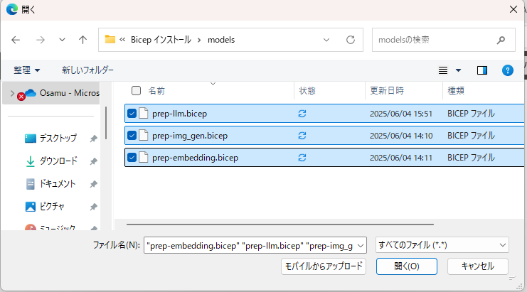

# 準備 2: Azure AI Search のインデックスの作成

前の手順でデプロイされた Azure OpenAI リソースに AI モデルをデプロイし、リソースへの接続情報を入手します。これらの情報は、この後の準備作業で演習用アプリケーションの設定に使用します。

## AI モデルのデプロイ

デプロイする AI モデルは以下の 3 つです。

| モデル | 種類 | 用途 |
|----|---|---|
| gpt-4o-mini | テキスト生成 | 会話 |
| dall-e-3 | 画像生成 | 画像の生成 |
| text-embedding-ada-002 | 埋め込み | 検索ワードのベクトル化 |

この作業も Bicep を使用して自動でデプロイを行いますが、手動で行いたい場合は Bicep を使用した手順の後に手動の手順へのリンクを用意していますので、そちらを参照してください。

Bicep を使用して AI モデルをデプロイする手順は以下のとおりです。

\[**手順**\]

1. 各 AI モデルをデプロイするための Bicep ファイルをダウンロードします。
   - [言語モデル用](./assets/prep-llm.bicep)
   - [埋め込みモデル用](./assets/prep-embedding.bicep)
   - [画像生成モデル用](./assets/prep-img_gen.bicep)

2. [Azure ポータル](https://portal.azure.com)にログインし、画面右上にある Cloud Shell アイコンをクリックして Cloud Shell 画面を開きます
    

3. Cloud Shell 画面のメニュー \[ファイルの監理\] - \[アップロード\] を選択し、ダウンロードした各モデル用の bicep ファイルをアップロードします
    
     

     

4. ファイルのアップロードが完了したら以下のコマンドを実行してアップロードしたファイルがリストされることを確認します。
   
    ```bash
    ls
    ```
5. 以下のコマンドを実行します。デプロイ中のリソース利用のコンフリクトを避けるため、以下の各コマンドが完了するのを待って実行してください。

    なおコマンドラインのパラメーター `accountName` には、前の手順でデプロイした **Azure OpenAI リソースの名前**を指定してください。

    * 言語モデルのデプロイ
  
        ```bash
        az deployment group create --resource-group AOAI-AppEnv-handson --template-file prep-llm.bicep  --parameters accountName=%Azure OpenAI リソースの名前% 
        ```

    * 埋め込みモデルのデプロイ
  
        ```bash
        az deployment group create --resource-group AOAI-AppEnv-handson --template-file prep-embedding.bicep --parameters accountName=%Azure OpenAI リソースの名前% 
        ```
    * 画面生成モデルのデプロイ
  
        ```bash
        az deployment group create --resource-group AOAI-AppEnv-handson --template-file prep-img_gen.bicep --parameters accountName=%Azure OpenAI リソースの名前% 
        ```
    デプロイが完了したら Cloud Shell 画面は閉じてしまって構いません。

    もし、失敗する場合は、[AI モデルを手動でデプロイする方法]() の内容に従い、手動でデプロイを行ってください。

6. デプロイが完了したら、Azure ポータルで前の作業で作成した Azure OpenAI サービスのリソース `aoai-(ランダムな値)` を開き、\[**概要**\] メニュー画面内にある \[Explore and deploy\] ボックス内の \[**Explore Azure AI Foundry Portal**\]ボタンをクリックします

    

7. Azure AI Foundry が開かれるので、画面左のメニューバーから \[**デプロイ**\] をクリックします

    

8. `gpt-4o-mini`、`text-embedding-ada-002`、`dall-e-3` の 3 つのモデルがリストされることを確認します。もし、リストされていない場合は、画面上部の \[**モデルのデプロイ**\] ボタンをクリックして、モデルを選択し、デプロイを行ってください。

    


 ここまでの手順で、ハンズオンで使用する Azure OpenAI サービスの AI モデルがデプロイされました。

### AI モデルを手動でデプロイする方法

 もし、ここまでの手順でデプロイがうまくいかなかった場合は、以下の手順に従い各 AI モデルをデプロイしてください。

なお、この手順は [Azure OpenAI アプリケーション開発ハンズオン](https://github.com/osamum/AOAI-first-step-for-Developer)コンテンツに遷移するので、デプロイが完了したら**次の演習には進まずに**このページに戻ってきてください。

* <a target="_blank" href="https://github.com/osamum/AOAI-first-step-for-Developer/blob/main/Ex01-2.md">Azure AI Foundry から言語モデル gpt-4o-mini のデプロイ</a>
* <a target="_blank" href="https://github.com/osamum/AOAI-first-step-for-Developer/blob/main/Ex01-3.md">Azure AI Foundry から埋め込みモデル : text-embedding-ada-002 のデプロイ</a>
* <a target="_blank" href="https://github.com/osamum/AOAI-first-step-for-Developer/blob/main/Ex01-4.md">Azure AI Foundry から画像生成モデル : dall-e-3 のデプロイ</a>


<br>

## 接続情報の取得

デプロイした Azure OpenAI サービスの接続情報を取得します。これらの情報は、演習用アプリケーションの設定に使用します。

具体的な手順については以下のリンク先のドキュメントの手順を参照してください。

* [**Azure OpenAI サービスの接続情報の入手**](https://github.com/osamum/AOAI-first-step-for-Developer/blob/main/Ex03-0.md#%E6%8E%A5%E7%B6%9A%E6%83%85%E5%A0%B1%E3%81%AE%E5%85%A5%E6%89%8B)

この手順は [Azure OpenAI アプリケーション開発ハンズオン](https://github.com/osamum/AOAI-first-step-for-Developer)コンテンツに遷移するので、接続情報をメモしたら**次の演習には進まずに**このページに戻ってきてください。