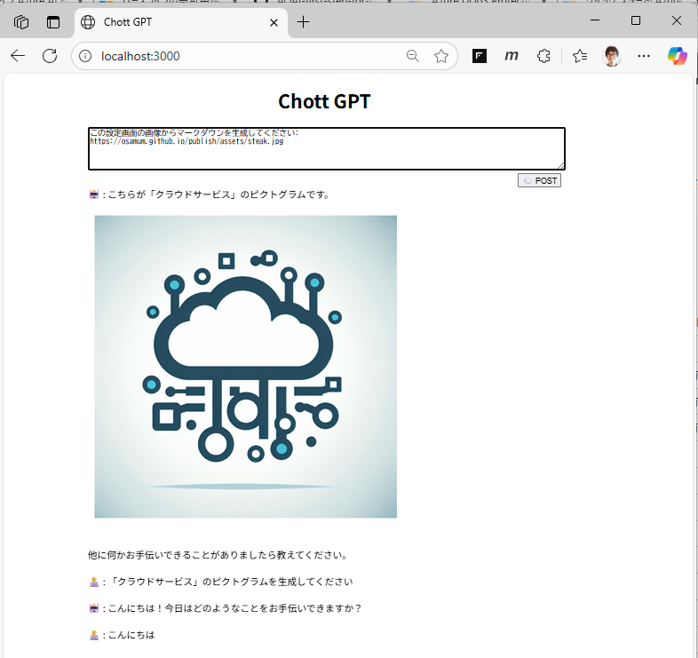

# はじめに

このハンズオンでは Azure OpenAI サービスを使用するアプリケーションをサービスとしてホストするための環境を実際に構築します。

このハンズオンを通じて、Azure OpenAI サービスを利用するアプリケーションをホストするための基本的な設定と運用に必要な知識を習得できます。

演習で構築するシステム構成は、 [Azure ランディング ゾーンでの Azure OpenAI チャット ベースライン アーキテクチャ](https://learn.microsoft.com/ja-jp/azure/architecture/ai-ml/architecture/baseline-azure-ai-foundry-chat) と [Azure でホストされる Web アプリケーションのベースライン](https://learn.microsoft.com/ja-jp/azure/architecture/web-apps/app-service/architectures/baseline-zone-redundant)を元にし、かつ、ログや監視、バックアップ、Production/Staging 環境(デプロイスロット)、セキュリティなどの運用に必要な設定を含むように一部変更を加えています。

今回のハンズオンで最終的に構築されるシステム構成図は以下のようになります。

ただし、一気にすべての構築を行うと理解が難しくなるため、複数の演習に分割して順を追って設定を行います。

 

# デプロイするアプリケーションについて

このハンズオンで使用するアプリケーションは [Node.js](https://nodejs.org/ja/) と [Express](https://expressjs.com/ja/) を使用して構築されており、Azure OpenAI サービスを利用して以下の機能を有しています。

* 会話
* Function Calling
  - 現在時刻の取得
  - 指定された GitHub アカウントの情報取得
* RAG (Retrieval Augmented Generation)
  - Azure AI Search サービスを利用したドキュメント検索
* 画像生成
* 画像認識

なお、このアプリケーションは以下のハンズオンで作成する演習用アプリケーションに Web の UI を追加したものです。

* [**AOAI-first-step-for-Developer**](https://github.com/osamum/AOAI-first-step-for-Developer)

 

# デプロイされる Azure リソースと AI モデル

演習で使用する Azure リソースと AI モデルは以下です。

* [**リソース グループ**](https://learn.microsoft.com/ja-jp/azure/azure-resource-manager/management/manage-resource-groups-portal#what-is-a-resource-group)
* [**Azure App Service**](https://learn.microsoft.com/ja-jp/azure/app-service/overview)
* [**Azure Storage Account**](https://learn.microsoft.com/ja-jp/azure/storage/common/storage-account-overview)
* [**Azure AI Search**](https://learn.microsoft.com/ja-jp/azure/search/search-what-is-azure-search)
* [**Azure OpenAI Service**](https://learn.microsoft.com/ja-jp/azure/ai-foundry/openai/overview)
  - gpt-4o-mini (テキスト生成)
  - dall-e-3 (画像生成)
  - text-embedding-ada-002 (埋め込み)

リソースグループ以外の Azure リソースは [Bicep](https://learn.microsoft.com/ja-jp/azure/azure-resource-manager/bicep/overview?tabs=bicep) ファイルを使用して自動的に作成されます。

各リソースの作成直後の設定値は以下の通りです。

* 🗂️ **リソースグループ** (※これはコマンドで手動で作成します)
    | 項目 | 値 |
    |----|---|
    | リソースグループ名 | `AOAI-AppEnv-handson` |
    | リージョン | `Japan East` |

* 🌐 **Azure App Service**
    | 項目 | 値 |
    |----|----|
    | リソースグループ | `AOAI-AppEnv-handson` |
    | 名前 | `botApp-(ユニークな値)` |
    | 公開 | コード |
    | ランタイムスタック | Node 22 LTS|
    | オペレーティング システム | Linux |
    | リージョン | `Japan East` |
    | 価格プラン | B1 |

    その他の設定は既定のまま

* 🛢️ **Azure Storage Account**
    | 項目 | 値 |
    |----|----|
    | リソースグループ | `AOAI-AppEnv-handson` |
    | ストレージ アカウント名 | `storage-(ユニークな値)` |
    | リージョン | `Japan East` |
    | パフォーマンス | Standard |
    | アカウントの種類 | StorageV2 (汎用 v2) |
    | 冗長性 | LRS |

    * **BLOB コンテナー**
        | 項目 | 値 |
        |----|----|
        | 名前 | `rag-data-store` |

    その他の設定は既定のまま

* 🔍  **Azure AI Search**
    | 項目 | 値 |
    |----|----|
    | リソースグループ | `AOAI-AppEnv-handson` |
    | 名前 | `aisearch-(ユニークな値)` |
    | リージョン | `Japan East` |
    | 価格レベル | Standard  |

    その他の設定は既定のまま

* 🧠 **Azure OpenAI Service**
    | 項目 | 値 |
    |----|----|
    | リソースグループ | `AOAI-AppEnv-handson` |
    | 名前 | `aoai-(ユニークな値)` |
    | リージョン | `East US` |
    | 価格レベル | Standard 0|

    * **デプロイされる AI モデル**
        | モデル | 種類 | 用途 |
        |----|---|---|
        | gpt-4o-mini | テキスト生成 | 会話 |
        | dall-e-3 | 画像生成 | 画像の生成 |
        | text-embedding-ada-002 | 埋め込み | 検索ワードのベクトル化 |

その他、演習の手順で以下のリソースを作成します。

* [**Log Analytics ワークスペース**](https://learn.microsoft.com/ja-jp/azure/azure-monitor/logs/log-analytics-workspace-overview)
* [**Application Insights**](https://learn.microsoft.com/ja-jp/azure/azure-monitor/app/app-insights-overview)
* [**仮想ネットワーク**](https://learn.microsoft.com/ja-jp/azure/virtual-network/virtual-networks-overview)
* [**仮想マシン**](https://learn.microsoft.com/ja-jp/azure/virtual-machines/overview)
* [**Azure Monitor**](https://learn.microsoft.com/ja-jp/azure/azure-monitor/overview)
* [**Azure Application Gateway**](https://learn.microsoft.com/ja-jp/azure/application-gateway/overview)
* [**Azure Key Vault**](https://learn.microsoft.com/ja-jp/azure/key-vault/general/overview)

 

# 必要なアカウントとツール

このハンズオンでは、以下のアカウントとツール類が必要となります。

* アカウント

  * [**Microsoft Azure** アカウント](https://learn.microsoft.com/ja-jp/dotnet/azure/create-azure-account)
  * [**GitHub** アカウント](https://github.com/signup)
  
* ツール
  * BASH
    * Windows をお使いの方: [WSL を使用して Windows に Linux をインストールする方法](https://learn.microsoft.com/ja-jp/windows/wsl/install)
  * [**Visual Studio Code**](https://code.visualstudio.com/)
    * [Azure Tools 拡張機能パック](https://marketplace.visualstudio.com/items?itemName=ms-vscode.vscode-node-azure-pack)
  * [**Node.js**](https://nodejs.org/ja/)
  * [**Git ツール**](https://git-scm.com/downloads)
  
   (※) GitHub リポジトリから zip 形式でのダウンロードの方法をご存じの場合は、Git ツールがなくても一部の演習をスキップしてハンズオンを実施することができます。

 

# 演習のすすめ方

基本的には、ハンズオン コンテンツに記述されている手順に従い Azure を実際に操作して演習を行います。

ただし、このハンズオンは作業内容を補足するための説明や、副次的な作業手順、実施すると影響が大きいのでハンズオン中は実施しないもの、なども含まれています。

これらを区別するために、作業手順のラベルに以下のような表記ルールを使用しています。

* \[**手順**▶️\] : 実際に Azure を操作して行う作業手順
* \[**手順**📖\] : 参考情報や補足説明を提供する手順

 

# コンテンツの不具合の報告について

クラウドサービスは日々進化しており、サービスの UI や機能の変更が頻繁に発生するため、このハンズオン コンテンツの内容が最新の情報と異なる場合があります。

もし、内容に不具合や改善点を見つけた場合は、GitHub の [Issues](https://github.com/osamum/aoai-app-basic-hosting/issues) でご報告ください。

 

## 次へ

👉　[演習 1 : Azure リソースの作成とアプリケーションのデプロイ](Ex01.md)

---

🏚️　[README に戻る](README.md)
