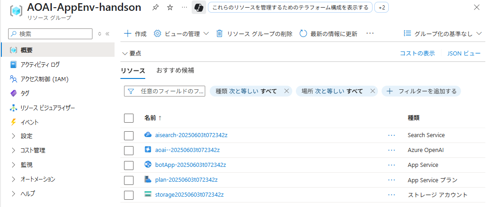

# 準備 1 : Azure リソースの作成

ハンズオンの演習で使用する以下の Azure リソースを作成します。

作成には Bicep を使用しますが Azure Portal や Azure CLI を使用して以下の設定で手動で作成しても構いません。

なお、リソースの作成先のリージョンは Azure OpenAI Service だけが `Australia East` で、他のリソースは `Japan East` となるので手動で作成する場合は注意してください。

* リソースグループ
    | 項目 | 値 |
    |----|---|
    | リソースグループ名 | `AOAI-AppEnv-handson` |
    | リージョン | `Japan East` |


* Azure App Service
    | 項目 | 値 |
    |----|----|
    | リソースグループ | `AOAI-AppEnv-handson` |
    | 名前 | `botApp-(ユニークな値)` |
    | 公開 | コード |
    | ランタイムスタック | Node 22 TLS|
    | オペレーティング システム | Linux |
    | リージョン | `Japan East` |
    | 価格プラン | B1 |

    その他の設定は既定のままで構いません。

* Azure Storage Account
    | 項目 | 値 |
    |----|----|
    | リソースグループ | `AOAI-AppEnv-handson` |
    | ストレージ アカウント名 | `storage-(ユニークな値)` |
    | リージョン | `Japan East` |
    | パフォーマンス | Standard |
    | アカウントの種類 | StorageV2 (汎用 v2) |
    | 冗長性 | LRS |

    その他の設定は既定のままで構いません。

* Azure OpenAI Service
    | 項目 | 値 |
    |----|----|
    | リソースグループ | `AOAI-AppEnv-handson` |
    | 名前 | `aoai-(ユニークな値)` |
    | リージョン | `Australia East` |
    | 価格レベル | Standard 0|

    その他の設定は既定のままで構いません。

* Azure AI Search
    | 項目 | 値 |
    |----|----|
    | リソースグループ | `AOAI-AppEnv-handson` |
    | 名前 | `aisearch-(ユニークな値)` |
    | リージョン | `Japan East` |
    | 価格レベル | Standard  |

    その他の設定は既定のままで構いません。


作成には Bicep を使用しますが Azure Portal や Azure CLI を使用して上記の設定内容に従い手動で作成しても構いません。

Bicep 使用する場合の手順は

\[**手順**\]

1. 以下の Bicep ファイルをダウンロードします。
   - [handson-prep.bicep](./assets/handson-prep.bicep)
  
2. Azure ポータルにログインし、画面右上にある Cloud Shell アイコンをクリックして Cloud Shell 画面を開きます

    
   
3. Cloud Shell 画面で、以下のコマンドを実行してリソースグルーブを作成します
   ```bash
   az group create --name AOAI-AppEnv-handson --location "Japan East"
   ```

   Cloud Shell で以下のコマンドを実行してリソースグループ `AOAI-AppEnv-handson` が作成されていることを確認します。

    ```bash
    az group list --query "[?name=='AOAI-AppEnv-handson']" --output table
    ```

4. Cloud Shell 画面のメニュー \[ファイルの監理\] - \[アップロード\] を選択し、ダウンロードした `handson-prep.bicep` ファイルをアップロードします

    
    
    ファイルのアップロードが完了したら以下のコマンドを実行してアップロードしたファイルがリストされることを確認します。

    ```bash
    ls
    ```
5. アップロードした Bicep ファイルを使用して Azure リソースをデプロイします。実行するコマンドは以下のとおりです。

    ```bash
    az deployment group create --resource-group AOAI-AppEnv-handson --template-file handson-prep.bicep
    ```

    この Bicep ファイルは作成する各リソースにタイムスタンプを付与したユニークな名前を付けてリソースを作成します。

6. デプロイが完了したら Azire ポータル画面で `AOAI-AppEnv-handson` リソースグループを開き、以下のリソースが作成されていることを確認します。

   - Azure OpenAI Service
   - Azure AI Search
   - Azure App Service
   - Azure Storage Account

   

ここまでの手順で演習で使用する Azure リソースの作成が完了しました。
