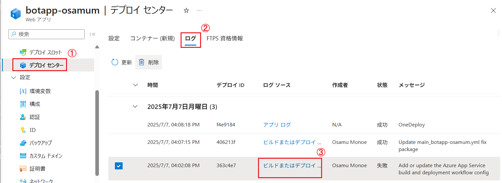
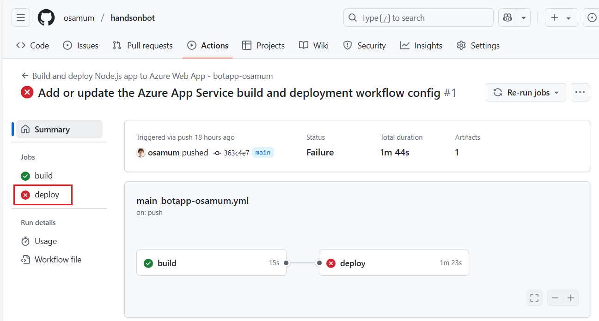
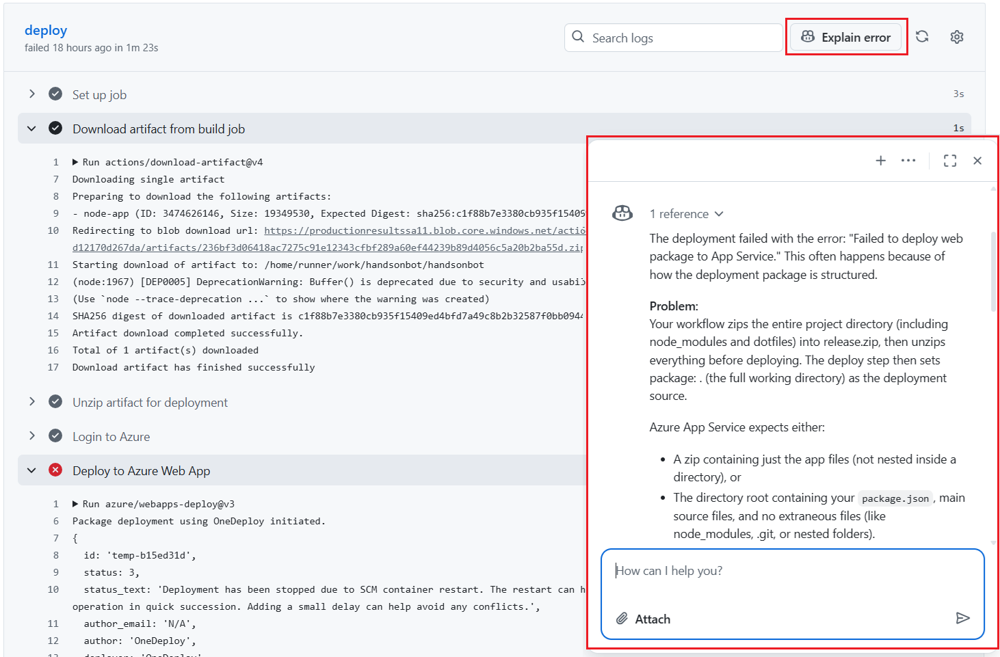
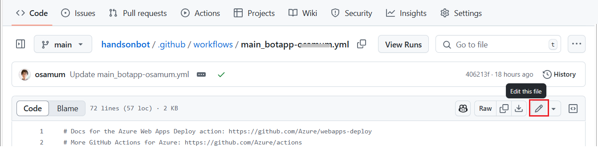
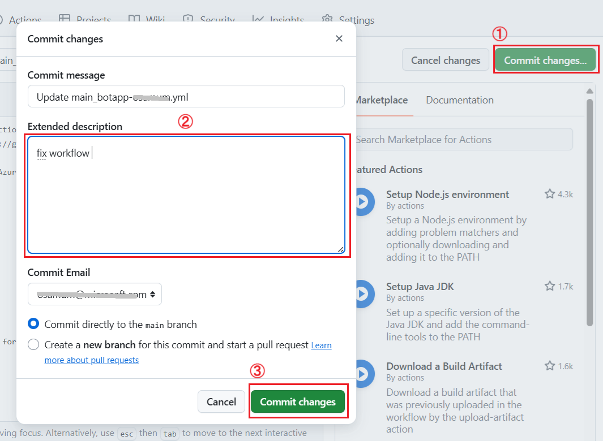
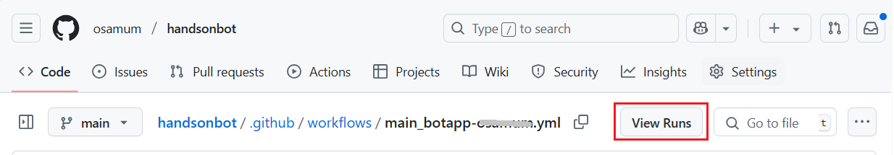
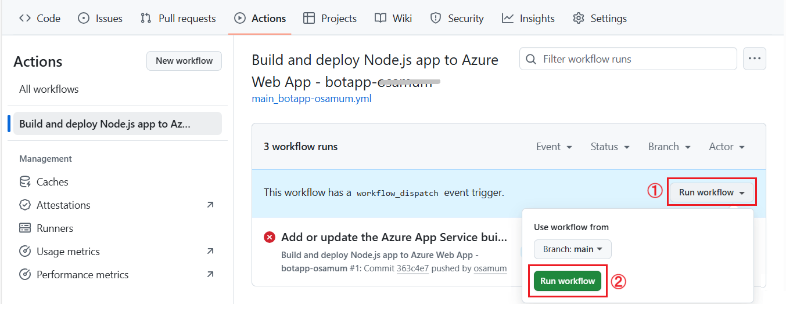

# 【補足】　Azure App Service デプロイ センターが作成した GitHub Actions ワークフローでエラーが発生する場合のトラブルシュート

Azure App Service のデプロイ センターで GitHub Actions を使用して自動デプロイを設定した際にエラーが発生する場合があります。また、このエラーの内容は特定ものではないので、決まった回避方法はなく、エラーの内容に応じて対処が必要です。

以下に大まかなトラブルシュートの手順を示します。

\[**手順**\]

1. Azure App Service の \[**デプロイ センター**\] の \[**ログ**\] タブを確認し、\[状態\] が \[**失敗**\] になっているログの、\[ログ ソース\] フィールドの \[**ビルドまたはデプロイ...**\] リンクをクリックします
   
   

2. GitHub の画面に遷移し、Azure App Service が作成したワークフローの実行履歴が表示されるので、画面左のメニューからエラーのマークがついている Job をクリックします

    

3. エラーの発生した箇所が表示されるので、画面上部にある \[**Explain error**\]　ボタンをクリックします

    GitHub Copilot のチャット画面が表示され、エラーの内容の説明と、エラーの原因と考えられる内容が表示されます。

    

    英語で説明されますが、`日本語で再度説明してください` と入力すると日本語で説明してくれるので、原因と対処方法を確認します。

4. 対処方法がワークフローの修正である場合は、GitHub Copilot の回答内容に従ってワークフロー ファイルを修正します。
 
    ワークフロー ファイルは GitHub のリポジトリの \[**.github/workflows**\] フォルダに YAML ファイルとして保存されていいるので、GitHub の画面で表示し、画面上部の \[**Edit this file**\] ボタンをクリックし、Copilot の回答内容に従って修正します。

    

5. 修正が完了したら、画面下部の \[**Commit changes...**\] ボタンをクリックして修正内容をコミットします。

    

6. 修正が完了したら、画面上部の \[**View Runs**\] ボタンをクリックします

    

7. \[**Actions**\] の画面に遷移し、ワークフローの一覧が表示されるので、リストの一番上の \[**Run workflow**\] ボタンをクリックしてワークフローを再実行します

    

ここまでの手順で、GitHub Actions のワークフローの修正と再実行が完了しました。

原因がワークフローの修正でない場合は、GitHub Copilot の回答内容に従って、必要な設定を行ってください。

 

---

👈　[演習 2-4 : デプロイ スロットの作成](Ex02-4.md)

🏚️　[README に戻る](README.md)