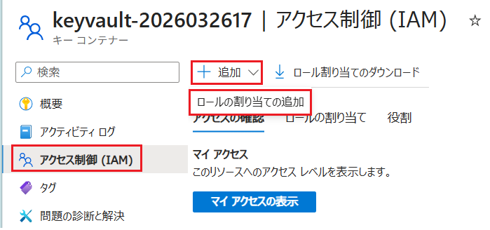
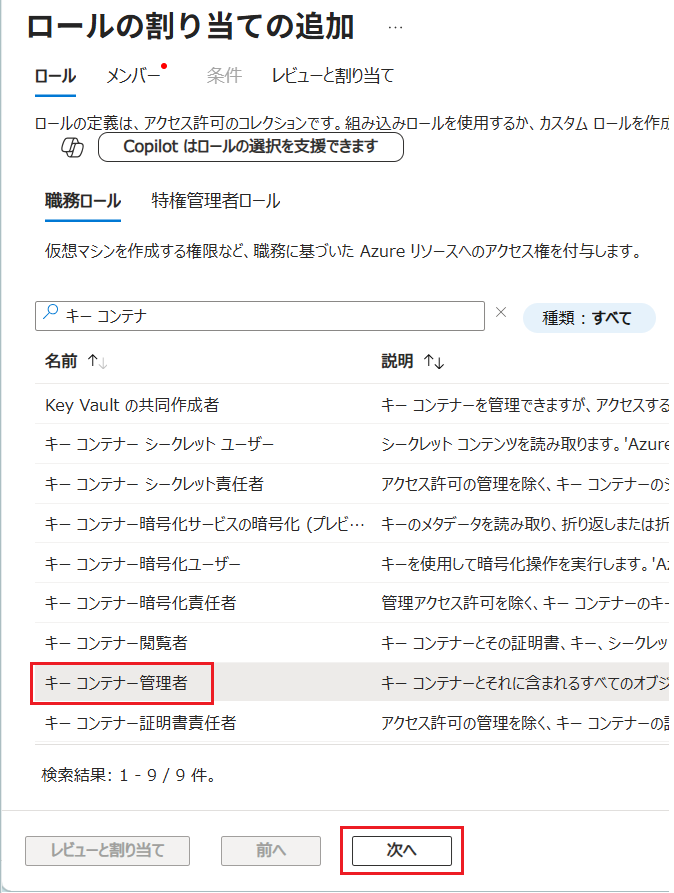
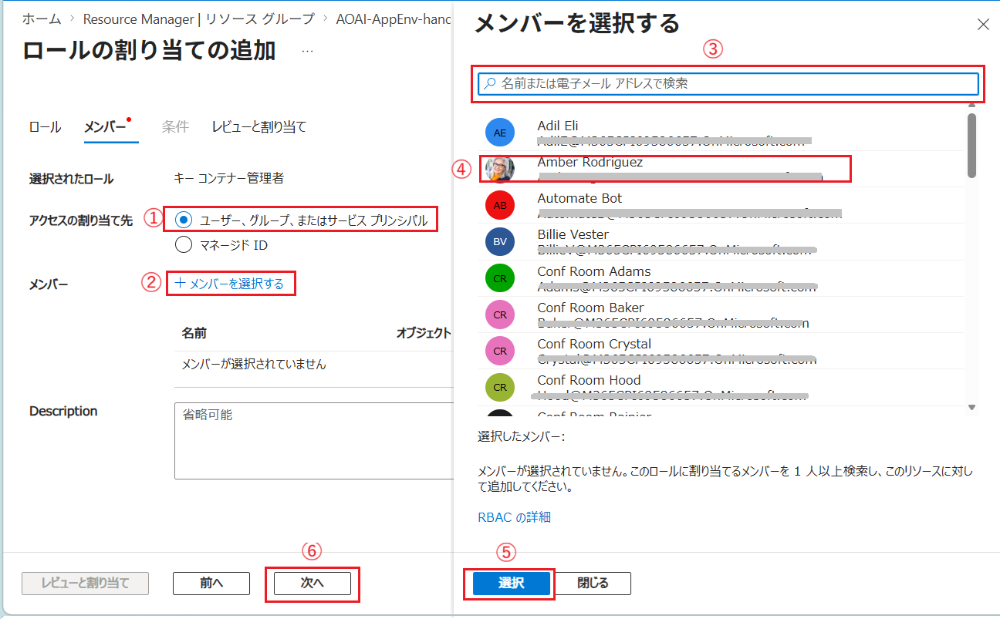
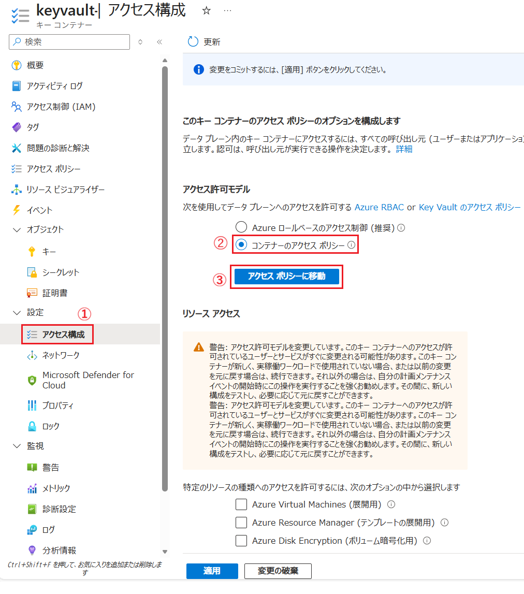
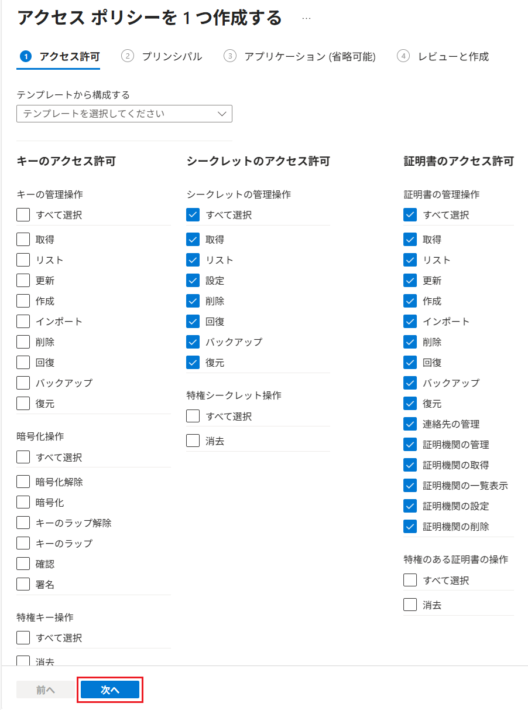
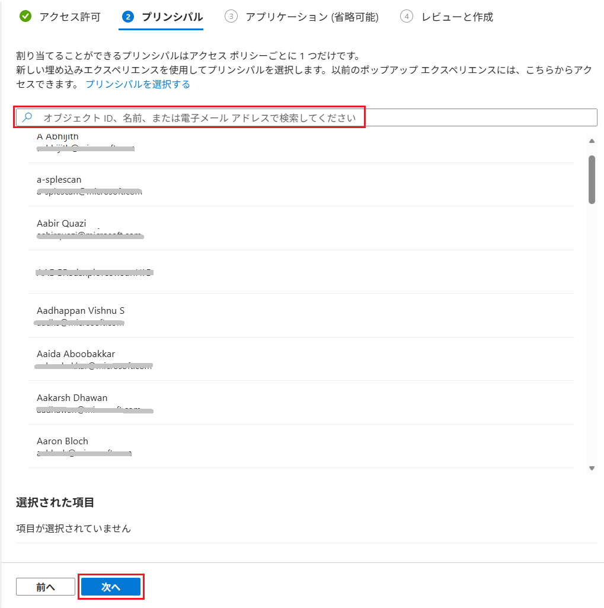

# 【補足】　Azure Key Vault で権限のロール割り当てが正しいにもかかわらず、証明書やシークレット、キーの操作ができない場合のトラブルシュート

Azure Key Vault に証明書をアップロードするには、RBAC の以下のいずれかのロールが必要です。

| 操作対象 | 操作内容 | 最小 RBAC ロール | 補足 |
|---|---|---|---|
| シークレット（Secrets） | 追加（Set / Create） | **Key Vault Secrets Officer** | パスワード、接続文字列、API Key |
| シークレット（Secrets） | 取得 / 一覧 | Key Vault Secrets Officer | アプリ実行時でも使用可 |
| キー（Keys） | 作成 / インポート | **Key Vault Keys Officer** | RSA / EC キー、BYOK |
| キー（Keys） | 取得 / 一覧 | Key Vault Keys Officer | 暗号化・復号用途 |
| 証明書（Certificates） | インポート / 作成 | **Key Vault Certificates Officer** | PFX（秘密鍵付き）が前提 |
| 証明書（Certificates） | 更新 / 削除 | Key Vault Certificates Officer | バージョン管理含む |
| Keys / Secrets / Certificates | すべて管理 | **Key Vault Administrator** | 全データプレーン操作 |
| RBAC 設定 / ロール付与 | IAM 管理 | **Owner / User Access Administrator** | データ操作権限は含まれない |

しかし、正しいロールが設定されているにもかかわらず、なんらかの理由で、Key Vault の \[**キー**\] 、\[**シークレット**\] 、\[**証明書**\] 画面に以下のメッセージが表示されて操作できない場合があります。

`操作 "一覧" はこのキー コンテナーのアクセス ポリシーでは有効になっていません。`

その場合には、以下のいずれかの方法で問題を解決できる可能性があります。

 

## キー コンテナー管理者 ロールの割り当て

操作対象の Key Vault のアクセス構成で **キー コンテナー管理者** を明示的に追加します。

具体的な手順は以下のとおりです。

\[**手順**▶️\]

1. [Azure ポータル](https://portal.azure.com/)で、問題が発生している Key Vault の画面を開き、画面左側のメニューから \[**アクセス制御 (IAM)**\] をクリックし、遷移した画面上部にある \[+ 追加\] - \[**ロールの割り当ての追加**\] ボタンをクリックします

    

2. \[**ロールの割り当ての追加**\] 画面の \[**ロール**\] タブで、`キー コンテナー管理者` ロールを選択し、画面下部の \[**次へ**\] ボタンをクリックします

    

3. \[**メンバー**\] タブの画面に遷移するので、項目 \[**アクセスの割り当て先**\] が `ユーザー、グループ、またはサービス プリンシパル` にチェックされていることを確認し、\[**メンバーを選択する**\] リンクをクリックします

    画面右に \[**メンバーを選択する**\] ブレードが表示さるので、検索ボックスで現在のユーザー アカウントを検索して選択し、画面下部の \[**選択*\] ボタンをクリックしてブレードを閉じます

    

    ブレードが閉じたら、画面下部の \[**次へ**\] ボタンをクリックします

4. \[**レビューと割り当て**\] タブの画面に遷移するので、内容を確認して \[**レビューと割り当て**\] ボタンをクリックし、遷移した画面で \[**割り当て**\] ボタンをクリックします

以上で Key Vault へのロールの割り当ては完了です。再度 \[**キー**\] 、\[**シークレット**\] 、\[**証明書**\] 画面にアクセスして、操作が可能になっていることを確認してください。

 

## RBAC からアクセス ポリシーへの一時的な切り替え

IAM の設定で `キー コンテナー管理者` ロールが割り当てられているにもかかわらず、問題が解決しない場合には、Key Vault のアクセス構成を `Azure ロールベースのアクセス制御` から `アクセス ポリシー` に一時的に切り替えることで問題を解決できる可能性があります。

具体的な手順は以下のとおりです。

\[**手順**▶️\]

1. [Azure ポータル](https://portal.azure.com/)で、問題が発生している Key Vault の画面を開き、画面左側のメニューから \[設定\] - \[**アクセス構成**\] をクリックします

    遷移した画面内の `アクセス許可モデル` のセクションで \[**コンテナーのアクセス ポリシー**\] オプション ボタンにチェックをつけ、その下に表示される \[**アクセス ポリシーに移動**\] ボタンをクリックします

    

2. \[**アクセス ポリシー**\] 画面で、画面上部の \[**+ 作成**\] ボタンをクリックします

    \[**アクセス ポリシーを 1 つ作成する**\] 画面の \[**① アクセス許可**\] タブがアクティブになっていることを確認し、必要な権限を選択して \[**次へ**\] ボタンをクリックします

    

3. \[**② プリンシパルの選択**\] タブの画面に遷移するので、検索ボックスで現在のユーザー アカウントを検索して選択し、画面下部の \[**次へ**\] ボタンをクリックします

    

    また、同様にこの Key Vault を参照する演習用アプリケーションの App Service のマネージド ID もここで追加してください。なお、App Service に付与する権限は読み取り専用で十分です。

4. \[**③ アプリケーション(省略可能)**\] タブの画面に遷移するので、既定のまま \[**次へ**\] ボタンをクリックし、遷移した \[**④ レビューと作成**\]画面で \[**作成**\] ボタンをクリックします

5. \[**アクセス ポリシー**\] 画面に戻るので、`➁ プリンシパルの選択` タブで追加したユーザー アカウントが表示されていることを確認します

6. 画面左側のメニューから \[設定\] - \[**アクセス構成**\] をクリックし、遷移した画面の `アクセス許可モデル` のセクションで \[**コンテナーのアクセス ポリシー**\] オプション ボタンが選択されていることを確認してください
 
以上で Key Vault のアクセス構成の変更は完了です。再度 \[**キー**\] 、\[**シークレット**\] 、\[**証明書**\] 画面にアクセスして、操作が可能になっていることを確認してください。

 

上記のいずれの方法でも問題が解決しない場合には、Azure サポートにお問い合わせください。

---

👈　[演習 4-1 : Key Vault へのキーの登録と利用](Ex04-1.md)

👈　[演習 5-オプション : App Service へのカスタムドメインの設定](Ex05-4.md)

🏚️　[README に戻る](README.md)